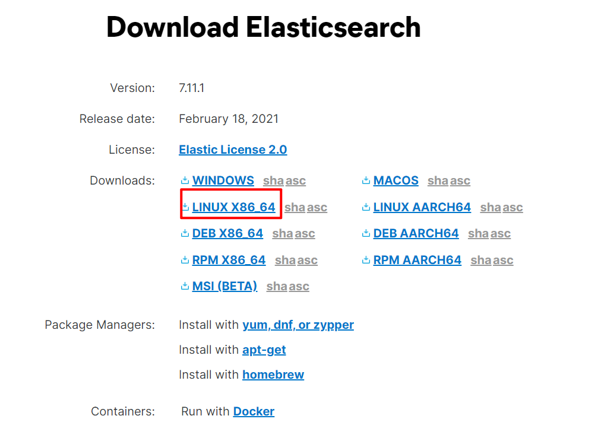
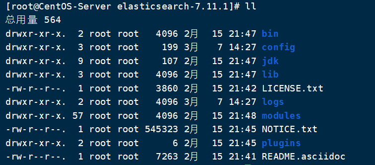
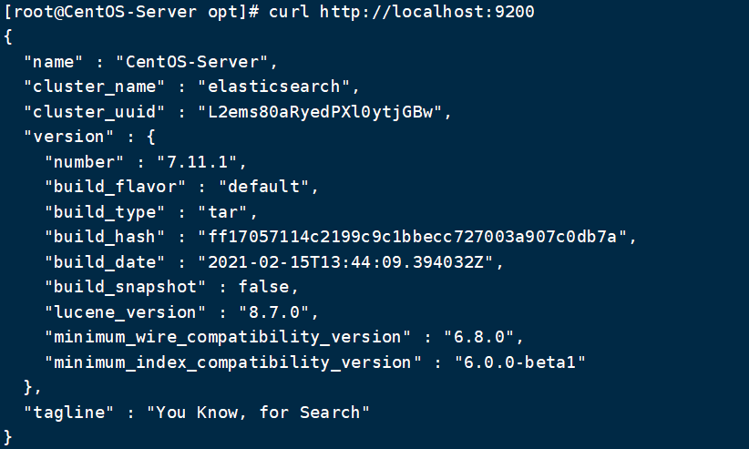
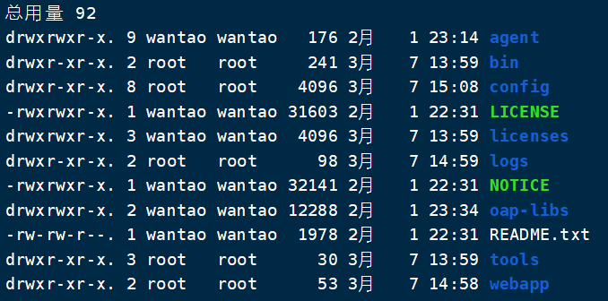
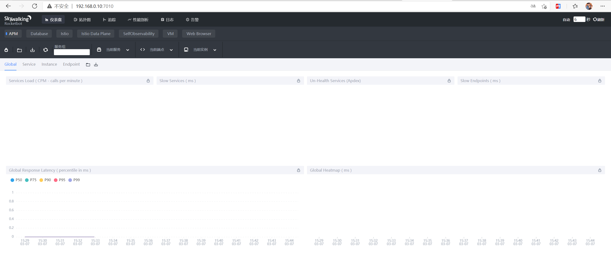

# SkyWalking安装


## 一. 安装Elasticsearch7

### 第一步：下载

下载地址：[https://www.elastic.co/cn/downloads/elasticsearch](https://www.elastic.co/cn/downloads/elasticsearch)



如图，下载对应需要的 ES 。我这边是 CentOS8 ，所以直接下载了 Linux的版本。另外 ES 支持 Docker 方式启动。另外，ES 7.x 不需要本地 JDK 环境支持：

- ES 5，安装需要 JDK 8 以上
- ES 6.5，安装需要 JDK 11 以上
- ES 7.2.1，内置了 JDK 12

下载解压后，ES 文件目录结构如下图所示：



### 第二步：启动

执行下列命令：

```shell
./bin/elasticsearch -d # -d代表后台启动
```

一部分情况下，我们启动会出现下列错误

#### 修改启动使用JDK

用户可能为出现需要JDK11的报错：


这是因为我当前主机上的JDK环境是1.8，在Elasticsearch7以上版本就自带了jdk（解压根目录下jdk目录就是内置的jdk），以`elasticsearch-7.11.1`为例，它自带了JDK15：


我们只需要将Elasticsearch指向自带的jdk，就可正常启动了

进入Elasticsearch的bin目录，找到elasticsearch文件，我们在文件头部添加如下命令：

```shell
export JAVA_HOME=/opt/elasticsearch-7.11.1/jdk  #这个配置视实际安装位置修改
export PATH=$JAVA_HOME/bin:$PATH
```

此时们重新启动，就会发现不报刚刚那个错了

#### 使用非root用户启动

解决上述问题后，我们启动可能会出现下列问题：


Elasticsearch不能在root用户下运行，所以我们要单独建一个用户，以便运行Elasticsearch。

这种情况下，我们使用非`root`用户启动即可，但是需要注意的是我们需要将elasticsearch安装目录的owner和group设置为你要启动的用户名：

```shell
sudo chown -R es /opt/elasticsearch-7.11.1 #将安装目录的所属权设置为es用户
sudo chgrp -R es /opt/elasticsearch-7.11.1 #将安装目录的所属权设置为es用户组
```

### 第三步：检测启动是否成功

```shell
curl http://localhost:9200
```



## 二. 安装Skywalking

### 第一步：下载

https://archive.apache.org/dist/skywalking/

下载解压后，目录结构如下：



### 第二步：修改skywalking持久化方式

修改`config/application.yml`文件，将`storage.selector`中的值改为`elasticsearch7`即可，其它配置暂时都不用修改：

```yaml
#集群配置
cluster:
  #选择配置，这里使用单机版
  selector: ${SW_CLUSTER:standalone}
  #单机版配置
  standalone:
    ...
  #基于zk集群配置
  zookeeper:
    ...
...
#数据库
storage:
  #这里使用elasticsearch7
  selector: ${SW_STORAGE:elasticsearch7}
  ...
  elasticsearch7:
    nameSpace: ${SW_NAMESPACE:""}
    clusterNodes: ${SW_STORAGE_ES_CLUSTER_NODES:192.168.0.10:9200}
    ...
...
```

### 第三步：修改Web管理页面访问端口

修改`webapp/webapp.yml`文件，port

```yml
server:
  #访问端口号
  port: 7010
```

### 第四步：启动

```shell
./bin/startup.sh
```

### 第五步：访问




> 本文参考：
>
> [SkyWalking8简单安装部署配置(1)](https://blog.csdn.net/lizz861109/article/details/107514354)
>
> [Elasticsearch 7.x 最详细安装及配置](https://juejin.cn/post/6844903920448323597)
>
> [ES在Linux部署遇到的问题](https://www.jianshu.com/p/9a6bfb01d284)

