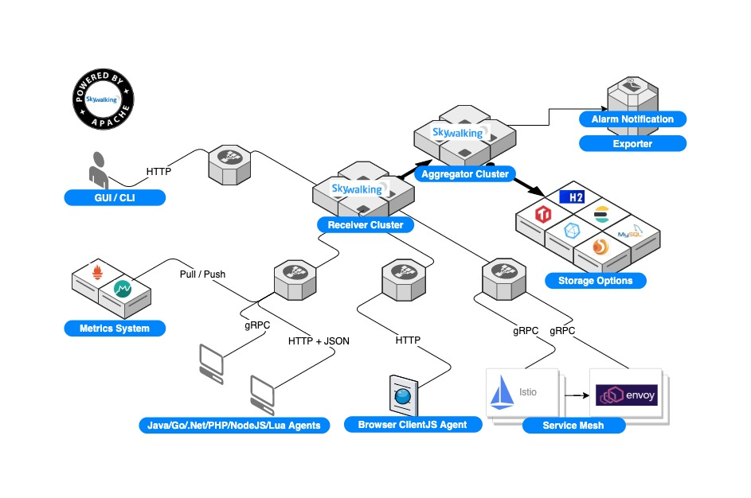

# SkyWalking概念与设计总览

> 本文转载至：https://skyapm.github.io/document-cn-translation-of-skywalking/zh/8.0.0/concepts-and-designs/overview.html

SkyWalking: 一个开源的可观测平台, 用于从服务和云原生基础设施收集, 分析, 聚合及可视化数据。SkyWalking 提供了一种简便的方式来清晰地观测分布式系统, 甚至横跨多个云平台。SkyWalking 更是一个现代化的应用程序性能监控(Application Performance Monitoring)系统, 尤其专为云原生、基于容器的分布式系统设计.

## 为什么使用 SkyWalking

在许多不同的场景下, SkyWalking 为观察和监控分布式系统提供了解决方案。首先是像传统的方式那样, SkyWalking 为服务提供了自动打点的代理, 如 Java, C# , Node.js , Go , PHP 以及 Nginx LUA（包括 Python 和 C++ 调用的 SDK 捐献）。

对于多数语言，持续部署环境，云原生基础设施正变得更加强大，但也更加复杂。

Skywalking 的服务网格接收器可以让 Skywalking 接收来自服务网格框架（例如 Istio , Linkerd）的遥测数据，以帮助用户理解整个分布式系统。

总之, SkyWalking 为 **服务(service)**, **服务实例(service instance)**, 以及 **端点(endpoint)** 提供了可观测能力。服务(Service), 实例(Instance) 以及端点(Endpoint) 等概念在如今随处可见, 所以让我们先了解一下他们在 SkyWalking 中都表示什么意思：

- **服务(Service)**. 表示对请求提供相同行为的一组工作负载. 在使用打点代理或 SDK 的时候,你可以定义服务的名字. SkyWalking 还可以使用在 Istio 等平台中定义的名称。
- **服务实例(Service Instance)**. 上述的一组工作负载中的每一个工作负载称为一个实例. 就像 Kubernetes 中的 `pods` 一样,服务实例未必就是操作系统上的一个进程. 但当你在使用打点代理的时候, 一个服务实例实际就是操作系统上的一个真实进程.
- **端点(Endpoint)**. 对于特定服务所接收的请求路径, 如 HTTP 的 URI 路径和 gRPC 服务的类名 + 方法签名。

使用 SkyWalking 时, 用户可以看到服务与端点之间的拓扑结构, 每个服务/服务实例/端点的性能指标, 还可以设置报警规则。

除此之外, 你还可以通过以下方式集成

1. 其他分布式追踪使用 Skywalking 原生代理和Zipkin , Jaeger 和 OpenCensus 的 SDK；
2. 其他度量指标系统，例如 Prometheus , Sleuth(Micrometer。

## 架构

SkyWalking 逻辑上分为四部分: 探针, 平台后端, 存储和用户界面.

- **探针** 基于不同的来源可能是不一样的, 但作用都是收集数据, 将数据格式化为 SkyWalking 适用的格式.
- **平台后端**, 支持数据聚合, 数据分析以及驱动数据流从探针到用户界面的流程。分析包括 Skywalking 原生追踪和性能指标以及第三方来源，包括 Istio 及 Envoy telemetry , Zipkin 追踪格式化等。 你甚至可以使用 [Observability Analysis Language 对原生度量指标](https://skyapm.github.io/document-cn-translation-of-skywalking/zh/8.0.0/concepts-and-designs/oal.html) 和 [用于扩展度量的计量系统](https://skyapm.github.io/document-cn-translation-of-skywalking/zh/8.0.0/concepts-and-designs/meter.html) 自定义聚合分析。
- **存储** 通过开放的插件化的接口存放 SkyWalking 数据. 你可以选择一个既有的存储系统, 如 ElasticSearch, H2 或 MySQL 集群(Sharding-Sphere 管理),也可以选择自己实现一个存储系统. 当然, 我们非常欢迎你贡献新的存储系统实现。
- **UI** 一个基于接口高度定制化的Web系统，用户可以可视化查看和管理 SkyWalking 数据。

## SkyWalking探针

> 转载至：https://skyapm.github.io/document-cn-translation-of-skywalking/zh/8.0.0/concepts-and-designs/probe-introduction.html

在 SkyWalking 中, 探针表示集成到目标系统中的代理或 SDK 库, 它负责收集遥测数据, 包括链路追踪和性能指标。根据目标系统的技术栈, 探针可能有差异巨大的方式来达到以上功能. 但从根本上来说都是一样的, 即收集并格式化数据, 并发送到后端。

从高层次上来讲, SkyWalking 探针可分为以下三组：

- **基于语言的原生代理**. 这种类型的代理运行在目标服务的用户空间中, 就像用户代码的一部分一样. 如 SkyWalking Java 代理, 使用 `-javaagent` 命令行参数在运行期间对代码进行操作, `操作` 一词表示修改并注入用户代码. 另一种代理是使用目标库提供的钩子函数或拦截机制. 如你所见, 这些探针是基于特定的语言和库。
- **服务网格探针**. 服务网格探针从服务网格的 Sidecar 和控制面板收集数据. 在以前, 代理只用作整个集群的入口, 但是有了服务网格和 Sidecar 之后, 我们可以基于此进行观测了。
- **第三方打点类库**. SkyWalking 也能够接收其他流行的打点库产生的数据格式. SkyWalking 通过分析数据,将数据格式化成自身的链路和度量数据格式. 该功能最初只能接收 Zipkin 的 span 数据. 更多参考[其他追踪系统的接收器](https://skyapm.github.io/document-cn-translation-of-skywalking/zh/8.0.0/setup/backend/backend-receivers.html)。

你不必同时使用 **基于语言的原生代理** 和 **服务网格探针** ，因为两者都收集指标数据，否则你的系统就要承受双倍负载, 且分析数量会翻倍.

有如下几种推荐的方式来使用探针:

1. 只使用 **基于语言的原生代理**.
2. 只使用 **第三方打点库**, 如 Zipkin 打点系统.
3. 只使用 **服务网格探针**.
4. 使用 **服务网格探针**, 配合 **语言原生代理** 或 **第三方打点库**, 来 **追踪状态** . (高级用法)

另外，让我们举例说明什么是 **追踪状态**？

默认情况下, **基于语言的原生代理** 和 **第三方打点库** 都会发送分布式追踪数据到后台, 后者分析/聚合这些追踪数据. **追踪状态**意味着, 后端把这些追踪数据看作是日志一类的事情, 仅仅将他们保存下来, 并且在追踪和指标之间建立联系, 比如 `这个追踪数据属于哪个入口哪个服务?` 。

## 服务自动打点代理

服务自动打点代理是基于语言的原生代理的一部分,这种代理需要依靠某些语言特定的特性, 通常是一种基于虚拟机的语言.

### 自动打点是什么意思?

许多用户都是在听到"他们说不需要改一行代码"之后才了解到这些代理的, SkyWalking 以前也将这种说法放在 README 文档中. 实际上这种说法是既对又错的. 对于最终用户来说是对的, 他们不需要修改代码(至少在绝大多数情况下). 但这种说法也是错的, 因为代码实际上还是被修改了, 只是被代理给修改了, 这种做法通常叫做"在运行时操作代码". 底层原理就是自动打点代理利用了虚拟机提供的用于修改代码的接口来动态加入打点的代码, 如通过 `javaagent premain` 来修改 Java 类.

此外, 我们说大部分自动打点代理是基于虚拟机的, 但实际上你也可以在编译期构建这样的工具.

### 有什么限制?

自动打点很好用, 你还可以在编译时进行自动打点而不需要依赖虚拟机特性, 那么这里有什么限制吗?

答案当然是有, 以下就是它们的限制:

- **进程内传播在大多数情况下成为可能**. 许多高级编程语言(如 Java, .NET)都是用于构建业务系统. 大部分业务逻辑代码对于每一个请求来说都运行在同一个线程内, 这使得传播是基于线程 ID 的, 以确保上下文是安全的.
- **仅仅对某些框架和库奏效**. 因为是代理来在运行时修改代码的, 这也意味着代理插件开发者事先就要知道 所要修改的代码是怎么样的. 因此, 在这种探针下通常会有一个已支持的列表清单. 如 [SkyWalking Java 代理支持列表](https://skyapm.github.io/document-cn-translation-of-skywalking/zh/8.0.0/setup/service-agent/java-agent/Supported-list.html).
- **跨线程可能并非总是奏效**. 如上所述, 每个请求的代码大都运行在一个线程之内, 对于业务代码来说尤其如此. 但是在其他一些场景下, 它们也会在不同线程下工作, 比如指派任务到其他线程, 任务池, 以及批处理. 对于一些语言, 可能还提供了协程或类似的概念如 `Goroutine`, 使得开发者可以低开销地来执行异步操作, 在这些场景下, 自动打点可能会遇到一些问题.

所以说自动打点没有什么神秘的, 总而言之就是, 自动打点代理开发者写了一个激活程序, 使得打点的代码 自动运行, 仅此而已.

