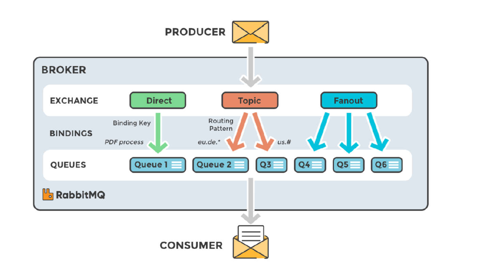
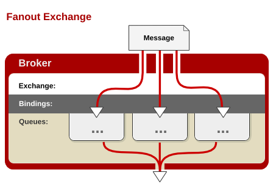
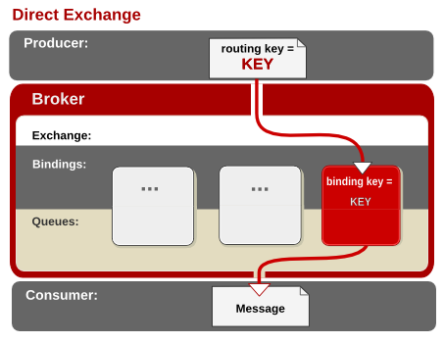
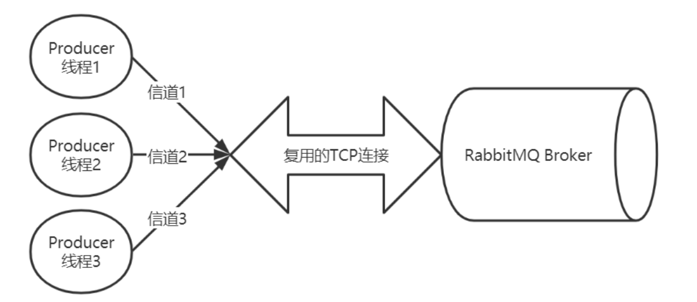

# RabbitMQ基本概念

## 一. 介绍

RabbitMQ（Rabbit 可见其轻巧，敏捷），是目前非常热门的一款开源消息中间件，不管是互联网行业还是传统行业都广泛使用（最早是为了解决电信行业系统之间的可靠通信而设计）。

1. 高可靠性、易扩展、高可用、功能丰富等
2. 支持大多数（甚至冷门）的编程语言客户端。

3. RabbitMQ遵循AMQP协议，自身采用Erlang（一种由爱立信开发的通用面向并发编程的语言）编写。

4. RabbitMQ也支持MQTT等其他协议。

RabbitMQ具有很强大的插件扩展能力，官方和社区提供了非常丰富的插件可供选择：

[https://www.rabbitmq.com/community-plugins.html](https://www.rabbitmq.com/community-plugins.html)

## 二. RabbitMQ整体逻辑架构

## 三. RabbitMQ Exchange类型

RabbitMQ常用的交换器类型有：fanout、direct 、topic 、headers 四种。

### 3.1 Fanout

Fanout Exchange不处理路由键，它会把所有发送到该交换器的消息路由到所有与该交换器绑定的队列中，虽然在声明Exchange时仍能够指定bindingKey，但是这个参数对这个模式是无效的，因为它压根不会处理生产者发送消息时指定的routingKey。

如图：

### 3.2 Direct

direct类型的交换器路由规则很简单，它会把消息路由到那些BindingKey和RoutingKey完全匹配的队列中，如下图：

### 3.3 Topic

topic类型的交换器在direct匹配规则上进行了扩展，也是将消息路由到BindingKey和RoutingKey相匹配的队列中，这里的匹配规则稍微不同，它约定：

BindingKey和RoutingKey一样都是由"."分隔的多个单词（最多不超过256个字节）；BindingKey中可以存在两种特殊字符`*`和`#`，用于模糊匹配，其中`*`用于匹配一个单词，`#`用于匹配多个单词（可以是0个）。如果不使用这两类符号，则Exchange的表现与类型Driect一致。单独使用`#`时，会接收所有的消息，这与类型Fanout一致。

### 3.4 Headers

headers类型的交换器不依赖于路由键的匹配规则来路由信息，而是根据发送的消息内容中的headers属性进行匹配。在绑定队列和交换器时指定一组键值对，当发送的消息到交换器时，RabbitMQ会获取到该消息的headers，对比其中的键值对是否完全匹配队列和交换器绑定时指定的键值对，如果匹配，消息就会路由到该队列。headers类型的交换器性能很差，不实用。

## 四. RabbitMQ工作流程

### 4.1 生产者

1. 生产者连接RabbitMQ，建立TCP连接( Connection)，开启信道（Channel） 
2. 生产者声明一个Exchange（交换器），并设置相关属性，比如交换器类型、是否持久化等
3. 生产者声明一个队列井设置相关属性，比如是否排他、是否持久化、是否自动删除等
4. 生产者通过 bindingKey （绑定Key）将交换器和队列绑定（binding）起来
5. 生产者发送消息至RabbitMQ Broker，其中包含routingKey（路由键）、交换器等信息
6. 相应的交换器根据接收到的 routingKey 查找相匹配的队列。
7. 如果找到，则将从生产者发送过来的消息存入相应的队列中。
8. 如果没有找到，则根据生产者配置的属性选择丢弃还是回退给生产者
9. 关闭信道。
10. 关闭连接

### 4.2 消费者

1. 消费者连接到RabbitMQ Broker，建立一个连接(Connection ) ，开启一个信道(Channel) 。
2. 消费者向RabbitMQ Broker请求消费相应队列中的消息，可能会设置相应的回调函数，以及做一些准备工作。
3. 等待RabbitMQ Broker回应并投递相应队列中的消息，消费者接收消息。
4. 消费者确认(ack)接收到的消息。
5. RabbitMQ从队列中删除相应己经被确认的消息。
6. 关闭信道。
7. 关闭连接。

## 五. Connection和Channel的关系

生产者和消费者，需要与RabbitMQ Broker 建立TCP连接，也就是Connection 。一旦TCP 连接建立起来，客户端紧接着创建一个AMQP 信道（Channel），每个信道都会被指派一个唯一的ID。信道是建立在Connection 之上的虚拟连接， RabbitMQ 处理的每条AMQP 指令都是通过信道完成的。

为什么不直接使用TCP连接，而是使用信道？

RabbitMQ 采用类似NIO的做法，复用TCP 连接，减少性能开销，便于管理。

当每个信道的流量不是很大时，复用单一的Connection 可以在产生性能瓶颈的情况下有效地节省TCP 连接资源。

当信道本身的流量很大时，一个Connection 就会产生性能瓶颈，流量被限制。需要建立多个Connection，分摊信道。具体的调优看业务需要。信道在AMQP 中是一个很重要的概念，大多数操作都是在信道这个层面进行的。

RabbitMQ相关的API与AMQP紧密相连，比如channel.basicPublish对应AMQP的Basic.Publish命令。

