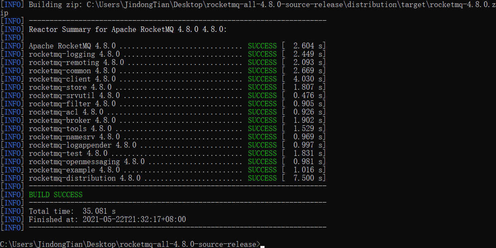
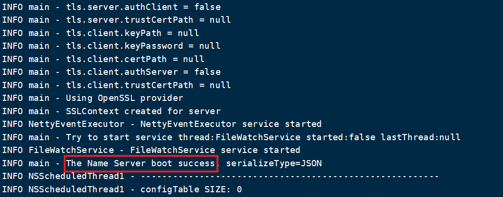

# 安装RocketMQ

> 本文参考至：[Quick Start - Apache RocketMQ](https://rocketmq.apache.org/docs/quick-start/)

## 一. 环境要求

- 64位操作系统（Linux、Unix、Mac、Windows）
- 64位JDK 1.8+
- Maven 3.2x
- Git
- 4G+的磁盘空间

## 二. RocketMQ安装

因为官方只提供了源码，我们需要下载源码自行构建，我们目标是在Linux上安装RocketMQ，但是我的Linux服务器上并没有安装Maven环境，但是好在自己Windows上是有Maven环境的，我们在Windows上将源码打包构建完成后在上传至Linux服务器运行即可。

**第一步：下载源码，并解压**

[Rocket MQ 4.8.0](https://www.apache.org/dyn/closer.cgi?path=rocketmq/4.8.0/rocketmq-all-4.8.0-source-release.zip)

**第二步：进入解压目录，执行打包命令**

```shell
mvn -Prelease-all -DskipTests clean package -U
```



打包完成后，我们进入`distribution/target/rocketmq-4.8.0/rocketmq-4.8.0`目录，我们就可以看到打包好的文件：


**第三步：上传可执行文件**

我们将打包好文件夹上传至Linux服务器，但是上传后我们会发现bin目录下的文件都没有执行的权限，我们需要进入到bin目录，执行下列命令去赋予执行权限：

```shell
chmod +x *
```

**第四步：启动RocketMQ**

先启动名称服务器

```shell
#启动名称服务器
nohup sh bin/mqnamesrv & 
tail -f ~/logs/rocketmqlogs/namesrv.log
```

看到如下界面就代表启动成功了：



然后再**启动Broker服务器**

```shell
nohup sh bin/mqbroker -n localhost:9876 &
tail -f ~/logs/rocketmqlogs/broker.log 
```

看到如下信息代表启动成功：


我们可以通过如下命令测试broker是否成功：

```shell
export NAMESRV_ADDR=localhost:9876
sh bin/tools.sh org.apache.rocketmq.example.quickstart.Producer
```

看到如下输出可以证明broker启动成功，生成者发送消息成功：


通过下列命令，可以测试消费者消费数据：

```shell
sh bin/tools.sh org.apache.rocketmq.example.quickstart.Consumer
```

如果我们想**关闭RocketMQ**，执行下列命令：

```shell
sh bin/mqshutdown broker
sh bin/mqshutdown namesrv
```

## 二. RocketMQ配置

### 2.1 JVM参数配置

由于RocketMQ Broker Server默认的`-Xmx`、`-Xms`都设置为了8G，我们如果只是做简单的测试，并没有必要设置那么大的堆内存，我们可以修改`bin/runbroker.sh`文件中的JVM参数降低堆内存：


