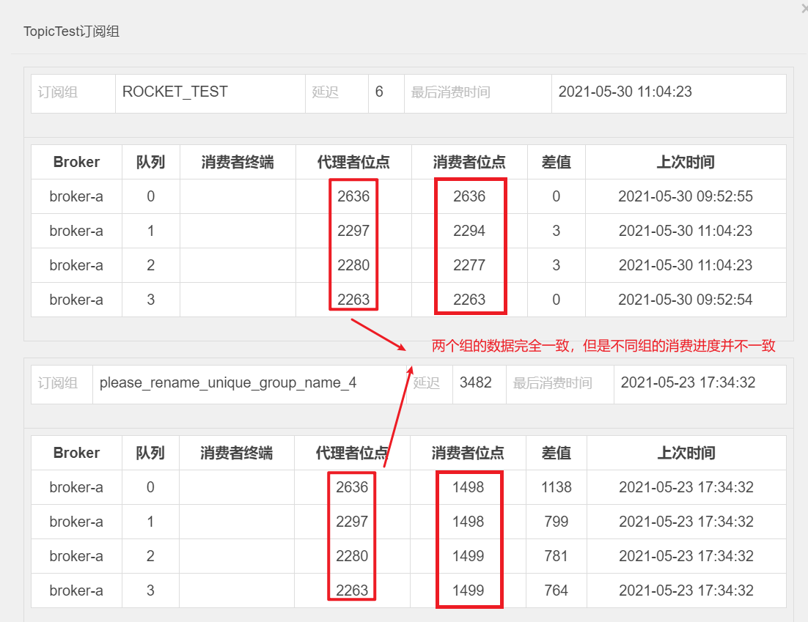
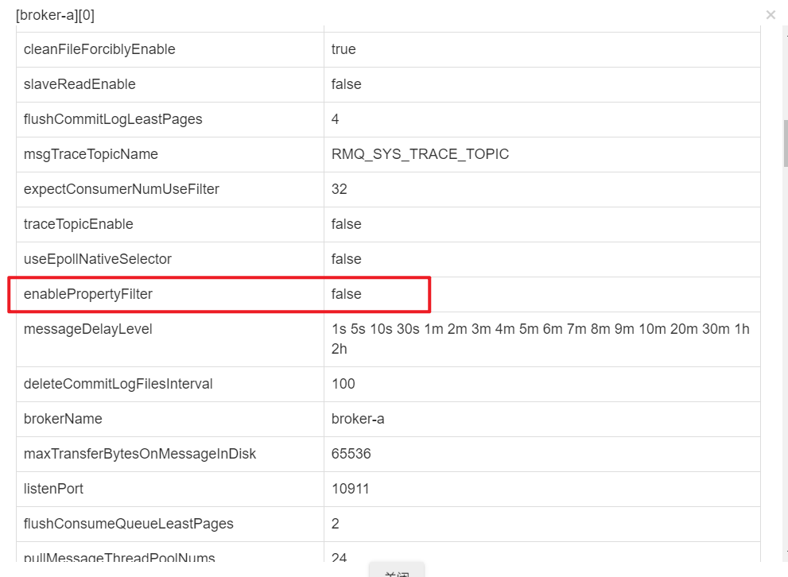

# RocketMQ原生API

## 一. 基本概念

**1.1 消息模型（Message Model）**

RocketMQ主要由 Producer、Broker、Consumer 三部分组成，其中Producer 负责生产消息，Consumer 负责消费消息，Broker 负责存储消息。Broker 在实际部署过程中对应一台服务器，每个 Broker 可以存储多个Topic的消息，每个Topic的消息也可以分片存储于不同的 Broker。Message Queue 用于存储消息的物理地址，每个Topic中的消息地址存储于多个 Message Queue 中。ConsumerGroup 由多个Consumer 实例构成。

**1.2 消息生产者（Producer）**

负责生产消息，一般由业务系统负责生产消息。一个消息生产者会把业务应用系统里产生的消息发送到broker服务器。RocketMQ提供多种发送方式，同步发送、异步发送、顺序发送、单向发送。同步和异步方式均需要Broker返回确认信息，单向发送不需要。

**1.3 消息消费者（Consumer）**

负责消费消息，一般是后台系统负责异步消费。一个消息消费者会从Broker服务器拉取消息、并将其提供给应用程序。从用户应用的角度而言提供了两种消费形式：拉取式消费、推动式消费。

**1.4 主题（Topic）**

表示一类消息的集合，每个主题包含若干条消息，每条消息只能属于一个主题，是RocketMQ进行消息订阅的基本单位。

**1.5 代理服务器（Broker Server）**

消息中转角色，负责存储消息、转发消息。代理服务器在RocketMQ系统中负责接收从生产者发送来的消息并存储、同时为消费者的拉取请求作准备。代理服务器也存储消息相关的元数据，包括消费者组、消费进度偏移和主题和队列消息等。

**1.6 名字服务（Name Server）**

名称服务充当路由消息的提供者。生产者或消费者能够通过名字服务查找各主题相应的Broker IP列表。多个Namesrv实例组成集群，但相互独立，没有信息交换。

**1.7 生产者组（Producer Group）**

同一类Producer的集合，这类Producer发送同一类消息且发送逻辑一致。如果发送的是事务消息且原始生产者在发送之后崩溃，则Broker服务器会联系同一生产者组的其他生产者实例以提交或回溯消费。

**1.8 消费者组（Consumer Group）**

一个组中的客户端会基本保证只消费一次。



同一类Consumer的集合，这类Consumer通常消费同一类消息且消费逻辑一致。消费者组使得在消息消费方面，实现负载均衡和容错的目标变得非常容易。要注意的是，消费者组的消费者实例必须订阅完全相同的Topic。RocketMQ 支持两种消息模式：集群消费（Clustering）和广播消费（Broadcasting）。

**1.9 集群消费（Clustering）**

集群消费模式下,相同Consumer Group的每个Consumer实例平均分摊消息。

**1.12 广播消费（Broadcasting）**

广播消费模式下，相同Consumer Group的每个Consumer实例都接收全量的消息。

**1.13 普通顺序消息（Normal Ordered Message）**

普通顺序消费模式下，消费者通过同一个消费队列收到的消息是有顺序的，不同消息队列收到的消息则可能是无顺序的。

**1.14 严格顺序消息（Strictly Ordered Message）**

严格顺序消息模式下，消费者收到的所有消息均是有顺序的。

**1.15 消息（Message）**

消息系统所传输信息的物理载体，生产和消费数据的最小单位，每条消息必须属于一个主题。RocketMQ中每个消息拥有唯一的Message ID，且可以携带具有业务标识的Key。系统提供了通过Message ID和Key查询消息的功能。

**1.16 标签（Tag）**

为消息设置的标志，用于同一主题下区分不同类型的消息。来自同一业务单元的消息，可以根据不同业务目的在同一主题下设置不同标签。标签能够有效地保持代码的清晰度和连贯性，并优化RocketMQ提供的查询系统。消费者可以根据Tag实现对不同子主题的不同消费逻辑，实现更好的扩展性。

## 二. 基础消息

### 2.1 同步发送基本消息

```java
//指明生产者组名称
DefaultMQProducer producer = new DefaultMQProducer("TEST_GROUP");
// Name Server 地址
producer.setNamesrvAddr(HOST);
producer.setSendMsgTimeout(600);
producer.start();
//创建消息
Message msg = new Message("TopicTest", ("Hello RocketMQ " +i).getBytes(RemotingHelper.DEFAULT_CHARSET));
//发送消息
SendResult sendResult = producer.send(msg);
System.out.printf("%s%n", sendResult);
producer.shutdown();
```

### 2.2 异步发送基本消息

```java
DefaultMQProducer producer = new DefaultMQProducer("TEST_GROUP");
producer.setNamesrvAddr(HOST);
producer.start();
Message message = new Message("TopicTest", "测试消息".getBytes("UTF-8"));
producer.send(message, new SendCallback() {
    @Override
    public void onSuccess(SendResult sendResult) {
        System.out.println(sendResult);
    }

    @Override
    public void onException(Throwable e) {

    }
});
producer.shutdown();
```

### 2.3 推动式消费（订阅模式）

该模式下Broker收到数据后会主动推送给消费端，该消费模式一般实时性较高。

```java
DefaultMQPushConsumer consumer = new DefaultMQPushConsumer(GROUP);
consumer.setNamesrvAddr(HOST);
consumer.subscribe(TOPIC, "*");
consumer.registerMessageListener(new MessageListenerConcurrently() {
    @Override
    public ConsumeConcurrentlyStatus consumeMessage(List<MessageExt> msgs, ConsumeConcurrentlyContext context) {
        for (MessageExt msg : msgs) {
            String s = new String(msg.getBody());
            System.out.println(s);
        }
        return null;
    }
});
consumer.start();
```

### 2.4 拉取式消费

应用通常主动调用Consumer的拉消息方法从Broker服务器拉消息、主动权由应用控制。一旦获取了批量消息，应用就会启动消费过程。

```java
DefaultMQProducer producer = new DefaultMQProducer(GROUP);
producer.setNamesrvAddr(HOST);
producer.start();
for (int i = 0; i < 100; i++) {
    Message message = new Message("TopicTest", ("测试消息" + i).getBytes("UTF-8"));
    SendResult result = producer.send(message);
    System.out.println(result);
}
producer.shutdown();
```

## 三. 顺序消息

### 3.1 发送顺序消息

在RocketMQ中，一个Topic由多个MessageQueue组成，常规的消息发送会将消息随机发送给任意一个MessageQueue中，这样客户端在消费不同的MessageQueue的消息时就会出现消息无序的情况。

发送顺序消息的关键就是客户端将消息发送个一个特定的MeesageQueue，这样消费者在消费时就能保证消息的获取的顺序性了。

假设我们有一个OrderDTO：

```java
public class OrderDTO {
    private Integer orderId;
    private String name;
    private String step;
}
```

然后我们生成一批订单：

```java
public static List<OrderDTO> buildOrderList() {
    List<OrderDTO> list = new ArrayList<>();
    list.add(new OrderDTO(3001, "张三", "创建订单"));
    list.add(new OrderDTO(3002, "李四", "创建订单"));
    list.add(new OrderDTO(3001, "张三", "发送通知"));
    list.add(new OrderDTO(3001, "张三", "完成"));
    list.add(new OrderDTO(3002, "李四", "发送通知"));
    list.add(new OrderDTO(3002, "李四", "完成"));
    return list;
}
```

消息发送：

```java
private static final String HOST = "192.168.0.10:9876";
private static final String GROUP = "ROCKET_TEST";
private static final String TOPIC = "TopicTest";

public static void main(String[] args) throws MQClientException, UnsupportedEncodingException, RemotingException, InterruptedException, MQBrokerException {
    List<OrderDTO> orders = buildOrderList();
    DefaultMQProducer producer = new DefaultMQProducer(GROUP);
    producer.setNamesrvAddr(HOST);
    producer.start();
    for (OrderDTO order : orders) {
        Message msg = new Message(TOPIC, JSONObject.toJSONString(order).getBytes(RemotingHelper.DEFAULT_CHARSET));
        /**
         * 参数一：消息对象
         * 参数二：MessageQueue选择器
         * 参数三：选择MessageQueue的业务标识
         */
        SendResult sendResult = producer.send(msg, new MessageQueueSelector() {
            /**
             * @param mqs MessageQueue集合
             * @param msg 消息对象
             * @param arg 业务表示参数
             * @return
             */
            @Override
            public MessageQueue select(List<MessageQueue> mqs, Message msg, Object arg) {
                Integer orderId = (Integer) arg;
                int index = orderId % mqs.size();
                return mqs.get(index);
            }
        }, order.getOrderId());
        System.out.println(sendResult);
    }
}
```

### 3.2 消费顺序消息

```java
private static final String HOST = "192.168.0.10:9876";
private static final String GROUP = "ROCKET_TEST";
private static final String TOPIC = "TopicTest";

public static void main(String[] args) throws MQClientException, UnsupportedEncodingException, RemotingException, InterruptedException, MQBrokerException {
    DefaultMQPushConsumer consumer = new DefaultMQPushConsumer(GROUP);
    consumer.subscribe(TOPIC, "*");
    consumer.setNamesrvAddr(HOST);

    consumer.registerMessageListener(new MessageListenerOrderly() {
        @Override
        public ConsumeOrderlyStatus consumeMessage(List<MessageExt> msgs,
                                                   ConsumeOrderlyContext context) {
            for (MessageExt msg : msgs) {
                System.out.println(Thread.currentThread().getName() + "消费消息:" + new String(msg.getBody()));
            }
            return ConsumeOrderlyStatus.SUCCESS;
        }
    });
    consumer.start();
    System.out.printf("Consumer Started.%n");
}
```

## 四. 批量发送

`send`方法支持批量发送消息。

## 五. 消息过滤

### 5.1 Tag过滤

我们可以在创建“消息对象”时指定一个TAG：

```java
Message message = new Message(TOPIC ,"A" , "消息体");
```

那么我们在订阅Topic时可以指定订阅的消息`Tag`是什么，这样消费者只能接收到标有该标签的消息：

```java
DefaultMQPushConsumer consumer = new DefaultMQPushConsumer(GROUP);
consumer.subscribe(TOPIC, "A"); //只接收标记A的消息

consumer.subscribe(TOPIC, "A || B || C"); //接收A、B、C三种标签的消息

consumer.subscribe(TOPIC, "*"); //通配符接收所有消息
```

### 5.2 SQL语法过滤

一个消息只能有一个标记，这可能不适用于复杂的场景。在这种情况下，可以使用 SQL 表达式过滤消息。

SQL 特性可以通过发送消息时放入的属性进行一些计算。根据 RocketMQ 定义的语法，您可以实现一些有趣的逻辑。下面是一个例子:

```txt
------------
| message  |
|----------|  a > 5 AND b = 'abc'
| a = 10   |  --------------------> Gotten
| b = 'abc'|
| c = true |
------------
------------
| message  |
|----------|   a > 5 AND b = 'abc'
| a = 1    |  --------------------> Missed
| b = 'abc'|
| c = true |
------------
```

#### 数值比较

RocketMQ只定义了一些基本语法，没有对SQL92标准做过多的扩展。

- 数值比较, 例如>, >=, <, <=, BETWEEN, =;
- 字符比较, 例如 =, <>, IN;
- IS NULL 或者 IS NOT NULL;
- 逻辑语法， AND, OR, NOT;

#### 常量类型

常量类型如下:

- 数值, 例如123, 3.1415;
- 字符, 例如'abc', 必须使用单引号包裹;
- NULL, 特殊常量;
- 布尔类型, TRUE or FALSE;

需要注意的是，在4.8.0版本下RocketMQ默认是关闭该功能的：



我们需要修改`conf/broker.conf`文件，添加下列配置，然后重启Broker即可：

```properties
enablePropertyFilter=true
```

#### 生产者：

```java
DefaultMQProducer producer = new DefaultMQProducer(GROUP);
producer.setNamesrvAddr(HOST);
producer.start();
for (int i = 0; i < 100; i++) {
    Message message = new Message(TOPIC, "TAG", ("测试消息" + i).getBytes("UTF-8"));
    // 指定一个用户参数“id”
    message.putUserProperty("id", String.valueOf(i));
    SendResult result = producer.send(message);
    System.out.println(result);
}
producer.shutdown();
```

#### 消费者：

```java
DefaultMQPushConsumer consumer = new DefaultMQPushConsumer(GROUP);
consumer.setNamesrvAddr(HOST);
//我们只订阅自定义参数 "id>50" 的消息
consumer.subscribe(TOPIC, MessageSelector.bySql("id>50"));
consumer.registerMessageListener(new MessageListenerConcurrently() {
    @Override
    public ConsumeConcurrentlyStatus consumeMessage(List<MessageExt> msgs, ConsumeConcurrentlyContext context) {
        for (MessageExt msg : msgs) {
            System.out.println(new String(msg.getBody()));
        }
        return null;
    }
});
consumer.start();
```

## 六. 事务消息

