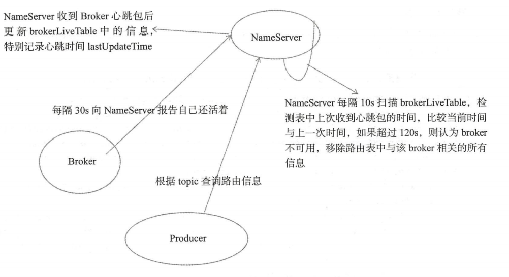
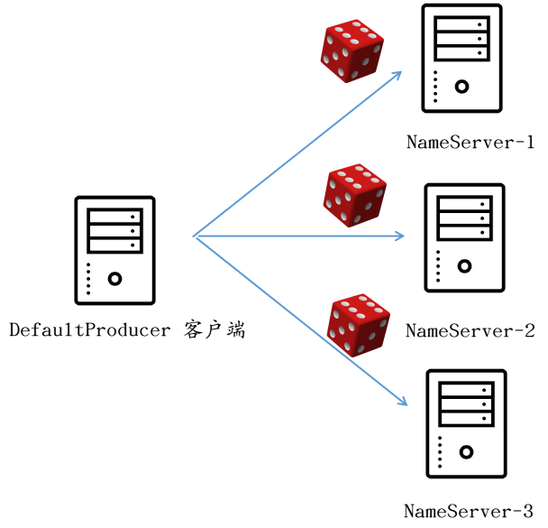
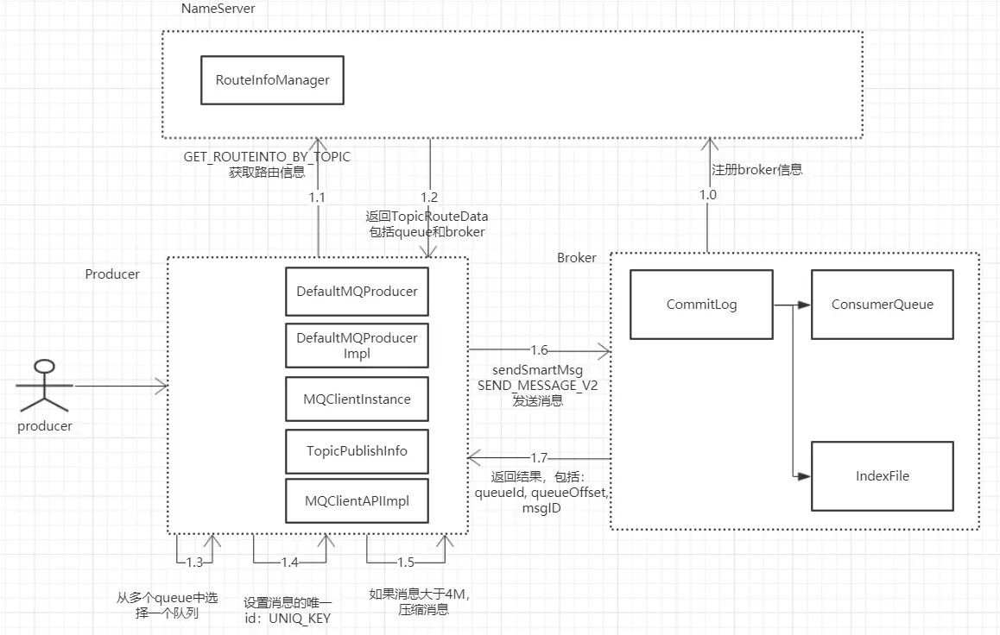

# RocketMQ消息发送流程

本文基于RocketMQ 4.6.0 进行源码分析

本文讲述 RocketMQ 发送一条**普通消息**的流程。

## 一. 服务器启动

我们可以参考[官方文档](https://rocketmq.apache.org/docs/quick-start/)来启动服务:

- 启动 Name 服务器:

```bash
sh bin/mqnamesrv
```

- 启动 Broker 服务器:

```bash
sh bin/mqbroker -n localhost:9876
```


## 二. 构建消息体

一条消息体最少需要指定两个值:

- 所属话题
- 消息内容

如下就是创建了一条话题为 “Test”，消息体为 “Hello World” 的消息:

```java
Message msg = new Message( "Test", "Hello World".getBytes() );
```

## 三. 启动 Producer 准备发送消息

如果我们想要发送消息呢，我们还需要再启动一个 DefaultProducer (生产者) 类来发消息:

```java
DefaultMQProducer producer = new DefaultMQProducer();
producer.start();
```

现在我们所启动的服务如下所示:


## 四. Name服务器的均等性

注意我们上述开启的是单个服务，也即一个 Broker 和一个 Name 服务器，但是实际上使用消息队列的时候，我们可能需要搭建的是一个集群，如下所示:


在 RocketMQ 的设计中，客户端需要首先**询问 NameServer**才能确定一个合适的 Broker 以进行消息的发送:


然而这么多 NameServer，客户端是如何选择一个合适的 NameServer 呢?

首先，我们要意识到很重要的一点，NameServer 全部都是处于相同状态的，保存的都是相同的信息。在 Broker 启动的时候，其会将自己在本地存储的话题配置文件 (默认位于 `$HOME/store/config/topics.json` 目录) 中的所有话题加载到内存中去，然后会将这些所有的话题全部同步到所有的 NameServer 中。与此同时，Broker 也会启动一个定时任务，默认每隔 30 秒来执行一次话题全同步:


## 五. NameServer信息同步

NameServer作为无状态节点，本身不持久化任何信息，它只会将Broker通过心跳上报的Topic信息存储在内存中，不同的NameServer之间是没有通讯连接的，每一个NameServer中数据理论上来说都是最终一致的。

NameServer中存储如下元信息：

```java
public class RouteInfoManager {

    /**
     * topic消息队列的路由信息，消息发送时根据路由表进行负载均衡
     */
    private final HashMap<String/* topic */, List<QueueData>> topicQueueTable;
    /**
     * Broker基础信息，包含brokerName、所属集群名称、主备Broker地址。
     */
    private final HashMap<String/* brokerName */, BrokerData> brokerAddrTable;
    /**
     * Broker集群信息，存储集群中所有Broker的名称
     */
    private final HashMap<String/* clusterName */, Set<String/* brokerName */>> clusterAddrTable;
    /**
     * Broker状态信息，NameServer每次收到心跳包时会替换该信息
     */
    private final HashMap<String/* brokerAddr */, BrokerLiveInfo> brokerLiveTable;
    /**
     * Broker上的FilterServer列表，用于类模式消息过滤。类模式过滤机制在4.4及以后版本被废弃。
     */
    private final HashMap<String/* brokerAddr */, List<String>/* Filter Server */> filterServerTable;
}

public class QueueData implements Comparable<QueueData> {
    private String brokerName;
    private int readQueueNums;
    private int writeQueueNums;
    private int perm;
    private int topicSynFlag;
}

public class BrokerData implements Comparable<BrokerData> {
    private String cluster;
    private String brokerName;
    // brokerId=0代表主Master，大于0表示从Slave
    private HashMap<Long/* brokerId */, String/* broker address */> brokerAddrs;
}

class BrokerLiveInfo {
    //最近一次心跳上报的时间
    private long lastUpdateTimestamp;
    private DataVersion dataVersion;
    private Channel channel;
    private String haServerAddr;
}
```





Broker在启动时，会将自身的信息全部注册至NameServer，然后每隔30s会向NameServer通过心跳更新自身的Topic信息。NameServer 每隔10s 会扫描 brokerLiveTable，检测表中上次收到心跳包的时间，比较当前时间与上一次时间，如果超过120s，则会认为broker不可用，移除路由表中该broker相关的所有信息：

```java
// org.apache.rocketmq.namesrv.NamesrvController#initialize
public boolean initialize() {

        this.kvConfigManager.load();

        // 初始化Netty信息，会在后序流程启动Netty
        this.remotingServer = new NettyRemotingServer(this.nettyServerConfig, this.brokerHousekeepingService);

        this.remotingExecutor =
            Executors.newFixedThreadPool(nettyServerConfig.getServerWorkerThreads(), new ThreadFactoryImpl("RemotingExecutorThread_"));

        this.registerProcessor();

        // 定时任务，每隔10s会扫描一次brokerLiveTable（存放心跳包的时间戳信息），如果在120s内没有收到心跳包，
        // 则认为Broker失效，更新topic的路由信息，将失效的Broker信息移除
        this.scheduledExecutorService.scheduleAtFixedRate(new Runnable() {

            @Override
            public void run() {
                NamesrvController.this.routeInfoManager.scanNotActiveBroker();
            }
        }, 5, 10, TimeUnit.SECONDS);

        // 每隔10s打印一次KV配置
        this.scheduledExecutorService.scheduleAtFixedRate(new Runnable() {

            @Override
            public void run() {
                NamesrvController.this.kvConfigManager.printAllPeriodically();
            }
        }, 1, 10, TimeUnit.MINUTES);

        //....

        return true;
    }
```

## 五. 选择 NameServer

由于 NameServer 每台机器存储的数据都是一致的。因此我们客户端任意选择一台服务器进行沟通即可。



`org.apache.rocketmq.remoting.netty.NettyRemotingClient#getAndCreateNameserverChannel`

```java
public class NettyRemotingClient extends NettyRemotingAbstract implements RemotingClient {
    private Channel getAndCreateNameserverChannel() throws RemotingConnectException, InterruptedException {
        //获取已经选择的Name Server，如果可用就一直使用它
        String addr = this.namesrvAddrChoosed.get();
        if (addr != null) {
            ChannelWrapper cw = this.channelTables.get(addr);
            if (cw != null && cw.isOK()) {
                return cw.getChannel();
            }
        }

        // Name Server 列表
        final List<String> addrList = this.namesrvAddrList.get();
        if (this.lockNamesrvChannel.tryLock(LOCK_TIMEOUT_MILLIS, TimeUnit.MILLISECONDS)) {
            try {
                addr = this.namesrvAddrChoosed.get();
                // 双重校验机制
                if (addr != null) {
                    ChannelWrapper cw = this.channelTables.get(addr);
                    if (cw != null && cw.isOK()) {
                        return cw.getChannel();
                    }
                }

                if (addrList != null && !addrList.isEmpty()) {
                    // 循环寻找下一个可用的Name Server
                    for (int i = 0; i < addrList.size(); i++) {
                        int index = this.namesrvIndex.incrementAndGet();
                        index = Math.abs(index);
                        index = index % addrList.size();
                        String newAddr = addrList.get(index);

                        this.namesrvAddrChoosed.set(newAddr);
                        log.info("new name server is chosen. OLD: {} , NEW: {}. namesrvIndex = {}", addr, newAddr, namesrvIndex);
                        Channel channelNew = this.createChannel(newAddr);
                        if (channelNew != null) {
                            return channelNew;
                        }
                    }
                    throw new RemotingConnectException(addrList.toString());
                }
            } finally {
                this.lockNamesrvChannel.unlock();
            }
        } else {
            log.warn("getAndCreateNameserverChannel: try to lock name server, but timeout, {}ms", LOCK_TIMEOUT_MILLIS);
        }

        return null;
    }
}
```

以后，如果 `namesrvAddrChoosed` 选择的服务器如果一直处于连接状态，那么客户端就会一直与这台服务器进行沟通。否则的话，如上源代码所示，就会自动轮寻下一台可用服务器。

## 六. 寻找Topic路由信息

当客户端发送消息的时候，其首先会尝试寻找Topic路由信息。即**这条消息应该被发送到哪个地方去**。

客户端在内存中维护了一份和Topic相关的路由信息表 `topicPublishInfoTable`，当发送消息的时候，会首先尝试从此表中获取信息。如果此表不存在这条话题的话，那么便会从 Name 服务器获取路由消息。


`org.apache.rocketmq.client.impl.producer.DefaultMQProducerImpl#tryToFindTopicPublishInfo`：

```java
public class DefaultMQProducerImpl implements MQProducerInner {
    /**
     * 如果生产者中缓存了topic的路由信息，且该路由信息包含消息队列，则直
     * 接返回该路由信息。如果没有缓存或没有包含消息队列，则向
     * NameServer查询该topic的路由信息。如果最终未找到路由信息，则抛
     * 出异常，表示无法找到主题相关路由信息异常。
     * @param topic
     * @return
     */
    private TopicPublishInfo tryToFindTopicPublishInfo(final String topic) {
        // 先查本地缓存
        TopicPublishInfo topicPublishInfo = this.topicPublishInfoTable.get(topic);
        if (null == topicPublishInfo || !topicPublishInfo.ok()) {
            this.topicPublishInfoTable.putIfAbsent(topic, new TopicPublishInfo());
            // 如果本地缓存没有该topic路由信息，则查询NameServer并更新本地缓存
            this.mQClientFactory.updateTopicRouteInfoFromNameServer(topic);
            topicPublishInfo = this.topicPublishInfoTable.get(topic);
        }

        if (topicPublishInfo.isHaveTopicRouterInfo() || topicPublishInfo.ok()) {
            return topicPublishInfo;
        } else {
            // 如果是新创建的 Topic，NameServer中不会有Topic信息，则会加载 默认的Topic路由信息
            this.mQClientFactory.updateTopicRouteInfoFromNameServer(topic, true, this.defaultMQProducer);
            topicPublishInfo = this.topicPublishInfoTable.get(topic);
            return topicPublishInfo;
        }
    }
}
```

### 6.1 新建会话

这个Topic是新创建的，NameServer 不存在和此话题相关的信息：


### 6.2 已存会话

话题之前创建过，NameServer存在此话题信息：


服务器返回的话题路由信息包括以下内容:


`org.apache.rocketmq.common.protocol.route.TopicRouteData`：

```java
public class TopicRouteData extends RemotingSerializable {
    private String orderTopicConf;
    private List<QueueData> queueDatas;
    private List<BrokerData> brokerDatas;
    private HashMap<String/* brokerAddr */, List<String>/* Filter Server */> filterServerTable;
}

public class QueueData implements Comparable<QueueData> {
    private String brokerName;
    private int readQueueNums;
    private int writeQueueNums;
    private int perm;
    private int topicSynFlag;
}

public class BrokerData implements Comparable<BrokerData> {
    private String cluster;
    private String brokerName;
    private HashMap<Long/* brokerId */, String/* broker address */> brokerAddrs;
}
```

“broker-1”、”broker-2” 分别为两个 Broker 服务器的名称，相同名称下可以有主从 Broker，因此每个 Broker 又都有 brokerId 。默认情况下，BrokerId 如果为 `MixAll.MASTER_ID` （值为 0） 的话，那么认为这个 Broker 为 MASTER 主节点，其余的位于相同名称下的 Broker 为这台 MASTER 主机的 SLAVE 主机。

`org.apache.rocketmq.client.impl.factory.MQClientInstance#findBrokerAddressInPublish`：

```java
public class MQClientInstance {
	public String findBrokerAddressInPublish(final String brokerName) {
        HashMap<Long/* brokerId */, String/* address */> map = this.brokerAddrTable.get(brokerName);
        if (map != null && !map.isEmpty()) {
            return map.get(MixAll.MASTER_ID);
        }

        return null;
    }
}
```

每个 Broker 上面可以绑定多个可写消息队列和多个可读消息队列，客户端根据返回的所有 Broker 地址列表和每个 Broker 的可写消息队列列表会在内存中构建一份所有的消息队列列表。之后客户端每次发送消息，都会在消息队列列表上轮循选择队列 (我们假设返回了两个 Broker，每个 Broker 均有 4 个可写消息队列):
`org.apache.rocketmq.client.impl.producer.TopicPublishInfo#selectOneMessageQueue()`：

```java
public class TopicPublishInfo {
	public MessageQueue selectOneMessageQueue() {
        int index = this.sendWhichQueue.getAndIncrement();
        int pos = Math.abs(index) % this.messageQueueList.size();
        if (pos < 0)
            pos = 0;
        return this.messageQueueList.get(pos);
    }
}
```


## 七. 给Broker发送消息

```java
// org.apache.rocketmq.client.impl.producer.DefaultMQProducerImpl#sendDefaultImpl
private SendResult sendDefaultImpl(
        Message msg,
        final CommunicationMode communicationMode,
        final SendCallback sendCallback,
        final long timeout
    ) throws MQClientException, RemotingException, MQBrokerException, InterruptedException {
        this.makeSureStateOK();
        Validators.checkMessage(msg, this.defaultMQProducer);
        final long invokeID = random.nextLong();
        long beginTimestampFirst = System.currentTimeMillis();
        long beginTimestampPrev = beginTimestampFirst;
        long endTimestamp = beginTimestampFirst;
        // 第一步：查询topic对应的路由信息
        TopicPublishInfo topicPublishInfo = this.tryToFindTopicPublishInfo(msg.getTopic());
        if (topicPublishInfo != null && topicPublishInfo.ok()) {
            boolean callTimeout = false;
            MessageQueue mq = null;
            Exception exception = null;
            SendResult sendResult = null
            // 总计发送次数（1+重试次数）
            int timesTotal = communicationMode == CommunicationMode.SYNC ? 1 + this.defaultMQProducer.getRetryTimesWhenSendFailed() : 1;
            int times = 0;
            String[] brokersSent = new String[timesTotal];
            // 循环指定发送指定次数，直到成功发送后退出循环
            for (; times < timesTotal; times++) {
                String lastBrokerName = null == mq ? null : mq.getBrokerName();
                // 第二步：选择一个消息队列
                MessageQueue mqSelected = this.selectOneMessageQueue(topicPublishInfo, lastBrokerName);
                if (mqSelected != null) {
                    mq = mqSelected;
                    brokersSent[times] = mq.getBrokerName();
                    try {
                        beginTimestampPrev = System.currentTimeMillis();
                        if (times > 0) {
                            //Reset topic with namespace during resend.
                            msg.setTopic(this.defaultMQProducer.withNamespace(msg.getTopic()));
                        }
                        long costTime = beginTimestampPrev - beginTimestampFirst;
                        if (timeout < costTime) {
                            callTimeout = true;
                            break;
                        }
                        // 第三步：发送消息
                        sendResult = this.sendKernelImpl(msg, mq, communicationMode, sendCallback, topicPublishInfo, timeout - costTime);
                        endTimestamp = System.currentTimeMillis();
                        // 使用本次消息发送延迟时间来计算Broker故障规避时长
                        this.updateFaultItem(mq.getBrokerName(), endTimestamp - beginTimestampPrev, false);
                        switch (communicationMode) {
                            case ASYNC:
                                return null;
                            case ONEWAY:
                                return null;
                            case SYNC:
                                if (sendResult.getSendStatus() != SendStatus.SEND_OK) {
                                    if (this.defaultMQProducer.isRetryAnotherBrokerWhenNotStoreOK()) {
                                        continue;
                                    }
                                }

                                return sendResult;
                            default:
                                break;
                        }
                    } catch (RemotingException e) {
                        endTimestamp = System.currentTimeMillis();
                        // 若消息发送失败，则更新失败条目，使用默认时长30s来计算Broker故障规避时长
                        this.updateFaultItem(mq.getBrokerName(), endTimestamp - beginTimestampPrev, true);
                        log.warn(String.format("sendKernelImpl exception, resend at once, InvokeID: %s, RT: %sms, Broker: %s", invokeID, endTimestamp - beginTimestampPrev, mq), e);
                        log.warn(msg.toString());
                        exception = e;
                        continue;
                    } catch (MQClientException e) {
                        endTimestamp = System.currentTimeMillis();
                        this.updateFaultItem(mq.getBrokerName(), endTimestamp - beginTimestampPrev, true);
                        log.warn(String.format("sendKernelImpl exception, resend at once, InvokeID: %s, RT: %sms, Broker: %s", invokeID, endTimestamp - beginTimestampPrev, mq), e);
                        log.warn(msg.toString());
                        exception = e;
                        continue;
                    } catch (MQBrokerException e) {
                        endTimestamp = System.currentTimeMillis();
                        this.updateFaultItem(mq.getBrokerName(), endTimestamp - beginTimestampPrev, true);
                        log.warn(String.format("sendKernelImpl exception, resend at once, InvokeID: %s, RT: %sms, Broker: %s", invokeID, endTimestamp - beginTimestampPrev, mq), e);
                        log.warn(msg.toString());
                        exception = e;
                        switch (e.getResponseCode()) {
                            case ResponseCode.TOPIC_NOT_EXIST:
                            case ResponseCode.SERVICE_NOT_AVAILABLE:
                            case ResponseCode.SYSTEM_ERROR:
                            case ResponseCode.NO_PERMISSION:
                            case ResponseCode.NO_BUYER_ID:
                            case ResponseCode.NOT_IN_CURRENT_UNIT:
                                continue;
                            default:
                                if (sendResult != null) {
                                    return sendResult;
                                }

                                throw e;
                        }
                    } catch (InterruptedException e) {
                        endTimestamp = System.currentTimeMillis();
                        this.updateFaultItem(mq.getBrokerName(), endTimestamp - beginTimestampPrev, false);
                        log.warn(String.format("sendKernelImpl exception, throw exception, InvokeID: %s, RT: %sms, Broker: %s", invokeID, endTimestamp - beginTimestampPrev, mq), e);
                        log.warn(msg.toString());

                        log.warn("sendKernelImpl exception", e);
                        log.warn(msg.toString());
                        throw e;
                    }
                } else {
                    break;
                }
            }

            if (sendResult != null) {
                return sendResult;
            }

            String info = String.format("Send [%d] times, still failed, cost [%d]ms, Topic: %s, BrokersSent: %s",
                times,
                System.currentTimeMillis() - beginTimestampFirst,
                msg.getTopic(),
                Arrays.toString(brokersSent));

            info += FAQUrl.suggestTodo(FAQUrl.SEND_MSG_FAILED);

            MQClientException mqClientException = new MQClientException(info, exception);
            if (callTimeout) {
                throw new RemotingTooMuchRequestException("sendDefaultImpl call timeout");
            }

            if (exception instanceof MQBrokerException) {
                mqClientException.setResponseCode(((MQBrokerException) exception).getResponseCode());
            } else if (exception instanceof RemotingConnectException) {
                mqClientException.setResponseCode(ClientErrorCode.CONNECT_BROKER_EXCEPTION);
            } else if (exception instanceof RemotingTimeoutException) {
                mqClientException.setResponseCode(ClientErrorCode.ACCESS_BROKER_TIMEOUT);
            } else if (exception instanceof MQClientException) {
                mqClientException.setResponseCode(ClientErrorCode.BROKER_NOT_EXIST_EXCEPTION);
            }

            throw mqClientException;
        }

        validateNameServerSetting();

        throw new MQClientException("No route info of this topic: " + msg.getTopic() + FAQUrl.suggestTodo(FAQUrl.NO_TOPIC_ROUTE_INFO),
            null).setResponseCode(ClientErrorCode.NOT_FOUND_TOPIC_EXCEPTION);
    }
```

### 7.1 发送消息时的容错机制

在RocketMQ Producer发送失败后，Producer默认会再重试两次（retryTimesWhenSendFailed）：

```java
// 总计发送次数（1+重试次数）
int timesTotal = communicationMode == CommunicationMode.SYNC ? 1 + this.defaultMQProducer.getRetryTimesWhenSendFailed() : 1;
```

若上一次发送失败，则在重试选择队列时，会尽量跳过上一次失败的broker，去选择不是上一次失败的broker上的队列：

```java
// org.apache.rocketmq.client.impl.producer.TopicPublishInfo#selectOneMessageQueue(java.lang.String)
/**
 * 选择一个队列，如果上一次发送失败，这一次会尽量规避调上一次失败的broker上的队列
 * @param lastBrokerName 上一次失败的broker
 * @return
 */
public MessageQueue selectOneMessageQueue(final String lastBrokerName) {
        if (lastBrokerName == null) {
            // 在消息发送过程中，可能会多次执行选择消息队列这个方法，
            //lastBrokerName就是上一次选择的执行发送消息失败的Broker。第一
            //次执行消息队列选择时，lastBrokerName为null，此时直接用
            //sendWhichQueue自增再获取值，与当前路由表中消息队列的个数取
            //模，返回该位置的MessageQueue(selectOneMessageQueue()方法
            return selectOneMessageQueue();
        } else {
            //如果消息发送失败，下次进行消息队列选择时规避上次MesageQueue所在的Broker，否则有可能再次失败。
            int index = this.sendWhichQueue.getAndIncrement();
            for (int i = 0; i < this.messageQueueList.size(); i++) {
                int pos = Math.abs(index++) % this.messageQueueList.size();
                if (pos < 0)
                    pos = 0;
                MessageQueue mq = this.messageQueueList.get(pos);
                if (!mq.getBrokerName().equals(lastBrokerName)) {
                    return mq;
                }
            }
            // 如果没有找到其它broker上的队列，则降级为默认逻辑，轮询获取下一个队列信息。
            return selectOneMessageQueue();
        }
    }
```

但是此种容错只会在当前这一次发送中生效，RocketMQ 提供了 `sendLatencyFaultEnable` 参数开启 broker故障延迟机制，故障延迟机制由 `MQFaultStrategy` 实现，`MQFaultStrategy` 使用了装饰器模式，对基础的容错机制进行了增强：

```java
// org.apache.rocketmq.client.latency.MQFaultStrategy#selectOneMessageQueue 
public MessageQueue selectOneMessageQueue(final TopicPublishInfo tpInfo, final String lastBrokerName) {
        if (this.sendLatencyFaultEnable) {
            // 如果开启了故障延迟机制
            try {
                int index = tpInfo.getSendWhichQueue().getAndIncrement();
                for (int i = 0; i < tpInfo.getMessageQueueList().size(); i++) {
                    int pos = Math.abs(index++) % tpInfo.getMessageQueueList().size();
                    if (pos < 0)
                        pos = 0;
                    // 获取一个消息队列
                    MessageQueue mq = tpInfo.getMessageQueueList().get(pos);
                    // 验证该消息队列是否可用
                    if (latencyFaultTolerance.isAvailable(mq.getBrokerName())) {
                        if (null == lastBrokerName || mq.getBrokerName().equals(lastBrokerName))
                            return mq;
                    }
                }

                final String notBestBroker = latencyFaultTolerance.pickOneAtLeast();
                int writeQueueNums = tpInfo.getQueueIdByBroker(notBestBroker);
                if (writeQueueNums > 0) {
                    final MessageQueue mq = tpInfo.selectOneMessageQueue();
                    if (notBestBroker != null) {
                        mq.setBrokerName(notBestBroker);
                        mq.setQueueId(tpInfo.getSendWhichQueue().getAndIncrement() % writeQueueNums);
                    }
                    return mq;
                } else {
                    // 移除失败条目，意味着Broker重新参与路由计算
                    latencyFaultTolerance.remove(notBestBroker);
                }
            } catch (Exception e) {
                log.error("Error occurred when selecting message queue", e);
            }

            return tpInfo.selectOneMessageQueue();
        }
        // 未开启故障延迟机制，则使用基础的容错机制选择一个队列
        return tpInfo.selectOneMessageQueue(lastBrokerName);
    }
```

是否启用Broker故障延迟机制，开启与不开启sendLatencyFaultEnable机制在消息发送时都能规避故障的Broker，那么这两种机制有何区别呢？

开启所谓的故障延迟机制，即设置sendLatencyFaultEnable为true，其实是一种较为悲观的做法。当消息发送者遇到一次消息发送失败
后，就会悲观地认为Broker不可用，在接下来的一段时间内就不再向其发送消息，直接避开该Broker。而不开启延迟规避机制，就只会在本次消息发送的重试过程中规避该Broker，下一次消息发送还是会继续尝试。

## 八. Broker 检查话题信息

刚才说到，如果话题信息在 Name 服务器不存在的话，那么会使用默认话题信息进行消息的发送。然而一旦这条消息到来之后，Broker 端还并没有这个话题。所以 Broker 需要检查话题的存在性:

`org.apache.rocketmq.broker.processor.AbstractSendMessageProcessor#msgCheck`：

```java
public abstract class AbstractSendMessageProcessor implements NettyRequestProcessor {

    protected RemotingCommand msgCheck(final ChannelHandlerContext ctx,
                                       final SendMessageRequestHeader requestHeader, final RemotingCommand response) {

        // ...

        TopicConfig topicConfig =
            this.brokerController
                .getTopicConfigManager()
                .selectTopicConfig(requestHeader.getTopic());
        if (null == topicConfig) {

            // ...

            topicConfig = this.brokerController
                .getTopicConfigManager()
                .createTopicInSendMessageMethod( ... );
            
        }
        
    }
    
}
```

如果话题不存在的话，那么便会创建一个话题信息存储到本地，并将所有话题再进行一次同步给所有的 NameServer:

`org.apache.rocketmq.broker.topic.TopicConfigManager#createTopicInSendMessageMethod`：

```java
public class TopicConfigManager extends ConfigManager {

    public TopicConfig createTopicInSendMessageMethod(final String topic, /** params **/) {
        // ...
        topicConfig = new TopicConfig(topic);
        
        this.topicConfigTable.put(topic, topicConfig);
        this.persist();

        // ...
        
        this.brokerController.registerBrokerAll(false, true);

        return topicConfig;
    }
    
}
```

话题检查的整体流程如下所示:


## 九. 整体流程

发送消息的整体流程:



- Broker启动时，向NameServer注册信息

- 客户端调用producer发送消息时，会先从NameServer获取该topic的路由信息。消息头code为GET_ROUTEINFO_BY_TOPIC

- 从NameServer返回的路由信息，包括topic包含的队列列表和broker列表

- Producer端根据查询策略，选出其中一个队列，用于后续存储消息

- 每条消息会生成一个唯一id，添加到消息的属性中。属性的key为UNIQ_KEY

- 对消息做一些特殊处理，比如：超过4M会对消息进行压缩

- producer向Broker发送rpc请求，将消息保存到broker端。消息头的code为SEND_MESSAGE或SEND_MESSAGE_V2（配置文件设置了特殊标志）

> 本文参考至：
>
> [RocketMQ 消息发送流程 | 赵坤的个人网站 (kunzhao.org)](https://kunzhao.org/docs/rocketmq/rocketmq-send-message-flow/)
>
> [图解RocketMQ消息发送和存储流程 - 掘金 (juejin.cn)](https://juejin.cn/post/6844903862147497998)
