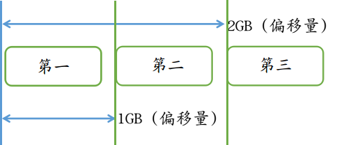
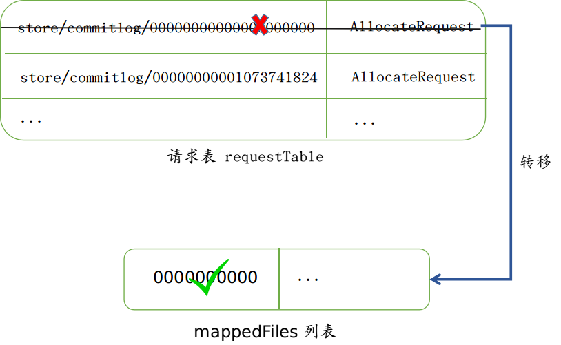
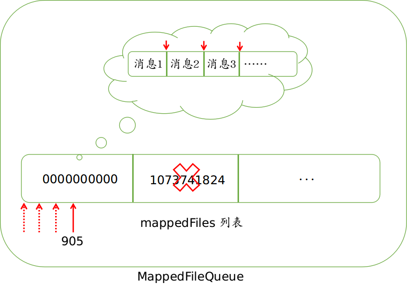

# RocketMQ消息存储流程

> 本文转载至：[RocketMQ 消息存储流程 | 赵坤的个人网站 (kunzhao.org)](https://kunzhao.org/docs/rocketmq/rocketmq-message-store-flow/)

> 本文基于RocketMQ 4.8.0进行源码分析

## 一. 存储位置

当有一条消息过来之后，Broker 首先需要做的是确定这条消息应该存储在哪个文件里面。在 RocketMQ 中，这个用来存储消息的文件被称之为 MappedFile。这个文件默认创建的大小为 1GB。


一个文件为 1GB 大小，也即 `1024 * 1024 * 1024 = 1073741824` 字节，这每个文件的命名是按照总的字节偏移量来命名的。例如第一个文件偏移量为 0，那么它的名字为 `00000000000000000000`；当当前这 1G 文件被存储满了之后，就会创建下一个文件，下一个文件的偏移量则为 1GB，那么它的名字为 `00000000001073741824`，以此类推。



默认情况下这些消息文件位于 `$HOME/store/commitlog` 目录下，如下图所示:


## 二. 文件创建

当有新的消息到来的时候，其会默认选择列表中的最后一个文件来进行消息的保存:


当有新的消息到来的时候，其会默认选择列表中的最后一个文件来进行消息的保存:


`org.apache.rocketmq.store.MappedFileQueue`：

```java
public class MappedFileQueue {
    public MappedFile getLastMappedFile() {
        MappedFile mappedFileLast = null;

        while (!this.mappedFiles.isEmpty()) {
            try {
                mappedFileLast = this.mappedFiles.get(this.mappedFiles.size() - 1);
                break;
            } catch (IndexOutOfBoundsException e) {
                //continue;
            } catch (Exception e) {
                log.error("getLastMappedFile has exception.", e);
                break;
            }
        }

        return mappedFileLast;
    }
}
```

当然如果这个 Broker 之前从未接受过消息的话，那么这个列表肯定是空的。这样一旦有新的消息需要存储的时候，其就得需要立即创建一个 `MappedFile` 文件来存储消息。

RocketMQ 提供了一个专门用来实例化 `MappedFile` 文件的服务类 `AllocateMappedFileService`。在内存中，也同时维护了一张请求表 `requestTable` 和一个优先级请求队列 `requestQueue` 。当需要创建文件的时候，Broker 会创建一个 `AllocateRequest` 对象，其包含了文件的路径、大小等信息。然后先将其放入 `requestTable` 表中，再将其放入优先级请求队列 `requestQueue` 中:

`org.apache.rocketmq.store.AllocateMappedFileService#putRequestAndReturnMappedFile`

```java
public class AllocateMappedFileService extends ServiceThread {

    public MappedFile putRequestAndReturnMappedFile(String nextFilePath,
                                                    String nextNextFilePath,
                                                    int fileSize) {

        // ...

        AllocateRequest nextReq = new AllocateRequest(nextFilePath, fileSize);
        boolean nextPutOK = this.requestTable.putIfAbsent(nextFilePath, nextReq) == null;
        if (nextPutOK) {
            // ...
            boolean offerOK = this.requestQueue.offer(nextReq);
        }
        
    }
    
}
```

服务类会**一直**等待优先级队列是否有新的请求到来，如果有，便会从队列中取出请求，然后创建对应的 `MappedFile`，并将请求表 requestTable 中 `AllocateRequest` 对象的字段 `mappedFile` 设置上值。最后将 `AllocateRequest` 对象上的 `CountDownLatch` 的计数器减 1 ，以标明此分配申请的 `MappedFile` 已经创建完毕了:

`org.apache.rocketmq.store.AllocateMappedFileService#mmapOperation`

```java
public class AllocateMappedFileService extends ServiceThread {
        public void run() {
        log.info(this.getServiceName() + " service started");
		//会一直尝试从队列中获取请求，从而执行创建文件的任务
        while (!this.isStopped() && this.mmapOperation()) {

        }
        log.info(this.getServiceName() + " service end");
    }

    /**
     * Only interrupted by the external thread, will return false
     */
    private boolean mmapOperation() {
        boolean isSuccess = false;
        AllocateRequest req = null;
        try {
            // 获取优先队列中的请求
            req = this.requestQueue.take();
            AllocateRequest expectedRequest = this.requestTable.get(req.getFilePath());

            // ...
            
            if (req.getMappedFile() == null) {
                long beginTime = System.currentTimeMillis();

                MappedFile mappedFile;
                if (messageStore.getMessageStoreConfig().isTransientStorePoolEnable()) {
                    try {
                        //创建MappedFile
                        mappedFile = ServiceLoader.load(MappedFile.class).iterator().next();
                        mappedFile.init(req.getFilePath(), req.getFileSize(), messageStore.getTransientStorePool());
                    } catch (RuntimeException e) {
                        log.warn("Use default implementation.");
                        mappedFile = new MappedFile(req.getFilePath(), req.getFileSize(), messageStore.getTransientStorePool());
                    }
                } else {
                    mappedFile = new MappedFile(req.getFilePath(), req.getFileSize());
                }

                // pre write mappedFile
                if (mappedFile.getFileSize() >= this.messageStore.getMessageStoreConfig()
                   //...
                }

                req.setMappedFile(mappedFile);
                this.hasException = false;
                isSuccess = true;
            }
        } catch (InterruptedException e) {
            log.warn(this.getServiceName() + " interrupted, possibly by shutdown.");
            this.hasException = true;
            return false;
        } catch (IOException e) {
            log.warn(this.getServiceName() + " service has exception. ", e);
            this.hasException = true;
            if (null != req) {
                requestQueue.offer(req);
                try {
                    Thread.sleep(1);
                } catch (InterruptedException ignored) {
                }
            }
        } finally {
            if (req != null && isSuccess)
                // 文件创建成功，计数减一。因为创建文件的动作是在独立的线程中完成的，业务线程需要等待文件创建完毕
                req.getCountDownLatch().countDown();
        }
        return true;
    }
}
```

等待 `MappedFile` 创建完毕之后，其便会从请求表 `requestTable` 中取出并删除表中记录:

`org.apache.rocketmq.store.AllocateMappedFileService#putRequestAndReturnMappedFile`

```java
public class AllocateMappedFileService extends ServiceThread {

    public MappedFile putRequestAndReturnMappedFile(String nextFilePath,
                                                    String nextNextFilePath,
                                                    int fileSize) {
        // ...........
        //获取请求
        AllocateRequest result = this.requestTable.get(nextFilePath);
        try {
            if (result != null) {
                // 等待 MappedFile 的创建完成
                boolean waitOK = result.getCountDownLatch().await(waitTimeOut, TimeUnit.MILLISECONDS);
                if (!waitOK) {
                    // 创建超时
                    log.warn("create mmap timeout " + result.getFilePath() + " " + result.getFileSize());
                    return null;
                } else {
                    //创建成功，则将requestTable中将请求移除
                    this.requestTable.remove(nextFilePath);
                    // 返回创建的MappedFiles
                    return result.getMappedFile();
                }
            } else {
                log.error("find preallocate mmap failed, this never happen");
            }
        } catch (InterruptedException e) {
            log.warn(this.getServiceName() + " service has exception. ", e);
        }

        return null;
    }
    
}
```

创建完成后将其加入列表中：

`org.apache.rocketmq.store.MappedFileQueue#getLastMappedFile(long, boolean)`

```java
public class MappedFileQueue {
    public MappedFile getLastMappedFile(final long startOffset, boolean needCreate) {
        long createOffset = -1;
        // 尝试获取最后一个MappedFile
        MappedFile mappedFileLast = getLastMappedFile();

        if (mappedFileLast == null) {
            createOffset = startOffset - (startOffset % this.mappedFileSize);
        }

        if (mappedFileLast != null && mappedFileLast.isFull()) {
            createOffset = mappedFileLast.getFileFromOffset() + this.mappedFileSize;
        }

        // 第一次启动未创建MappedFile
        if (createOffset != -1 && needCreate) {
            // 文件名
            String nextFilePath = this.storePath + File.separator + UtilAll.offset2FileName(createOffset);
            String nextNextFilePath = this.storePath + File.separator
                + UtilAll.offset2FileName(createOffset + this.mappedFileSize);
            MappedFile mappedFile = null;

            if (this.allocateMappedFileService != null) {
                // 提交一个创建MappedFile的请求
                mappedFile = this.allocateMappedFileService.putRequestAndReturnMappedFile(nextFilePath,
                    nextNextFilePath, this.mappedFileSize);
            } else {
                try {
                    mappedFile = new MappedFile(nextFilePath, this.mappedFileSize);
                } catch (IOException e) {
                    log.error("create mappedFile exception", e);
                }
            }

            if (mappedFile != null) {
                //创建成功
                if (this.mappedFiles.isEmpty()) {
                    mappedFile.setFirstCreateInQueue(true);
                }
                //加入列表
                this.mappedFiles.add(mappedFile);
            }

            return mappedFile;
        }

        return mappedFileLast;
    }    
}
```



至此，`MappedFile` 已经创建完毕，也即可以进行下一步的操作了。

## 三. 文件初始化

在 `MappedFile` 的构造函数中，其使用了 `FileChannel` 类提供的 map 函数来将磁盘上的这个文件映射到进程地址空间中。然后当通过 `MappedByteBuffer` 来读入或者写入文件的时候，磁盘上也会有相应的改动。采用这种方式，通常比传统的基于文件 IO 流的方式读取效率高。

```java
public class MappedFile extends ReferenceResource {
    
    public MappedFile(final String fileName, final int fileSize)
        throws IOException {
        init(fileName, fileSize);
    }

    private void init(final String fileName, final int fileSize)
        throws IOException {
        // ...
        this.fileChannel = new RandomAccessFile(this.file, "rw").getChannel();
        this.mappedByteBuffer = this.fileChannel.map(MapMode.READ_WRITE, 0, fileSize);
        // ...
    }
    
}
```

## 四. 消息文件加载

前面提到过，Broker 在启动的时候，会加载磁盘上的文件到一个 `mappedFiles` 列表中。但是加载完毕后，其还会对这份列表中的消息文件进行**验证 (恢复)**，确保没有错误。

验证的基本想法是通过一一读取列表中的每一个文件，然后再一一读取每个文件中的每个消息，在读取的过程中，其会更新整体的消息写入的偏移量，如下图中的红色箭头 (我们假设最终读取的消息的总偏移量为 905):



当确定消息整体的偏移量之后，Broker 便会确定每一个单独的 `MappedFile` 文件的**各自的偏移量**，每一个文件的偏移量是通过**取余**算法确定的:

`org.apache.rocketmq.store.MappedFileQueue#truncateDirtyFiles`:

```java
public class MappedFileQueue {

    public void truncateDirtyFiles(long offset) {

        for (MappedFile file : this.mappedFiles) {
            long fileTailOffset = file.getFileFromOffset() + this.mappedFileSize;
            if (fileTailOffset > offset) {
                if (offset >= file.getFileFromOffset()) {
                    // 确定每个文件的各自偏移量
                    file.setWrotePosition((int) (offset % this.mappedFileSize));
                    file.setCommittedPosition((int) (offset % this.mappedFileSize));
                    file.setFlushedPosition((int) (offset % this.mappedFileSize));
                } else {
                    // ...
                }
            }
        }

        // ...
    }
    
}
```


在确定每个消息文件各自的写入位置的同时，其还会删除**起始偏移量**大于当前总偏移量的消息文件，这些文件可以视作脏文件，或者也可以说这些文件里面一条消息也没有。这也是上述文件 `1073741824` 被打上红叉的原因:

```java
public void truncateDirtyFiles(long offset) {
    List<MappedFile> willRemoveFiles = new ArrayList<MappedFile>();

    for (MappedFile file : this.mappedFiles) {
        long fileTailOffset = file.getFileFromOffset() + this.mappedFileSize;
        if (fileTailOffset > offset) {
            if (offset >= file.getFileFromOffset()) {
                // ...
            } else {
                // 总偏移量 < 文件起始偏移量
                // 加入到待删除列表中
                file.destroy(1000);
                willRemoveFiles.add(file);
            }
        }
    }

    this.deleteExpiredFile(willRemoveFiles);
}
```

## 五. 写入消息

> 消息写入口：org.apache.rocketmq.store.CommitLog#putMessage

一旦我们获取到 `MappedFile` 文件之后，我们便可以往这个文件里面写入消息了。写入消息可能会遇见如下两种情况，一种是这条消息可以完全追加到这个文件中，另外一种是这条消息完全不能或者只有一小部分能存放到这个文件中，其余的需要放到新的文件中。我们对于这两种情况分别讨论:

### 5.1 文件可以完全存储消息

`MappedFile` 类维护了一个用以标识当前写位置的指针 `wrotePosition`，以及一个用来映射文件到进程地址空间的 `mappedByteBuffer`:

```java
public class MappedFile extends ReferenceResource {

    protected final AtomicInteger wrotePosition = new AtomicInteger(0);
    private MappedByteBuffer mappedByteBuffer;
    
}
```

由这两个数据结构我们可以看出来，单个文件的消息写入过程其实是非常简单的。首先获取到这个文件的写入位置，然后将消息内容追加到 `byteBuffer` 中，然后再更新写入位置。

```java
public class MappedFile extends ReferenceResource {

    public AppendMessageResult appendMessagesInner(final MessageExt messageExt, final AppendMessageCallback cb) {
        // ...
    
        int currentPos = this.wrotePosition.get();

        if (currentPos < this.fileSize) {
            ByteBuffer byteBuffer =
                writeBuffer != null ?
                writeBuffer.slice() :
                this.mappedByteBuffer.slice();

            // 更新 byteBuffer 位置
            byteBuffer.position(currentPos);

            // 写入消息内容
            // ...

            // 获取当前需要写入的消息长度，更新 wrotePosition 指针的位置
            this.wrotePosition.addAndGet(result.getWroteBytes());

            return result;
        }

    }
    
}
```

示例流程如下所示:


### 5.2 文件不可以完全存储消息

在写入消息之前，如果判断出文件已经满了的情况下，其会直接尝试创建一个新的 `MappedFile`:

```java
public class CommitLog {

    public PutMessageResult putMessage(final MessageExtBrokerInner msg) {

        // 文件为空 || 文件已经满了
        if (null == mappedFile || mappedFile.isFull()) {
            mappedFile = this.mappedFileQueue.getLastMappedFile(0);
        }

        // ...
        
        result = mappedFile.appendMessage(msg, this.appendMessageCallback);
        
    }
    
}
```

如果文件未满，那么在写入之前会先计算出消息体长度 `msgLen`，然后判断这个文件剩下的空间是否有能力容纳这条消息。在这个地方我们还需要介绍下每条消息的存储方式。

每条消息的存储是按照一个 4 字节的长度来做界限的，这个长度本身就是整个消息体的长度，当读完这整条消息体的长度之后，下一次再取出来的一个 4 字节的数字，便又是下一条消息的长度:


围绕着一条消息，还会存储许多其它内容，我们在这里只需要了解前两位是 4 字节的总长度和 4 字节的 MAGICCODE 即可:


`MAGICCODE` 的可选值有:

- `CommitLog.MESSAGE_MAGIC_CODE`
- `CommitLog.BLANK_MAGIC_CODE`

当这个文件有能力容纳这条消息体的情况下，其便会存储 `MESSAGE_MAGIC_CODE` 值；当这个文件没有能力容纳这条消息体的情况下，其便会存储 `BLANK_MAGIC_CODE` 值。所以这个 `MAGICCODE` 是用来界定这是空消息还是一条正常的消息。

当判定这个文件不足以容纳整个消息的时候，其将消息体长度设置为这个文件剩余的最大空间长度，将 `MAGICCODE` 设定为这是一个空消息文件 (需要去下一个文件去读)。由此我们可以看出消息体长度 和 `MAGICCODE` 是判别一条消息格式的最基本要求，这也是 `END_FILE_MIN_BLANK_LENGTH` 的值为 8 的原因:

`org.apache.rocketmq.store.CommitLog.DefaultAppendMessageCallback#doAppend(long, java.nio.ByteBuffer, int, org.apache.rocketmq.store.MessageExtBrokerInner)`

```java
public class CommitLog {

    
    class DefaultAppendMessageCallback implements AppendMessageCallback {

        // File at the end of the minimum fixed length empty
        private static final int END_FILE_MIN_BLANK_LENGTH = 4 + 4;

        public AppendMessageResult doAppend(final long fileFromOffset,
                                            final ByteBuffer byteBuffer,
                                            final int maxBlank,
                                            final MessageExtBrokerInner msgInner) {

            // ...

            if ((msgLen + END_FILE_MIN_BLANK_LENGTH) > maxBlank) {
                // ...

                // 1 TOTALSIZE
                this.msgStoreItemMemory.putInt(maxBlank);
                // 2 MAGICCODE
                this.msgStoreItemMemory.putInt(CommitLog.BLANK_MAGIC_CODE);
                // 3 The remaining space may be any value
                byteBuffer.put(this.msgStoreItemMemory.array(), 0, maxBlank);

                return new AppendMessageResult(AppendMessageStatus.END_OF_FILE,
                                               /** other params **/ );
            }

        }

    }
}
```

由上述方法我们看出在这种情况下返回的结果是 `END_OF_FILE`。当检测到这种返回结果的时候，`CommitLog` 接着又会申请创建新的 `MappedFile` 并尝试写入消息。追加方法同 (1) 相同，不再赘述:


> 注: 在消息文件加载的过程中，其也是通过判断 `MAGICCODE` 的类型，来判断是否继续读取下一个 `MappedFile` 来计算整体消息偏移量的。

## 六. 消息刷盘策略

当消息体追加到 `MappedFile` 以后，这条消息实际上还只是存储在内存中，因此还需要将内存中的内容刷到磁盘上才算真正的存储下来，才能确保消息不丢失。一般而言，刷盘有两种策略: 异步刷盘和同步刷盘。

### 6.1 异步刷盘

当配置为异步刷盘策略的时候，Broker 会运行一个服务 `FlushRealTimeService` 用来刷新缓冲区的消息内容到磁盘，这个服务使用一个独立的线程来做刷盘这件事情，默认情况下每隔 500ms 来检查一次是否需要刷盘:

```java
class FlushRealTimeService extends FlushCommitLogService {

    public void run() {

        // 不停运行
        while (!this.isStopped()) {

            // interval 默认值是 500ms
            if (flushCommitLogTimed) {
                Thread.sleep(interval);
            } else {
                this.waitForRunning(interval);
            }

            // 刷盘
            CommitLog.this.mappedFileQueue.flush(flushPhysicQueueLeastPages);

        }
        
    }
    
}
```

