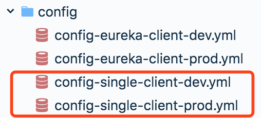

# Spring Cloud Config

> [Spring Cloud Config 实现配置中心，看这一篇就够了 - 风的姿态 - 博客园 (cnblogs.com)](https://www.cnblogs.com/fengzheng/p/11242128.html)

Spring Cloud Config 是 Spring Cloud 家族中最早的配置中心，虽然后来又发布了 Consul 可以代替配置中心功能，但是 Config 依然适用于 Spring Cloud 项目，通过简单的配置即可实现功能。

配置文件是我们再熟悉不过的了，尤其是 Spring Boot 项目，除了引入相应的 maven 包之外，剩下的工作就是完善配置文件了，例如 mysql、redis 、security 相关的配置。除了项目运行的基础配置之外，还有一些配置是与我们业务有关系的，比如说七牛存储、短信相关、邮件相关，或者一些业务上的开关。

对于一些简单的项目来说，我们一般都是直接把相关配置放在单独的配置文件中，以 properties 或者 yml 的格式出现，更省事儿的方式是直接放到 application.properties 或 application.yml 中。但是这样的方式有个明显的问题，那就是，当修改了配置之后，必须重启服务，否则配置无法生效。

目前有一些用的比较多的开源的配置中心，比如携程的 Apollo、蚂蚁金服的 disconf 等，对比 Spring Cloud Config，这些配置中心功能更加强大。有兴趣的可以拿来试一试。

**接下来**，我们开始在 Spring Boot 项目中集成 Spring Cloud Config，并以 github 作为配置存储。除了 git 外，还可以用数据库、svn、本地文件等作为存储。主要从以下三块来说一下 Config 的使用。

1. 基础版的配置中心（不集成 Eureka）;

2. 结合 Eureka 版的配置中心;

3. 实现配置的自动刷新；

## 一. 实现最简单的配置中心

最简单的配置中心，就是启动一个服务作为服务方，之后各个需要获取配置的服务作为客户端来这个服务方获取配置。

**第一步：创建一个Git仓库**



配置文件内容大致如下：

```yml
data:
  env: config-eureka-dev
  user:
    username: eureka-client-user
    password: 1291029102
```

**第二步：创建SpringBoot项目作为config server**

**第三步：在项目中引入`Spring Cloud config`依赖**

```xml
<dependency>
    <groupId>org.springframework.boot</groupId>
    <artifactId>spring-boot-starter-web</artifactId>
</dependency>
<dependency>
    <groupId>org.springframework.cloud</groupId>
    <artifactId>spring-cloud-config-server</artifactId>
</dependency>
```

**第四步：配置config server 连接Git仓库**

```yml
server:
  port: 8091
spring:
  application:
    # 应用名称
    name: config-single-server
  cloud:
    config:
      server:
        git:
          #配置文件所在仓库
          uri: git@github.com:bigcoder84/spring-cloud-config-qa.git
          username: bigcoder84
          password: *********
          #配置文件分支
          default-label: master
          #配置文件所在根目录
          search-paths: config
```

**第五步：在启动类上加上`@EnableConfigServer`注解**

启动Config Server后我们可以通过下列模式，去访问Git中存储的配置文件了：

```txt
/{application}/{profile}[/{label}]
/{application}-{profile}.yml
/{label}/{application}-{profile}.yml
/{application}-{profile}.properties
/{label}/{application}-{profile}.properties
```

- {application} 就是应用名称，对应到配置文件上来，就是配置文件的名称部分，例如我上面创建的配置文件。

- {profile} 就是配置文件的版本，我们的项目有开发版本、测试环境版本、生产环境版本，对应到配置文件上来就是以 application-{profile}.yml 加以区分，例如application-dev.yml、application-sit.yml、application-prod.yml。

- {label} 表示 git 分支，默认是 master 分支，如果项目是以分支做区分也是可以的，那就可以通过不同的 label 来控制访问不同的配置文件了。

上面的 5 条规则中，我们只看前三条，因为我这里的配置文件都是 yml 格式的。根据这三条规则，我们可以通过以下地址查看配置文件内容:

http://localhost:8091/config-single-client/dev/master

http://localhost:8091/config-single-client/prod

http://localhost:8091/config-single-client-dev.yml

http://localhost:8091/config-single-client-prod.yml

http://localhost:8091/master/config-single-client-prod.yml

通过访问以上地址，如果可以正常返回数据，则说明配置中心服务端一切正常。


