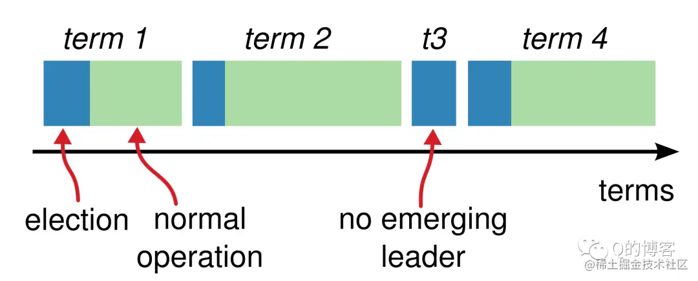
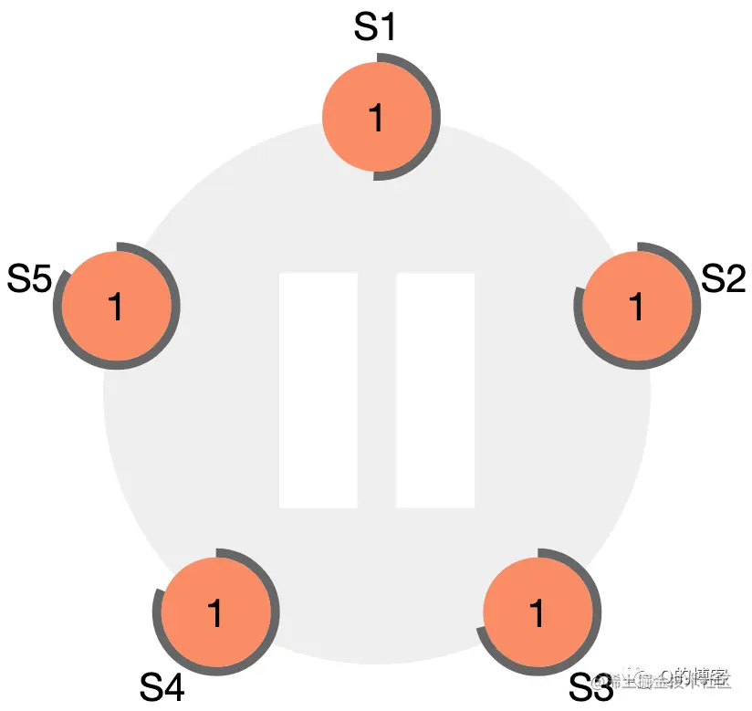
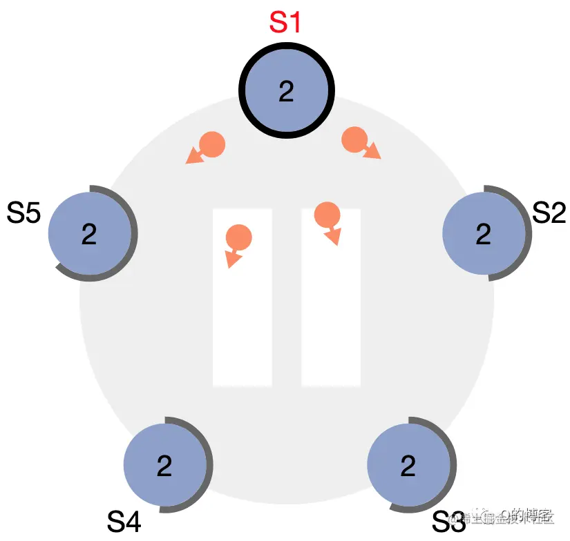
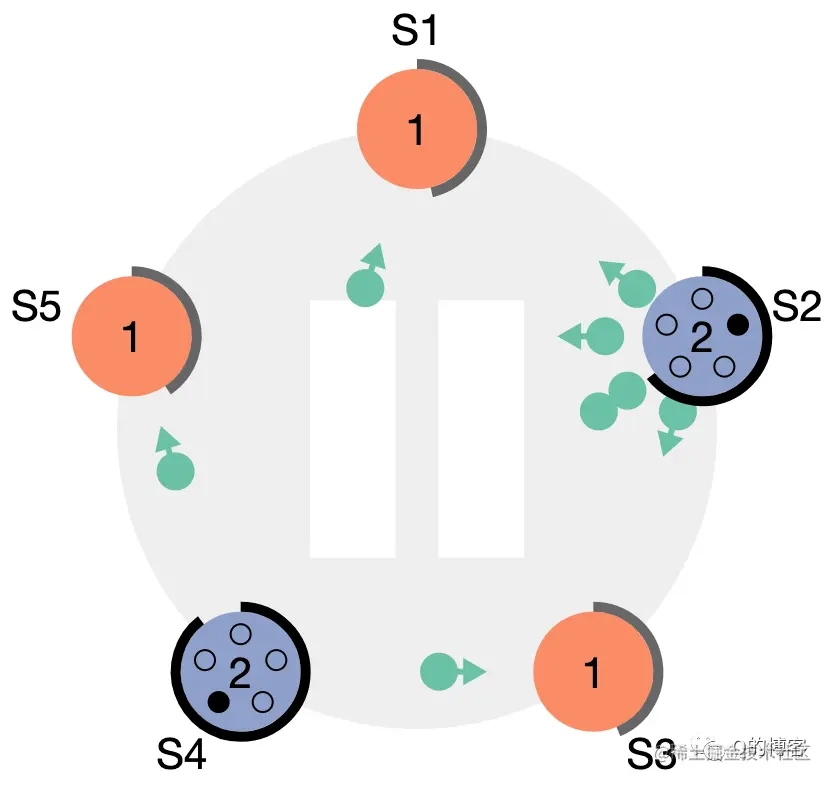
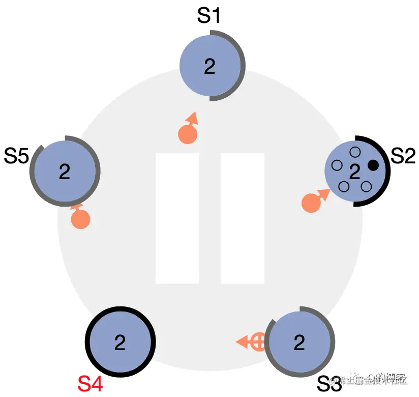
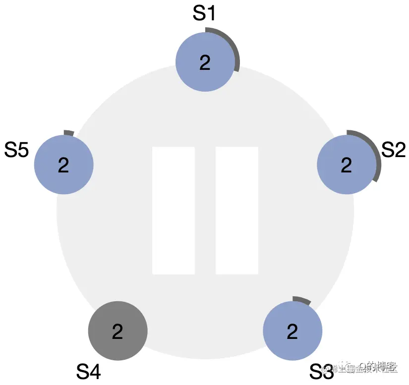
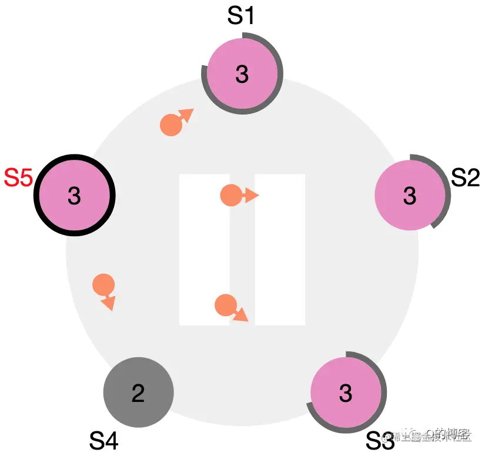
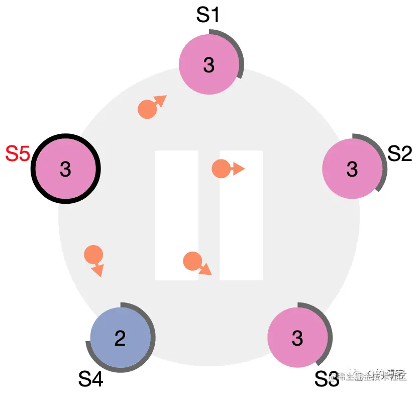
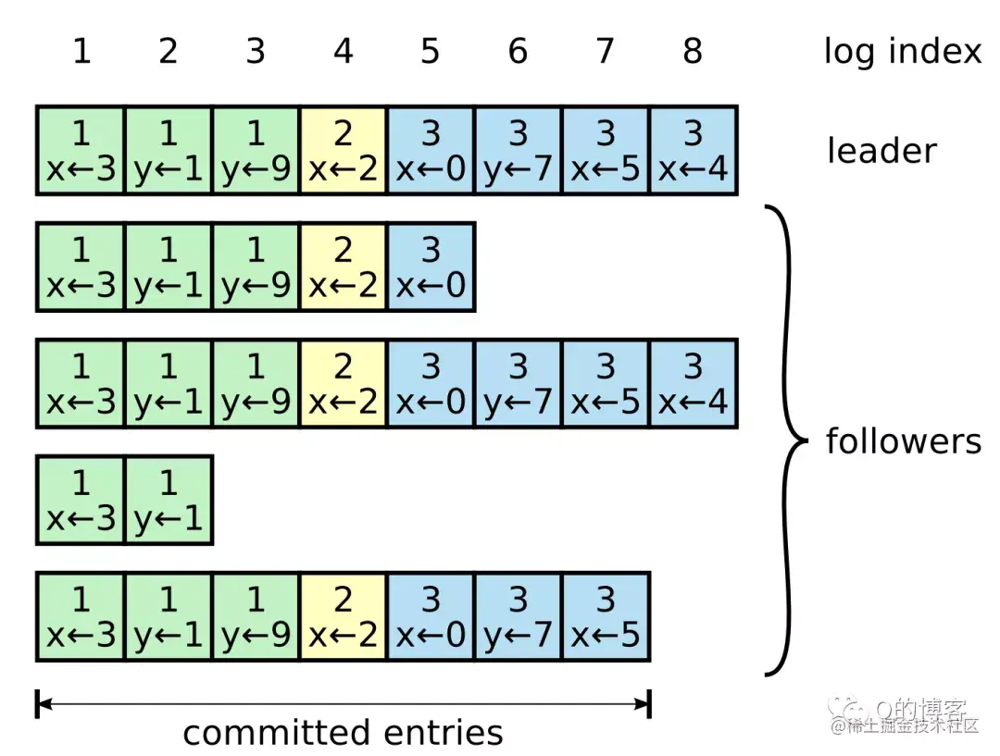

# 深度解析 Raft 分布式一致性协议

> 本文转载至：[浅谈 Raft 分布式一致性协议｜图解 Raft - 白泽来了 - 博客园 (cnblogs.com)](https://www.cnblogs.com/YLTFY1998/p/16600755.html)
>
> [深度解析 Raft 分布式一致性协议 - 掘金 (juejin.cn)](https://juejin.cn/post/6907151199141625870)

本篇文章将模拟一个KV数据读写服务，从提供单一节点读写服务，到结合分布式一致性协议（**Raft**）后，逐步扩展为一个分布式的，满足一致性读写需求的读写服务的过程。

其中将配合引入**Raft协议**的种种概念：**选主、一致性、共识、安全等**，通篇阅读之后，将帮助你深刻理解什么是分布式一致性协议。

## 一. 单机Key-Value数据读写服务

**DB Engine**这里可以简单看成对数据的状态进行存储（比如B+树型的组织形式），负责存储**Key-Value**的内容 ，并假设这个Key-Value服务将提供如下接口：

- Get(key) —> value
- Put([key, value])

思考此时Key-Value服务的可靠性：

- 容错：单个数据存储节点，不具备容错能力。
- 高可用：服务部署在单节点上，节点宕机将无法提供服务。

思考此时Key-Value服务的正确性：

- 单进程，所有操作顺序执行，可以保证已经存储的数据是正确的

**数据规模不断增加，我们需要扩大这个Key-Value服务的规模，将其构建成一个分布式的系统**

## 二. 一致性与共识算法

### 2.1 从复制开始

既然一个节点会挂，那么我们就多准备一个节点！

我们这里只考虑**主副本**负责**接收数据**，而**从副本**只负责**同步**接收**主副本**数据的模式，如果主从都开放数据接收能力，将要考虑更多高可用和数据一致性的问题。

### 2.2 如何复制

- 主副本定期拷贝全量数据到从副本（代价太高）
- 主副本拷贝操作日志到从副本：如果你了解 MySQL 的主从同步，你就会想起它也是通过**从副本**监听**主副本**当中的`binlog`操作日志变化，进行集群数据同步的，因此这种方式也是更主流的选择。

### 2.3 写流程

- 主副本把所有的操作打包成`Log`
  - 所有的`Log`写入都是持久化的，保存在磁盘上
- 应用包装成状态机（**也就是DB Engine部分**），只接收`Log`作为`Input`
- 主副本确认`Log`已经成功写入到从副本机器上，当状态机`apply`后，返回客户端（关于写入之后，请求返回客户端的时机，是可以由应用控制的，可以是`Log`写入**从副本**之后，就从**主副本**机器返回，也可以等`Log`完成**落盘**之后，再返回）

### 2.4 读流程

- 方案一：直接读状态机（**这里指的是DB**），要求上一步写操作进入状态机后再返回client（数据已落盘）
- 方案二：写操作复制`Log`完成后直接返回，读操作`Block`等待所有`pending log`进入状态机

- 如果不遵循上述两种方案：可能存在刚刚写入的值读不到的情况（在Log中）

### 2.5 什么是一致性

对于我们的**KV**服务，要像操作一台机器一样，对用户来说在写入成功后，就应该能读到最近写入的值，而不关心具体底层是如何分布式实现。

一致性是一种模型（或语义），约定一个分布式系统如何向外界提供服务，KV服务中常见的一致性模型有以下两种：

- 最终一致性：读取可能暂时读不到但是总会读到
- 线性一致性：最严格，线性时间执行（写完KV确保就能读到），**是最理想中的状态**

### 2.6 复制协议-当失效发生

上述用到的添加了一个**从副本**节点的方式，我们暂且将其称为**山寨版分布式一致性协议——复制协议**（因为它依赖于主从副本间的复制操作）

那么当主副本失效时，以这个**复制协议**为基础的KV服务的运行情况如何呢：

- 容错能力：没有容错能力，因为主副本停了，KV服务就停了

- 高可用：或许有，取决于我们发现**主副本宕机后**多快将**从副本**切换为**主副本**（手动切换）

- 正确性：正确，因为操作只从一台机器发起，可以控制所有操作返回前都已经复制到另一台机器了

衍生出的一些的问题：

- 如何保证**主副本**是真的失效了，切换的过程中如果主副本又开始接收`client`请求，则会出现**Log覆盖写**的情况
- 如果增加到3个乃至更多的节点，每次**PUT**数据的请求都等待其他节点操作**落盘**性能较差
- 能否允许**少数节点挂了**的情况下，仍然可以保持服务能工作（具备容错能力）

### 2.7 共识算法

**什么是共识：一个值一旦确定，所有人都认同**

共识协议不等于一致性：

- 应用层面不同的一致性，都可以用共识算法来实现
  - 比如可以故意返回旧的值（**共识算法只是一个彼此的约定，只要数据存储与获取符合需求，达成共识即可**）
- 简单的复制协议也可以提供线性一致性（虽然不容错）

一般讨论**共识协议**时提到的一致性，都指**线性一致性**

- 因为**弱一致性**往往可以使用相对简单的**复制算法**实现

## 三. 一致性协议案例：Raft

### 3.1 Raft 协议是什么

在分布式系统中，为了消除单点提高系统可用性，通常会使用副本来进行容错，但这会带来另一个问题，即如何保证多个副本之间的一致性？

所谓的强一致性（线性一致性）并不是指集群中所有节点在任一时刻的状态必须完全一致，而是指一个目标，即让一个分布式系统看起来只有一个数据副本，并且读写操作都是原子的，这样应用层就可以忽略系统底层多个数据副本间的同步问题。也就是说，我们可以将一个强一致性分布式系统当成一个整体，一旦某个客户端成功的执行了写操作，那么所有客户端都一定能读出刚刚写入的值。即使发生网络分区故障，或者少部分节点发生异常，整个集群依然能够像单机一样提供服务。

共识算法（Consensus Algorithm）就是用来做这个事情的，它保证即使在小部分（≤ (N-1)/2）节点故障的情况下，系统仍然能正常对外提供服务。共识算法通常基于状态复制机（Replicated State Machine）模型，也就是所有节点从同一个 state 出发，经过同样的操作 log，最终达到一致的 state。

共识算法是构建强一致性分布式系统的基石，Paxos 是共识算法的代表，而 Raft 则是其作者在博士期间研究 Paxos 时提出的一个变种，主要优点是容易理解、易于实现，甚至关键的部分都在论文中给出了伪代码实现。

### 3.2 谁在使用 Raft

采用 Raft 的系统最著名的当属 etcd 了，可以认为 etcd 的核心就是 Raft 算法的实现。作为一个分布式 kv 系统，etcd 使用 Raft 在多节点间进行数据同步，每个节点都拥有全量的状态机数据。我们在学习了 Raft 以后将会深刻理解为什么 etcd 不适合大数据量的存储（for the most critical data）、为什么集群节点数不是越多越好、为什么集群适合部署奇数个节点等问题。

作为一个微服务基础设施，consul 底层使用 Raft 来保证 consul server 之间的数据一致性。在阅读完第六章后，我们会理解为什么 consul 提供了 `default`、`consistent`、`stale` 三种一致性模式（Consistency Modes）、它们各自适用的场景，以及 consul 底层是如何通过改变 Raft 读模型来支撑这些不同的一致性模式的。

[TiKV](https://github.com/tikv/tikv) 同样在底层使用了 Raft 算法。虽然都自称是“分布式 kv 存储”，但 TiKV 的使用场景与 etcd 存在区别。其目标是支持 100TB+ 的数据，类似 etcd 的单 Raft 集群肯定无法支撑这个数据量。因此 TiKV 底层使用 Multi Raft，将数据划分为多个 region，每个 region 其实还是一个标准的 Raft 集群，对每个分区的数据实现了多副本高可用。

目前 Raft 在工业界已经开始大放异彩，对于其各类应用场景这里不再赘述，感兴趣的读者可以参考 [这里](https://raft.github.io/)，下方有列出各种语言的大量 Raft 实现。

### 3.3 Raft基本概念

Raft 使用 Quorum 机制来实现共识和容错，我们将对 Raft 集群的操作称为提案，每当发起一个提案，必须得到大多数（> N/2）节点的同意才能提交。

> 这里的“提案”我们可以先狭义地理解为对集群的读写操作，“提交”理解为操作成功。

那么当我们向 Raft 集群发起一系列读写操作时，集群内部究竟发生了什么呢？我们先来概览式地做一个整体了解，接下来再分章节详细介绍每个部分。

首先，Raft 集群必须存在一个主节点（leader），我们作为客户端向集群发起的所有操作都必须经由主节点处理。所以 Raft 核心算法中的第一部分就是**选主**（**Leader election**）——没有主节点集群就无法工作，先票选出一个主节点，再考虑其它事情。

其次，主节点需要承载什么工作呢？它会负责接收客户端发过来的操作请求，将操作包装为**日志**同步给其它节点，在保证**大部分**节点都同步了本次操作后，就可以安全地给客户端回应响应了。这一部分工作在 Raft 核心算法中叫**日志复制**（**Log replication**）。

然后，因为主节点的责任是如此之大，所以节点们在选主的时候一定要谨慎，只有**符合条件**的节点才可以当选主节点。此外主节点在处理操作日志的时候也一定要谨慎，为了保证集群对外展现的一致性，不可以**覆盖或删除**前任主节点已经处理成功的操作日志。所谓的“谨慎处理”，其实就是在选主和提交日志的时候进行一些限制，这一部分在 Raft 核心算法中叫**安全性**（**Safety**）。

**Raft 核心算法其实就是由这三个子问题组成的：选主（Leader election）、日志复制（Log replication）、安全性（Safety）。这三部分共同实现了 Raft 核心的共识和容错机制。**

除了核心算法外，Raft 也提供了几个工程实践中必须面对问题的解决方案。

第一个是关于日志无限增长的问题。Raft 将操作包装成为了日志，集群每个节点都维护了一个不断增长的日志序列，状态机只有通过重放日志序列来得到。但由于这个日志序列可能会随着时间流逝不断增长，因此我们必须有一些办法来避免无休止的磁盘占用和过久的日志重放。这一部分叫**日志压缩**（**Log compaction**）。

第二个是关于集群成员变更的问题。一个 Raft 集群不太可能永远是固定几个节点，总有扩缩容的需求，或是节点宕机需要替换的时候。直接更换集群成员可能会导致严重的**脑裂**问题。Raft 给出了一种安全变更集群成员的方式。这一部分叫**集群成员变更**（**Cluster membership change**）。

此外，我们还会额外讨论**线性一致性**的定义、为什么 **Raft 不能与线性一致划等号**、如何**基于 Raft 实现线性一致**，以及在如何**保证线性一致的前提下进行读性能优化**。

以上便是理论篇内将会讨论到的大部分内容的概要介绍，这里我们对 Raft 已经有了一个宏观上的认识，知道了各个部分大概是什么内容，以及它们之间的关系。

接下来我们将会详细讨论 Raft 算法的每个部分。让我们先从第一部分**选主**开始。

## 四. 选主

### 4.1 什么是选主

选主（Leader election）就是在分布式系统内抉择出一个主节点来负责一些特定的工作。在执行了选主过程后，集群中每个节点都会识别出一个特定的、唯一的节点作为 leader。

我们开发的系统如果遇到选主的需求，通常会直接基于 zookeeper 或 etcd 来做，把这部分的复杂性收敛到第三方系统。然而作为 etcd 基础的 Raft 自身也存在“选主”的概念，这是两个层面的事情：基于 etcd 的选主指的是利用第三方 etcd 让集群对谁做主节点的决策达成一致，技术上来说利用的是 etcd 的一致性状态机、lease 以及 watch 机制，这个事情也可以改用单节点的 MySQL/Redis 来做，只是无法获得高可用性；而 Raft 本身的选主则指的是在 Raft 集群自身内部通过票选、心跳等机制来协调出一个大多数节点认可的主节点作为集群的 leader 去协调所有决策。

**当你的系统利用 etcd 来写入谁是主节点的时候，这个决策也在 etcd 内部被它自己集群选出的主节点处理并同步给其它节点。**

### 4.2 Raft 为什么要进行选主？

按照论文所述，原生的 Paxos 算法使用了一种点对点（peer-to-peer）的方式，所有节点地位是平等的。在理想情况下，算法的目的是制定**一个决策**，这对于简化的模型比较有意义。但在工业界很少会有系统会使用这种方式，当有一系列的决策需要被制定的时候，先选出一个 leader 节点然后让它去协调所有的决策，这样算法会更加简单快速。

此外，和其它一致性算法相比，Raft 赋予了 leader 节点更强的领导力，称之为 **Strong Leader**。比如说日志条目只能从 leader 节点发送给其它节点而不能反着来，这种方式简化了日志复制的逻辑，使 Raft 变得更加简单易懂。

### 4.3 Raft 选主过程

> Raft协议动画：[Raft 分布式共识算法动画演示 (kailing.pub)](http://www.kailing.pub/raft/index.html)

#### 4.3.1 节点角色

Raft 集群中每个节点都处于以下三种角色之一：

- **Leader**: 所有请求的处理者，接收客户端发起的操作请求，写入本地日志后同步至集群其它节点。
- **Follower**: 请求的被动更新者，从 leader 接收更新请求，写入本地文件。如果客户端的操作请求发送给了 follower，会首先由 follower 重定向给 leader。
- **Candidate**: 如果 follower 在一定时间内没有收到 leader 的心跳，则判断 leader 可能已经故障，此时启动 leader election 过程，本节点切换为 candidate 直到选主结束。

#### 2.3.2 任期

每开始一次新的选举，称为一个**任期**（**term**），每个 term 都有一个严格递增的整数与之关联。

每当 candidate 触发 leader election 时都会增加 term，如果一个 candidate 赢得选举，他将在本 term 中担任 leader 的角色。但并不是每个 term 都一定对应一个 leader，有时候某个 term 内会由于选举超时导致选不出 leader，这时 candicate 会递增 term 号并开始新一轮选举。

Term 更像是一个**逻辑时钟**（**logic clock**）的作用，有了它，就可以发现哪些节点的状态已经过期。每一个节点都保存一个 current term，在通信时带上这个 term 号。

节点间通过 RPC 来通信，主要有两类 RPC 请求：

- **RequestVote RPCs**: 用于 candidate 拉票选举。
- **AppendEntries RPCs**: 用于 leader 向其它节点复制日志以及同步心跳。

#### 4.3.3 节点状态转换

我们知道集群每个节点的状态都只能是 leader、follower 或 candidate，那么节点什么时候会处于哪种状态呢？下图展示了一个节点可能发生的状态转换：

##### 4.3.3.1 Follower 状态转换过程

Raft 的选主基于一种心跳机制，集群中每个节点刚启动时都是 follower 身份（**Step: starts up**），leader 会周期性的向所有节点发送心跳包来维持自己的权威，那么首个 leader 是如何被选举出来的呢？方法是如果一个 follower 在一段时间内没有收到任何心跳，也就是选举超时，那么它就会主观认为系统中没有可用的 leader，并发起新的选举（**Step: times out, starts election**）。

这里有一个问题，即这个“选举超时时间”该如何制定？如果所有节点在同一时刻启动，经过同样的超时时间后同时发起选举，整个集群会变得低效不堪，极端情况下甚至会一直选不出一个主节点。Raft 巧妙的使用了一个随机化的定时器，让每个节点的“超时时间”在一定范围内随机生成，这样就大大的降低了多个节点同时发起选举的可能性。

*图：一个五节点 Raft 集群的初始状态，所有节点都是 follower 身份，term 为 1，且每个节点的选举超时定时器不同*

若 follower 想发起一次选举，follower 需要先增加自己的当前 term，并将身份切换为 candidate。然后它会向集群其它节点发送“请给自己投票”的消息（RequestVote RPC）。

*图：S1 率先超时，变为 candidate，term + 1，并向其它节点发出拉票请求*

##### 4.3.3.2 Candicate 状态转换过程

Follower 切换为 candidate 并向集群其他节点发送“请给自己投票”的消息后，接下来会有三种可能的结果，也即上面**节点状态图中 candidate 状态向外伸出的三条线**。

**情况一：选举成功（Step: receives votes from majority of servers）**

当candicate从整个集群的**大多数**（N/2+1）节点获得了针对同一 term 的选票时，它就赢得了这次选举，立刻将自己的身份转变为 leader 并开始向其它节点发送心跳来维持自己的权威。

*图：“大部分”节点都给了 S1 选票*

*图：S1 变为 leader，开始发送心跳维持权威*

每个节点针对每个 term 只能投出一张票，并且按照先到先得的原则。这个规则确保只有一个 candidate 会成为 leader。

**情况二：选举失败（Step: discovers current leader or new term）**

Candidate 在等待投票回复的时候，可能会突然收到其它自称是 leader 的节点发送的心跳包，如果这个心跳包里携带的 term **不小于** candidate 当前的 term，那么 candidate 会承认这个 leader，并将身份切回 follower。这说明其它节点已经成功赢得了选举，我们只需立刻跟随即可。但如果心跳包中的 term 比自己小，candidate 会拒绝这次请求并保持选举状态。

*图：S4、S2 依次开始选举*

*图：S4 成为 leader，S2 在收到 S4 的心跳包后，由于 term 不小于自己当前的 term，因此会立刻切为 follower 跟随 S4*

**情况三：选举超时（Step: times out, new election）**

第三种可能的结果是 candidate 既没有赢也没有输。如果有多个 follower 同时成为 candidate，选票是可能被瓜分的，如果没有任何一个 candidate 能得到大多数节点的支持，那么每一个 candidate 都会超时。此时 candidate 需要增加自己的 term，然后发起新一轮选举。如果这里不做一些特殊处理，选票可能会一直被瓜分，导致选不出 leader 来。这里的“特殊处理”指的就是前文所述的**随机化选举超时时间**。

*图：S1 ~ S5 都在参与选举*

*图：没有任何节点愿意给他人投票*

*图：如果没有随机化超时时间，所有节点将会继续同时发起选举……*

以上便是 candidate 三种可能的选举结果。

##### 4.3.3.3 Leader 状态转换过程

节点状态图中的最后一条线是：**discovers server with higher term**。想象一个场景：当 leader 节点发生了宕机或网络断连，此时其它 follower 会收不到 leader 心跳，首个触发超时的节点会变为 candidate 并开始拉票（由于随机化各个 follower 超时时间不同），由于该 candidate 的 term 大于原 leader 的 term，因此所有 follower 都会投票给它，这名 candidate 会变为新的 leader。一段时间后原 leader 恢复了，收到了来自新leader 的心跳包，发现心跳中的 term 大于自己的 term，此时该节点会立刻切换为 follower 并跟随的新 leader。

上述流程的动画模拟如下：

*图：S4 作为 term2 的 leader*

*图：S4 宕机，S5 即将率先超时*

*图：S5 当选 term3 的 leader*

*图：S4 宕机恢复后收到了来自 S5 的 term3 心跳*

*图：S4 立刻变为 S5 的 follower*

以上就是 Raft 的选主逻辑，但还有一些细节（譬如是否给该 candidate 投票还有一些其它条件）依赖算法的其它部分基础，我们会在后续“安全性”一章描述。

当票选出 leader 后，leader 也该承担起相应的责任了，这个责任是什么？就是下一章将介绍的“日志复制”。

## 五. 日志复制

### 5.1 什么是日志复制

在前文中我们讲过：共识算法通常基于**状态复制机**（**Replicated State Machine**）模型，所有节点从**同一个 state** 出发，经过一系列**同样操作 log** 的步骤，最终也必将达到**一致的 state**。也就是说，只要我们保证集群中所有节点的 log 一致，那么经过一系列应用（apply）后最终得到的状态机也就是一致的。

Raft 负责保证集群中所有节点 **log 的一致性**。

此外我们还提到过：Raft 赋予了 leader 节点更强的领导力（**Strong Leader**）。那么 Raft 保证 log 一致的方式就很容易理解了，即所有 log 都必须交给 leader 节点处理，并由 leader 节点复制给其它节点。

这个过程，就叫做**日志复制**（**Log replication**）。

### 5.2 Raft 日志复制机制解析

#### 5.2.1 整体流程解析

一旦 leader 被票选出来，它就承担起领导整个集群的责任了，开始接收客户端请求，并将操作包装成日志，并复制到其它节点上去。

整体流程如下：

- Leader 为客户端提供服务，客户端的每个请求都包含一条即将被状态复制机执行的指令。
- Leader 把该指令作为一条新的日志附加到自身的日志集合，然后向其它节点发起**附加条目请求**（**AppendEntries RPC**），来要求它们将这条日志附加到各自本地的日志集合。
- 当这条日志已经确保被**安全的复制**，即大多数（N/2+1）节点都已经复制后，leader 会将该日志 **apply** 到它本地的状态机中，然后把操作成功的结果返回给客户端。

整个集群的日志模型可以宏观表示为下图（x ← 3 代表 x 赋值为 3）：

每条日志除了存储状态机的操作指令外，还会拥有一个**唯一的整数索引值**（**log index**）来表明它在日志集合中的位置。此外，每条日志还会存储一个 **term** 号（日志条目方块最上方的数字，相同颜色 term 号相同），该 term 表示 leader 收到这条指令时的当前任期，term 相同的 log 是由同一个 leader 在其任期内发送的。

当一条日志被 leader 节点认为可以安全的 apply 到状态机时，称这条日志是 **committed**（上图中的 **committed entries**）。那么什么样的日志可以被 commit 呢？答案是：**当 leader 得知这条日志被集群过半的节点复制成功时**。因此在上图中我们可以看到 (term3, index7) 这条日志以及之前的日志都是 committed，尽管有两个节点拥有的日志并不完整。

Raft 保证所有 committed 日志都已经被**持久化**，且“**最终**”一定会被状态机apply。

*注：这里的“最终”用词很微妙，它表明了一个特点：Raft 保证的只是集群内日志的一致性，而我们真正期望的集群对外的状态机一致性需要我们做一些额外工作，这一点在《线性一致性与读性能优化》一章会着重介绍。*

#### 5.2.2 日志复制流程图解

我们通过 [Raft 动画](https://link.juejin.cn/?target=https%3A%2F%2Fraft.github.io%2F) 来模拟常规日志复制这一过程：

