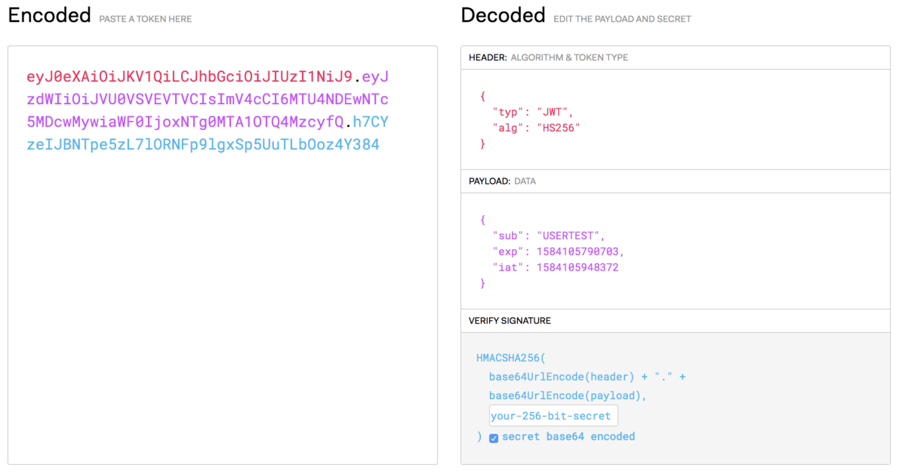
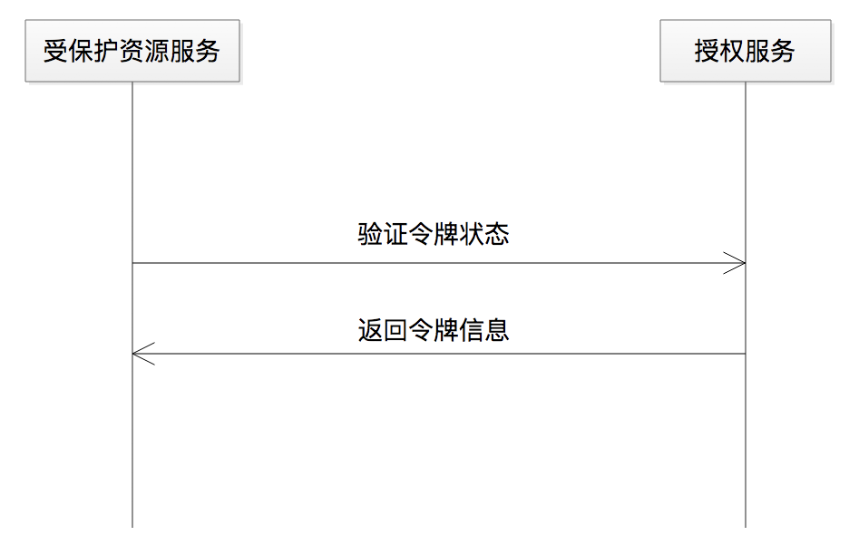
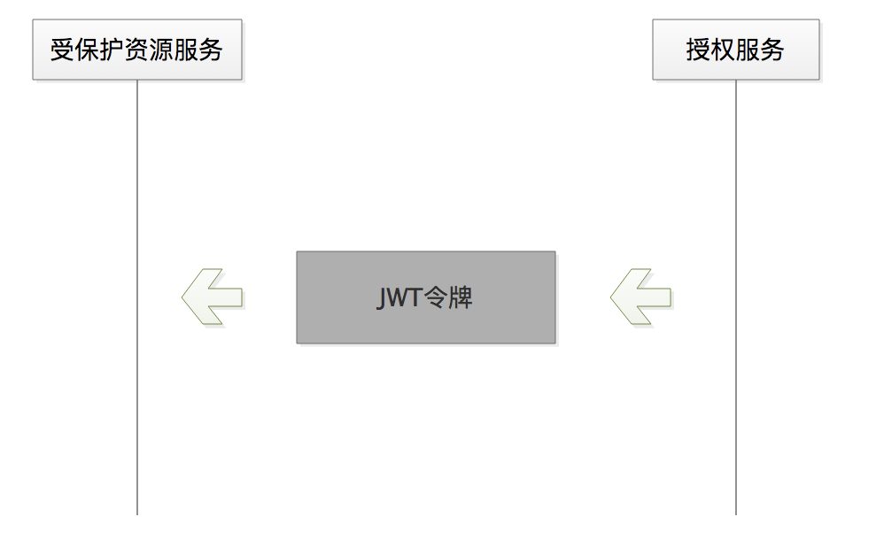
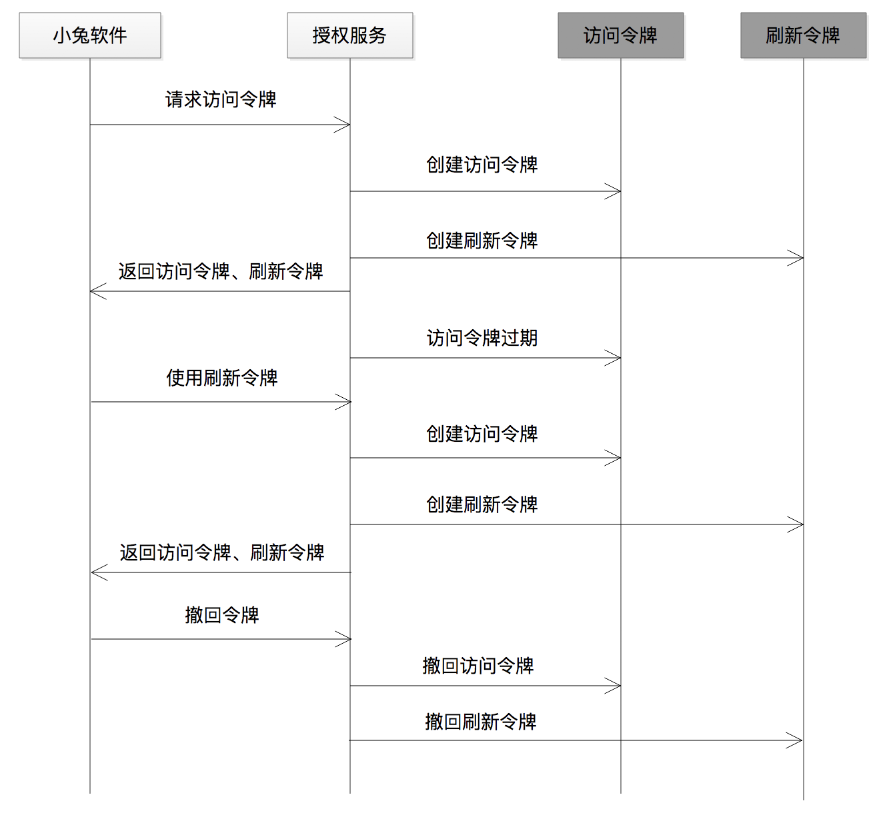

# 在OAuth 2.0中，如何使用JWT结构化令牌

在上一讲，我们讲到了授权服务的核心就是**颁发访问令牌**，而 OAuth 2.0 规范并没有约束访问令牌内容的生成规则，只要符合唯一性、不连续性、不可猜性就够了。这就意味着，我们可以灵活选择令牌的形式，既可以是没有内部结构且不包含任何信息含义的随机字符串，也可以是具有内部结构且包含有信息含义的字符串。

随机字符串这样的方式我就不再介绍了，之前课程中我们生成令牌的方式都是默认一个随机字符串。而在结构化令牌这方面，目前用得最多的就是 JWT 令牌了。

接下来，我就要和你详细讲讲，JWT 是什么、原理是怎样的、优势是什么，以及怎么使用，同时我还会讲到令牌生命周期的问题。

## 一. JWT 结构化令牌

关于什么是 JWT，官方定义是这样描述的：

JSON Web Token（JWT）是一个开放标准（RFC 7519），它定义了一种紧凑的、自包含的方式，用于作为 JSON 对象在各方之间安全地传输信息。

这个定义是不是很费解？我们简单理解下，JWT 就是用一种结构化封装的方式来生成 token 的技术。结构化后的 token 可以被赋予非常丰富的含义，这也是它与原先毫无意义的、随机的字符串形式 token 的最大区别。

结构化之后，令牌本身就可以被“塞进”一些有用的信息，比如小明为小兔软件进行了授权的信息、授权的范围信息等。或者，你可以形象地将其理解为这是一种“自编码”的能力，而这些恰恰是无结构化令牌所不具备的。

JWT 这种结构化体可以分为 HEADER（头部）、PAYLOAD（数据体）和 SIGNATURE（签名）三部分。经过签名之后的 JWT 的整体结构，是被**句点符号**分割的三段内容，结构为 header.payload.signature 。比如下面这个示例：

```txt
eyJ0eXAiOiJKV1QiLCJhbGciOiJIUzI1NiJ9.
eyJzdWIiOiJVU0VSVEVTVCIsImV4cCI6MTU4NDEwNTc5MDcwMywiaWF0IjoxNTg0MTA1OTQ4MzcyfQ.
1HbleXbvJ_2SW8ry30cXOBGR9FW4oSWBd3PWaWKsEXE
```

**注意：JWT 内部没有换行，这里只是为了展示方便，才将其用三行来表示。**

你可能会说，这个 JWT 令牌看起来也是毫无意义的、随机的字符串啊。确实，你直接去看这个字符串是没啥意义，但如果你把它拷贝到https://jwt.io/ 网站的在线校验工具中，就可以看到解码之后的数据：



再看解码后的数据，你是不是发现它跟随机的字符串不一样了呢。很显然，现在呈现出来的就是结构化的内容了。接下来，我就具体和你说说 JWT 的这三部分。

**HEADER** 表示装载令牌类型和算法等信息，是 JWT 的头部。其中，typ 表示第二部分 PAYLOAD 是 JWT 类型，alg 表示使用 HS256 对称签名的算法。

**PAYLOAD** 表示是 JWT 的数据体，代表了一组数据。其中，sub（令牌的主体，一般设为资源拥有者的唯一标识）、exp（令牌的过期时间戳）、iat（令牌颁发的时间戳）是 JWT 规范性的声明，代表的是常规性操作。更多的通用声明，你可以参考[RFC 7519 开放标准](https://tools.ietf.org/html/rfc7519)。不过，在一个 JWT 内可以包含一切合法的 JSON 格式的数据，也就是说，PAYLOAD 表示的一组数据允许我们自定义声明。

**SIGNATURE** 表示对 JWT 信息的签名。那么，它有什么作用呢？我们可能认为，有了 HEADER 和 PAYLOAD 两部分内容后，就可以让令牌携带信息了，似乎就可以在网络中传输了，但是在网络中传输这样的信息体是不安全的，因为你在“裸奔”啊。所以，我们还需要对其进行加密签名处理，而 SIGNATURE 就是对信息的签名结果，当受保护资源接收到第三方软件的签名后需要验证令牌的签名是否合法。

现在，我们知道了 JWT 的结构以及每部分的含义，那么具体到 OAuth 2.0 的授权流程中，JWT 令牌是如何被使用的呢？在讲如何使用之前呢，我先和你说说“令牌内检”。

## 二. 令牌内检

什么是令牌内检呢？授权服务颁发令牌，受保护资源服务就要验证令牌。同时呢，授权服务和受保护资源服务，它俩是“一伙的”，还记得我之前讲过的吧。受保护资源来调用授权服务提供的检验令牌的服务，**我们把这种校验令牌的方式称为令牌内检。**

有时候授权服务依赖一个数据库，然后受保护资源服务也依赖这个数据库，也就是我们说的“共享数据库”。不过，在如今已经成熟的分布式以及微服务的环境下，不同的系统之间是依靠**服务**而**不是数据库**来通信了，比如授权服务给受保护资源服务提供一个 RPC 服务。如下图所示。



那么，在有了 JWT 令牌之后，我们就多了一种选择，因为 JWT 令牌本身就包含了之前所要依赖数据库或者依赖 RPC 服务才能拿到的信息，比如我上面提到的哪个用户为哪个软件进行了授权等信息。

接下来就让我们看看有了 JWT 令牌之后，整体的内检流程会变成什么样子。

## 三. JWT 是如何被使用的

有了 JWT 令牌之后的通信方式，就如下面的图 3 所展示的那样了，**授权服务“扔出”一个令牌，受保护资源服务“接住”这个令牌，然后自己开始解析令牌本身所包含的信息就可以了，而不需要再去查询数据库或者请求 RPC 服务**。这样也实现了我们上面说的令牌内检。



在上面这幅图中呢，为了更能突出 JWT 令牌的位置，我简化了逻辑关系。实际上，授权服务颁发了 JWT 令牌后给到了小兔软件，小兔软件拿着 JWT 令牌来请求受保护资源服务，也就是小明在京东店铺的订单。很显然，JWT 令牌需要在公网上做传输。所以在传输过程中，JWT 令牌需要进行 Base64 编码以防止乱码，同时还需要进行签名及加密处理来防止数据信息泄露。

如果是我们自己处理这些编码、加密等工作的话，就会增加额外的编码负担。好在，我们可以借助一些开源的工具来帮助我们处理这些工作。比如，我在下面的 Demo 中，给出了开源 JJWT（Java JWT）的使用方法。

JJWT 是目前 Java 开源的、比较方便的 JWT 工具，封装了 Base64URL 编码和对称 HMAC、非对称 RSA 的一系列签名算法。使用 JJWT，我们只关注上层的业务逻辑实现，而无需关注编解码和签名算法的具体实现，这类开源工具可以做到“开箱即用”。

这个 Demo 的代码如下，使用 JJWT 可以很方便地生成一个经过签名的 JWT 令牌，以及解析一个 JWT 令牌。

```java
　　String sharedTokenSecret="hellooauthhellooauthhellooauthhellooauth";
　　Key key = new SecretKeySpec(sharedTokenSecret.getBytes(),
　　                SignatureAlgorithm.HS256.getJcaName());
　　String jwts=
　　Jwts.builder().setHeaderParams(headerMap).setClaims(payloadMap).signWith(key,SignatureAlgorithm.HS256).compact()

　　Jws<Claims> claimsJws =Jwts.parserBuilder().setSigningKey(key).build().parseClaimsJws(jwts);
　　JwsHeader header = claimsJws.getHeader();
　　Claims body = claimsJws.getBody();
```

使用 JJWT 解析 JWT 令牌时包含了验证签名的动作，如果签名不正确就会抛出异常信息。我们可以借助这一点来对签名做校验，从而判断是否是一个没有被伪造过的、合法的 JWT 令牌。

异常信息，一般是如下的样子：

```txt
　JWT signature does not match locally computed signature. JWT validity cannot be asserted and should not be trusted.
```

以上就是借助开源工具，将 JWT 令牌应用到授权服务流程中的方法了。到这里，你是不是一直都有一个疑问：为什么要绕这么大一个弯子，使用 JWT，而不是使用没有啥内部结构，也不包含任何信息的随机字符串呢？JWT 到底有什么好处？

## 四. 为什么要使用 JWT 令牌

别急，我这就和你总结下使用 JWT 格式令牌的三大好处。

第一，**JWT 的核心思想，就是用计算代替存储，有些 “时间换空间” 的 “味道”**。当然，这种经过计算并结构化封装的方式，也减少了“共享数据库” 因远程调用而带来的网络传输消耗，所以也有可能是节省时间的。

第二，也是一个重要特性，是加密。因为 JWT 令牌内部已经包含了重要的信息，所以在整个传输过程中都必须被要求是密文传输的，**这样被强制要求了加密也就保障了传输过程中的安全性**。这里的加密算法，既可以是对称加密，也可以是非对称加密。

第三，**使用 JWT 格式的令牌，有助于增强系统的可用性和可伸缩性**。这一点要怎么理解呢？我们前面讲到了，这种 JWT 格式的令牌，通过“自编码”的方式包含了身份验证需要的信息，不再需要服务端进行额外的存储，所以每次的请求都是无状态会话。这就符合了我们尽可能遵循无状态架构设计的原则，也就是增强了系统的可用性和伸缩性。

但，万物皆有两面性，JWT 令牌也有缺点。

JWT 格式令牌的最大问题在于 “覆水难收”，也就是说，没办法在使用过程中修改令牌状态。我们还是借助小明使用小兔软件例子，先停下来想一下。

小明在使用小兔软件的时候，是不是有可能因为某种原因修改了在京东的密码，或者是不是有可能突然取消了给小兔的授权？这时候，令牌的状态是不是就要有相应的变更，将原来对应的令牌置为无效。

但，使用 JWT 格式令牌时，每次颁发的令牌都不会在服务端存储，这样我们要改变令牌状态的时候，就无能为力了。因为服务端并没有存储这个 JWT 格式的令牌。这就意味着，JWT 令牌在有效期内，是可以“横行无止”的。

为了解决这个问题，我们可以把 JWT 令牌存储到远程的分布式内存数据库中吗？显然不能，因为这会违背 JWT 的初衷（将信息通过结构化的方式存入令牌本身）。因此，我们通常会有两种做法：

一是，将每次生成 JWT 令牌时的秘钥粒度缩小到用户级别，也就是一个用户一个秘钥。这样，当用户取消授权或者修改密码后，就可以让这个密钥一起修改。一般情况下，这种方案需要配套一个单独的密钥管理服务。

二是，在不提供用户主动取消授权的环境里面，如果只考虑到修改密码的情况，那么我们就可以把用户密码作为 JWT 的密钥。当然，这也是用户粒度级别的。这样一来，用户修改密码也就相当于修改了密钥。

## 五. 令牌的生命周期

我刚才讲了 JWT 令牌有效期的问题，讲到了它的失效处理，另外咱们在[第 3 讲]中提到，授权服务颁发访问令牌的时候，都会设置一个过期时间，其实这都属于令牌的生命周期的管理问题。接下来，我便向你讲一讲令牌的生命周期。

万物皆有周期，这是自然规律，令牌也不例外，无论是 JWT 结构化令牌还是普通的令牌。它们都有有效期，只不过，JWT 令牌可以把有效期的信息存储在本身的结构体中。

具体到 OAuth 2.0 的令牌生命周期，通常会有三种情况。

第一种情况是令牌的自然过期过程，这也是最常见的情况。这个过程是，从授权服务创建一个令牌开始，到第三方软件使用令牌，再到受保护资源服务验证令牌，最后再到令牌失效。同时，这个过程也不排除主动销毁令牌的事情发生，比如令牌被泄露，授权服务可以做主让令牌失效。

生命周期的第二种情况，也就是上一讲提到的，访问令牌失效之后可以使用刷新令牌请求新的访问令牌来代替失效的访问令牌，以提升用户使用第三方软件的体验。

生命周期的第三种情况，就是让第三方软件比如小兔，主动发起令牌失效的请求，然后授权服务收到请求之后让令牌立即失效。我们来想一下，什么情况下会需要这种机制，也就是想一下第三方软件这样做的 “动机”，毕竟一般情况下 “我们很难放弃已经拥有的事物”。

比如有些时候，用户和第三方软件之间存在一种订购关系，比如小明购买了小兔软件，那么在订购时长到期或者退订，且小明授权的 token 还没有到期的情况下，就需要有这样的一种令牌撤回协议，来支持小兔软件主动发起令牌失效的请求。作为平台一方比如京东商家开放平台，也建议有责任的第三方软件比如小兔软件，遵守这样的一种令牌撤回协议。

我将以上三种情况整理成了一份序列图，以便帮助你理解。同时，为了突出令牌，我将访问令牌和刷新令牌，特意用深颜色标识出来，并单独作为两个角色放进了整个序列图中。



## 六. 总结

OAuth 2.0 的核心是授权服务，更进一步讲是令牌，**没有令牌就没有 OAuth，**令牌表示的是授权行为之后的结果。

一般情况下令牌对第三方软件来说是一个随机的字符串，是不透明的。大部分情况下，我们提及的令牌，都是一个无意义的字符串。

但是，人们“不甘于”这样的满足，于是开始探索有没有其他生成令牌的方式，也就有了 JWT 令牌，这样一来既不需要通过共享数据库，也不需要通过授权服务提供接口的方式来做令牌校验了。这就相当于通过 JWT 这种结构化的方式，我们在做令牌校验的时候多了一种选择。

通过这一讲呢，我希望你能记住以下几点内容：

我们有了新的令牌生成方式的选择，这就是 JWT 令牌。这是一种结构化、信息化令牌，**结构化可以组织用户的授权信息，信息化就是令牌本身包含了授权信息**。

虽然我们这讲的重点是 JWT 令牌，但是呢，不论是结构化的令牌还是非结构化的令牌，对于第三方软件来讲，它都不关心，因为**令牌在 OAuth 2.0 系统中对于第三方软件都是不透明的**。需要关心令牌的，是授权服务和受保护资源服务。

我们需要注意 JWT 令牌的失效问题。我们使用了 JWT 令牌之后，远程的服务端上面是不存储的，因为不再有这个必要，JWT 令牌本身就包含了信息。那么，如何来控制它的有效性问题呢？本讲中，我给出了两种建议，**一种是建立一个秘钥管理系统，将生成秘钥的粒度缩小到用户级别，另外一种是直接将用户密码当作密钥。**

现在，你已经对 JWT 有了更深刻的认识，也知道如何来使用它了。当你构建并生成令牌的时候除了使用随机的、“任性的”字符串，还可以采用这样的结构化的令牌，以便在令牌校验的时候能解析出令牌的内容信息直接进行校验处理。

我把今天用到的代码放到了 GitHub 上，你可以点击[这个链接](https://github.com/xindongbook/oauth2-code)查看。