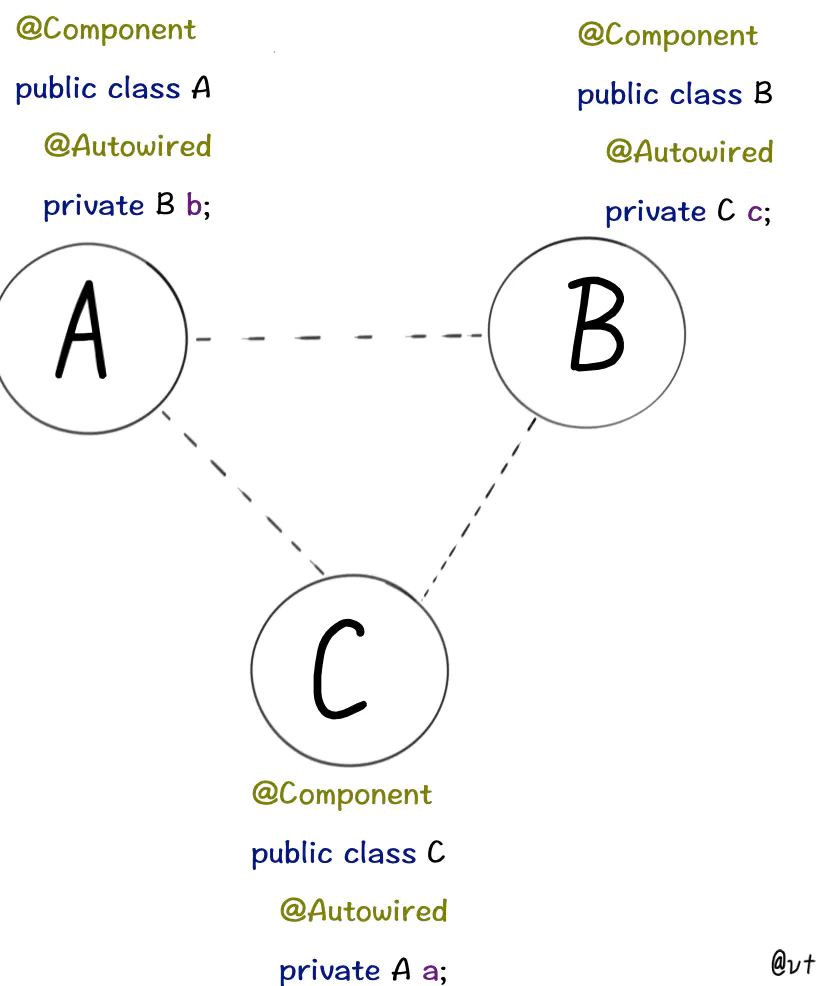
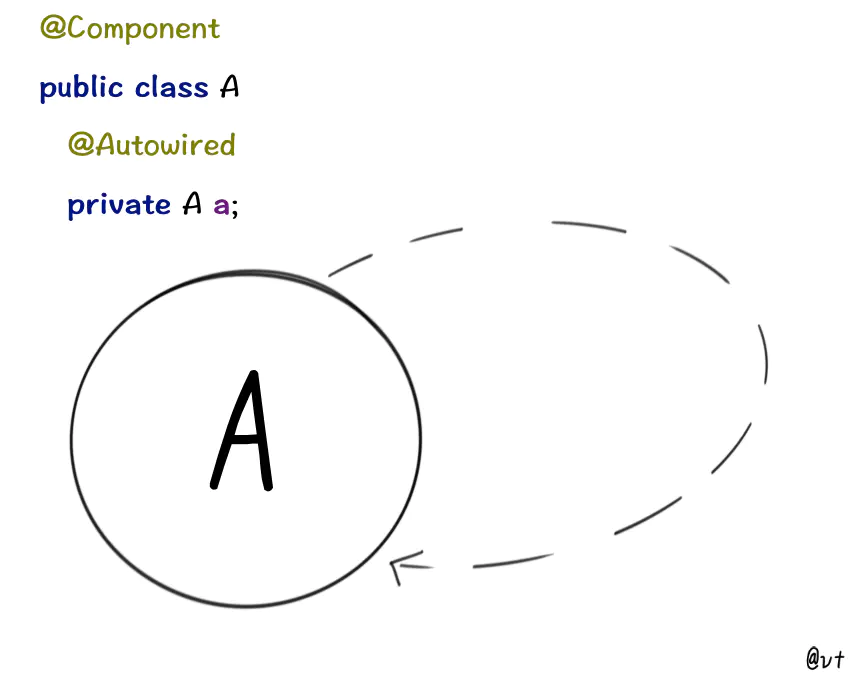
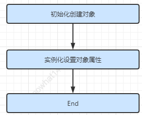
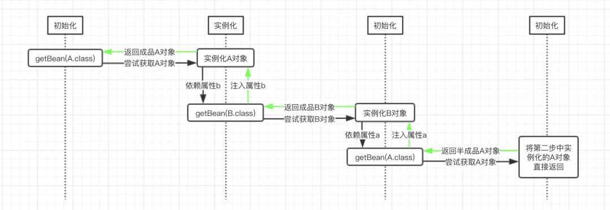
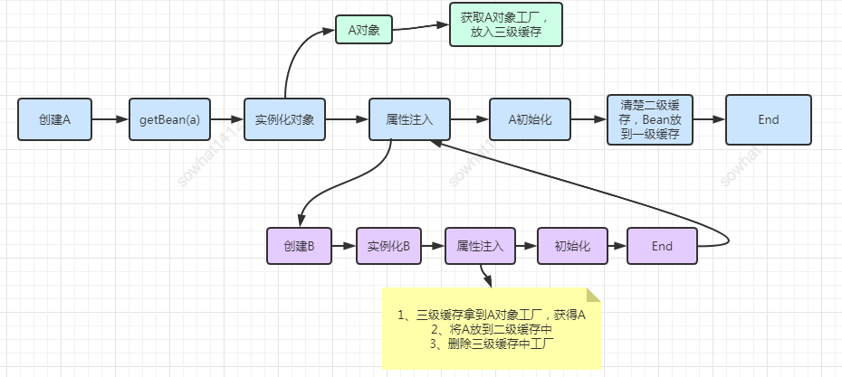
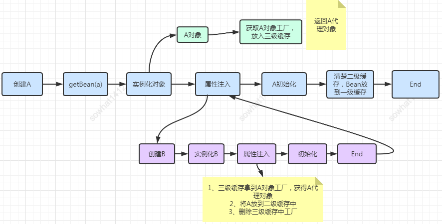
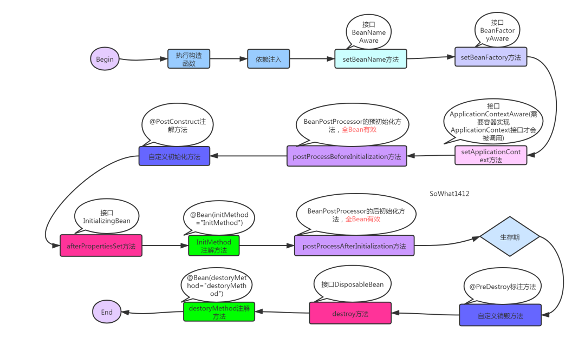
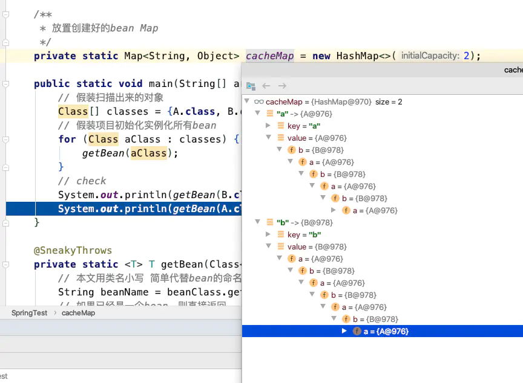

# Spring循环依赖

> 本文参考转载至：https://juejin.cn/post/6844904122160775176
>
> https://mp.weixin.qq.com/s?__biz=MzI1NDQ3MjQxNA==&mid=2247494458&idx=1&sn=35d731fa75dcaf2f9ff1420deee1bbac&chksm=e9c6128bdeb19b9d351c27d8460e2c23791b2abf19ef5dabfe6cc7c60f4a63333384a9d4f7e0&mpshare=1&scene=23&srcid=1224kKi705YtNdDVH2gpwNRn&sharer_sharetime=1609058424108&sharer_shareid=e81601a95b901aeca142bbe3b957819a#rd

通常来说，如果问Spring内部如何解决循环依赖，一定是单默认的**单例**Bean中，属性互相引用的场景。

比如几个Bean之间的互相引用：



甚至自己“循环”依赖自己：



先说明前提：**原型**(Prototype)的场景是**不支持**循环依赖的，通常会走到`AbstractBeanFactory`类中下面的判断，抛出异常。

```java
if (isPrototypeCurrentlyInCreation(beanName)) {
  throw new BeanCurrentlyInCreationException(beanName);
}
```

原因很好理解，创建**新的A**时，发现要注入**原型字段B**，又创建**新的B**发现要注入**原型字段A**...

这就套娃了, 你猜是先**StackOverflow**还是**OutOfMemory**？

Spring怕你不好猜，就先抛出了**BeanCurrentlyInCreationException**


基于构造器的循环依赖，就更不用说了，[官方文档](https://docs.spring.io/spring/docs/current/spring-framework-reference/core.html#beans-dependency-resolution)都摊牌了，你想让构造器注入支持循环依赖，是不存在的，不如把代码改了。

下面是循环依赖的支持情况：

| 循环依赖形式           | 注入形式                                           | 是否支持循环依赖 |
| ---------------------- | -------------------------------------------------- | ---------------- |
| AB相互依赖（循环依赖） | 均采用setter方法注入                               | 是               |
| AB相互依赖（循环依赖） | 均采用属性自动注入                                 | 是               |
| AB相互依赖（循环依赖） | 均采用构造器注入                                   | 否               |
| AB相互依赖（循环依赖） | A中注入B的方式为setter方法，B中注入A的方式为构造器 | 否 |

## Spring解决循环依赖

Spring bean 的创建，其本质上还是一个对象的创建，既然是对象，一定要明白一点就是，一个完整的对象包含两部分：`当前对象实例化和对象属性的实例化`。在Spring中，对象的实例化是通过`反射`实现的，而对象的属性则是在对象实例化之后通过一定的方式设置的。这个过程可以按照如下方式进行理解：




大致绘制依赖流程图如下：



图中getBean()表示调用Spring的`ApplicationContext.getBean()`方法，而该方法中的参数，则表示我们要尝试获取的目标对象。图中的`黑色箭头`表示一开始的方法调用走向，走到最后，返回了Spring中缓存的A对象之后，表示递归调用返回了，此时使用`绿色箭头`表示。

从图中我们可以很清楚的看到，B对象的a属性是在第三步中注入的半成品A对象，而A对象的b属性是在第二步中注入的成品B对象，此时半成品的A对象也就变成了成品的A对象，因为其属性已经设置完成了。

到这里，Spring整个解决循环依赖问题的实现思路已经比较清楚了。对于整体过程只要理解两点：

- Spring是通过递归的方式获取目标bean及其所依赖的bean的；
- Spring实例化一个bean的时候，是分两步进行的，首先实例化目标bean，然后为其注入属性。

结合这两点，也就是说，`Spring在实例化一个bean的时候，是首先递归的实例化其所依赖的所有bean，直到某个bean没有依赖其他bean，此时就会将该实例返回，然后反递归的将获取到的bean设置为各个上层bean的属性的`。

## Spring循环依赖进阶

一个对象一般创建过程有3部分组成：

1. 实例化：简单理解就是new了一个对象
2. 属性注入：为实例化中new出来的对象填充属性
3. 初始化：执行aware接口中的方法，初始化方法，完成AOP代理

Spring是通过**「三级缓存」**来解决上述问题的：

- `singletonObjects`：一级缓存 存储的是所有创建好了的单例Bean
- `earlySingletonObjects`：完成实例化，但是还未进行属性注入及初始化的对象
- `singletonFactories`：提前暴露的一个单例工厂，二级缓存中存储的就是从这个工厂中获取到的对象

然后接下来说下普通循环依赖跟带AOP的循环依赖。

### 普通循环依赖图




结论：没有进行AOP的Bean间的循环依赖 从上图分析可以看出，这种情况下**「三级缓存根本没用」**！所以不会存在什么提高了效率的说法。

### 带AOP循环依赖

带AOP的跟不带AOP的其实几乎一样，只是在三级缓存中存放的是函数式接口，在需要调用时直接返回代理对象。三级缓存存在的意义：

只有真正发生循环依赖的时候，才去提前生成代理对象，否则只会创建一个工厂并将其放入到三级缓存中，但是不会去通过这个工厂去真正创建对象




是否可以用二级缓存而不用三级缓存？

答案：不可以，违背Spring在结合AOP跟Bean的生命周期的设计！Spring结合AOP跟Bean的生命周期(看下图)本身就是通过`AnnotationAwareAspectJAutoProxyCreator`这个后置处理器来完成的，在这个后置处理的postProcessAfterInitialization方法中对初始化后的Bean完成AOP代理。如果出现了循环依赖，那没有办法，只有给Bean先创建代理，但是没有出现循环依赖的情况下，设计之初就是让Bean在生命周期的**「最后一步完成代理而不是在实例化后就立马完成代理」**。



## 循环依赖的本质

上文了解完Spring如何处理循环依赖之后，让我们跳出“**阅读源码**”的思维，假设让你实现一个有以下特点的功能，你会怎么做？

- 将指定的一些类实例为单例
- 类中的字段也都实例为单例
- 支持循环依赖

举个例子，假设有类A：

```java
public class A {
    private B b;
}
```

类B：

```java
public class B {    
    private A a;
}
```

说白了让你**模仿Spring**：**假装A**和**B**是被@Component修饰，并且类中的字段**假装**是@Autowired修饰的，处理完放到Map中。

其实非常简单，笔者写了一份粗糙的代码，可供参考：

```java
/**
 * 放置创建好的bean  Map
 */
private static Map<String, Object> cacheMap = new HashMap<>(2);

public static void main(String[] args) {  //  假装扫描出来的对象
    Class[] classes = {A.class, B.class};
    //  假装项目初始化实例化所有bean
    for (Class aClass : classes) {
        getBean(aClass);
    }
    //  check
    System.out.println(getBean(B.class).getA() == getBean(A.class));
    System.out.println(getBean(A.class).getB() == getBean(B.class));
}

@SneakyThrows
private static <T> T getBean(Class<T> beanClass) {
    //  本文用类名小写  简单代替bean的命名规则
    String beanName = beanClass.getSimpleName().toLowerCase();
    //  如果已经是一个bean，则直接返回
    if (cacheMap.containsKey(beanName)) {
        return (T) cacheMap.get(beanName);
    }
    //  将对象本身实例化
    Object object = beanClass.getDeclaredConstructor().newInstance();
    //  放入缓存
    cacheMap.put(beanName, object);
    //  把所有字段当成需要注入的bean，创建并注入到当前bean中
    Field[] fields = object.getClass().getDeclaredFields();
    for (Field field : fields) {
        field.setAccessible(true);
        //  获取需要注入字段的class
        Class<?> fieldClass = field.getType();
        String fieldBeanName = fieldClass.getSimpleName().toLowerCase();
        //  如果需要注入的bean，已经在缓存Map中，那么把缓存Map中的值注入到该field即可
        //  如果缓存没有  继续创建
        field.set(object, cacheMap.containsKey(fieldBeanName) ? cacheMap.get(fieldBeanName) : getBean(fieldClass));
    }
    //  属性填充完成，返回
    return (T) object;
}
```

这段代码的效果，其实就是处理了循环依赖，并且处理完成后，cacheMap中放的就是完整的“**Bean**”了



这就是“**循环依赖**”的本质，而不是“Spring如何解决循环依赖”。

之所以要举这个例子，是发现一小部分盆友陷入了“**阅读源码的泥潭**”，而忘记了问题的本质。

为了看源码而看源码，结果一直看不懂，却忘了本质是什么。

如果真看不懂，不如先写出基础版本，逆推Spring为什么要这么实现，可能效果会更好。

### what？问题的本质居然是two sum！

看完笔者刚才的代码有没有似曾相识？没错，和**two sum**的解题是类似的。

不知道**two sum**是什么梗的，笔者和你介绍一下：

**two sum**是刷题网站[leetcode](https://leetcode-cn.com/problems/two-sum/)序号为1的题，也就是大多人的算法入门的第一题。

常常被人调侃，有**算法面**的公司，被面试官钦定了，合的来。那就来一道**two sum**走走过场。

问题内容是：给定**一个数组**，给定**一个数字**。返回数组中可以**相加得到指定数字**的两个**索引**。

比如：给定`nums = [2, 7, 11, 15], target = 9`

那么要返回 `[0, 1]`，因为`2 + 7 = 9`

这道题的优解是，一次遍历+HashMap：

```java
class Solution {
    public int[] twoSum(int[] nums, int target) {
        Map<Integer, Integer> map = new HashMap<>();
        for (int i = 0; i < nums.length; i++) {
            int complement = target - nums[i];
            if (map.containsKey(complement)) {
                return new int[]{map.get(complement), i};
            }
            map.put(nums[i], i);
        }
        throw new IllegalArgumentException("No two sum solution");
    }

```

先去Map中找**需要的数字**，没有就将**当前的数字**保存在Map中，如果找到**需要的数字**，则一起返回。

和笔者上面的代码是不是一样？

先去缓存里找**Bean**，没有则**实例化当前的Bean**放到Map，如果有需要**依赖**当前Bean的，就能从Map取到。

## 结尾

如果你是上文笔者提到的“**陷入阅读源码的泥潭**”的读者，上文应该可以帮助到你。

可能还有盆友有疑问，为什么一道“**two-sum**”，Spring处理的如此复杂？这个想想Spring支持多少功能就知道了，各种实例方式..各种注入方式..各种Bean的加载，校验..各种**callback**，aop处理等等..

Spring可不只有**依赖注入**，同样Java也不仅是**Spring**。如果我们陷入了某个“牛角尖”，不妨跳出来看看，可能会更佳清晰哦。