# AQS详解

## 一. 前言

AQS（ AbstractQueuedSynchronizer ）是一个用来构建锁和同步器（所谓同步，是指线程之间的通信、协作）的框架，Lock 包中的各种锁（如常见的 ReentrantLock, ReadWriteLock）, concurrent 包中的各种同步器（如 CountDownLatch, Semaphore, CyclicBarrier）都是基于 AQS 来构建，所以理解 AQS 的实现原理至关重要，AQS 也是面试中区分侯选人的常见考点，**我们务必要掌握**，本文将用循序渐近地介绍 AQS，相信大家看完一定有收获。

## 二. 锁原理 - 信号量 vs 管程

在并发编程领域，有两大核心问题：**互斥**与**同步**，互斥即同一时刻只允许一个线程访问共享资源，同步，即线程之间如何通信、协作，一般这两大问题可以通过**信号量**和**管程**来解决。

### 2.1 信号量

信号量（Semaphore）是操作系统提供的一种进程间常见的通信方式，主要用来协调并发程序对共享资源的访问，操作系统可以保证对信号量操作的**原子性**。它是怎么实现的呢。

- 信号量由一个共享整型变量 S 和两个原子操作 PV 组成，S 只能通过 P 和 V 操作来改变
- P 操作：即请求资源，意味着 S 要减 1，如果 S <  0, 则表示没有资源了，此时线程要进入等待队列（同步队列）等待
- V 操作:  即释放资源，意味着 S 要加 1， 如果 S 小于等于 0，说明等待队列里有线程，此时就需要唤醒线程。

示意图如下：

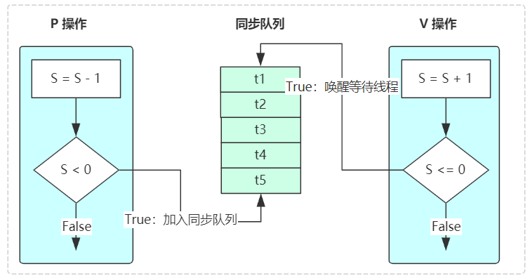

信号量机制的引入解决了进程同步和互斥问题，但信号量的大量同步操作分散在各个进程中不便于管理，还有可能导致系统死锁。如：生产者消费者问题中将P、V颠倒可能死锁（见文末参考链接），另外条件越多，需要的信号量就越多，需要更加谨慎地处理信号量之间的处理顺序，否则很容易造成死锁现象。

基于信号量给编程带来的隐患，于是有了提出了对开发者更加友好的并发编程模型-**管程**

### 2.2 管程

Dijkstra 于 1971 年提出：把所有进程对某一种**临界资源**的同步操作都集中起来，构成一个所谓的秘书进程。凡要访问该临界资源的进程，都需先报告秘书，由秘书来实现诸进程对同一临界资源的**互斥**使用，这种机制就是管程。

管程是一种在信号量机制上进行改进的并发编程模型，解决了信号量在临界区的 PV 操作上配对的麻烦，把配对的 PV 操作集中在一起而形成的并发编程方法理论，极大降低了使用和理解成本。

管程由四部分组成：

1. 管程内部的共享变量。
2. 管程内部的条件变量。
3. 管程内部并行执行的进程。
4. 对于局部与管程内部的共享数据设置初始值的语句。

由此可见，管程就是一个对象监视器。任何线程想要访问该资源（共享变量），就要排队进入监控范围。进入之后，接受检查，不符合条件，则要继续等待，直到被通知，然后继续进入监视器。

需要注意的事，信号量和管程两者是等价的，信号量可以实现管程，管程也可以实现信号量，只是两者的表现形式不同而已，管程对开发者更加友好。

两者的区别如下

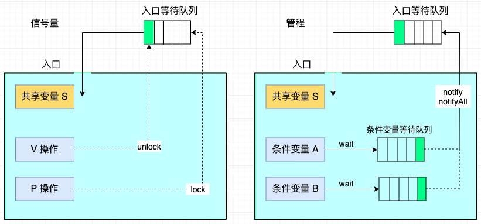

管程为了解决信号量在临界区的 PV 操作上的配对的麻烦，把配对的 PV 操作集中在一起，并且加入了条件变量的概念，使得在多条件下线程间的同步实现变得更加简单。

怎么理解管程中的入口等待队列，共享变量，条件变量等概念，有时候技术上的概念较难理解，我们可以借助生活中的场景来帮助我们理解，就以我们的就医场景为例来简单说明一下，正常的就医流程如下：

1. 病人去挂号后，去侯诊室等待叫号
2. 叫到自己时，就可以进入就诊室就诊了
3. 就诊时，有两种情况，一种是医生很快就确定病人的病，并作出诊断，诊断完成后，就通知下一位病人进来就诊，一种是医生无法确定病因，需要病人去做个验血 / CT 检查才能确定病情，于是病人就先去验个血 /  CT
4. 病人验完血 / 做完 CT 后，重新取号，等待叫号（进入入口等待队列）
5. 病人等到自己的号，病人又重新拿着验血 / CT 报告去找医生就诊

整个流程如下

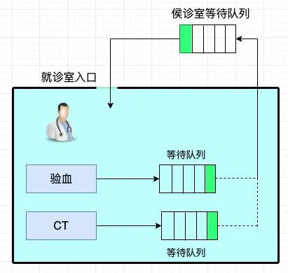

那么管程是如何解决**互斥**和**同步**的呢

首先来看**互斥**，上文中医生即**共享资源**（也即共享变量），就诊室即为**临界区**，病人即**线程**，任何病人如果想要访问临界区，必须首先获取共享资源（即医生），入口一次只允许一个线程经过，在共享资源被占有的情况下，如果再有线程想占有共享资源，就需要到等待队列去等候，等到获取共享资源的线程释放资源后，等待队列中的线程就可以去竞争共享资源了，这样就解决了互斥问题，所以本质上管程是通过将共享资源及其对共享资源的操作（线程安全地获取和释放）封装起来来保证互斥性的。

再来看**同步**，同步是通过文中的条件变量及其等待队列实现的，同步的实现分两种情况

1. 病人进入就诊室后，无需做验血 / CT 等操作，于是医生诊断完成后，就会释放共享资源（解锁）去通知（notify，notifyAll）入口等待队列的下一个病人，下一个病人听到叫号后就能看医生了。
2. 如果病人进入就诊室后需要做验血 / CT 等操作，会去验血 / CT 队列（条件队列）排队， 同时释放共享变量（医生），通知入口等待队列的其他病人（线程）去获取共享变量（医生），获得许可的线程执行完临界区的逻辑后会唤醒条件变量等待队列中的线程，将它放到入口等待队列中 ，等到其获取共享变量（医生）时，即可进入入口（临界区）处理。

在 Java 里，锁大多是依赖于管程来实现的，以大家熟悉的内置锁 synchronized 为例，它的实现原理如下。

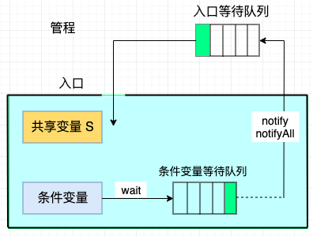

可以看到 synchronized 锁也是基于管程实现的，只不过它只有且只有一个条件变量（就是锁对象本身）而已，这也是为什么JDK 要实现 Lock 锁的原因之一，Lock 支持多个条件变量。

通过这样的类比，相信大家对管程的工作机制有了比较清晰的认识，为啥要花这么大的力气介绍管程呢，一来管程是解决并发问题的万能钥匙，二来 **AQS 是基于 Java 并发包中管程的一种实现**，所以理解管程对我们理解 AQS 会大有帮助，接下来我们就来看看 AQS 是如何工作的。

## 三. AQS实现原理

AQS 全称是 AbstractQueuedSynchronizer，是一个用来构建**锁**和**同步器**的框架，它维护了一个共享资源 state 和一个 FIFO 的等待队列（即上文中管程的入口等待队列），底层利用了 CAS 机制来保证操作的原子性。

**AQS 实现锁的主要原理如下：**

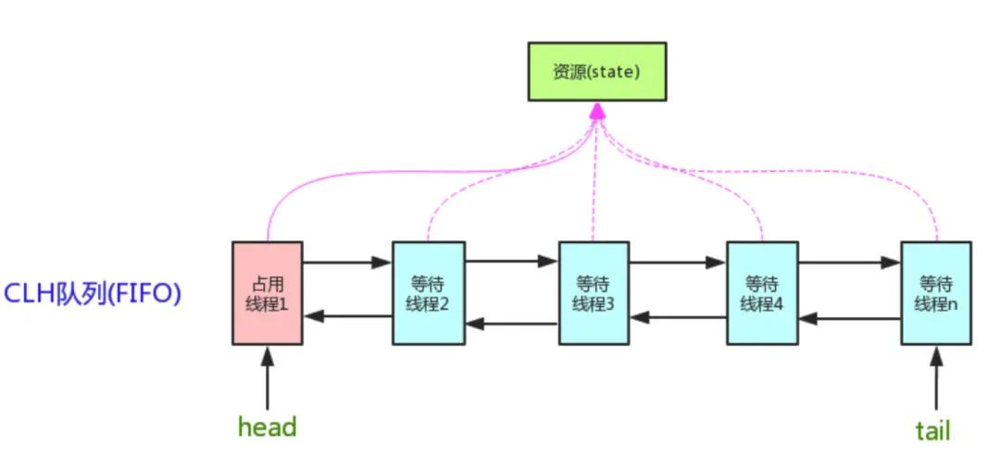

以实现独占锁为例（即当前资源只能被一个线程占有），其实现原理如下：state 初始化 0，在多线程条件下，线程要执行临界区的代码，必须首先获取 state，某个线程获取成功之后， state 加 1，其他线程再获取的话由于共享资源已被占用，所以会到 FIFO 等待队列去等待，等占有 state 的线程执行完临界区的代码释放资源( state 减 1)后，会唤醒 FIFO 中的下一个等待线程（head 中的下一个结点）去获取 state。

state 由于是多线程共享变量，所以必须定义成 volatile，以保证 state 的可见性, 同时虽然 volatile 能保证可见性，但不能保证原子性，所以 AQS 提供了对 state 的原子操作方法(CAS)，保证了线程安全。

另外 AQS 中实现的 FIFO 队列（CLH 队列）其实是双向链表实现的，由 head, tail 节点表示，head 结点代表当前占用的线程，其他节点由于暂时获取不到锁所以依次排队等待锁释放。

所以我们不难明白 AQS 的如下定义:

```java
public abstract class AbstractQueuedSynchronizer
  extends AbstractOwnableSynchronizer
    implements java.io.Serializable {
    // 以下为双向链表的首尾结点，代表入口等待队列
    private transient volatile Node head;
    private transient volatile Node tail;
    // 共享变量 state
    private volatile int state;
    // cas 获取 / 释放 state，保证线程安全地获取锁
    protected final boolean compareAndSetState(int expect, int update) {
        // See below for intrinsics setup to support this
        return unsafe.compareAndSwapInt(this, stateOffset, expect, update);
    }
    // ...
 }
```

## 四. AQS源码剖析

ReentrantLock 是我们比较常用的一种锁，也是基于 AQS 实现的，所以接下来我们就来分析一下 ReentrantLock 锁的实现来一探 AQS 究竟。本文将会采用图文并茂的方式让大家理解 AQS 的实现原理，大家在学习过程中，可以多类比一下上文中就诊的例子，相信会有助于理解。

首先我们要知道 ReentrantLock 是独占锁，也有公平和非公平两种锁模式。

**什么是独占与共享模式**？

- 独占锁：即其他线程只有在占有锁的线程释放后才能竞争锁，有且只有一个线程能竞争成功（医生只有一个，一次只能看一个病人）

- 共享锁：即共享资源可以被多个线程同时占有，直到共享资源被占用完毕（一个老师，监考多个学生），常见的有读写锁 ReadWriteLock, CountdownLatch，两者的区别如下

**什么是公平与非公平锁**？

还是以就医为例，所谓公平锁即大家取号后老老实实按照先来后到的顺序在侯诊室依次等待叫号，如果是非公平锁呢，新来的病人（线程）很霸道，不取号排队，直接去抢先看病，占有医生（不一定成功）。

由于非公平锁一旦有新的线程进来，如果恰好此时共享资源空闲，则直接拿到了锁，而不需要去等待对头的线程唤醒获取锁，从而提高了锁的吞吐量。但是这样也有可能导致等待队列中的线程，发生饥饿的情况。

公平锁和非公平锁的性能测试结果如下，以下测试数据来自于《Java并发编程实战》：

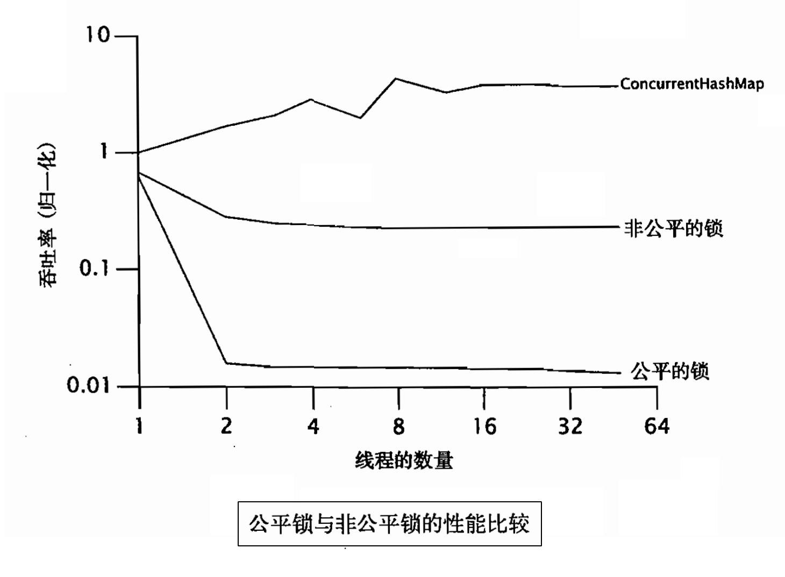

本文我们将会重点分析独占，非公平模式的源码实现，不分析共享模式与 Condition 的实现，因为剖析了独占锁的实现，由于原理都是相似的，再分析共享与 Condition 就不难了。

首先我们先来看下 ReentrantLock 的使用方法

```java
// 1. 初始化可重入锁
private ReentrantLock lock = new ReentrantLock();
public void run() {
    // 加锁
    lock.lock();
    try {
        // 2. 执行临界区代码
    } catch (InterruptedException e) {
        e.printStackTrace();
    } finally {
        // 3. 解锁
        lock.unlock();
    }
}
```

第一步是初始化可重入锁，可以看到默认使用的是非公平锁机制

```java
public ReentrantLock() {
    sync = new NonfairSync();
}
```

当然你也可以用如下构造方法来指定使用公平锁:

```java
public ReentrantLock(boolean fair) {
    sync = fair ? new FairSync() : new NonfairSync();
}
```

> FairSync 和 NonfairSync 是 ReentrantLock 实现的内部类，分别指公平和非公平模式，ReentrantLock ReentrantLock 的加锁（lock），解锁（unlock）在内部具体都是调用的 FairSync，NonfairSync 的加锁和解锁方法

几个类的关系如下：

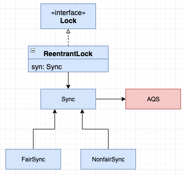

我们先来剖析下非公平锁（NonfairSync）的实现方式，来看上述示例代码的第二步：加锁，由于默认的是非公平锁的加锁，所以我们来分析下非公平锁是如何加锁的：

```java
static final class NonfairSync extends Sync {
    private static final long serialVersionUID = 7316153563782823691L;


    final void lock() {
        if (compareAndSetState(0, 1))
            setExclusiveOwnerThread(Thread.currentThread());
        else
            acquire(1);
    }

    protected final boolean tryAcquire(int acquires) {
        return nonfairTryAcquire(acquires);
    }
}
```

可以看到 lock 方法主要有两步

1. 使用 CAS 来获取 state 资源，如果成功设置 1，代表 state 资源获取锁成功，此时记录下当前占用 state 的线程 **setExclusiveOwnerThread(Thread.currentThread());**
2. 如果 CAS 设置 state 为 1 失败（代表获取锁失败），则执行 acquire(1) 方法，这个方法是 AQS 提供的方法，如下

```java
public final void acquire(int arg) {
    if (!tryAcquire(arg) &&
        acquireQueued(addWaiter(Node.EXCLUSIVE), arg))
        selfInterrupt();
}
```

### 4.1 tryAcquire剖析

首先 调用 tryAcquire 尝试着获取 state，如果成功，则跳过后面的步骤。如果失败，则执行 acquireQueued 将线程加入 CLH 等待队列中。

先来看下 tryAcquire 方法，这个方法是 AQS 提供的一个模板方法，最终由其 AQS 具体的实现类（Sync）实现，由于执行的是非公平锁逻辑，执行的代码如下：

```java
final boolean nonfairTryAcquire(int acquires) {
    final Thread current = Thread.currentThread();
    int c = getState();

    if (c == 0) {
        // 如果 c 等于0，表示此时资源是空闲的（即锁是释放的），再用 CAS 获取锁
        if (compareAndSetState(0, acquires)) {
            setExclusiveOwnerThread(current);
            return true;
        }
    }
    else if (current == getExclusiveOwnerThread()) {
        // 此条件表示之前已有线程获得锁，且此线程再一次获得了锁，获取资源次数再加 1，这也映证了 ReentrantLock 为可重入锁
        int nextc = c + acquires;
        if (nextc < 0) // overflow
            throw new Error("Maximum lock count exceeded");
        setState(nextc);
        return true;
    }
    return false;
}
```

此段代码可知锁的获取主要分两种情况

1. state 为 0 时，代表锁已经被释放，可以去获取，于是使用 CAS 去重新获取锁资源，如果获取成功，则代表竞争锁成功，使用 setExclusiveOwnerThread(current) 记录下此时占有锁的线程，看到这里的 CAS，大家应该不难理解为啥当前实现是非公平锁了，因为队列中的线程与新线程都可以 CAS 获取锁啊，新来的线程不需要排队
2. 如果 state 不为 0，代表之前已有线程占有了锁，如果此时的线程依然是之前占有锁的线程（current == getExclusiveOwnerThread() 为 true），代表此线程再一次占有了锁（可重入锁），此时更新 state，记录下锁被占有的次数（锁的重入次数）,这里的 setState 方法不需要使用 CAS 更新，因为此时的锁就是当前线程占有的，其他线程没有机会进入这段代码执行。所以此时更新 state 是线程安全的。

### 4.2 acquireQueued 剖析

如果 tryAcquire(arg) 执行失败，代表获取锁失败，则执行 acquireQueued 方法，将线程加入 FIFO 等待队列

```java
public final void acquire(int arg) {
    if (!tryAcquire(arg) &&
        acquireQueued(addWaiter(Node.EXCLUSIVE), arg))
        selfInterrupt();
}
```

所以接下来我们来看看 acquireQueued 的执行逻辑，首先会调用 **addWaiter(Node.EXCLUSIVE)** 将包含有当前线程的 Node 节点入队, Node.EXCLUSIVE 代表此结点为独占模式

再来看下 addWaiter 是如何实现的

```java
private Node addWaiter(Node mode) {
    Node node = new Node(Thread.currentThread(), mode);
    Node pred = tail;
    // 如果尾结点不为空，则用 CAS 将获取锁失败的线程入队
    if (pred != null) {
        node.prev = pred;
        if (compareAndSetTail(pred, node)) {
            pred.next = node;
            return node;
        }
    }
    // 如果结点为空，执行 enq 方法
    enq(node);
    return node;
}
```

这段逻辑比较清楚，首先是获取 FIFO 队列的尾结点，如果尾结点存在，则采用 CAS 的方式将等待线程入队，如果尾结点为空则执行 enq 方法

```java
private Node enq(final Node node) {
    for (;;) {
        Node t = tail;
        if (t == null) {
            // 尾结点为空，说明 FIFO 队列未初始化，所以先初始化其头结点
            if (compareAndSetHead(new Node()))
                tail = head;
        } else {
            // 尾结点不为空，则将等待线程入队
            node.prev = t;
            if (compareAndSetTail(t, node)) {
                t.next = node;
                return t;
            }
        }
    }
}
```

首先判断 tail 是否为空，如果为空说明 FIFO 队列的 head，tail 还未构建，此时先构建头结点，构建之后再用 CAS 的方式将此线程结点入队。

> 使用 CAS 创建 head 节点的时候只是简单调用了 new Node() 方法，并不像其他节点那样记录 thread，这是为啥

因为 head 结点为**虚结点**，它只代表当前有线程占用了 state，至于占用 state 的是哪个线程，其实是调用了上文的 setExclusiveOwnerThread(current) ，即记录在 exclusiveOwnerThread 属性里。

执行完 addWaiter 后，线程入队成功，现在就要看最后一个最关键的方法 acquireQueued 了，这个方法有点难以理解，先不急，我们先用三个线程来模拟一下之前的代码对应的步骤

1. 假设 T1 获取锁成功，由于此时 FIFO 未初始化，所以先创建 head 结点


2. 此时 T2 或 T3 再去竞争 state 失败，入队，如下图:

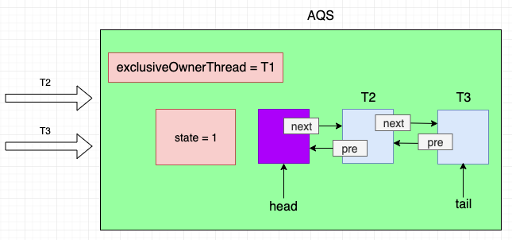

好了，现在问题来了， T2，T3 入队后怎么处理，是马上阻塞吗，马上阻塞意味着线程从运行态转为阻塞态 ，涉及到用户态向内核态的切换，而且唤醒后也要从内核态转为用户态，开销相对比较大，所以 AQS 对这种入队的线程采用的方式是让它们自旋来竞争锁，如下图示

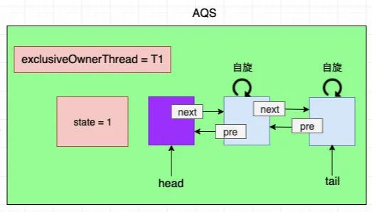

不过聪明的你可能发现了一个问题，如果当前锁是独占锁，如果锁一直被被 T1 占有， T2，T3 一直自旋没太大意义，反而会占用 CPU，影响性能，所以更合适的方式是它们自旋一两次竞争不到锁后识趣地阻塞以等待前置节点释放锁后再来唤醒它。

另外如果锁在自旋过程中被中断了，或者自旋超时了，应该处于「取消」状态。

基于每个 Node 可能所处的状态，AQS 为其定义了一个变量 waitStatus，根据这个变量值对相应节点进行相关的操作，我们一起来看这看这个变量都有哪些值，是时候看一个 Node 结点的属性定义了

```java
static final class Node {
    static final Node SHARED = new Node();//标识等待节点处于共享模式
    static final Node EXCLUSIVE = null;//标识等待节点处于独占模式

    static final int CANCELLED = 1; //由于超时或中断，节点已被取消
    static final int SIGNAL = -1;  // 节点阻塞（park）必须在其前驱结点为 SIGNAL 的状态下才能进行，如果结点为 SIGNAL，则其释放锁或取消后，可以通过 unpark 唤醒下一个节点，
    static final int CONDITION = -2;//表示线程在等待条件变量（先获取锁，加入到条件等待队列，然后释放锁，等待条件变量满足条件；只有重新获取锁之后才能返回）
    static final int PROPAGATE = -3;//表示后续结点会传播唤醒的操作，共享模式下起作用

    //等待状态：对于condition节点，初始化为CONDITION；其它情况，默认为0，通过CAS操作原子更新
    volatile int waitStatus;
```

通过状态的定义，我们可以猜测一下 AQS 对线程自旋的处理：如果当前节点的上一个节点不为 head，且它的状态为 SIGNAL，则结点进入阻塞状态。来看下代码以映证我们的猜测：

```java
final boolean acquireQueued(final Node node, int arg) {
    boolean failed = true;
    try {
        boolean interrupted = false;
        for (;;) {
            final Node p = node.predecessor();
            // 如果前一个节点是 head，则尝试自旋获取锁
            if (p == head && tryAcquire(arg)) {
                //  将 head 结点指向当前节点，原 head 结点出队
                setHead(node);
                p.next = null; // help GC
                failed = false;
                return interrupted;
            }
            // 如果前一个节点不是 head 或者竞争锁失败，则进入阻塞状态
            if (shouldParkAfterFailedAcquire(p, node) &&
                parkAndCheckInterrupt())
                interrupted = true;
        }
    } finally {
        if (failed)
            // 如果线程自旋中因为异常等原因获取锁最终失败，则调用此方法
            cancelAcquire(node);
    }
}
```

先来看第一种情况，如果当前结点的前一个节点是 head 结点，且获取锁（tryAcquire）成功的处理


可以看到主要的处理就是把 head 指向当前节点，并且让原 head 结点出队，这样由于原 head 不可达， 会被垃圾回收。

注意其中 setHead 的处理

```java
private void setHead(Node node) {
    head = node;
    node.thread = null;
    node.prev = null;
}
```

将 head 设置成当前结点后，要把节点的 thread, pre 设置成 null，因为之前分析过了，head 是虚节点，不保存除 waitStatus（结点状态）的其他信息，所以这里把 thread ,pre 置为空，因为占有锁的线程由 exclusiveThread 记录了，如果 head 再记录 thread 不仅多此一举，反而在释放锁的时候要多操作一遍 head 的 thread 释放。

如果前一个节点不是 head 或者竞争锁失败，则首先调用  shouldParkAfterFailedAcquire 方法判断锁是否应该停止自旋进入阻塞状态:

```java
private static boolean shouldParkAfterFailedAcquire(Node pred, Node node) {
    int ws = pred.waitStatus;
        
    if (ws == Node.SIGNAL)
       // 1. 如果前置顶点的状态为 SIGNAL，表示当前节点可以阻塞了
        return true;
    if (ws > 0) {
        // 2. 移除取消状态的结点
        do {
            node.prev = pred = pred.prev;
        } while (pred.waitStatus > 0);
        pred.next = node;
    } else {
        // 3. 如果前置节点的 ws 不为 0，则其设置为 SIGNAL，
        compareAndSetWaitStatus(pred, ws, Node.SIGNAL);
    }
    return false;
}
```

这一段代码有点绕，需要稍微动点脑子，按以上步骤一步步来看

1. 首先我们要明白，根据之前 Node 类的注释，如果前驱节点为 SIGNAL，则当前节点可以进入阻塞状态。

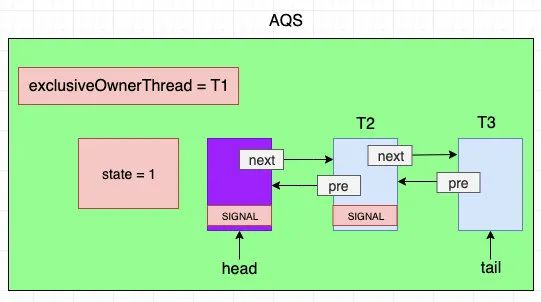

**如图示：T2，T3 的前驱节点的 waitStatus 都为 SIGNAL，所以 T2，T3 此时都可以阻塞。**

2. 如果前驱节点为取消状态，则前驱节点需要移除，这些采用了一个更巧妙的方法，把所有当前节点之前所有 waitStatus 为取消状态的节点全部移除，假设有四个线程如下，T2，T3 为取消状态，则执行逻辑后如下图所示，T2, T3 节点会被 GC。


3. 如果前驱节点小于等于 0，则需要首先将其前驱节点置为 SIGNAL,因为前文我们分析过，当前节点进入阻塞的一个条件是前驱节点必须为 SIGNAL，这样下一次自旋后发现前驱节点为 SIGNAL，就会返回 true（即步骤 1）

shouldParkAfterFailedAcquire 返回 true 代表线程可以进入阻塞中断，那么下一步 parkAndCheckInterrupt 就该让线程阻塞了

```java
private final boolean parkAndCheckInterrupt() {
    // 阻塞线程
    LockSupport.park(this);
    // 返回线程是否中断过，并且清除中断状态（在获得锁后会补一次中断）
    return Thread.interrupted();
}
```

这里的阻塞线程很容易理解，但为啥要判断线程是否中断过呢，因为如果线程在阻塞期间收到了中断，唤醒（转为运行态）获取锁后（acquireQueued 为 true）需要补一个中断，如下所示：

```java
public final void acquire(int arg) {
    if (!tryAcquire(arg) &&
        acquireQueued(addWaiter(Node.EXCLUSIVE), arg))
        // 如果是因为中断唤醒的线程，获取锁后需要补一下中断
        selfInterrupt();
}
```

至此，获取锁的流程已经分析完毕，不过还有一个疑惑我们还没解开：前文不是说 Node 状态为取消状态会被取消吗，那 Node 什么时候会被设置为取消状态呢。

回头看 acquireQueued

```java
final boolean acquireQueued(final Node node, int arg) {
    boolean failed = true;
    try {
        // 省略自旋获取锁代码        
    } finally {
        if (failed)
            // 如果线程自旋中因为异常等原因获取锁最终失败，则调用此方法
            cancelAcquire(node);
    }
}
```

看最后一个 cancelAcquire 方法，如果线程自旋中因为异常等原因获取锁最终失败，则会调用此方法

```java
private void cancelAcquire(Node node) {
    // 如果节点为空，直接返回
    if (node == null)
        return;
    // 由于线程要被取消了，所以将 thread 线程清掉
    node.thread = null;

    // 下面这步表示将 node 的 pre 指向之前第一个非取消状态的结点（即跳过所有取消状态的结点）,waitStatus > 0 表示当前结点状态为取消状态
    Node pred = node.prev;
    while (pred.waitStatus > 0)
        node.prev = pred = pred.prev;

    // 获取经过过滤后的 pre 的 next 结点，这一步主要用在后面的 CAS 设置 pre 的 next 节点上
    Node predNext = pred.next;
    // 将当前结点设置为取消状态
    node.waitStatus = Node.CANCELLED;

    // 如果当前取消结点为尾结点，使用 CAS 则将尾结点设置为其前驱节点，如果设置成功，则尾结点的 next 指针设置为空
    if (node == tail && compareAndSetTail(node, pred)) {
        compareAndSetNext(pred, predNext, null);
    } else {
    // 这一步看得有点绕，我们想想，如果当前节点取消了，那是不是要把当前节点的前驱节点指向当前节点的后继节点，但是我们之前也说了，要唤醒或阻塞结点，须在其前驱节点的状态为 SIGNAL 的条件才能操作，所以在设置 pre 的 next 节点时要保证 pre 结点的状态为 SIGNAL，想通了这一点相信你不难理解以下代码。
        int ws;
        if (pred != head &&
            ((ws = pred.waitStatus) == Node.SIGNAL ||
             (ws <= 0 && compareAndSetWaitStatus(pred, ws, Node.SIGNAL))) &&
            pred.thread != null) {
            Node next = node.next;
            if (next != null && next.waitStatus <= 0)
                compareAndSetNext(pred, predNext, next);
        } else {
        // 如果 pre 为 head，或者  pre 的状态设置 SIGNAL 失败，则直接唤醒后继结点去竞争锁，之前我们说过， SIGNAL 的结点取消（或释放锁）后可以唤醒后继结点
            unparkSuccessor(node);
        }
        node.next = node; // help GC
    }
}
```

这一段代码有点绕，我们一个个来看，首先考虑以下情况

1. 首先第一步当前节点之前有取消结点时，则逻辑如下

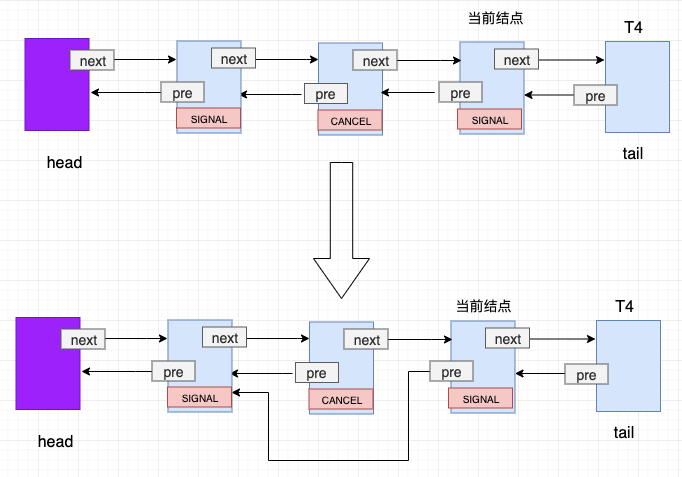

2. 如果当前结点既非头结点的后继结点，也非尾结点，即步骤 1 所示，则最终结果如下

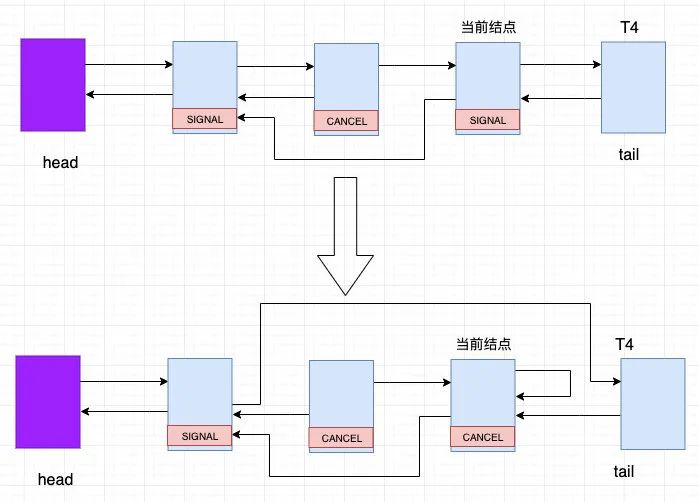

这里肯定有人问，这种情况下当前节点与它的前驱结点无法被 GC 啊，还记得我们上文分析锁自旋时的处理吗，再看下以下代码：

```java
private static boolean shouldParkAfterFailedAcquire(Node pred, Node node) {
    int ws = pred.waitStatus;
    // 省略无关代码
    if (ws > 0) {
        // 移除取消状态的结点
        do {
            node.prev = pred = pred.prev;
        } while (pred.waitStatus > 0);
        pred.next = node;
    } 
    return false;
}
```

这段代码会将 node 的 pre 指向之前 waitStatus 为非 CANCEL 的节点

所以当 T4 执行这段代码时，会变成如下情况

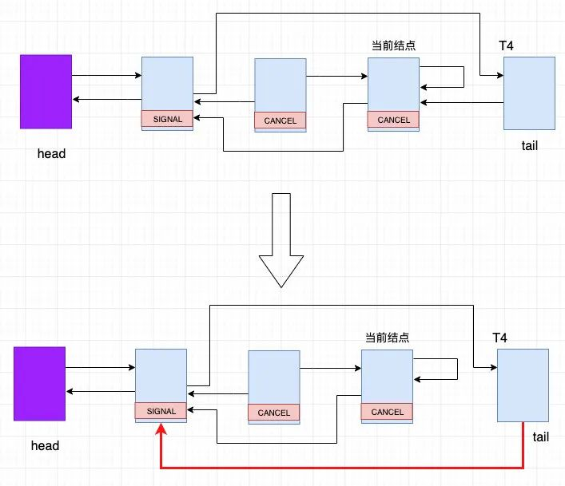

可以看到此时中间的两个 CANCEL 节点不可达了，会被 GC

3. 如果当前结点为 tail 结点，则结果如下，这种情况下当前结点不可达，会被 GC


4. 如果当前结点为 head 的后继结点时，如下

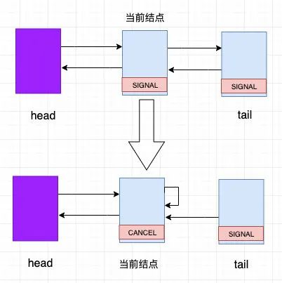


自此我们终于分析完了锁的获取流程，接下来我们来看看锁是如何释放的。

### 4.3 锁释放

不管是公平锁还是非公平锁，最终都是调的 AQS 的如下模板方法来释放锁

```java
// java.util.concurrent.locks.AbstractQueuedSynchronizer

public final boolean release(int arg) {
    // 锁释放是否成功
    if (tryRelease(arg)) {
        Node h = head;
        if (h != null && h.waitStatus != 0)
            unparkSuccessor(h);
        return true;
    }
    return false;
}
```

tryRelease 方法定义在了 AQS 的子类 Sync 方法里

```java
// java.util.concurrent.locks.ReentrantLock.Sync

protected final boolean tryRelease(int releases) {
    int c = getState() - releases;
    // 只有持有锁的线程才能释放锁，所以如果当前锁不是持有锁的线程，则抛异常
    if (Thread.currentThread() != getExclusiveOwnerThread())
        throw new IllegalMonitorStateException();
    boolean free = false;
    // 说明线程持有的锁全部释放了，需要释放 exclusiveOwnerThread 的持有线程
    if (c == 0) {
        free = true;
        setExclusiveOwnerThread(null);
    }
    setState(c);
    return free;
}
```

锁释放成功后该干嘛，显然是唤醒之后 head 之后节点，让它来竞争锁

```java

// java.util.concurrent.locks.AbstractQueuedSynchronizer

public final boolean release(int arg) {
    // 锁释放是否成功
    if (tryRelease(arg)) {
        Node h = head;
        if (h != null && h.waitStatus != 0)
            // 锁释放成功后，唤醒 head 之后的节点，让它来竞争锁
            unparkSuccessor(h);
        return true;
    }
    return false;
}
```

这里释放锁的条件为啥是 h != null && h.waitStatus != 0 呢。

1. 如果 h == null, 这有两种可能，一种是一个线程在竞争锁，现在它释放了，当然没有所谓的唤醒后继节点，一种是其他线程正在运行竞争锁，只是还未初始化头节点，既然其他线程正在运行，也就无需执行唤醒操作
2. 如果 h != null 且 h.waitStatus == 0，说明 head 的后继节点正在自旋竞争锁，也就是说线程是运行状态的，无需唤醒。
3. 如果 h != null 且 h.waitStatus < 0, 此时 waitStatus 值可能为 SIGNAL，或 PROPAGATE，这两种情况说明后继结点阻塞需要被唤醒

来看一下唤醒方法 unparkSuccessor：

```java
private void unparkSuccessor(Node node) {
    // 获取 head 的 waitStatus（假设其为 SIGNAL）,并用 CAS 将其置为 0，为啥要做这一步呢，之前我们分析过多次，其实 waitStatus = SIGNAL（< -1）或 PROPAGATE（-·3） 只是一个标志，代表在此状态下，后继节点可以唤醒，既然正在唤醒后继节点，自然可以将其重置为 0，当然如果失败了也不影响其唤醒后继结点
    int ws = node.waitStatus;
    if (ws < 0)
        compareAndSetWaitStatus(node, ws, 0);

    // 以下操作为获取队列第一个非取消状态的结点，并将其唤醒
    Node s = node.next;
    // s 状态为非空，或者其为取消状态，说明 s 是无效节点，此时需要执行 if 里的逻辑
    if (s == null || s.waitStatus > 0) {
        s = null;
        // 以下操作为从尾向前获取最后一个非取消状态的结点
        for (Node t = tail; t != null && t != node; t = t.prev)
            if (t.waitStatus <= 0)
                s = t;
    }
    if (s != null)
        LockSupport.unpark(s.thread);
}
```

这里的寻找队列的第一个非取消状态的节点为啥要从后往前找呢，因为节点入队并不是原子操作，如下

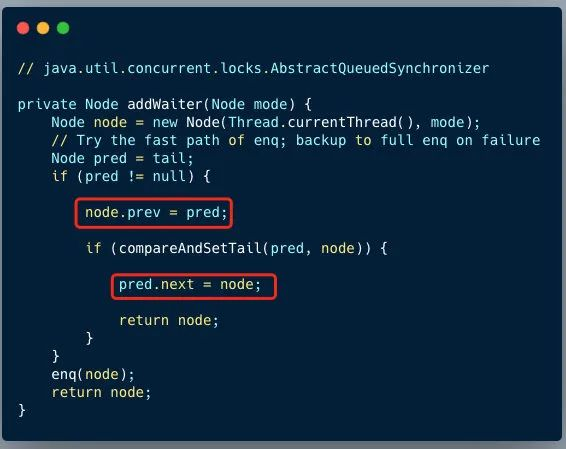

线程自旋时时是先执行 node.pre = pred, 然后再执行 pred.next = node，如果 unparkSuccessor 刚好在这两者之间执行，此时是找不到  head 的后继节点的，如下

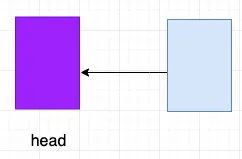

## 五. 总结

AQS（AbstractQueuedSynchronizer）是Java中的一个同步器框架，它内部维护一个整型的state来表示同步状态。通过这个state，AQS可以实现不同类型的同步器，如互斥锁、信号量等。

AQS提供了两类方法：acquire和release，用于操作state。当线程需要获取同步状态时，它会调用acquire方法。如果获取成功，则继续执行；如果获取失败，则线程将进入阻塞队列等待。在另一方面，当线程释放同步状态时，它会调用release方法，释放同步状态，并通知阻塞队列中的某个线程可以尝试获取同步状态。

具体来说，acquire方法会尝试获取同步状态，如果获取失败，则线程会被加入到AQS内部的阻塞队列中，然后进入阻塞状态。而release方法则主要用于释放同步状态，同时可能唤醒阻塞队列中的某个线程以便它能够尝试去获取同步状态。

通过这种机制，AQS实现了一个灵活的同步机制，可以支持不同类型的同步器，并且能够有效地管理线程的阻塞与唤醒，从而支持高效的并发编程。


>本文参考至：
>
>[1.5w字，30图带你彻底掌握 AQS！ (qq.com)](https://mp.weixin.qq.com/s/iNz6sTen2CSOdLE0j7qu9A)
>
>[图解：为什么非公平锁的性能更高？ - 腾讯云开发者社区-腾讯云 (tencent.com)](https://cloud.tencent.com/developer/article/1866720)
>
>[我画了35张图就是为了让你深入 AQS (qq.com)](https://mp.weixin.qq.com/s/trsjgUFRrz40Simq2VKxTA)