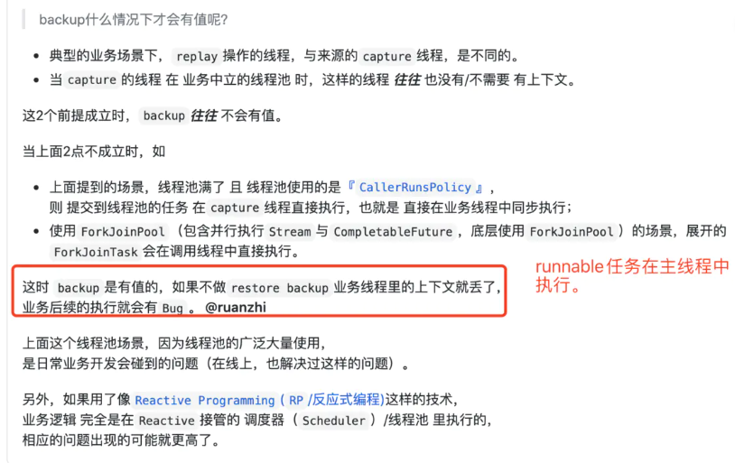

# TransmittableThreadLocal详解

> 后文中如无特殊说明，ITL代表 InheritableThreadLocal，TTL代表 TransmittableThreadLocal

## 一. ThreadLocal和InheritableThreadLocal的局限性

ThreadLocal 无法在父子线程中传递变量值：

```java
ThreadLocal<String> threadLocal = new ThreadLocal<>();
threadLocal.set("主线程的值1");

new Thread(() -> {
    System.out.println(threadLocal.get());
}).start();
```

输出：null

InheritableThreadLocal 可以在父子线程中传递值：

```java
InheritableThreadLocal<String> threadLocal = new InheritableThreadLocal<>();
threadLocal.set("主线程的值");
new Thread(() -> System.out.println(threadLocal.get())).start();
```

输出：主线程的值

但是它在使用线程池时，无法在子线程中获取到父线程的值，因为线程池中的线程是复用的，无法触发ITL中创建时的扩展点：

```java
  static {
        new Thread(() -> {
            executorService = new ThreadPoolExecutor(1, 1, 3, TimeUnit.HOURS, new LinkedBlockingDeque<>());
            // 这一步是为了，将真实的线程创建出来。
            // InheritableThreadLocal是在线程创建的时候进行数据拷贝的，如果没有这一步，第一次提交的任务还是会获取到父线程的数据
            executorService.submit(()->{});
        }).start();
    }

    /**
     * 测试 InheritableThreadLocal 数据无法传递给线程池中的线程
     */
    @Test
    public void test3() {
        InheritableThreadLocal<String> threadLocal = new InheritableThreadLocal<>();
        threadLocal.set("主线程的值");
        executorService.submit(() -> System.out.println(threadLocal.get()));//输出null
    }
```

如果需要在线程池中使用ThreadLocal并实现父子线程的值传递，可以引入阿里巴巴开源的 TransmittableThreadLocal：

```java
      static {
        new Thread(() -> {
            executorService = new ThreadPoolExecutor(1, 1, 3, TimeUnit.HOURS, new LinkedBlockingDeque<>());
            // 这一步是为了，将真实的线程创建出来。
            // InheritableThreadLocal是在线程创建的时候进行数据拷贝的，如果没有这一步，第一次提交的任务还是会获取到父线程的数据
            executorService.submit(()->{});
        }).start();
    }
	/**
     * 测试 TransmittableThreadLocal 数据可以传递给线程池中的线程
     */
    @Test
    public void test4() {
        TransmittableThreadLocal<String> threadLocal = new TransmittableThreadLocal<>();
        threadLocal.set("主线程的值");

        Runnable runnable = () -> System.out.println(threadLocal.get());
        // 额外的处理，生成修饰了的对象ttlRunnable
        Runnable ttlRunnable = TtlRunnable.get(runnable);
        executorService.submit(ttlRunnable);
    }
```

## 二. TTL原理

ITL是在子线程创建时，将父线程的中的所有变量值进行复制传递的。而TTL因为是线程池的场景，线程会复用，这样就无法在线程创建时进行值复制。只能在任务被执行的时候，将父线程的值复制到子线程中。

由于我们无法对原生线程池代码进行修改，使其在任务执行前进行值复制，所以另寻它路，将原生`Runnable` 装饰为 `TtlRunnable`。`TtlRunnable`。

`TtlRunnable` 提供了两大核心功能：

1. 父线程在通过 `TtlRunnable.get()` 方法对原生Runnable进行装饰时，获取父线程下所有 `TransmittableThreadLocal` 对象值快照，暂存在装饰对象 `TtlRunnable` 中。
2. 装饰真实任务的 `Runnable.run()` 方法，在任务被执行前，将父线程值快照中的值，塞入当前线程的 `TransmittableThreadLocal` 中。

## 三. holder变量设计

Thread中存在下面两个变量，存储的是 `ThreadLocal` 的值和 `InheritableThreadLocal` 的值。并且 `ThreadLocal` 和 `InheritableThreadLocal` 分别实现了 `get()` 方法，可以获取到对应的 `ThreadLocalMap`。

```java
    /* ThreadLocal values pertaining to this thread. This map is maintained
     * by the ThreadLocal class. */
    ThreadLocal.ThreadLocalMap threadLocals = null;

    /*
     * InheritableThreadLocal values pertaining to this thread. This map is
     * maintained by the InheritableThreadLocal class.
     */
    ThreadLocal.ThreadLocalMap inheritableThreadLocals = null;
```

- `TransmittableThreadLocal` 继承 `ThreadLocal`，那么便去 `threadLocals` 填充值；
- `TransmittableThreadLocal` 继承 `InheritableThreadLocal`，那么便去 `inheritableThreadLocals` 填充值；

`TransmittableThreadLocal` 无论继承哪个类，若只是将 `TransmittableThreadLocal` 传递到子线程（粒度小），那么就不能简单的使用get()方法。

于是：`TransmittableThreadLocal` 需要重新创建一个**线程级别的缓存**，来记录某个线程所有的 `TransmittableThreadLocal` 对象。

源码位置：`TransmittableThreadLocal`

```java
    // Note about the holder:
    // 1. holder self is a InheritableThreadLocal(a *ThreadLocal*).
    // 2. The type of value in the holder is WeakHashMap<TransmittableThreadLocal<Object>, ?>.
    //    2.1 but the WeakHashMap is used as a *Set*:
    //        - the value of WeakHashMap is *always null,
    //        - and be never used.
    //    2.2 WeakHashMap support *null* value.
    private static InheritableThreadLocal<WeakHashMap<TransmittableThreadLocal<Object>, ?>> holder =
            new InheritableThreadLocal<WeakHashMap<TransmittableThreadLocal<Object>, ?>>() {
                @Override
                protected WeakHashMap<TransmittableThreadLocal<Object>, ?> initialValue() {
                    return new WeakHashMap<TransmittableThreadLocal<Object>, Object>();
                }

                @Override
                protected WeakHashMap<TransmittableThreadLocal<Object>, ?> childValue(WeakHashMap<TransmittableThreadLocal<Object>, ?> parentValue) {
                    return new WeakHashMap<TransmittableThreadLocal<Object>, Object>(parentValue);
                }
            };
```

这就是holder的由来：无法对Thread进行扩展，且只想将 `TransmittableThreadLocal` 传递到子线程。即自己去维护一个线程级别的全局缓存。

1. `static`修饰：一个线程中，无论 `TransmittableThreadLocal` 被创建多少次，需要保证维护的是同一个缓存。即static保证；
2. `InheritableThreadLocal`：这个后续展开，其实和单纯使用 `ThreadLocal` 区别不大；
3. `WeakHashMap`：弱引用（发生GC便回收），这个是为了确保本框架不会造成潜在的内存泄漏；

这样 `TransmittableThreadLocal` 每一次set时，都会尝试将当前对象，放入 `holder` 缓存中：

```java
    /**
     * {@inheritDoc}
     */
    @Override
    public final void set(T value) {
        if (!disableIgnoreNullValueSemantics && value == null) {
            // may set null to remove value
            remove();
        } else {
            super.set(value);
            addThisToHolder();
        }
    }

    @SuppressWarnings("unchecked")
    private void addThisToHolder() {
        if (!holder.get().containsKey(this)) {
            holder.get().put((TransmittableThreadLocal<Object>) this, null); // WeakHashMap supports null value.
        }
    }
```

## 四. TtlRunnable 的创建

```java
 	@Nullable
    public static TtlRunnable get(@Nullable Runnable runnable) {
        return get(runnable, false, false);
    }

    @Nullable
    public static TtlRunnable get(@Nullable Runnable runnable, boolean releaseTtlValueReferenceAfterRun) {
        return get(runnable, releaseTtlValueReferenceAfterRun, false);
    }

	@Nullable
    public static TtlRunnable get(@Nullable Runnable runnable, boolean releaseTtlValueReferenceAfterRun, boolean idempotent) {
        if (runnable == null) return null;

        if (runnable instanceof TtlEnhanced) {
            // avoid redundant decoration, and ensure idempotency
            if (idempotent) return (TtlRunnable) runnable;
            else throw new IllegalStateException("Already TtlRunnable!");
        }
        return new TtlRunnable(runnable, releaseTtlValueReferenceAfterRun);
    }
```

get方法最终会调用 `TtlRunnable ` 的构造方法创建装饰对象。

需要注意的是，在 get 方法中会判断当前实例是否实现 `TtlEnhanced` 接口，`TtlEnhanced`接口仅仅是为了标识一个类已经被加强过了，目的是为了防止同一个实例被多次加强，如果传入已经加强的Runnable默认会直接返回，不再进行加强。

```java
public final class TtlRunnable implements Runnable, TtlWrapper<Runnable>, TtlEnhanced, TtlAttachments {
    private final AtomicReference<Object> capturedRef;
    private final Runnable runnable;
    private final boolean releaseTtlValueReferenceAfterRun;

    private TtlRunnable(@NonNull Runnable runnable, boolean releaseTtlValueReferenceAfterRun) {
        this.capturedRef = new AtomicReference<>(capture());
        this.runnable = runnable;
        this.releaseTtlValueReferenceAfterRun = releaseTtlValueReferenceAfterRun;
    }
}
```

在构造器中会调用 `capture()` 方法捕获主线程中所有`TransmittableThreadLocal`实例对应值的副本，然后放入 `capturedRef` 中暂存起来。

```java
        /**
         * 捕获当前线程中的所有TransmittableThreadLocal和注册ThreadLocal值。 
         */
        @NonNull
        public static Object capture() {
            final HashMap<Transmittee<Object, Object>, Object> transmittee2Value = new HashMap<>(transmitteeSet.size());
            for (Transmittee<Object, Object> transmittee : transmitteeSet) {
                try {
                    transmittee2Value.put(transmittee, transmittee.capture());
                } catch (Throwable t) {
                    if (logger.isLoggable(Level.WARNING)) {
                        logger.log(Level.WARNING, "exception when Transmitter.capture for transmittee " + transmittee +
                                "(class " + transmittee.getClass().getName() + "), just ignored; cause: " + t, t);
                    }
                }
            }
            return new Snapshot(transmittee2Value);
        }
```

在capture()方法中，会遍历所有的“发射器”集合，让他们捕获自己职责域中的父线程中的值，然后创建快照，暂存在TtlRunnable中。

## 五. 增强任务的执行

被装饰的Runnable最终还是会被线程池执行，调用任务的run方法：

```java
//TtlRunnable.java

    @Override
    public void run() {
        // 1. 取出任务创建时捕获的父线程的值。
        final Object captured = capturedRef.get();
        if (captured == null || releaseTtlValueReferenceAfterRun && !capturedRef.compareAndSet(captured, null)) {
            throw new IllegalStateException("TTL value reference is released after run!");
        }
		
        final Object backup = replay(captured);
        try {
            runnable.run();
        } finally {
            restore(backup);
        }
    }
```

步骤：

1. 取出任务创建时捕获的父线程的值。
2. 调用replay方法，将快照中的值，写入当前线程（线程池中的子线程）TransmittableThreadLocal中去（com.alibaba.ttl.TransmittableThreadLocal.Transmitter#setTtlValuesTo）。
3. 执行被装饰的Runnable任务
4. 删除子线程新增的TTL，将备份还原重新设置到子线程的TTL中

### 5.1 为什么会有restore操作

Runnable可能由主线程执行，若Runnable修改了TransmittableThreadLocal，可能会造成主线程的TransmittableThreadLocal值变化，造成bug：



restore中由框架进行了ttl的remove操作，无需开发人员在子线程中显式调用remove()方法，也不会造成内存泄漏。

代码位置：`com.alibaba.ttl.TransmittableThreadLocal.Transmitter#restoreTtlValues`

## 六. Transmittee 发射器

```java
public interface Transmittee<C, B> {
    /**
     * 捕获
     */
    @NonNull
    C capture();

    /**
     * 重放
     */
    @NonNull
    B replay(@NonNull C captured);

    /**
     * 清除
     */
    @NonNull
    B clear();

    /**
     * 恢复
     */
    void restore(@NonNull B backup);
}
```

`Transmittee` 接口用于抽象“发射器”的捕获、重放、清除、恢复操作，其中捕获操作(capture)用于捕获父线程获取对应的值。

而在上一节中遍历的发射器集合就是在类加载的时候注册进去的：

```java

private static final Set<Transmittee<Object, Object>> transmitteeSet = new CopyOnWriteArraySet<>();

static {
    registerTransmittee(ttlTransmittee);
    registerTransmittee(threadLocalTransmittee);
}

public static <C, B> boolean registerTransmittee(@NonNull Transmittee<C, B> transmittee) {
    return transmitteeSet.add((Transmittee<Object, Object>) transmittee);
}
```

可以看到在类加载时，会注册两个“发射器”，这里我们主要关注 `ttlTransmittee`:

```java
        private static final Transmittee<HashMap<TransmittableThreadLocal<Object>, Object>, HashMap<TransmittableThreadLocal<Object>, Object>> ttlTransmittee =
                new Transmittee<HashMap<TransmittableThreadLocal<Object>, Object>, HashMap<TransmittableThreadLocal<Object>, Object>>() {
                    @NonNull
                    @Override
                    public HashMap<TransmittableThreadLocal<Object>, Object> capture() {
                        final HashMap<TransmittableThreadLocal<Object>, Object> ttl2Value = new HashMap<>(holder.get().size());
                        // 拿到当前线程的holder，内部保存着当前线程使用到的所有 TransmittableThreadLocal 实例
                        for (TransmittableThreadLocal<Object> threadLocal : holder.get().keySet()) {
                            ttl2Value.put(threadLocal, threadLocal.copyValue());
                        }
                        return ttl2Value;
                    }

                    @NonNull
                    @Override
                    public HashMap<TransmittableThreadLocal<Object>, Object> replay(@NonNull HashMap<TransmittableThreadLocal<Object>, Object> captured) {
                        final HashMap<TransmittableThreadLocal<Object>, Object> backup = new HashMap<>(holder.get().size());

                        for (final Iterator<TransmittableThreadLocal<Object>> iterator = holder.get().keySet().iterator(); iterator.hasNext(); ) {
                            TransmittableThreadLocal<Object> threadLocal = iterator.next();

                            // backup
                            backup.put(threadLocal, threadLocal.get());

                            // clear the TTL values that is not in captured
                            // avoid the extra TTL values after replay when run task
                            if (!captured.containsKey(threadLocal)) {
                                iterator.remove();
                                threadLocal.superRemove();
                            }
                        }

                        // set TTL values to captured
                        setTtlValuesTo(captured);

                        // call beforeExecute callback
                        doExecuteCallback(true);

                        return backup;
                    }

                    @NonNull
                    @Override
                    public HashMap<TransmittableThreadLocal<Object>, Object> clear() {
                        return replay(new HashMap<>(0));
                    }

                    @Override
                    public void restore(@NonNull HashMap<TransmittableThreadLocal<Object>, Object> backup) {
                        // call afterExecute callback
                        doExecuteCallback(false);

                        for (final Iterator<TransmittableThreadLocal<Object>> iterator = holder.get().keySet().iterator(); iterator.hasNext(); ) {
                            TransmittableThreadLocal<Object> threadLocal = iterator.next();

                            // clear the TTL values that is not in backup
                            // avoid the extra TTL values after restore
                            if (!backup.containsKey(threadLocal)) {
                                iterator.remove();
                                threadLocal.superRemove();
                            }
                        }

                        // restore TTL values
                        setTtlValuesTo(backup);
                    }
                };

```

可以看到capture方法中，会拿到当前主线程中的 `holder` 变量，它其中保存着当前线程使用到的所有 TransmittableThreadLocal 实例，然后copy其中的value，为子线程创建快照。


> 本文参考至：
>
> [从TransmittableThreadLocal使用前调研（源码分析） - 简书 (jianshu.io)](http://events.jianshu.io/p/79650be29e34)
>
> [小伙伴同学们写的 TTL实际业务使用场景 与 设计实现解析的文章（写得都很好！ ）❤️ · Issue #123 · alibaba/transmittable-thread-local (github.com)](https://github.com/alibaba/transmittable-thread-local/issues/123)
