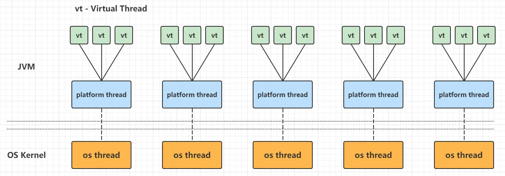
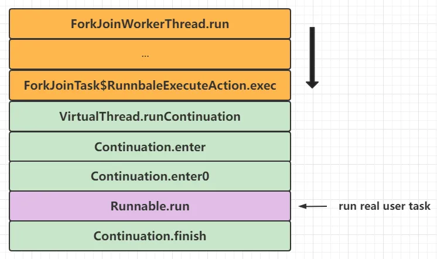
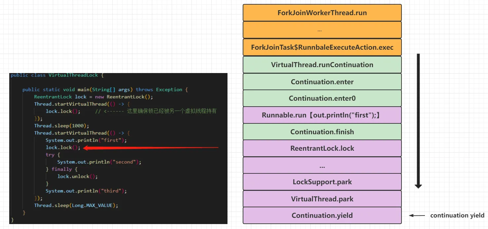
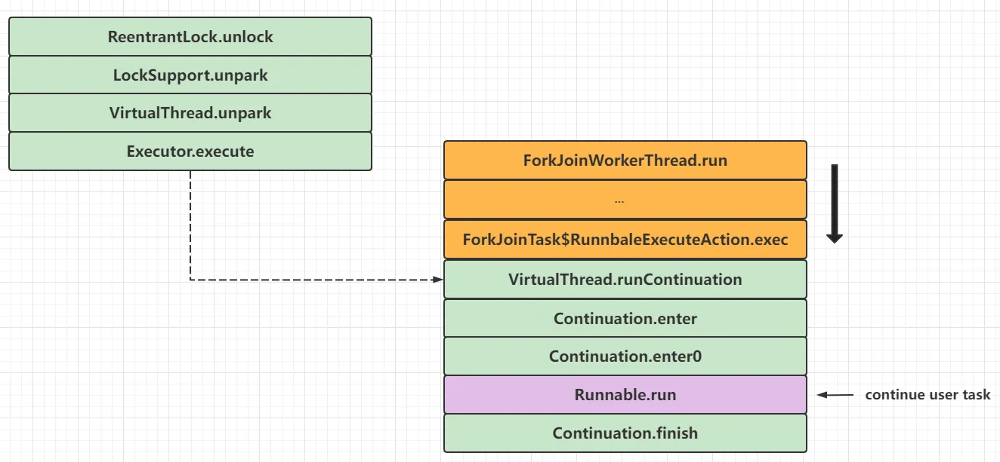
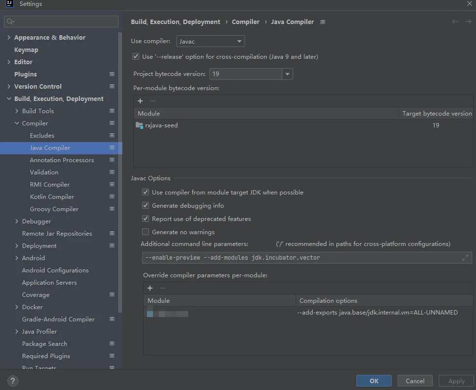
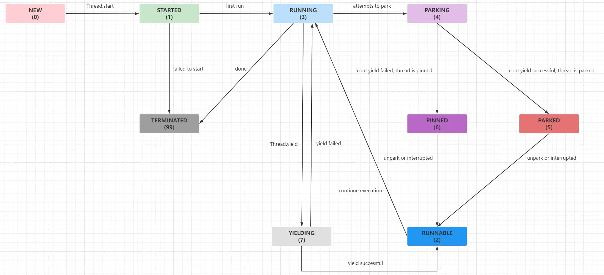
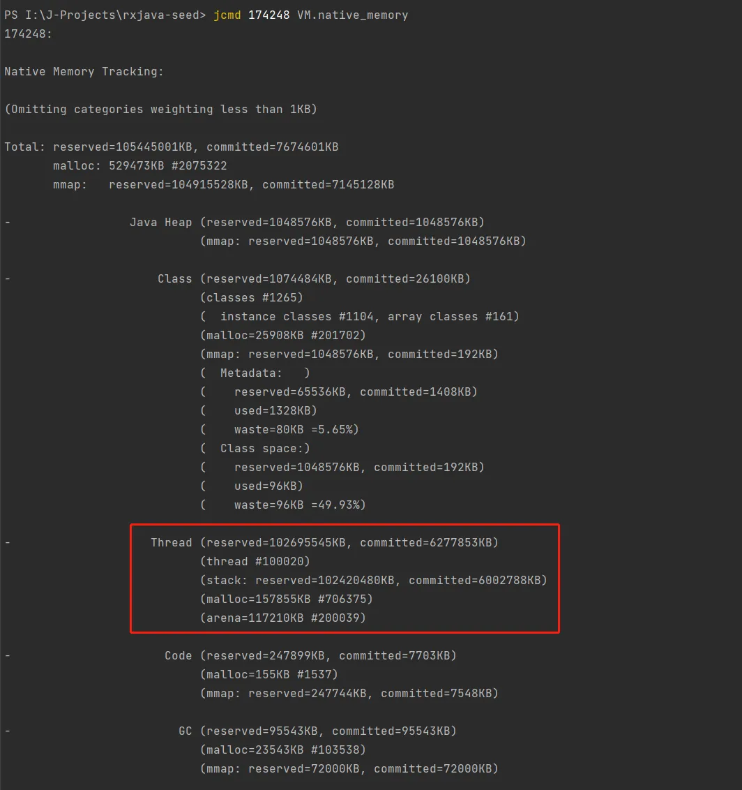
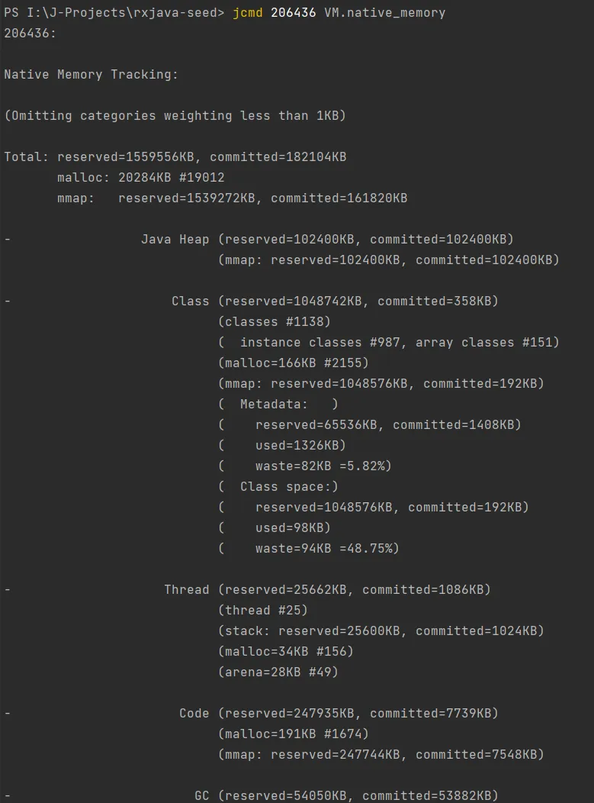

# 虚拟线程 - VirtualThread源码透视

> 本文转载至：[虚拟线程 - VirtualThread源码透视 - throwable - 博客园 (cnblogs.com)](https://www.cnblogs.com/throwable/p/16758997.html#continuation)

## 一. 前提

`JDK19`于`2022-09-20`发布`GA`版本，该版本提供了虚拟线程的预览功能。下载`JDK19`之后翻看了一下有关虚拟线程的一些源码，跟早些时候的`Loom`项目构建版本基本并没有很大出入，也跟第三方`JDK`如鹅厂的`Kona`虚拟线程实现方式基本一致，这里分析一下虚拟线程设计与源码实现。

## 二. Platform Thread 与 Virtual Thread

因为引入了虚拟线程，原来`JDK`存在`java.lang.Thread`类，俗称线程，为了更好地区分虚拟线程和原有的线程类，引入了一个全新类`java.lang.VirtualThread`（`Thread`类的一个子类型），直译过来就是"虚拟线程"。

- 题外话：在`Loom`项目早期规划里面，核心`API`其实命名为`Fiber`，直译过来就是"纤程"或者"协程"，后来成为了废案，在一些历史提交的`Test`类或者文档中还能看到类似于下面的代码：

```java
// java.lang.Fiber
Fiber f = Fiber.execute({
    out.println("Good morning");
    readLock.lock();
    try{
        out.println("Good night");
    } finally{
        readLock.unlock();
    }
    out.println("Good night");
});

```

`Thread`在此基础上做了不少兼容性工作。此外，还应用了建造者模式引入了线程建造器，提供了静态工厂方法`Thread#ofPlatform()`和`Thread#ofVirtual()`分别用于实例化`Thread`（工厂）建造器和`VirtualThread`（工厂）建造器，顾名思义，两种建造器分别用于创建`Thread`或者`VirtualThread`，例如：

```java
// demo-1 build platform thread
Thread platformThread = Thread.ofPlatform().daemon().name("worker").unstarted(runnable);

// demo-2 create platform thread factory
ThreadFactory platformThreadFactory = Thread.ofPlatform().daemon().name("worker-", 0).factory();

// demo-3 build virtual thread
Thread virtualThread = Thread.ofVirtual().name("virtual-worker").unstarted(runnable);

// demo-4 create virtual thread factory
ThreadFactory virtualThreadFactory = Thread.ofVirtual().name("virtual-worker-", 0).factory();

```

更新的`JDK`文档中也把原来的`Thread`称为`Platform Thread`，可以更明晰地与`Virtual Thread`区分开来。这里`Platform Thread`直译为"平台线程"，其实就是"虚拟线程"出现之前的老生常谈的"线程"。

> 后文会把Platform Thread称为平台线程，Virtual Thread称为虚拟线程，或者直接用其英文名称

那么平台线程与虚拟线程的联系和区别是什么？`JDK`中的每个`java.lang.Thread`实例也就是每个平台线程实例都在底层操作系统线程上运行`Java`代码，并且**平台线程在运行代码的整个生命周期内捕获系统线程**。可以得出一个结论，平台线程与底层系统线程是一一对应的，平台线程实例本质是由系统内核的线程调度程序进行调度，并且平台线程的总数量受限于系统线程的总数量。


总的来说，平台线程有下面的一些特点或者说限制：

- 资源有限导致系统线程总量有限，进而导致与系统线程一一对应的平台线程有限
- 平台线程的调度依赖于系统的线程调度程序，当平台线程创建过多，会消耗大量资源用于处理线程上下文切换
- 每个平台线程都会开辟一块私有的栈空间，大量平台线程会占据大量内存

这些限制导致开发者不能极大量地创建平台线程，为了满足性能需要，需要引入池化技术、添加任务队列构建消费者-生产者模式等方案去让平台线程适配多变的现实场景。显然，开发者们迫切需要一种轻量级线程实现，刚好可以弥补上面提到的平台线程的限制，这种轻量级线程可以满足：

- 可以大量创建，例如十万级别、百万级别，而不会占据大量内存
- 由`JVM`进行调度和状态切换，并且与系统线程"松绑"
- 用法与原来平台线程差不多，或者说尽量兼容平台线程现存的`API`

`Loom`项目中开发的虚拟线程就是为了解决这个问题，看起来它的运行示意图如下：



当然，平台线程不是简单地与虚拟线程进行`1:N`的绑定，后面的章节会深入分析虚拟线程的运行原理。

## 三. 虚拟线程实现原理

虚拟线程是一种轻量级（用户模式）线程，这种线程是由`Java`虚拟机调度，而不是操作系统。虚拟线程占用空间小，任务切换开销几乎可以忽略不计，因此可以极大量地创建和使用。总体来看，虚拟线程实现如下：

```shell
virtual thread = continuation + scheduler
```

虚拟线程会把任务（一般是`java.lang.Runnable`）包装到一个`Continuation`实例中：

- 当任务需要阻塞挂起的时候，会调用`Continuation`的`yield`操作进行阻塞
- 当任务需要解除阻塞继续执行的时候，`Continuation`会被继续执行

`Scheduler`也就是执行器，会把任务提交到一个载体线程池中执行：

- 执行器是`java.util.concurrent.Executor`的子类
- 虚拟线程框架提供了一个默认的`ForkJoinPool`用于执行虚拟线程任务

> 下文会把carrier thread称为"载体线程"，指的是负责执行虚拟线程中任务的平台线程，或者说运行虚拟线程的平台线程称为它的载体线程

操作系统调度系统线程，而`Java`平台线程与系统线程一一映射，所以平台线程被操作系统调度，但是虚拟线程是由`JVM`调度。`JVM`把虚拟线程分配给平台线程的操作称为`mount`（挂载），反过来取消分配平台线程的操作称为`unmount`（卸载）：

- `mount`操作：虚拟线程挂载到平台线程，虚拟线程中包装的`Continuation`栈数据帧或者引用栈数据会被拷贝到平台线程的线程栈，这是一个从堆复制到栈的过程
- `unmount`操作：虚拟线程从平台线程卸载，大多数虚拟线程中包装的`Continuation`栈数据帧会留在堆内存中

这个`mount -> run -> unmount`过程用伪代码表示如下：

```java
mount();
try {
    Continuation.run();
} finally {
    unmount();
}
```

从`Java`代码的角度来看，虚拟线程和它的载体线程暂时共享一个`OS`线程实例这个事实是不可见，因为虚拟线程的堆栈跟踪和线程本地变量与平台线程是完全隔离的。`JDK`中专门是用了一个`FIFO`模式的`ForkJoinPool`作为虚拟线程的调度程序，从这个调度程序看虚拟线程任务的执行流程大致如下：

- 调度器（线程池）中的平台线程等待处理任务


- 一个虚拟线程被分配平台线程，该平台线程作为运载线程执行虚拟线程中的任务


- 虚拟线程运行其`Continuation`，从而执行基于`Runnable`包装的用户任务



- 虚拟线程任务执行完成，标记`Continuation`终结，标记虚拟线程为终结状态，清空一些上下文变量，运载线程"返还"到调度器（线程池）中作为平台线程等待处理下一个任务


上面是描述一般的虚拟线程任务执行情况，在执行任务时候首次调用`Continuation#run()`获取锁（`ReentrantLock`）的时候会触发`Continuation`的`yield`操作让出控制权，等待虚拟线程重新分配运载线程并且执行，见下面的代码：

```java
public class VirtualThreadLock {

    public static void main(String[] args) throws Exception {
        ReentrantLock lock = new ReentrantLock();
        Thread.startVirtualThread(() -> {
            lock.lock();     // <------ 这里确保锁已经被另一个虚拟线程持有
        });
        Thread.sleep(1000);
        Thread.startVirtualThread(() -> {
            System.out.println("first");
            lock.lock();
            try {
                System.out.println("second");
            } finally {
                lock.unlock();
            }
            System.out.println("third");
        });
        Thread.sleep(Long.MAX_VALUE);
    }
}
```

- 虚拟线程中任务执行时候首次调用`Continuation#run()`执行了部分任务代码，然后尝试获取锁，会导致`Continuation`的`yield`操作让出控制权（任务切换），也就是`unmount`，运载线程栈数据会移动到`Continuation`栈的数据帧中，保存在堆内存，虚拟线程任务完成（但是虚拟线程没有终结，同时其`Continuation`也没有终结和释放），运载线程被释放到执行器中等待新的任务；如果`Continuation`的`yield`操作失败，则会对运载线程进行`park`调用，阻塞在运载线程上



- 当锁持有者释放锁之后，会唤醒虚拟线程获取锁（成功后），虚拟线程会重新进行`mount`，让虚拟线程任务再次执行，有可能是分配到另一个运载线程中执行，`Continuation`栈会的数据帧会被恢复到运载线程栈中，然后再次调用`Continuation#run()`恢复任务执行：



- 最终虚拟线程任务执行完成，标记`Continuation`终结，标记虚拟线程为终结状态，清空一些上下文变量，运载线程"返还"到调度器（线程池）中作为平台线程等待处理下一个任务

`Continuation`组件十分重要，它既是用户真实任务的包装器，也是任务切换虚拟线程与平台线程之间数据转移的一个句柄，它提供的`yield`操作可以实现任务上下文的中断和恢复。由于`Continuation`被封闭在`java.base/jdk.internal.vm`下，可以通过增加编译参数`--add-exports java.base/jdk.internal.vm=ALL-UNNAMED`暴露对应的功能，从而编写实验性案例，`IDEA`中可以按下图进行编译参数添加：



然后编写和运行下面的例子：

```java
import jdk.internal.vm.Continuation;
import jdk.internal.vm.ContinuationScope;

public class ContinuationDemo {

    public static void main(String[] args) {
        ContinuationScope scope = new ContinuationScope("scope");
        Continuation continuation = new Continuation(scope, () -> {
            System.out.println("Running before yield");
            Continuation.yield(scope);
            System.out.println("Running after yield");
        });
        System.out.println("First run");
        // 第一次执行Continuation.run
        continuation.run();
        System.out.println("Second run");
        // 第二次执行Continuation.run
        continuation.run();
        System.out.println("Done");
    }
}
```

运行结果：

```java
// 运行代码，神奇的结果出现了
First run
Running before yield
Second run
Running after yield
Done
```

这里可以看出`Continuation`的奇妙之处，`Continuation`实例进行`yield`调用后，再次调用其`run`方法就可以从`yield`的调用之处往下执行，从而实现了程序的中断和恢复。

## 四. 源码分析

主要包括：

- `Continuation`
- `VirtualThread`
- 线程建造器

### 4.1 Continuation

`Continuation`直译为"连续"，一般来说表示一种语言构造，**使语言可以在任意点保存执行状态并且在之后的某个点返回**。在`JDK`中对应类`jdk.internal.vm.Continuation`，这个类只有一句类注释`A one-shot delimited continuation`，直译为**一个只能执行一次的回调函数**。由于`Continuation`的成员和方法缺少详细的注释，并且大部分功能由`JVM`实现，这里只能阅读其一些骨干源码和上一小节编写的`Continuation`相关例子去了解其实现（笔者`C`语言比较薄弱，有兴趣的可以翻阅`JVM`的源码）。先看成员变量和构造函数：

```java
// 判断是否需要保留当前线程的本地缓存，由系统参数jdk.preserveExtentLocalCache决定
private static final boolean PRESERVE_EXTENT_LOCAL_CACHE;

// 真正要被执行的任务实例
private final Runnable target;

// 标识Continuation的范围，
private final ContinuationScope scope;

// Continuation的父节点，如果为空的时候则为本地线程栈
private Continuation parent;

// Continuation的子节点，非空时候说明在子Continuation中进行了yield操作
private Continuation child;

// 猜测为Continuation栈结构，由JVM管理，无法得知其真实作用
private StackChunk tail;

// 标记Continuation是否已经完成
private boolean done;

// 标记是否进行了mount操作
private volatile boolean mounted = false;

// yield操作时候设置的信息
private Object yieldInfo;

// 标记一个未挂载的Continuation是否通过强制抢占式卸载
private boolean preempted;

// 保留当前线程的本地缓存的副本
private Object[] extentLocalCache;

// 构造函数，要求传入范围和任务包装实例
public Continuation(ContinuationScope scope, Runnable target) {
    this.scope = scope;
    this.target = target;
}
```

`Continuation`是一个双向链表设计，它的唯一一组构造参数是`ContinuationScope`和`Runnable`：


这里不深入研究内部`StackChunk`、`Pinned`等实现，直接看`run`、`enter`系列方法和`yield`方法：

```java
// Continuation.run()
public final void run() {
    // 设置死循环
    while (true) {
        // 进行mount操作
        mount();
        JLA.setExtentLocalCache(extentLocalCache);
        // 如果Continuation已完成则抛出异常
        if (done)
            throw new IllegalStateException("Continuation terminated");
        // 获取当前虚拟线程分配的运载线程
        Thread t = currentCarrierThread();
        if (parent != null) {
            if (parent != JLA.getContinuation(t))
                throw new IllegalStateException();
        } else
            this.parent = JLA.getContinuation(t);
        // 运载线程设置当前Continuation实例
        JLA.setContinuation(t, this);

        try {
            // 判断ContinuationScope是否虚拟线程范围
            boolean isVirtualThread = (scope == JLA.virtualThreadContinuationScope());
            if (!isStarted()) { // is this the first run? (at this point we know !done)
                // 激活enter系列方法，标记isContinue为false，标记是否虚拟线程范围
                enterSpecial(this, false, isVirtualThread);
            } else {
                assert !isEmpty();
                // 激活enter系列方法，标记isContinue为true，标记是否虚拟线程范围
                enterSpecial(this, true, isVirtualThread);
            }
        } finally {
            // 设置内存屏障
            fence();
            try {
                assert isEmpty() == done : "empty: " + isEmpty() + " done: " + done + " cont: " + Integer.toHexString(System.identityHashCode(this));
                // 当前Continuation执行完成后，把运载线程的Continuation指向父Continuation
                JLA.setContinuation(currentCarrierThread(), this.parent);
                if (parent != null)
                    parent.child = null;
                // 进行后置的yield清理工作
                postYieldCleanup();
                // 进行unmount操作
                unmount();
                // 判断是否需要保留当前线程的本地缓存并处理
                if (PRESERVE_EXTENT_LOCAL_CACHE) {
                    extentLocalCache = JLA.extentLocalCache();
                } else {
                    extentLocalCache = null;
                }
                JLA.setExtentLocalCache(null);
            } catch (Throwable e) { e.printStackTrace(); System.exit(1); }
        }
        // we're now in the parent continuation

        assert yieldInfo == null || yieldInfo instanceof ContinuationScope;
        // 父Continuation的yieldInfo缓存当前的scope实例，清空当前Continuation的父节点和yieldInfo
        if (yieldInfo == null || yieldInfo == scope) {
            this.parent = null;
            this.yieldInfo = null;
            // 这个位置是死循环的唯一跳出点
            return;
        } else {
            // 执行到这个位置说明在当前是子Continuation并且进行了yield操作，需要跳转到父Continuation进行yield操作
            parent.child = this;
            parent.yield0((ContinuationScope)yieldInfo, this);
            parent.child = null;
        }
    }
}

// Continuation.enter()系列方法

// 这是一个native方法，它最终会根据判断回调到enter()方法
private native static void enterSpecial(Continuation c, boolean isContinue, boolean isVirtualThread);

// Continuation的入口方法，用户任务回调的入口
@DontInline
@IntrinsicCandidate
private static void enter(Continuation c, boolean isContinue) {
    // This method runs in the "entry frame".
    // A yield jumps to this method's caller as if returning from this method.
    try {
        c.enter0();
    } finally {
        c.finish();
    }
}

// 真正任务包装器执行的回调方法
private void enter0() {
    target.run();
}

// Continuation完成，标记done为true
private void finish() {
    done = true;
    assert isEmpty();
}


// Continuation.yield()方法，静态方法
public static boolean yield(ContinuationScope scope) {
    // 获取当前运载线程的Continuation实例
    Continuation cont = JLA.getContinuation(currentCarrierThread());
    Continuation c;
    // 基于Continuation实例当前向父节点遍历，直到匹配虚拟线程类型的ContinuationScope的Continuation，如果没有匹配的Continuation会抛出异常中断流程
    for (c = cont; c != null && c.scope != scope; c = c.parent)
        ;
    if (c == null)
        throw new IllegalStateException("Not in scope " + scope);
    // 把当前的Continuation挂起到给定的ContinuationScope
    return cont.yield0(scope, null);
}

// 透过上下文猜测是当前的Continuation实例挂起到给定的ContinuationScope
private boolean yield0(ContinuationScope scope, Continuation child) {
    // 强制抢占式卸载标记为false
    preempted = false;
    // 如果当前Continuation实例的yieldInfo不等于传入的ContinuationScope实例，则进行更新，相等的情况下yieldInfo会保持是一个空值
    if (scope != this.scope)
        this.yieldInfo = scope;
    // 最终的yield调用，最终当前Continuation就是阻塞在此方法，从下文源码猜测，当该方法唤醒后，res值为0的时候，当前Continuation实例会继续执行，返回其他值的时候则会打印pined线程栈
    int res = doYield();
    // 放置内存屏障防止指令重排，后面注释提到是防止编译器进行某些转换
    U.storeFence(); // needed to prevent certain transformations by the compiler

    assert scope != this.scope || yieldInfo == null : "scope: " + scope + " this.scope: " + this.scope + " yieldInfo: " + yieldInfo + " res: " + res;
    assert yieldInfo == null || scope == this.scope || yieldInfo instanceof Integer : "scope: " + scope + " this.scope: " + this.scope + " yieldInfo: " + yieldInfo + " res: " + res;

    if (child != null) { // TODO: ugly <----- 这个位置还有一句吐槽的代码注释：丑陋的代码
        if (res != 0) {
            child.yieldInfo = res;
        } else if (yieldInfo != null) {
            assert yieldInfo instanceof Integer;
            child.yieldInfo = yieldInfo;
        } else {
            child.yieldInfo = res;
        }
        this.yieldInfo = null;
    } else {
        if (res == 0 && yieldInfo != null) {
            res = (Integer)yieldInfo;
        }
        this.yieldInfo = null;

        if (res == 0)
            // Continuation实例继续执行前回调
            onContinue();
        else
            // Continuation固定在运载线程前回调，res是pined的级别
            onPinned0(res);
    }
    assert yieldInfo == null;
    // 返回布尔值结果表示当前Continuation实例是否会继续执行
    return res == 0;
}

// 最终的yield调用，看实现是抛出异常，猜测是由JVM实现
@IntrinsicCandidate
private static int doYield() { throw new Error("Intrinsic not installed"); }
```

说实话，`Continuation`源码的可读性比想象中低，连代码注释也留下了"丑陋的"这句吐槽。通过上面源码分析和上一节`Continuation`的一个例子，可以得知`Continuation#yield()`可以让程序代码中断，然后再次调用`Continuation#run()`可以从上一个中断位置继续执行，`JVM`在这个过程中为使用者屏蔽了`Continuation`和运行此`Continuation`的平台线程之间的交互细节，让使用者可以专注实际的任务开发即可。

### 4.2 VirtualThread

前面花了不少篇幅介绍`Continuation`，它是一个全新的`API`。已有的`JUC`类库已经十分完善，如果可以把`Continuation`融入到已有的`JUC`体系，那么就可以通过线程池技术去管理运载线程，原有的大多数并发相关`API`也能直接在协程体系中使用。从这个背景来看，创造一个`Thread`类的全新子类用于融合`JUC`和`Continuation`是十分合适的，这样通过很小的改造成本就能通过`Java`继承特性把这个全新子类适配`JUC`体系，也能扩展一些`API`让它适配协程新引入的特性，这个全新的子类就是`java.lang.VirtualThread`：


`VirtualThread`类的继承体系如下：

```java
package java.lang;

final class VirtualThread extends BaseVirtualThread {
  // ...
}

package java.lang;

sealed abstract class BaseVirtualThread extends Thread
        permits VirtualThread, ThreadBuilders.BoundVirtualThread {
  // ... 
}
```

`VirtualThread`是`BaseVirtualThread`的子类，而`BaseVirtualThread`是一个"密封类"，它是`Thread`的子类，只对`VirtualThread`和`ThreadBuilders.BoundVirtualThread`开放，并且`VirtualThread`是**包私有访问权限的**同时用`final`关键字修饰，无法被继承。接着看`VirtualThread`的成员变量和构造函数：

```java
// java.lang.VirtualThread

// Unsafe实例
private static final Unsafe U = Unsafe.getUnsafe();

// 虚拟线程的ContinuationScope静态常量
private static final ContinuationScope VTHREAD_SCOPE = new ContinuationScope("VirtualThreads");

// 调度器，或者说执行器，默认就是用此调度器运行虚拟线程
private static final ForkJoinPool DEFAULT_SCHEDULER = createDefaultScheduler();

// 调度线程池实例，用于唤醒带超时阻塞的虚拟线程实例，主要用于sleep的唤醒
private static final ScheduledExecutorService UNPARKER = createDelayedTaskScheduler();

// pin模式，也就是pined thread的跟踪模式，决定打印堆栈的详细程度，来自于系统参数jdk.tracePinnedThreads，full表示详细，short表示简略
private static final int TRACE_PINNING_MODE = tracePinningMode();

// 下面几个都是成员地址，用于Unsafe直接操作成员
private static final long STATE = U.objectFieldOffset(VirtualThread.class, "state");
private static final long PARK_PERMIT = U.objectFieldOffset(VirtualThread.class, "parkPermit");
private static final long CARRIER_THREAD = U.objectFieldOffset(VirtualThread.class, "carrierThread");
private static final long TERMINATION = U.objectFieldOffset(VirtualThread.class, "termination");

// 调度器实例
private final Executor scheduler;

// Continuation实例
private final Continuation cont;

// Continuation实例的Runnable包装实例
private final Runnable runContinuation;

// 虚拟线程状态，这个值由JVM访问和修改
private volatile int state;

// 下面的状态集合
private static final int NEW      = 0;
private static final int STARTED  = 1;
private static final int RUNNABLE = 2;     // runnable-unmounted
private static final int RUNNING  = 3;     // runnable-mounted
private static final int PARKING  = 4;
private static final int PARKED   = 5;     // unmounted
private static final int PINNED   = 6;     // mounted
private static final int YIELDING = 7;     // Thread.yield
private static final int TERMINATED = 99;  // final state

// 虚拟线程unmount后可以从调度过程中挂起的状态
private static final int SUSPENDED = 1 << 8;
private static final int RUNNABLE_SUSPENDED = (RUNNABLE | SUSPENDED);
private static final int PARKED_SUSPENDED   = (PARKED | SUSPENDED);

// park操作许可
private volatile boolean parkPermit;

// 运载线程实例
private volatile Thread carrierThread;

// 终结倒数栅栏实例，主要用于join操作
private volatile CountDownLatch termination;

// 唯一构造函数
VirtualThread(Executor scheduler, String name, int characteristics, Runnable task) {
    // 默认标记bound为false，当bound为true的时候标记为绑定到系统线程
    super(name, characteristics, /*bound*/ false);
    Objects.requireNonNull(task);
    // 如果传入的调度器实例非空则直接使用
    // 否则，如果父线程是虚拟线程，则使用父虚拟线程的调度器实例
    // 如果传入的调度器实例为空，父线程为平台线程，那么使用默认的调度器
    // choose scheduler if not specified
    if (scheduler == null) {
        Thread parent = Thread.currentThread();
        if (parent instanceof VirtualThread vparent) {
            scheduler = vparent.scheduler;
        } else {
            scheduler = DEFAULT_SCHEDULER;
        }
    }
    // 赋值调度器
    this.scheduler = scheduler;
    // 封装和初始化Continuation
    this.cont = new VThreadContinuation(this, task);
    // 初始化Continuation的Runnable包装器，最终提交到调度器中执行
    this.runContinuation = this::runContinuation;
}

// 虚拟线程Continuation的专有子类，默认为ContinuationScope("VirtualThreads")，从而实现Continuation.enter()执行时候实际上执行的是VirtualThread.run()方法
// 也就是 Runnable.run()[runContinuation by carrier thread from executor] --> Continuation.run() --> Continuation.enter() --> VirtualThread.run() --> Runnable.run()[user task]
private static class VThreadContinuation extends Continuation {

    VThreadContinuation(VirtualThread vthread, Runnable task) {
        super(VTHREAD_SCOPE, () -> vthread.run(task));
    }

    // pin之前回调的方法，基于TRACE_PINNING_MODE的返回值决定pinned线程栈的打印详略
    @Override
    protected void onPinned(Continuation.Pinned reason) {
        if (TRACE_PINNING_MODE > 0) {
            boolean printAll = (TRACE_PINNING_MODE == 1);
            PinnedThreadPrinter.printStackTrace(System.out, printAll);
        }
    }
}

// 在当前线程上运行或继续Continuation的执行，必须由平台线程运行此方法，最终会封装为Runnble包装器提交到执行器中运行
private void runContinuation() {
    // the carrier must be a platform thread
    if (Thread.currentThread().isVirtual()) {
        throw new WrongThreadException();
    }

    // set state to RUNNING
    boolean firstRun;
    int initialState = state();
    // 当前为STARTED状态并且CAS更新为RUNNING状态则标记首次运行为true
    if (initialState == STARTED && compareAndSetState(STARTED, RUNNING)) {
        // first run
        firstRun = true;
    } else if (initialState == RUNNABLE && compareAndSetState(RUNNABLE, RUNNING)) {
        // 当前为RUNNABLE状态并且CAS更新为RUNNING状态则标记首次运行为false，并且设置park许可为false
        // consume parking permit
        setParkPermit(false);
        firstRun = false;
    } else {
        // not runnable
        return;
    }

    // notify JVMTI before mount
    if (notifyJvmtiEvents) notifyJvmtiMountBegin(firstRun);

    try {
        // 执行Continuation.run()
        cont.run();
    } finally {
        // Continuation执行完成，回调钩子方法afterTerminate
        if (cont.isDone()) {
            afterTerminate(/*executed*/ true);
        } else {
            // Continuation没有执行完成，说明调用了Continuation.yield或者pin到运载线程中进行了park操作
            afterYield();
        }
    }
}

// Continuation执行完成回调的钩子方法
private void afterTerminate(boolean executed) {
    assert (state() == TERMINATED) && (carrierThread == null);

    if (executed) {
        if (notifyJvmtiEvents) notifyJvmtiUnmountEnd(true);
    }

    // 如果有其他线程阻塞等待虚拟线程的返回，例如调用了join方法，那么在这里解除阻塞
    CountDownLatch termination = this.termination;
    if (termination != null) {
        assert termination.getCount() == 1;
        termination.countDown();
    }
    
    // 如果执行成功则通知线程容器当前线程实例退出，清空线程本地变量引用
    if (executed) {
        // notify container if thread executed
        threadContainer().onExit(this);

        // clear references to thread locals
        clearReferences();
    }
}

// 由于Continuation的yield操作或者调用了Thread.yield()导致Continuation挂起，需要重新把Continuation的包装器"懒提交"到调度器中
private void afterYield() {
    int s = state();
    assert (s == PARKING || s == YIELDING) && (carrierThread == null);
    // 如果是PARKING状态，这种对应于Continuation的yield操作调用
    if (s == PARKING) {
        // 更变为PARKED状态
        setState(PARKED);

        // notify JVMTI that unmount has completed, thread is parked
        if (notifyJvmtiEvents) notifyJvmtiUnmountEnd(false);

        // 得到park许可，并且CAS为RUNNABLE状态
        if (parkPermit && compareAndSetState(PARKED, RUNNABLE)) {
            // 进行懒提交，如果可能的话，用当前线程作为运载线程继续执行任务
            lazySubmitRunContinuation();
        }
    } else if (s == YIELDING) {   // 如果是YIELDING状态，这种对应于调用了Thread.yield
        // 更变为RUNNABLE状态
        setState(RUNNABLE);

        // notify JVMTI that unmount has completed, thread is runnable
        if (notifyJvmtiEvents) notifyJvmtiUnmountEnd(false);

        // 进行懒提交，如果可能的话，用当前线程作为运载线程继续执行任
        lazySubmitRunContinuation();
    }
}
```

这里唯一的构造函数是比较复杂的，抛开一些钩子接口，最终想达到的效果就是：

```java
Runnable.run()[runContinuation by carrier thread from executor] --> Continuation.run() --> Continuation.enter() --> VirtualThread.run() --> Runnable.run()[user task]
```

用户任务实际被包裹了很多层，在最里面一层才会回调。`VirtualThread`中提供了两个静态全局的线程池实例，一个用于调度，一个用于唤醒，这里看看两个线程池是如何构造的：

```java
// java.lang.VirtualThread

private static final ForkJoinPool DEFAULT_SCHEDULER = createDefaultScheduler();
private static final ScheduledExecutorService UNPARKER = createDelayedTaskScheduler();

// 创建默认的调度器
private static ForkJoinPool createDefaultScheduler() {
    // 线程工厂，默认创建CarrierThread实例，CarrierThread是ForkJoinWorkerThread的一个子类
    ForkJoinWorkerThreadFactory factory = pool -> {
        PrivilegedAction<ForkJoinWorkerThread> pa = () -> new CarrierThread(pool);
        return AccessController.doPrivileged(pa);
    };
    PrivilegedAction<ForkJoinPool> pa = () -> {
        int parallelism, maxPoolSize, minRunnable;
        String parallelismValue = System.getProperty("jdk.virtualThreadScheduler.parallelism");
        String maxPoolSizeValue = System.getProperty("jdk.virtualThreadScheduler.maxPoolSize");
        String minRunnableValue = System.getProperty("jdk.virtualThreadScheduler.minRunnable");
        if (parallelismValue != null) {
            parallelism = Integer.parseInt(parallelismValue);
        } else {
            parallelism = Runtime.getRuntime().availableProcessors();
        }
        if (maxPoolSizeValue != null) {
            maxPoolSize = Integer.parseInt(maxPoolSizeValue);
            parallelism = Integer.min(parallelism, maxPoolSize);
        } else {
            maxPoolSize = Integer.max(parallelism, 256);
        }
        if (minRunnableValue != null) {
            minRunnable = Integer.parseInt(minRunnableValue);
        } else {
            minRunnable = Integer.max(parallelism / 2, 1);
        }
        Thread.UncaughtExceptionHandler handler = (t, e) -> { };
        boolean asyncMode = true; // FIFO
        return new ForkJoinPool(parallelism, factory, handler, asyncMode,
                        0, maxPoolSize, minRunnable, pool -> true, 30, SECONDS);
    };
    return AccessController.doPrivileged(pa);
}

// 创建调度线程池，用于虚拟线程带超时时间的unpark操作
private static ScheduledExecutorService createDelayedTaskScheduler() {
    String propValue = GetPropertyAction.privilegedGetProperty("jdk.unparker.maxPoolSize");
    int poolSize;
    if (propValue != null) {
        poolSize = Integer.parseInt(propValue);
    } else {
        // 确保至少有一个工作线程
        poolSize = 1;
    }
    ScheduledThreadPoolExecutor stpe = (ScheduledThreadPoolExecutor)
        Executors.newScheduledThreadPool(poolSize, task -> {
            return InnocuousThread.newThread("VirtualThread-unparker", task);
        });
    // 任务取消后马上从工作队列移除
    stpe.setRemoveOnCancelPolicy(true);
    return stpe;
}
```

对于默认调度器（`DEFAULT_SCHEDULER`）的创建，它是一个`ForkJoinPool`实例，构造参数的选取如下：

- `parallelism`参数由系统变量`jdk.virtualThreadScheduler.parallelism`决定，默认值为`Runtime.getRuntime().availableProcessors()`，如果配置了系统参数`jdk.virtualThreadScheduler.maxPoolSize`则取`min(parallelism,maxPoolSize)`
- `maxPoolSize`参数由系统变量`jdk.virtualThreadScheduler.maxPoolSize`决定，默认值为`min(parallelism, maxPoolSize)`
- `minRunnable`参数由系统变量`jdk.virtualThreadScheduler.minRunnable`决定，默认值为`max(parallelism / 2, 1)`
- `asyncMode`参数固定值`true`，也就是选用`FIFO`模式
- `keepAliveTime`参数为固定值`30`秒
- `saturate`参数在`JDK17`引入，是一个`Predicate`函数，在此固定返回`true`，用于忽略`minRunnable`值允许线程池饱和
- 线程工厂用于创建`CarrierThread`实例，`CarrierThread`是`ForkJoinWorkerThread`的子类

在`Intel 4C8T`开发机器环境中，该`ForkJoinPool`实例创建时候的几个参数分别为：`parallelism = 8, maxPoolSize = 256, minRunnable = 4`。

对于调度线程池（`UNPARKER`）的创建，它是一个`ScheduledThreadPoolExecutor`实例，构造参数的选取如下：

- `corePoolSize`参数由系统变量`jdk.unparker.maxPoolSize`决定，并且确保最小值为`1`
- 线程工厂用于创建`InnocuousThread`实例，线程名称为`VirtualThread-unparker`

接着看虚拟线程的启动方法`start()`：

```java
// java.lang.VirtualThread

@Override
public void start() {
    start(ThreadContainers.root());
}

// 调度虚拟线程让之运行
@Override
void start(ThreadContainer container) {
    // CAS由NEW转换为STARTED状态
    if (!compareAndSetState(NEW, STARTED)) {
        throw new IllegalThreadStateException("Already started");
    }
 
    // 绑定当前虚拟线程到线程容器
    setThreadContainer(container);

    // 标记为未启动
    boolean started = false;
    // 回调start钩子方法
    container.onStart(this); // may throw
    try {
        // 从给定容器继承extent-local绑定参数
        inheritExtentLocalBindings(container);
        // 提交'runContinuation'任务到调度器
        submitRunContinuation();
        // 标记为启动完成
        started = true;
    } finally {
        // 如果启动失败，则标记最终状态和回调终结钩子方法
        if (!started) {
            setState(TERMINATED);
            container.onExit(this);
            afterTerminate(/*executed*/ false);
        }
    }
}

// 提交'runContinuation'任务到调度器
private void submitRunContinuation() {
    submitRunContinuation(false);
}

// 提交'runContinuation'任务到调度器，lazySubmit参数决定是否"懒提交"
private void submitRunContinuation(boolean lazySubmit) {
    try {
        if (lazySubmit && scheduler instanceof ForkJoinPool pool) {
            // ForkJoinPool类型调度器并且lazySubmit为true，对runContinuation这个Runnable实例适配为ForkJoinTask类型，进行"懒提交"到ForkJoinPool
            pool.lazySubmit(ForkJoinTask.adapt(runContinuation));
        } else {
            // 非ForkJoinPool类型调度器或者lazySubmit为false，直接使用Executor.execute()提交任务
            scheduler.execute(runContinuation);
        }
    } catch (RejectedExecutionException ree) {
        // 线程池拒绝接收任务，发布提交失败事件到JVM
        var event = new VirtualThreadSubmitFailedEvent();
        if (event.isEnabled()) {
            event.javaThreadId = threadId();
            event.exceptionMessage = ree.getMessage();
            event.commit();
        }
        throw ree;
    }
}
```

`ForkJoinPool#lazySubmit()`是`JDK19`新增的一个`API`，它的方法注释如下：

> 提交给定的任务，但不保证它最终会在没有可用活动线程的情况下执行。在某些上下文中，这种方法可以通过依赖于特定于上下文的知识来减少竞争和开销，即现有线程(如果在此池中操作，则可能包括调用线程)最终将可用来执行任务

使用此方法提交的目的就是希望可以用当前调用线程去执行任务，对于首次提交`Continuation`任务可能作用不明显，但是对于`Continuation.yield()`调用后的再次提交意义比较重大，因为这样就可以**把运行的`Continuation.run()`方法链分配到同一个运载线程实例**，在开发者的角度就是虚拟线程任务执行中断后恢复执行，执行任务的运载线程没有改变。

源码中还可以发现，`run()`方法覆盖了`Thread#run()`替换为空实现，因为`VirtualThread`最终是触发`Continuation#run()`，这一点已经在`start()`方法进行提交和调度。最后分析虚拟线程的阻塞（不带超时，也就是`timeout = 0`）、限时阻塞（`timeout > 0`）、`join`的实现。先看相对简单的`joinNanos()`：

```java
// java.lang.VirtualThread
// Thread.join() --> VirtualThread.joinNanos()

// 虚拟线程join调用
boolean joinNanos(long nanos) throws InterruptedException {
    // 如果状态为TERMINATED直接返回true
    if (state() == TERMINATED)
        return true;
    // 获取数栅栏实例
    CountDownLatch termination = getTermination();
    // 再次验证如果状态为TERMINATED直接返回true
    if (state() == TERMINATED)
        return true;

    // 如果nanos为0则调用CountDownLatch.await()阻塞
    if (nanos == 0) {
        termination.await();
    } else {
        // 如果nanos大于0则调用CountDownLatch.await(nanos,TimeUnit)限时阻塞
        boolean terminated = termination.await(nanos, NANOSECONDS);
        if (!terminated) {
            // 阻塞到超时时限过了返回，非解除阻塞下的正常返回
            return false;
        }
    }
    assert state() == TERMINATED;
    // 解除阻塞下的正常返回
    return true;
}

// 懒创建终结倒数栅栏实例，设置资源值为1，这里用到CAS是考虑之前已经创建和保存到成员变量，如果已创建则直接选用成员变量的那个实例
private CountDownLatch getTermination() {
    CountDownLatch termination = this.termination;
    if (termination == null) {
        termination = new CountDownLatch(1);
        if (!U.compareAndSetReference(this, TERMINATION, null, termination)) {
            termination = this.termination;
        }
    }
    return termination;
}
```

接着看虚拟线程阻塞和限时阻塞的现实：

```java
// java.lang.VirtualThread
// Thread.sleep() --> VirtualThread.sleepNanos()

// 给定休眠时间让当前虚拟线程休眠
void sleepNanos(long nanos) throws InterruptedException {
    assert Thread.currentThread() == this;
    // nanos必须大于等于0
    if (nanos >= 0) {
        // 如果支持线程休眠事件发布则在休眠处理前后处理休眠事件，最终的休眠操作调用doSleepNanos()完成
        if (ThreadSleepEvent.isTurnedOn()) {
            ThreadSleepEvent event = new ThreadSleepEvent();
            try {
                event.time = nanos;
                event.begin();
                doSleepNanos(nanos);
            } finally {
                event.commit();
            }
        } else {
            doSleepNanos(nanos);
        }
    }
}

// 让当前线程休眠给定的睡眠时间(单位为纳秒)。如果nanos为0时，线程将尝试yield
private void doSleepNanos(long nanos) throws InterruptedException {
    assert nanos >= 0;
    // 响应中断清理中断状态，抛出中断异常
    if (getAndClearInterrupt())
        throw new InterruptedException();
    if (nanos == 0) {
        // nanos为0的时候直接进行yield操作，具体是Continuation.yield()
        tryYield();
    } else {
        // park for the sleep time
        try {
            long remainingNanos = nanos;
            // 临时变量记录开始休眠时间
            long startNanos = System.nanoTime();
            while (remainingNanos > 0) {
                // 剩余休眠时间大于0纳秒，进行park操作
                parkNanos(remainingNanos);
                // 响应中断清理中断状态，抛出中断异常
                if (getAndClearInterrupt()) {
                    throw new InterruptedException();
                }
                // 重新计算剩余休眠事件
                remainingNanos = nanos - (System.nanoTime() - startNanos);
            }
        } finally {
            // park会消耗park许可，走到这里说明unpark了，可以重新设置许可
            setParkPermit(true);
        }
    }
}

// 当前虚拟线程park（阻塞）直至指定等候时间，进行unpark操作或者中断也能解除park状态
@Override
void parkNanos(long nanos) {
    assert Thread.currentThread() == this;

    // 已经消耗了park许可或者处于中断状态，直接返回
    if (getAndSetParkPermit(false) || interrupted)
        return;

    // 当前虚拟线程park（阻塞）直至指定等候时间
    if (nanos > 0) {
        // 记录开始park的时间
        long startTime = System.nanoTime();
        // 记录是否yield成功
        boolean yielded;
        // 通过调度线程池提交一个延时执行的unpark任务，用于进行unpark操作解除当前虚拟线程阻塞等待
        Future<?> unparker = scheduleUnpark(nanos);
        // 设置为PARKING状态
        setState(PARKING);
        try {
            // 执行Continuation.yield()
            yielded = yieldContinuation();
        } finally {
            assert (Thread.currentThread() == this)
                    && (state() == RUNNING || state() == PARKING);
            // 执行Continuation.yield()执行完毕后，如果该unparker任务未完成则进行取消操作
            cancel(unparker);
        }

        // Continuation.yield()调用失败，则重新计算等待时间并基于运载线程进行park操作
        if (!yielded) {
            long deadline = startTime + nanos;
            if (deadline < 0L)
                deadline = Long.MAX_VALUE;
            parkOnCarrierThread(true, deadline - System.nanoTime());
        }
    }
}

// 当前虚拟线程的运载线程park（阻塞）直至指定等候时间，这就是前面提到过的pinned thread产生的过程
private void parkOnCarrierThread(boolean timed, long nanos) {
    assert state() == PARKING;

    var pinnedEvent = new VirtualThreadPinnedEvent();
    pinnedEvent.begin();
    // 设置状态为PINNED
    setState(PINNED);
    try {
        // 如果没有park许可，则不处理，否则使用Usafe的park api进行平台线程阻塞
        if (!parkPermit) {
            if (!timed) {
                U.park(false, 0);
            } else if (nanos > 0) {
                U.park(false, nanos);
            }
        }
    } finally {
        // 阻塞解除后状态为RUNNING
        setState(RUNNING);
    }

    // 解除阻塞后此park操作消耗了park许可
    setParkPermit(false);

    pinnedEvent.commit();
}

@ChangesCurrentThread
private Future<?> scheduleUnpark(long nanos) {
    Thread carrier = this.carrierThread;
    // need to switch to current platform thread to avoid nested parking
    carrier.setCurrentThread(carrier);
    try {
        return UNPARKER.schedule(() -> unpark(), nanos, NANOSECONDS);
    } finally {
        carrier.setCurrentThread(this);
    }
}

// 如果unpark任务未完成则取消它，这个过程需要切换到当前平台线程以避免嵌套park操作
@ChangesCurrentThread
private void cancel(Future<?> future) {
    if (!future.isDone()) {
        Thread carrier = this.carrierThread;
        // need to switch to current platform thread to avoid nested parking
        carrier.setCurrentThread(carrier);
        try {
            future.cancel(false);
        } finally {
            carrier.setCurrentThread(this);
        }
    }
}

// unpark操作，重新启用当前虚拟线程进行调度，如果虚拟线程处于park状态会将它解除阻塞
@Override
@ChangesCurrentThread
void unpark() {
    Thread currentThread = Thread.currentThread();
    // 重置park许可false -> true，并且判断当前线程是虚拟线程
    if (!getAndSetParkPermit(true) && currentThread != this) {
        int s = state();
        // 命中虚拟线程PARKED状态，则CAS设置为RUNNABLE状态，并且重新提交Continuation的Runnable包装器到调度器中，这个提交过程需要切换到当前运载线程，然后恢复为当前虚拟线程
        if (s == PARKED && compareAndSetState(PARKED, RUNNABLE)) {
            if (currentThread instanceof VirtualThread vthread) {
                Thread carrier = vthread.carrierThread;
                carrier.setCurrentThread(carrier);
                try {
                    submitRunContinuation();
                } finally {
                    carrier.setCurrentThread(vthread);
                }
            } else {
                submitRunContinuation();
            }
        } else if (s == PINNED) {
            // park操作基于运载线程阻塞，则调用Usafe的unpark api进行唤醒，唤醒后在parkOnCarrierThread()中会重新被修改为RUNNING状态
            synchronized (carrierThreadAccessLock()) {
                Thread carrier = carrierThread;
                if (carrier != null && state() == PINNED) {
                    U.unpark(carrier);
                }
            }
        }
    }
}

// 尝试执行Continuation.yield()
void tryYield() {
    assert Thread.currentThread() == this;
    // 设置状态为YIELDING
    setState(YIELDING);
    try {
        // 执行Continuation.yield()，忽略返回值处理
        yieldContinuation();
    } finally {
        assert Thread.currentThread() == this;
        // 虚拟线程重新mount并且运行，设置为RUNNING状态
        if (state() != RUNNING) {
            assert state() == YIELDING;
            setState(RUNNING);
        }
    }
}

// 执行Continuation.yield()
private boolean yieldContinuation() {
    boolean notifyJvmti = notifyJvmtiEvents;
    // 当前虚拟线程进行unmount操作
    if (notifyJvmti) notifyJvmtiUnmountBegin(false);
    unmount();
    try {
        // 执行Continuation.yield()
        return Continuation.yield(VTHREAD_SCOPE);
    } finally {
        // 当前虚拟线程重新进行mount操作
        mount();
        if (notifyJvmti) notifyJvmtiMountEnd(false);
    }
}
```

总的来说就是：

- 阻塞：通过`Continuation.yield()`调用实现阻塞，主要是提供给`Thread.sleep()`调用
- 限时阻塞：`Continuation.yield()`调用之前计算唤醒时间并且向调度线程池（`UNPARKER`）提交一个**延时执行**的`unpark`任务通过"懒提交"方式重新运行`Continuation.run()`调用链解除阻塞，主要是提供给`Thread.sleep(long nanos)`调用
- `join(Nanos)`：通过`CountDownLatch.await()`调用实现阻塞，在虚拟线程终结钩子方法`afterTerminate()`中调用`CountDownLatch.countDown()`解除阻塞，`join(Nanos)()`方法主要是提供给`Thread.join()`调用
- 特殊情况：如果`Continuation.yield()`调用失败，则会通过`Unsafe`提供的`park API`阻塞在运载线程上，在`unpark`任务中通过`Unsafe`提供的`unpark API`解除阻塞

分析完虚拟线程实现的核心代码，这里总结一下虚拟线程的状态切换，由于支持的状态比较多，这里通过一张状态图进行展示：



还有其他像获取虚拟线程栈、`JVM`状态通知、获取虚拟线程状态、状态切换的`CAS`操作等方法限于篇幅这里就不展开分析。

### 4.3 线程建造器

线程建造器和线程工厂建造器用于快速创建平台线程实例、平台线程工厂实例、虚拟线程实例或者虚拟线程工厂实例。熟悉`Builder`模式的开发者看这个新引入的功能源码应该比较轻松：

```java
// 内部类：java.lang.Thread.Builder
// Builder只对OfPlatform、OfVirtual、BaseThreadBuilder开放继承权限
@PreviewFeature(feature = PreviewFeature.Feature.VIRTUAL_THREADS)
public sealed interface Builder
        permits Builder.OfPlatform,
                Builder.OfVirtual,
                ThreadBuilders.BaseThreadBuilder {

    // 设置线程名称
    Builder name(String name);
    
    // 设置线程名称规则，最终线程名称为：$prefix$start++
    // 如prefix: worker-, start: 0，则worker-0, worker-1.... worker-n
    Builder name(String prefix, long start);

    Builder allowSetThreadLocals(boolean allow);

    // 是否开启InheritableThreadLocal
    Builder inheritInheritableThreadLocals(boolean inherit);

    // 设置未捕获异常处理器
    Builder uncaughtExceptionHandler(UncaughtExceptionHandler ueh);

    // 设置非启动前的任务实例
    Thread unstarted(Runnable task);

    // 设置任务实例并且马上启动
    Thread start(Runnable task);

    // 构建线程工厂实例
    ThreadFactory factory();

    // 平台线程Builder接口
    @PreviewFeature(feature = PreviewFeature.Feature.VIRTUAL_THREADS)
    sealed interface OfPlatform extends Builder
            permits ThreadBuilders.PlatformThreadBuilder {

        @Override OfPlatform name(String name);
        @Override OfPlatform name(String prefix, long start);
        @Override OfPlatform allowSetThreadLocals(boolean allow);
        @Override OfPlatform inheritInheritableThreadLocals(boolean inherit);
        @Override OfPlatform uncaughtExceptionHandler(UncaughtExceptionHandler ueh);

        // 设置平台线程组
        OfPlatform group(ThreadGroup group);

        // 设置新建平台线程是否为守护线程
        OfPlatform daemon(boolean on);

        // 判断新建平台线程是否为守护线程
        default OfPlatform daemon() {
            return daemon(true);
        }

        // 设置优先级
        OfPlatform priority(int priority);

        // 设置线程栈大小
        OfPlatform stackSize(long stackSize);
    }

    // 虚拟线程Builder接口
    @PreviewFeature(feature = PreviewFeature.Feature.VIRTUAL_THREADS)
    sealed interface OfVirtual extends Builder
            permits ThreadBuilders.VirtualThreadBuilder {

        @Override OfVirtual name(String name);
        @Override OfVirtual name(String prefix, long start);
        @Override OfVirtual allowSetThreadLocals(boolean allow);
        @Override OfVirtual inheritInheritableThreadLocals(boolean inherit);
        @Override OfVirtual uncaughtExceptionHandler(UncaughtExceptionHandler ueh);
    }
}
```

上面的`Builder`接口都在`java.lang.ThreadBuilders`中进行实现，因为整体实现比较简单，这里只看全新引入的`VirtualThreadFactory`和`VirtualThreadBuilder`：

```java
// 内部类：java.lang.ThreadBuilders.VirtualThreadFactory
private static class VirtualThreadFactory extends BaseThreadFactory {

    // 执行器或者说调度器实例
    private final Executor scheduler;
    
    // 线程工厂构造函数基本与平台线程工厂实现一致，但是必须提供执行器实例
    VirtualThreadFactory(Executor scheduler,
                         String name,
                         long start,
                         int characteristics,
                         UncaughtExceptionHandler uhe) {
        super(name, start, characteristics, uhe);
        this.scheduler = scheduler;
    }

    @Override
    public Thread newThread(Runnable task) {
        Objects.requireNonNull(task);
        // 获取下一个虚拟线程名称，start >= 0则为$name$start++，否则固定为name
        String name = nextThreadName();
        // 创建新的虚拟线程实例
        Thread thread = newVirtualThread(scheduler, name, characteristics(), task);
        UncaughtExceptionHandler uhe = uncaughtExceptionHandler();
        if (uhe != null)
            // 设置未捕获异常处理器
            thread.uncaughtExceptionHandler(uhe);
        return thread;
    }
}

// 静态方法：java.lang.ThreadBuilders#newVirtualThread()
static Thread newVirtualThread(Executor scheduler,
                               String name,
                               int characteristics,
                               Runnable task) {
    // 当前JVM支持Continuation，则创建初始化一个新的虚拟线程实例
    if (ContinuationSupport.isSupported()) {
        return new VirtualThread(scheduler, name, characteristics, task);
    } else {
        // 当前的JVM不支持Continuation，则虚拟线程退化为一个平台线程的包装类，要求执行器必须为空
        if (scheduler != null)
            throw new UnsupportedOperationException();
        return new BoundVirtualThread(name, characteristics, task);
    }
}

// 内部类：java.lang.ThreadBuilders.VirtualThreadBuilder
static final class VirtualThreadBuilder
        extends BaseThreadBuilder<OfVirtual> implements OfVirtual {

    // 执行器成员变量
    private Executor scheduler;

    VirtualThreadBuilder() {
    }
    
    // 目前VirtualThreadBuilder的构造都是默认修饰符，Executor只能在单元测试中调用
    // 也就是用户无法设置Executor，因为所有虚拟线程默认都是由全局的ForkJoinPool调度
    // invoked by tests
    VirtualThreadBuilder(Executor scheduler) {
        if (!ContinuationSupport.isSupported())
            throw new UnsupportedOperationException();
        this.scheduler = Objects.requireNonNull(scheduler);
    }
    
    // 创建虚拟线程实例，设置任务，处于非启动状态
    @Override
    public Thread unstarted(Runnable task) {
        Objects.requireNonNull(task);
        var thread = newVirtualThread(scheduler, nextThreadName(), characteristics(), task);
        UncaughtExceptionHandler uhe = uncaughtExceptionHandler();
        if (uhe != null)
            thread.uncaughtExceptionHandler(uhe);
        return thread;
    }

    // 创建虚拟线程实例，设置任务并且马上启动
    @Override
    public Thread start(Runnable task) {
        Thread thread = unstarted(task);
        thread.start();
        return thread;
    }
    
    // 初始化虚拟线程工厂实例
    @Override
    public ThreadFactory factory() {
        return new VirtualThreadFactory(scheduler, name(), counter(), characteristics(),
                uncaughtExceptionHandler());
    }
}
```

值得注意的是：虚拟线程实现上来看都是"守护线程"，也就是说虚拟线程不需要设置`daemon`参数。平台线程或者虚拟线程的建造器或者工厂实现都是包访问权限的内部类，其父类使用了`permits`关键字指定继承范围，目前是只能通过链式设置值的方式初始化，无法修改其中的成员或者方法。

## 五. 其他探讨

其他探讨主要包括：

- 自定义执行器
- 内存占用评估
- 局限性
- 适用场景
- `JUC`亲和性

### 5.1 自定义执行器

然虚拟线程建造器屏蔽了执行器`Executor`实例的公共访问权限，在目前预留功能版本下只能所有虚拟线程的任务最终都是由全局的`ForkJoinPool`执行，可以通过`VarHandle`对其进行强制值设置，这样就能修改虚拟线程底层的载体线程为我们自定义线程池中的平台线程，例如这样：

```java
public class VirtualThreadCustomExecutor {

    /**
     * virtual thread with custom executor
     * add VM options: --add-opens java.base/java.lang=ALL-UNNAMED --add-opens java.base/java.lang.reflect=ALL-UNNAMED
     */
    public static void main(String[] args) throws Exception {
        ExecutorService carrier = Executors.newSingleThreadExecutor(runnable -> {
            Thread thread = new Thread(runnable);
            thread.setDaemon(true);
            thread.setName("CustomVirtualCarrier");
            return thread;
        });
        Thread.Builder.OfVirtual ofVirtual = Thread.ofVirtual();
        Class<?> klass = Class.forName("java.lang.ThreadBuilders$VirtualThreadBuilder");
        VarHandle varHandle = MethodHandles.privateLookupIn(klass, MethodHandles.lookup()).findVarHandle(klass, "scheduler", Executor.class);
        varHandle.set(ofVirtual, carrier);
        ThreadFactory factory = ofVirtual.name("VirtualWorker-", 0).allowSetThreadLocals(false).factory();
        ExecutorService virtualWorkerPool = Executors.newThreadPerTaskExecutor(factory);
        virtualWorkerPool.execute(() -> {
            Thread thread = Thread.currentThread();
            System.out.printf("first task ==> 线程名称:%s,载体线程名称:%s,是否虚拟线程:%s\n", thread.getName(), getCurrentCarrierThreadName(thread), thread.isVirtual());
        });
        virtualWorkerPool.execute(() -> {
            Thread thread = Thread.currentThread();
            System.out.printf("second task ==> 线程名称:%s,载体线程名称:%s,是否虚拟线程:%s\n", thread.getName(), getCurrentCarrierThreadName(thread), thread.isVirtual());
        });
        Thread.sleep(Long.MAX_VALUE);
    }

    private static String getCurrentCarrierThreadName(Thread currentThread) {
        if (currentThread.isVirtual()) {
            try {
                MethodHandle methodHandle = MethodHandles.privateLookupIn(Thread.class, MethodHandles.lookup())
                        .findStatic(Thread.class, "currentCarrierThread", MethodType.methodType(Thread.class));
                Thread carrierThread = (Thread) methodHandle.invoke();
                return carrierThread.getName();
            } catch (Throwable e) {
                e.printStackTrace();
            }
        }
        return "UNKNOWN";
    }
}

// 运行结果
first task ==> 线程名称:VirtualWorker-0,载体线程名称:CustomVirtualCarrier,是否虚拟线程:true
second task ==> 线程名称:VirtualWorker-1,载体线程名称:CustomVirtualCarrier,是否虚拟线程:true
```

可以看到最终效果，虚拟线程中的任务最终在自定义线程池中的唯一平台线程中运行。**这里只是做一个实验性例子**，使用反射或者`MethodHandle`对未稳定的`API`进行操作以后有很大概率会出现兼容性问题，不建议在生产环境这样操作，待虚拟线程完成预览正式发布后应该会提供对应的`API`让开发者设置自定义执行器。

### 5.2 资源占用评估

平台线程（单个实例）的资源占用：

- 通常是预留`1 mb`线程栈空间，额外需要`16 kb`操作系统核心数据源结构
- 对于已经启动的平台线程实例，会占据`2000+ byte`数据，包括`VM`中平台线程的元数据等

虚拟线程（单个实例）的资源占用：

- `Continuation`栈会占据数百`byte`到数百`kb`内存空间
- 虚拟线程实例会占据`200 - 240 byte`

两者对比一看，理论上得知单个平台线程占用的内存空间至少是`kb`级别的，而通常单个虚拟线程实例占用的内存空间是`byte`级别，两者的内存占用相差`1`个数量级。这里可以**使用`NMT`参数和`jcmd`命令**进行验证，见下面的代码和结果。

```java
public class PlatformThreadFootprint {

    private static final int COUNT = 100000;

    /**
     * platform thread footprint -Xms1g -Xmx1g -XX:NativeMemoryTracking=detail
     *
     * @param args args
     */
    public static void main(String[] args) throws Exception {
        for (int i = 0; i < COUNT; i++) {
            new Thread(() -> {
                try {
                    Thread.sleep(Long.MAX_VALUE);
                } catch (Exception e) {
                    e.printStackTrace();
                }
            }, String.valueOf(i)).start();
        }
        Thread.sleep(Long.MAX_VALUE);
    }
}
```

上面的程序运行后启动`10w`平台线程，通过`NMT`参数和`jcmd`命令查看所有线程占据的内存空间如下：



可见总已提交内存大部分来自创建的平台线程，这些平台线程占用了大概`613 mb`空间，它们的总线程栈空间占用约为`5862 mb`，两者加起来占据总使用内存（`7495 mb`）的`86 %`以上。用类似的方式编写运行虚拟线程的程序：

```java
public class VirtualThreadFootprint {

    private static final int COUNT = 100000;

    /**
     * virtual thread footprint -Xms10m -Xmx100m -XX:NativeMemoryTracking=detail
     *
     * @param args args
     */
    public static void main(String[] args) throws Exception {
        for (int i = 0; i < COUNT; i++) {
            Thread.startVirtualThread(() -> {
                try {
                    Thread.sleep(Long.MAX_VALUE);
                } catch (Exception e) {
                    e.printStackTrace();
                }
            });
        }
        Thread.sleep(Long.MAX_VALUE);
    }
}
```

上面的程序运行后启动`10w`虚拟线程，同样通过`NMT`参数和`jcmd`命令查看：



这里有意缩小虚拟线程程序的最小最大堆内存为`-Xms10m -Xmx100m`，程序依然正常运行，并且堆内存的实际占用量和总内存的实际占用量都不超过`200 mb`，由此可以证明虚拟线程确实在极大量创建的前提下不会占据大量内存空间（这里暂时没有考虑到复杂调用情况下`Continuation`栈占据内存空间大小，不过已经大幅度优于平台线程）。

### 5.3 局限性

当前的虚拟线程实现有如下局限性：

- `Continuation`栈存在`native`方法或者外部函数（`FFM`的`API`，见`JEP-424`）调用不能进行`yield`操作
- 当持有监视器或者等待监视器的时候（一般是使用了`synchronized`关键字或者`Object.wait()`）不能进行`yield`操作
- `Continuation`栈存在`native`方法调用、外部函数调用或者当持有监视器或者等待监视器的时候，虚拟线程会`Pin`到平台线程，导致虚拟线程无法从平台线程卸载，虽然不会影响程序正确执行，但是会影响性能，也就是如果这些虚拟线程是可复用的，永远无法切换到其运载线程，导致任务切换开销永久性增大
- 虚拟线程可以像平台线程一样使用`ThreadLocal`，但是由于一般虚拟线程实例是会大量创建的，`ThreadLocal`本质是哈希表的一个链接，创建大量哈希表会带来额外的内存开销（这一点不算局限性，更接近于开发建议，**建议使用虚拟线程的时候禁用ThreadLocal**）

对于前三点出现的情况，一些文档中提到会导致虚拟线程无法从运载线程卸载，这个现象称为`Pinned Thread`，通过系统参数`jdk.tracePinnedThreads`可以打印具体的`Pinned Thread`栈，从而定位到哪些虚拟线程被固定到哪些平台线程中。对于这个问题，目前可以通过编程规范去规避，也就是虚拟线程执行的任务尽量规避调用`native`方法或者外部函数，对于`synchronized`关键字可以使用`JUC`中的锁`API`进行替换，例如`ReentrantLock`等等。

### 5.4 使用场景

基于继承的特性，通过对`java.lang.Thread`（虚拟线程的超类）薄封装，也就是基于`Thread`的`API`可以直接透明地实现虚拟线程的挂起和恢复等操作，对使用者屏蔽了虚拟线程复杂的调度实现。由于虚拟线程实例占据的资源比较少，可以大量地创建而无须考虑池化，因此满足类似下面的使用场景：

- 大批量的处理时间较短的计算任务
- 大量的`IO`阻塞等待处理
- `thread-per-request`风格的应用程序，例如主流的`Tomcat`线程模型或者基于类似线程模型实现的`SpringMVC`框架等等

### 5.5 JUC亲和性

还是基于继承的特性，`java.lang.VirtualThread`是`java.lang.Thread`子类型，因此使用到`Thread`类型的地方原则上可以透明使用`VirtualThread`，就是说通过下面的形式可以**池化虚拟线程**：

```java
public class VirtualThreadPool {
    
    public static void main(String[] args) throws Exception {
        ThreadFactory factory = Thread.ofVirtual().allowSetThreadLocals(false)
                .name("VirtualFactoryWorker-", 0)
                .inheritInheritableThreadLocals(false)
                .factory();
        // core = max = 10
        ThreadPoolExecutor fixedVirtualThreadPool
                = new ThreadPoolExecutor(10, 10, 0, TimeUnit.SECONDS, new LinkedBlockingQueue<>(), factory);
        fixedVirtualThreadPool.execute(() -> {
            Thread thread = Thread.currentThread();
            System.out.printf("线程名称:%s,是否虚拟线程:%s\n", thread.getName(), thread.isVirtual());
        });
        fixedVirtualThreadPool.shutdown();
        fixedVirtualThreadPool.awaitTermination(5, TimeUnit.SECONDS);
    }
}
```

但是前面也提到过：由于虚拟线程本身是轻量级的，在执行计算任务的时候更建议每个任务新创建一个虚拟线程实例，**因为池化操作本身是会引入额外开销**。另外，`JUC`下很多类库都是基于`AQS`数据结构实现，而`AQS`中无论独占模式还是共享模式，在队列中等待的节点以及抢占虚拟头节点的对象本质都是`Thread`实例，基于这一点来看，`AQS`也是无缝适配`VirtualThread`。见下面的例子：

```java
public class VirtualThreadJuc {

    public static void main(String[] args) throws Exception {
        CountDownLatch latch = new CountDownLatch(1);
        Thread.startVirtualThread(() -> {
            try {
                System.out.println("before await");
                latch.await();
                System.out.println("after await");
            } catch (InterruptedException e) {
                e.printStackTrace();
            }
            Thread thread = Thread.currentThread();
            System.out.printf("线程名称:%s,是否虚拟线程:%s\n", thread.getName(), thread.isVirtual());
        });
        Thread.sleep(1000);
        System.out.println("main count down");
        latch.countDown();
        Thread.sleep(Long.MAX_VALUE);
    }
}
```

运行结果
```txt
before await
main count down
after await
线程名称:,是否虚拟线程:true
```

总的来说，`VirtualThread`与`JUC`既有类库是亲和的，大部分类库可以在虚拟线程任务中使用，并且不建议池化虚拟线程而是使用`per task per virtual thread`的编程模式。

## 六. 小结

本文详细介绍了平台线程与虚拟线程的区别、虚拟线程实现原理、虚拟线程的源码实现以及关于虚拟线程的一些探讨，希望能够帮到读者理解`Java`虚拟线程。