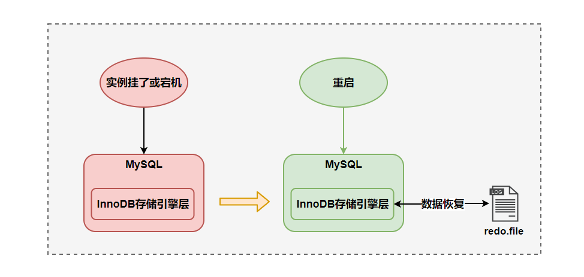
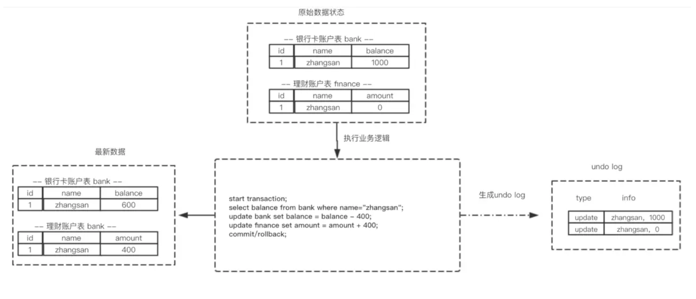
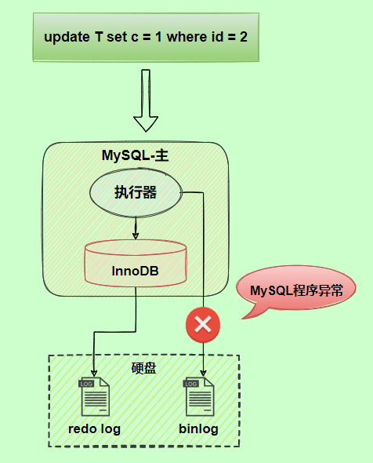
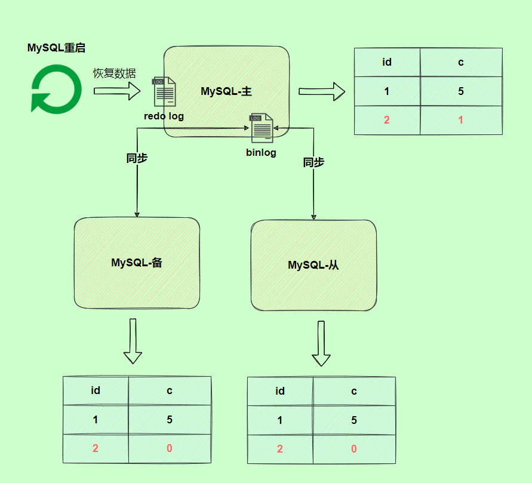

# Redo Log和Undo Log到底是什么

## 一. 前言

`MySQL` 日志 主要包括错误日志、查询日志、慢查询日志、事务日志、二进制日志几大类。其中，比较重要的还要属二进制日志 `binlog`（归档日志）和事务日志 `redo log`（重做日志）和 `undo log`（回滚日志）。

事务(Transaction)实现着重于实现事务的ACID属性，即:

- 原子性(Atomic)
- 一致性(Consistency)
- 隔离性(Isolation)
- 持久性(Duration)

事务的隔离性由锁机制和MVCC实现，原子性（Atomic）由Undo Log实现，持久性由Redo Log实现，一致性由Undo Log和Redo Log共同实现(即：数据库总是从一个一致状态转移到另一个一致状态)。


## 二. Redo Log

`redo log`（重做日志）是`InnoDB`存储引擎独有的，它让`MySQL`拥有了崩溃恢复能力。

比如 `MySQL` 实例挂了或宕机了，重启时，`InnoDB`存储引擎会使用`redo log`恢复数据，保证数据的持久性与完整性。



### 2.1 解决问题

InnoDB 存储引擎的存储数据存放在磁盘中，同时提供内存缓存(Buffer Pool)包含磁盘中部分数据页的映射，作为数据库访问的缓冲。Buffer Pool中修改的脏页数据会定期刷新到磁盘中。

**如果MySQL宕机，而Buffer Pool的数据没有完全刷新到磁盘，就会导致数据丢失，无法保证持久性。** 因此引入Redo Log解决这个问题。

- 当数据修改时，首先写入Redo Log，再更新到Buffer Pool，保证数据不会因为宕机而丢失，保证持久性。
- 当事务提交时会调用fsync将redo log刷至磁盘持久化。MySQL宕机时，通过读取Redo Log中的数据，对数据库进行恢复。

**Redo Log也是记录在磁盘中，为什么会比直接将Buffer Pool写入磁盘更快**？

- Buffer Pool刷入脏页至磁盘是随机IO，每次修改的数据位置随机，而Redo Log永远在页中追加，属于顺序IO。
- Buffer Pool刷入磁盘是以数据页为单位，每次都需要整页写入。而Redo Log只需要写入真正**物理修改**的部分，IO数据量大大减少。

### 2.2 Redo Log实现

redo log由两部分组成：

- 内存中的重做日志缓冲(redo log buffer)
- 重做日志文件(redo log file)

InnoDB通过`Force Log at Commit`机制保证持久性：当事务提交(COMMIT)时，必须先将该事务的所有日志缓冲写入到重做日志文件进行持久化，才能COMMIT成功。

为了确保每次日志都写入重做日志文件，在每次将重做日志缓冲写入重做日志文件后，InnoDB存储引擎都需要调用一次fsync操作。因此，磁盘的性能决定了事务提交的性能，也就是数据库的性能。

`innodb_flush_log_at_trx_commit`参数控制重做日志刷新到磁盘的策略：

- 0：事务提交时不进行写入重做日志操作，仅在master thread每秒进行一次。
- 1：事务提交时必须调用一次`fsync`操作。
- 2：仅写入文件系统缓存，不进行`fsync`操作。

log buffer根据如下规则写入到磁盘重做日志文件中：

- 事务提交时
- 当log buffer中有一半的内存空间已经被使用
- log checkpoint时

#### log block

重做日志以512字节进行存储，重做日志缓存、重做日志文件都是以块(block)的方式进行保存的，称为重做日志块(redo log block)。

重做日志块由：日志快头(log block header)、日志、日志快尾(log block tailer)三部分组成。


`log block header`占用12个字节，`log block tailer`占用8个字节，因此重做日志在每个重做日志块中占用512 - 12 - 8 = 492个字节。

#### redo log file 重做日志文件

重做日志文件存储在log buffer中保存的log block，因此其也是根据块的方式进行物理存储，每个块的大小同样为512字节。

写入log block时在redo log file最后进行追加，当一个redo log file被写满时，会接着写入下一个redo log file。

InnoDB存储引擎的存储管理基于页，因此重做日志格式也是基于页的，对于不同的操作类型，InnoDB有不同的重做日志格式，InnoDB 1.2版本时，总共有51种重做日志类型。


虽然重做日志格式不同，但是有同样的通用头部格式：

- redo_log_type : 重做日志类型
- space : 表空间ID
- page_no : 页偏移量

#### log group

log group是重做日志组，其中有多个重做日志文件，是一个逻辑上的概念。在InnoDB中只有一个log group。

### 2.3 通过Redo Log恢复

InnoDB存储引擎在启动时不管上次数据库是否正常关闭，都会尝试进行恢复操作。

重做日志记录的是页的物理修改，因此其恢复速度比二进制日志快很多。

```sql
如对table：

CREATE TABLE t ( a INT, b INT, PRIMARY KEY(a), KEY(b) );

执行SQL语句：

INSERT INTO t SELECT 1,2；

其记录的重做日志大致为：

page(2,3), offset 32, value 1,2 # 聚集索引
page(2,4), offset 54, value 2 # 辅助索引
```

#### Log Sequence Number LSN

LSN日志序列号占用8字节，记录重做日志当前总字节量，是单调递增的。

LSN不仅记录在重做日志中，还**存在于每个页中**，在每个页的头部，值`FIL_PAGE_LSN`记录该页的LSN。表示**页最后刷新时LSN的大小**。

数据库启动时，页中的LSN用来判断页是否需要进行恢复操作：

- 重做日志LSN > 页中LSN，需要进行恢复操作。
- 重做日志LSN < 页中LSN，不许进行恢复操作。

SHOW ENGINE INNODB STATUS可以查看当前数据库LSN情况。

## 三. Undo Log

Undo Log(回滚日志)用来实现事务的原子性(回滚)和隔离性(MVCC)。

Undo Log和Redo Log正好相反，记录的是数据**被修改前**的信息，并且只记录**逻辑**变化，基于Undo Log进行的回滚只是对数据库进行一个相反的操作，而不是直接恢复物理页。



- 针对每个DELETE操作，生成Insert Log插入Undo Log。
- 针对每个UPDATE操作，生成相反的Update Log插入Undo Log。

### 3.1 Undo Log生成举例

Undo Log中基于回滚指针(DB_ROLL_PT)维护数据行的所有历史版本。

1. 初始数据行


2. 事务Transaction1更新数据

此时Undo Log记录旧版本的数据值，且由于是第一个版本，`DB_TRX_ID`和`DB_ROLL_PT`为NULL。

```txt
用排他锁锁定该行。
记录redo log。
把该行修改前的值Copy到undo log。
修改当前行的值，填写事务编号，使回滚指针指向undo log中的修改前的行。
```


3. 事务Transaction2更新数据


### 3.2 Undo Log实现

#### 3.2.1 Undo Log格式

InnoDB中，undo log分为：

- Insert Undo Log
- Update Undo Log

#### 3.2.2 Insert Undo Log

Insert Undo Log是INSERT操作产生的undo log。

INSERT操作的记录由于是该数据的第一个记录，对其他事务不可见，该Undo Log可以在事务提交后直接删除。


- type_cmpl：undo的类型
- undo_no：事务的ID
- table_id：undo log对应的表对象 接着的部分记录了所有主键的列和值。

#### 3.2.3 Update Undo Log

Update Undo Log记录对DELETE和UPDATE操作产生的Undo Log。

Update Undo Log会提供MVCC机制，因此不能在事务提交时就删除，而是放入undo log链表，等待purge线程进行最后的删除。


update_vector表示update操作导致发生改变的列，每个修改的列信息都要记录。对于不同的undo log类型，可能还需要记录对索引列所做的修改。

#### 3.2.4 Undo Log存储管理

InnoDB基于Rollback Segment管理Undo Log，每个Rollback Segment记录1024个Undo Segment，Rollback Segment默认存储在共享表空间中。

```txt
Rollback Segment管理参数：
- innod\_undo\_directory：设置Rollback Segment文件所在的路径，默认在共享表空间内。
- innodb\_undo\_logs：设置Rollback Segment的个数，默认为128，即innoDB默认支持同事在线的事务限制为128 * 1024。
- innodb\_undo\_tablespaces：构成Rollback Segment的文件数量。
```

当事务没有提交时，InnoDB必须保留该事务对应的Undo Log。但是当事务提交时，依然不能删除Undo Log，因为要支持MVCC，可能有其他处于Repeatable Read隔离级别下的事务，正在读取对应版本的数据。

事务提交时，虽然不会立即删除Undo Log，但是会将对应的Undo Log放入一个删除列表中，未来通过purge线程来进行判断并删除。

## 四. Bin Log

`redo log` 它是物理日志，记录内容是“在某个数据页上做了什么修改”，属于 `InnoDB` 存储引擎。

而 `binlog` 是逻辑日志，记录内容是语句的原始逻辑，类似于“给 ID=2 这一行的 c 字段加 1”，属于`MySQL Server` 层。

不管用什么存储引擎，只要发生了表数据更新，都会产生 `binlog` 日志。

那 `binlog` 到底是用来干嘛的？

可以说`MySQL`数据库的**数据备份、主备、主主、主从**都离不开`binlog`，需要依靠`binlog`来同步数据，保证数据一致性。


`binlog`会记录所有涉及更新数据的逻辑操作，并且是顺序写。

### 4.1 记录格式

`binlog` 日志有三种格式，可以通过`binlog_format`参数指定。

- **statement**
- **row**
- **mixed**

指定`statement`，记录的内容是`SQL`语句原文，比如执行一条`update T set update_time=now() where id=1`，记录的内容如下。


同步数据时，会执行记录的`SQL`语句，但是有个问题，`update_time=now()`这里会获取当前系统时间，直接执行会导致与原库的数据不一致。

为了解决这种问题，我们需要指定为`row`，记录的内容不再是简单的`SQL`语句了，还包含操作的具体数据，记录内容如下。


`row`格式记录的内容看不到详细信息，要通过`mysqlbinlog`工具解析出来。

`update_time=now()`变成了具体的时间`update_time=1627112756247`，条件后面的@1、@2、@3 都是该行数据第 1 个~3 个字段的原始值（**假设这张表只有 3 个字段**）。

这样就能保证同步数据的一致性，通常情况下都是指定为`row`，这样可以为数据库的恢复与同步带来更好的可靠性。

但是这种格式，需要更大的容量来记录，比较占用空间，恢复与同步时会更消耗`IO`资源，影响执行速度。

所以就有了一种折中的方案，指定为`mixed`，记录的内容是前两者的混合。

`MySQL`会判断这条`SQL`语句是否可能引起数据不一致，如果是，就用`row`格式，否则就用`statement`格式。

### 4.2 写入机制

`binlog`的写入时机也非常简单，事务执行过程中，先把日志写到`binlog cache`，事务提交的时候，再把`binlog cache`写到`binlog`文件中。

因为一个事务的`binlog`不能被拆开，无论这个事务多大，也要确保一次性写入，所以系统会给每个线程分配一个块内存作为`binlog cache`。

我们可以通过`binlog_cache_size`参数控制单个线程 binlog cache 大小，如果存储内容超过了这个参数，就要暂存到磁盘（`Swap`）。

`binlog`日志刷盘流程如下


- **上图的 write，是指把日志写入到文件系统的 page cache，并没有把数据持久化到磁盘，所以速度比较快**
- **上图的 fsync，才是将数据持久化到磁盘的操作**

`write`和`fsync`的时机，可以由参数`sync_binlog`控制，默认是`0`。

为`0`的时候，表示每次提交事务都只`write`，由系统自行判断什么时候执行`fsync`。


虽然性能得到提升，但是机器宕机，`page cache`里面的 binlog 会丢失。

为了安全起见，可以设置为`1`，表示每次提交事务都会执行`fsync`，就如同 **redo log 日志刷盘流程** 一样。

最后还有一种折中方式，可以设置为`N(N>1)`，表示每次提交事务都`write`，但累积`N`个事务后才`fsync`。


在出现`IO`瓶颈的场景里，将`sync_binlog`设置成一个比较大的值，可以提升性能。

同样的，如果机器宕机，会丢失最近`N`个事务的`binlog`日志。

### 4.3 两阶段提交

`redo log`（重做日志）让`InnoDB`存储引擎拥有了崩溃恢复能力。

`binlog`（归档日志）保证了`MySQL`集群架构的数据一致性。

虽然它们都属于持久化的保证，但是侧重点不同。

在执行更新语句过程，会记录`redo log`与`binlog`两块日志，以基本的事务为单位，`redo log`在事务执行过程中可以不断写入，而`binlog`只有在提交事务时才写入，所以`redo log`与`binlog`的写入时机不一样。


回到正题，`redo log`与`binlog`两份日志之间的逻辑不一致，会出现什么问题？

我们以`update`语句为例，假设`id=2`的记录，字段`c`值是`0`，把字段`c`值更新成`1`，`SQL`语句为`update T set c=1 where id=2`。

假设执行过程中写完`redo log`日志后，`binlog`日志写期间发生了异常，会出现什么情况呢？



由于`binlog`没写完就异常，这时候`binlog`里面没有对应的修改记录。因此，之后用`binlog`日志恢复数据时，就会少这一次更新，恢复出来的这一行`c`值是`0`，而原库因为`redo log`日志恢复，这一行`c`值是`1`，最终数据不一致。



为了解决两份日志之间的逻辑一致问题，`InnoDB`存储引擎使用**两阶段提交**方案。

原理很简单，将`redo log`的写入拆成了两个步骤`prepare`和`commit`，这就是**两阶段提交**。


使用**两阶段提交**后，写入`binlog`时发生异常也不会有影响，因为`MySQL`根据`redo log`日志恢复数据时，发现`redo log`还处于`prepare`阶段，并且没有对应`binlog`日志，就会回滚该事务。


再看一个场景，`redo log`设置`commit`阶段发生异常，那会不会回滚事务呢？


并不会回滚事务，它会执行上图框住的逻辑，虽然`redo log`是处于`prepare`阶段，但是能通过事务`id`找到对应的`binlog`日志，所以`MySQL`认为是完整的，就会提交事务恢复数据。

> 本文参考至：
>
> - [MySQL事务实现及Redo Log和Undo Log详解 — 东平的笔记仓库 (cheng-dp.github.io)](https://cheng-dp.github.io/2019/05/09/mysql-tx-redo-undo/#undo-log)
> - [JavaGuide/mysql-logs.md at main · Snailclimb/JavaGuide (github.com)](https://github.com/Snailclimb/JavaGuide/blob/main/docs/database/mysql/mysql-logs.md)
