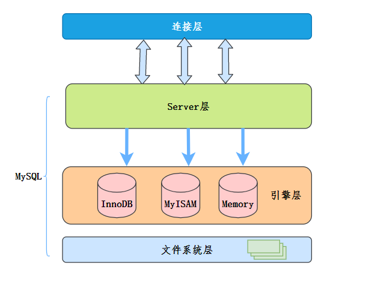
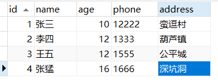
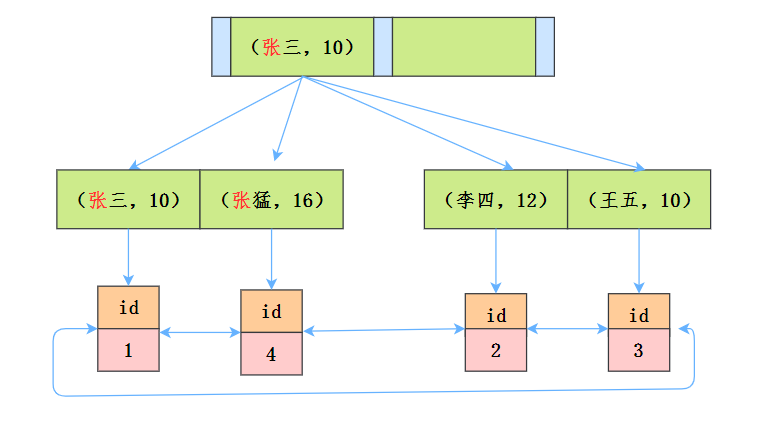
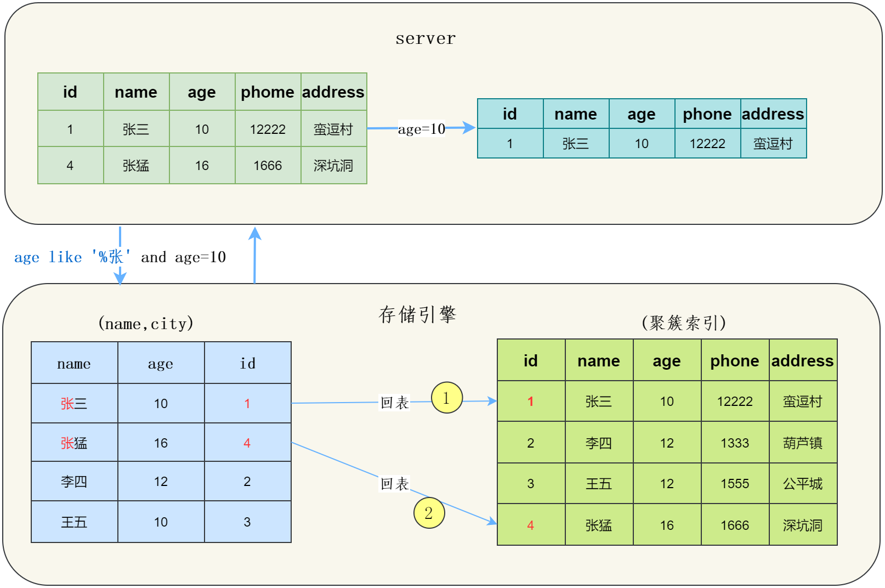
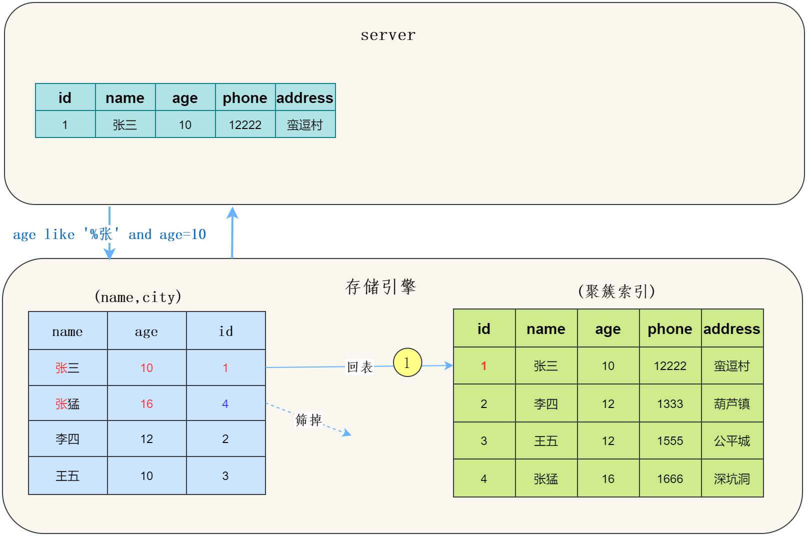

# 索引下推

索引下推(Index Condition Pushdown，简称ICP)，是MySQL5.6版本的新特性，它能减少回表查询次数，提高查询效率。

## 一. 索引下推原理

我们先简单了解一下MySQL大概的架构：



MySQL服务层负责SQL语法解析、生成执行计划等，并调用存储引擎层去执行数据的存储和检索。

`索引下推`的**下推**其实就是指将部分上层（服务层）负责的事情，交给了下层（引擎层）去处理。

我们来具体看一下，在没有使用ICP的情况下，MySQL的查询：

- 存储引擎读取索引记录；
- 根据索引中的主键值，定位并读取完整的行记录；
- 存储引擎把记录交给`Server`层去检测该记录是否满足`WHERE`条件。

使用ICP的情况下，查询过程：

- 存储引擎读取索引记录（不是完整的行记录）；
- 判断`WHERE`条件部分能否用索引中的列来做检查，条件不满足，则处理下一行索引记录；
- 条件满足，使用索引中的主键去定位并读取完整的行记录（就是所谓的回表）；
- 存储引擎把记录交给`Server`层，`Server`层检测该记录是否满足`WHERE`条件的其余部分。

## 二. 索引下推的具体实践

理论比较抽象，我们来上一个实践。

使用一张用户表`tuser`，表里创建联合索引（name, age）。



如果现在有一个需求：检索出表中`名字第一个字是张，而且年龄是10岁的所有用户`。那么，SQL语句是这么写的：

```sql
select * from tuser where name like '张%' and age=10;
```

假如你了解索引最左匹配原则，那么就知道这个语句在搜索索引树的时候，只能用 `张`，找到的第一个满足条件的记录id为1。



那接下来的步骤是什么呢？

### 2.1 没有使用ICP

在MySQL 5.6之前，存储引擎根据通过联合索引找到`name like '张%'` 的主键id（1、4），逐一进行回表扫描，去聚簇索引找到完整的行记录，server层再对数据根据`age=10进行筛选`。

我们看一下示意图：



可以看到需要回表两次，把我们联合索引的另一个字段`age`浪费了。

### 2.2 使用ICP

而MySQL 5.6 以后， 存储引擎根据（name，age）联合索引，找到`name like '张%'`，由于联合索引中包含`age`列，所以存储引擎直接再联合索引里按照`age=10`过滤。按照过滤后的数据再一一进行回表扫描。

我们看一下示意图：




可以看到只回表了一次。

除此之外我们还可以看一下执行计划，看到`Extra`一列里`Using index condition`，这就是用到了索引下推。

```txt
+----+-------------+-------+------------+-------+---------------+----------+---------+------+------+----------+-----------------------+
| id | select_type | table | partitions | type  | possible_keys | key      | key_len | ref  | rows | filtered | Extra                 |
+----+-------------+-------+------------+-------+---------------+----------+---------+------+------+----------+-----------------------+
|  1 | SIMPLE      | tuser | NULL       | range | na_index      | na_index | 102     | NULL |    2 |    25.00 | Using index condition |
+----+-------------+-------+------------+-------+---------------+----------+---------+------+------+----------+-----------------------+
```

## 三. 索引下推使用条件

- 只能用于`range`、 `ref`、 `eq_ref`、`ref_or_null`访问方法；
- 只能用于`InnoDB`和 `MyISAM`存储引擎及其分区表；
- 对`InnoDB`存储引擎来说，索引下推只适用于二级索引（也叫辅助索引）;

> 索引下推的目的是为了减少回表次数，也就是要减少IO操作。对于`InnoDB`的**聚簇索引**来说，数据和索引是在一起的，不存在回表这一说。

- 引用了子查询的条件不能下推；
- 引用了存储函数的条件不能下推，因为存储引擎无法调用存储函数。

## 四. 相关系统参数

索引条件下推默认是开启的，可以使用系统参数`optimizer_switch`来控制器是否开启。

查看默认状态：

```shell
mysql> select @@optimizer_switch\G;
*************************** 1. row ***************************
@@optimizer_switch: index_merge=on,index_merge_union=on,index_merge_sort_union=on,index_merge_intersection=on,engine_condition_pushdown=on,index_condition_pushdown=on,mrr=on,mrr_cost_based=on,block_nested_loop=on,batched_key_access=off,materialization=on,semijoin=on,loosescan=on,firstmatch=on,duplicateweedout=on,subquery_materialization_cost_based=on,use_index_extensions=on,condition_fanout_filter=on,derived_merge=on
1 row in set (0.00 sec)

```

切换状态：

```shell
set optimizer_switch="index_condition_pushdown=off";
set optimizer_switch="index_condition_pushdown=on";
```


> 本文转载至：[五分钟搞懂MySQL索引下推 - 三分恶 - 博客园 (cnblogs.com)](https://www.cnblogs.com/three-fighter/p/15246577.html)