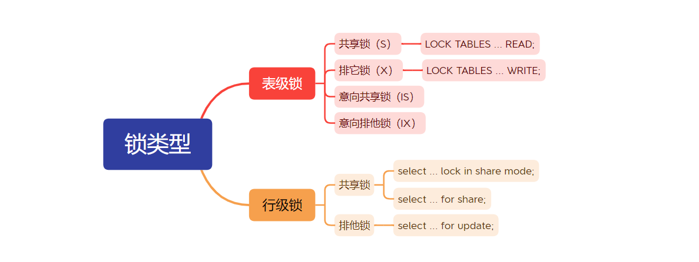

# InnoDB锁类型

MySQL 是支持ACID特性的数据库。我们都知道“C”代表Consistent，当不同事务操作同一行记录时，为了保证一致性，需要对记录加锁。在 MySQL 中，不同的引擎下的锁行为也会不同，本文将重点介绍 MySQL InnoDB 引擎中常见的锁。

## 一. 准备

```sql
CREATE TABLE `user` (
  `id` bigint(20) NOT NULL AUTO_INCREMENT,
  `name` varchar(32) DEFAULT NULL,
  `age` tinyint(4) DEFAULT '0',
  `phone` varchar(11) DEFAULT NULL,
  PRIMARY KEY (`id`),
  KEY `idx_age` (`age`)
) ENGINE=InnoDB AUTO_INCREMENT=6 DEFAULT CHARSET=utf8mb4;

#插入基础数据
INSERT INTO `user` (`id`, `name`, `age`, `phone`)
VALUES
	(1, '张三', 18, '13800138000'),
	(2, '李四', 20, '13800138001'),
	(3, '王五', 22, '13800138002'),
	(4, '赵六', 26, '13800138003'),
	(5, '孙七', 30, '13800138004');
```

为了方便讲解，创建一张user表，设置age的字段为普通索引，并填充以下数据。本文所有的sql语句均基于这张表。

| id   | name | age  | phone       |
| ---- | ---- | ---- | ----------- |
| 1    | 张三 | 18   | 13800138000 |
| 2    | 李四 | 20   | 13800138001 |
| 3    | 王五 | 22   | 13800138002 |
| 4    | 赵六 | 26   | 13800138003 |
| 5    | 孙七 | 30   | 13800138004 |

## 二. 锁的分类



### 2.1 行级锁和表级锁(Row-level and Table-level Locks)

按照锁的粒度划分，可分为行级锁和表级锁。表级锁作用于数据库表，不同的事务对同一个表加锁，根据实际情况，后加锁的事务可能会发生block，直到表锁被释放。表级锁的优点是资源占用低，可防止死锁等。缺点是锁的粒度太高，不利于高并发的场景。

行级锁行级锁作用于数据库行，它允许多个事务同时访问同一个数据库表。当多个事务操作同一行记录时，没获得锁的事务必须等持有锁的事务释放才能操作行数据。行级锁的优点能支持较高的并发。缺点是资源占用较高，且会出现死锁。

### 2.2 共享锁排它锁(Shared and Exclusive Locks)

InnoDB引擎的锁分为两类，分别是共享锁和排他锁。这些概念在很多领域都出现过，比如Java中的`ReadWriteLock`。

- 共享锁(shared lock) 允许多个事务同时持有同一个资源的锁，但是不允许常用`S`表示。

  ```sql
  #mysql 8.0之前的版本通过 lock in share mode给数据行添加share lock
  select * from user where id = 1 lock in share mode;
    
  #mysql 8.0以后的版本通过for share给数据行添加share lock
  select * from user where id = 1 for share
  ```

  > **需要注意的是，MySQL默认并不会给select语句加共享锁**，而是采用MVCC

- 排他锁(exclusive lock)只允许一个事务持有某个资源的锁，常用`X`表示。

  ```sql
  # 通过for update可以给数据行加exclusive lock
  select * from user where id = 1 for update;
    
  # 通过update或delete同样也可以
  update user set age = 16 where id = 1;
  ```

  > update语句默认会加排他行锁

举个例子，假如事务T1持有了某一行(r)的共享锁(S)。当事务T2也想获得该行的锁，分为如下两种情况:

- 如果T2申请的是行r的共享锁(S)，会被立即允许，此时T1和T2同时持有行r的共享锁。
- 如果T2申请的是排他锁(X)，那么必须等T1释放才能成功获取。

反过来说，假如T1持有行`R`的排他锁，那不管T2申请的是共享锁还是排他锁，都必须等待T1释放才能成功。

总的来说，MySQL中的锁有很多种，不过我们需要重点关注的就上面两点，即锁的作用域和锁的类型。如上所述，**锁可以作用于行，也能作用于表，但不管他们的作用域是什么，锁的类型只有两种，即“共享”和“排他”**。

不管是行级还是表级锁，都遵循下列互斥关系：

|             | 排他锁（X） | 共享锁（S） |
| :---------- | :---------- | :---------- |
| 排他锁（X） | 互斥        | 互斥        |
| 共享锁（S） | 互斥        | 兼容        |

## 二. 意向锁（Intention Locks）

### 2.1 意向锁分类

`InnoDB` 支持多粒度锁，允许行锁和表锁并存。例如， `LOCK TABLES ... WRITE` 之类的语句在指定的表上获取排它锁（`X` 锁）。为了使多粒度级别的锁定变得可行，`InnoDB` 使用了意向锁。

意向锁是一种特殊的**表级锁**，指示事务稍后对表中的行需要哪种类型的锁（共享或独占）。意向锁有两种类型：

- 意向共享锁（intention share lock）：简称 `IS`。**事务在给一个数据行加共享锁（S）前必须先取得该表的IS锁**，用于标记当前表有行级共享锁存在，也就是有事务准备读取数据。
- 意向排他锁（intention exclusive lock）：简称 `IX`**。事务在给一个数据行加排他锁（X）前必须先取得该表的IX锁**，用于标记当前表有行级排他锁的存在，有事务准备写入数据。

需要注意的是，意向锁不会阻塞除全表请求（例如 `LOCK TABLES ... WRITE` ）之外的任何内容。意向锁的主要目的是表明有人正在锁定一行，或者将要锁定表中的一行。IS 和 IX两者之间并不互斥：

|                  | 意向排他锁（IX） | 意向共享锁（IS） |
| :--------------- | :--------------- | :--------------- |
| 意向排他锁（IX） | 兼容             | 兼容             |
| 意向共享锁（IS） | 兼容             | 兼容             |

也就是说，当 `IX` 被 T1事务获取，并不影响其他事务获取 `IX` 和 `IS`；同理当 `IS` 被 `T1`获取时，其他事务也能获取到 `IX` 和 `IS`。

只有当一个事务需要获得表级X或S锁时：

```sql
# 给user表加表级 S 锁
lock tables user read;
# 给user表加表级 X 锁
lock tables user write;
```

才会去判断当前表是否有人占用 `IX` 和 `IS` 锁，具体有两种情况：

1. 尝试获取表级S锁时，如果 IX 被占用，这表明当前表有行级X锁存在，会有事务写入新数据，则获取表级S锁事务被阻塞；如果 IX 未被占用，这表明现在没有行级X锁存在，没有事务写入新数据，则成功获取表级S锁，。
2. 尝试获取表级X锁时，如果 IX 或 IS 被占用，这表明当前表有事务准备写入或读取某行数据，则获取表级X锁事务被阻塞。

表级锁和意向锁的互斥关系如下表：

|                 | 意向共享锁（IS） | 意向排他锁（IX） |
| --------------- | ---------------- | ---------------- |
| **共享锁（S）** | 兼容             | 互斥             |
| **排他锁（X）** | 互斥             | 互斥             |

### 2.2 意向锁存在的意义

有人可能会有疑问，MySQL为什么需要设计意向锁呢？

那我们就需要来看看没有意向锁，MySQL该如何处理表级锁和行级锁共存。

假如事务 A 获取了某一行的排他锁，并未提交：

```sql
SELECT * FROM `user` WHERE id = 61 FOR UPDATE;
```

事务 B 想要获取 `users` 表的表锁：

```sql
LOCK TABLES `user` READ;
```

因为共享锁与排他锁`互斥`，所以事务 B 在试图对 `user` 表加共享锁的时候，必须保证：

- 当前没有其他事务持有 user 表的表级排他锁。
- 当前没有其他事务持有 user 表中任意一行的行级排他锁。

为了检测是否满足第二个条件，事务 B 必须在确保 `user` 表不存在任何排他锁的前提下，去检测表中的每一行是否存在排他锁。很明显这是一个效率很差的做法，但是有了**意向锁**之后，情况就不一样了：

因为行级锁加锁前，都会先获取意向锁，所以如果当前意向锁没有被占用，就代表当前表没有行锁占用，就不需要扫描整张表是否存在行级锁占用，大大提高了表级锁加锁效率。

## 三. 行锁算法

## 

InnoDB引擎是MySQL非常重要的一部分，MySQL团队为它开发了很多种类型的锁，下面将逐一介绍。

### 3.1 记录锁（Record Locks）


### 3.2 间隙锁（Gap Locks）


### 3.3 Next-Key Locks


### 3.4 Insert Intention Locks


### 


> 参考文章：
>
> [MySQL :: MySQL 5.7 Reference Manual :: 14.7.1 InnoDB Locking](https://dev.mysql.com/doc/refman/5.7/en/innodb-locking.html)
>
> [MySQL详解－－锁.md (xuzhongcn.github.io)](https://xuzhongcn.github.io/mysql/03/mysql.html)
>
> [理解Mysql InnoDB引擎中的锁 | Bigbyto (wiyi.org)](https://wiyi.org/mysql-innodb-locking.html)
>
> [Innodb间隙锁实战 - 掘金 (juejin.cn)](https://juejin.cn/post/6999550724338090014)