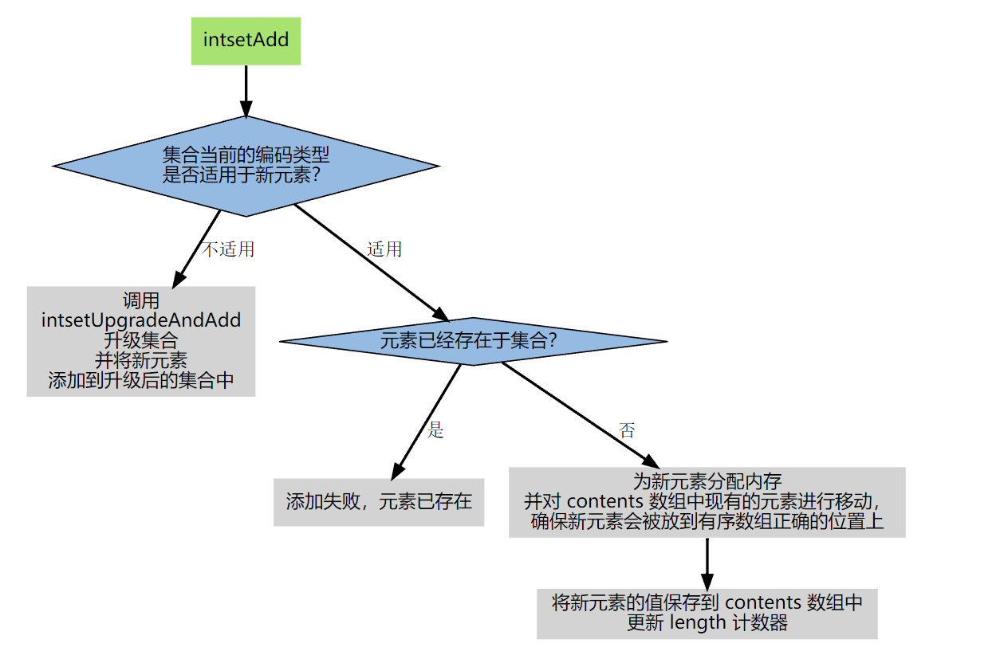
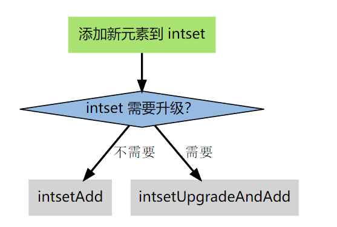

# 整数集合

> 本文转载至：[整数集合 — Redis 设计与实现 (redisbook.readthedocs.io)](https://redisbook.readthedocs.io/en/latest/compress-datastruct/intset.html)

整数集合（intset）**用于有序、无重复地保存多个整数值**， 根据元素的值， 自动选择该用什么长度的整数类型来保存元素。

举个例子， 如果在一个 intset 里面， 最长的元素可以用 `int16_t` 类型来保存， 那么这个 intset 的所有元素都以 `int16_t` 类型来保存。

另一方面， 如果有一个新元素要加入到这个 intset ， 并且这个元素不能用 `int16_t` 类型来保存 —— 比如说， 新元素的长度为 `int32_t` ， 那么这个 intset 就会自动进行“升级”： 先将集合中现有的所有元素从 `int16_t` 类型转换为 `int32_t` 类型， 接着再将新元素加入到集合中。

根据需要， intset 可以自动从 `int16_t` 升级到 `int32_t` 或 `int64_t` ， 或者从 `int32_t` 升级到 `int64_t` 。

## 一. 整数集合的应用

Intset 是集合键的底层实现之一，如果一个集合：

1. 只保存着整数元素；
2. 元素的数量不多；

那么 Redis 就会使用 intset 来保存集合元素。

具体的信息请参考《[集合](https://redisbook.readthedocs.io/en/latest/datatype/set.html#set-chapter)》。

## 二. 数据结构和主要操作

以下是 `intset.h/intset` 类型的定义：

```c
typedef struct intset {

    // 保存元素所使用的类型的长度
    uint32_t encoding;

    // 元素个数
    uint32_t length;

    // 保存元素的数组
    int8_t contents[];

} intset;
```

`encoding` 的值可以是以下三个常量之一（定义位于 `intset.c` ）：

```c
#define INTSET_ENC_INT16 (sizeof(int16_t))
#define INTSET_ENC_INT32 (sizeof(int32_t))
#define INTSET_ENC_INT64 (sizeof(int64_t))
```

`contents` 数组是实际保存元素的地方，数组中的元素有以下两个特性：

- 元素不重复；
- 元素在数组中由小到大排列；

`contents` 数组的 `int8_t` 类型声明比较容易让人误解，实际上， `intset` 并不使用 `int8_t` 类型来保存任何元素，结构中的这个类型声明只是作为一个占位符使用：在对 `contents` 中的元素进行读取或者写入时，程序并不是直接使用 `contents` 来对元素进行索引，而是根据 `encoding` 的值，对 `contents` 进行类型转换和指针运算，计算出元素在内存中的正确位置。在添加新元素，进行内存分配时，分配的空间也是由 `encoding` 的值决定。

下表列出了处理 `intset` 的一些主要操作，以及这些操作的算法复杂度：

| 操作                 | 函数                  | 复杂度       |
| :------------------- | :-------------------- | :----------- |
| 创建 intset          | `intsetNew`           | θ(1)θ(1)     |
| 删除 intset          | 无                    | 无           |
| 添加新元素（不升级） | `intsetAdd`           | O(N)O(N)     |
| 添加新元素（升级）   | `intsetUpgradeAndAdd` | O(N)O(N)     |
| 按索引获取元素       | `_intsetGet`          | θ(1)θ(1)     |
| 按索引设置元素       | `_intsetSet`          | θ(1)θ(1)     |
| 查找元素，返回索引   | `intsetSearch`        | O(lgN)O(lg⁡N) |
| 删除元素             | `intsetRemove`        | O(N)         |

## 三. intset 运行实例

让我们跟踪一个 `intset` 的创建和添加过程，借此了解 `intset` 的运作方式。

### 3.1 创建新 intset

`intset.c/intsetNew` 函数创建一个新的 `intset` ，并设置初始化值：

```c
intset *is = intsetNew();

// intset->encoding = INTSET_ENC_INT16;
// intset->length 0;
// intset->contents = [];
```

注意 `encoding` 使用 `INTSET_ENC_INT16` 作为初始值。

### 3.2 添加新元素到 intset

创建 `intset` 之后，就可以对它添加新元素了。

添加新元素到 `intset` 的工作由 `intset.c/intsetAdd` 函数完成，需要处理以下三种情况：

1. 元素已存在于集合，不做动作；
2. 元素不存在于集合，并且添加新元素并不需要升级；
3. 元素不存在于集合，但是要在升级之后，才能添加新元素；

并且， `intsetAdd` 需要维持 `intset->contents` 的以下性质：

1. 确保数组中没有重复元素；
2. 确保数组中的元素按由小到大排序；

整个 `intsetAdd` 的执行流程可以表示为下图：



以下两个小节分别演示添加操作在升级和不升级两种情况下的执行过程。

### 3.3 添加新元素到 intset （不需要升级）

如果 intset 现有的编码方式适用于新元素， 则可直接将新元素添加到 intset ， 无须对 intset 进行升级。

以下代码演示了将三个 `int16_t` 类型的整数添加到集合的过程， 以及在添加过程中，集合的状态：

```c
intset *is = intsetNew();

intsetAdd(is, 10, NULL);

// is->encoding = INTSET_ENC_INT16;
// is->length = 1;
// is->contents = [10];

intsetAdd(is, 5, NULL);

// is->encoding = INTSET_ENC_INT16;
// is->length = 2;
// is->contents = [5, 10];

intsetAdd(is, 12, NULL);

// is->encoding = INTSET_ENC_INT16;
// is->length = 3;
// is->contents = [5, 10, 12]
```

因为添加的三个元素都可以表示为 `int16_t` ， 因此 `is->encoding` 一直都是 `INTSET_ENC_INT16` 。

另一方面， `is->length` 和 `is->contents` 的值，则随着新元素的加入而被修改。

### 3.4 添加新元素到 intset （需要升级）

当要添加新元素到 intset ，并且 intset 当前的编码，不适用于新元素的编码时，就需要对 intset 进行升级。

以下代码演示了带升级的添加操作的执行过程：

```c
intset *is = intsetNew();

intsetAdd(is, 1, NULL);

// is->encoding = INTSET_ENC_INT16;
// is->length = 1;
// is->contents = [1];                  // 所有值使用 int16_t 保存

intsetAdd(is, 65535, NULL);

// is->encoding = INTSET_ENC_INT32;     // 升级
// is->length = 2;
// is->contents = [1, 65535];           // 所有值使用 int32_t 保存

intsetAdd(is, 70000, NULL);

// is->encoding = INTSET_ENC_INT32;
// is->length = 3;
// is->contents = [1, 65535, 70000];

intsetAdd(is, 4294967295, NULL);

// is->encoding = INTSET_ENC_INT64;                 // 升级
// is->length = 4;
// is->contents = [1, 65535, 70000, 4294967295];    // 所有值使用 int64_t 保存
```

在添加 `65535` 和 `4294967295` 之后， `encoding` 属性的值，以及 `contents` 数组保存值的方式，都被改变了。

## 四. 升级

添加新元素时，如果 `intsetAdd` 发现新元素，不能用现有的编码方式来保存，便会将升级集合和添加新元素的任务转交给 `intsetUpgradeAndAdd` 来完成：



`intsetUpgradeAndAdd` 需要完成以下几个任务：

1. 对新元素进行检测，看保存这个新元素需要什么类型的编码；
2. 将集合 `encoding` 属性的值设置为新编码类型，并根据新编码类型，对整个 `contents` 数组进行内存重分配。
3. 调整 `contents` 数组内原有元素在内存中的排列方式，从旧编码调整为新编码。
4. 将新元素添加到集合中。

整个过程中，最复杂的就是第三步，让我们用一个例子来理解这个步骤。

### 升级实例

假设有一个 `intset` ，里面有三个用 `int16_t` 方式保存的数值，分别是 `1` 、 `2` 和 `3` ，结构如下：

```c
intset->encoding = INTSET_ENC_INT16;
intset->length = 3;
intset->contents = [1, 2, 3];
```

其中， `intset->contents` 在内存中的排列如下：

```
bit     0    15    31    47
value   |  1  |  2  |  3  |
```

现在，我们将一个长度为 `int32_t` 的值 `65535` 加入到集合中， `intset` 需要执行以下步骤：

1. 将 `encoding` 属性设置为 `INTSET_ENC_INT32` 。

2. 根据 `encoding` 属性的值，对 `contents` 数组进行内存重分配。

   重分配完成之后， `contents` 在内存中的排列如下：

   ```
   bit     0    15    31    47     63        95       127
   value   |  1  |  2  |  3  |  ?  |    ?    |    ?    |
   ```

   `contents` 数组现在共有可容纳 4 个 `int32_t` 值的空间。

3. 因为原来的 3 个 `int16_t` 值还“挤在” `contents` 前面的 48 个位里， 所以程序需要移动它们并转换类型， 让它们适应集合的新编码方式。

   首先是移动 `3` ：

   ```
   bit     0    15    31    47     63        95       127
   value   |  1  |  2  |  3  |  ?  |    3    |    ?    |
                          |             ^
                          |             |
                          +-------------+
                        int16_t -> int32_t
   ```

   接着移动 `2` ：

   ```
   bit     0    15    31   47     63        95       127
   value   |  1  |  2  |    2     |    3    |    ?    |
                    |       ^
                    |       |
                    +-------+
               int16_t -> int32_t
   ```

   最后，移动 `1` ：

   ```
   bit     0   15    31   47     63        95       127
   value   |    1     |    2     |    3    |    ?    |
               | ^
               V |
       int16_t -> int32_t
   ```

4. 最后，将新值 65535 添加到数组：

   ```
   bit     0   15    31   47     63        95       127
   value   |    1     |    2     |    3    |  65535  |
                                                ^
                                                |
                                               add
   ```

   将 `intset->length` 设置为 `4` 。

至此，集合的升级和添加操作完成，现在的 `intset` 结构如下：

```
intset->encoding = INTSET_ENC_INT32;
intset->length = 4;
intset->contents = [1, 2, 3, 65535];
```

## 五. 关于升级

关于升级操作，有两点需要提醒一下：

**第一，从较短整数到较长整数的转换，并不会更改元素里面的值**。

在 C 语言中，从长度较短的带符号整数到长度较长的带符号整数之间的转换（比如从 `int16_t` 转换为 `int32_t` ）总是可行的（不会溢出）、无损的。

另一方面，从较长整数到较短整数之间的转换，可能是有损的（比如从 `int32_t` 转换为 `int16_t` ）。

因为 intset 只进行从较短整数到较长整数的转换（也即是，只“升级”，不“降级”），因此，“升级”操作并不会修改元素原有的值。

**第二，集合编码元素的方式，由元素中长度最大的那个值来决定**。

就像前面演示的例子一样， 当要将一个 `int32_t` 编码的新元素添加到集合时， 集合原有的所有 `int16_t` 编码的元素， 都必须转换为 `int32_t` 。

尽管这个集合真正需要用 `int32_t` 长度来保存的元素只有一个， 但整个集合的所有元素都必须转换为这种类型。

## 六. 关于元素移动

在进行升级的过程中，需要对数组内的元素进行“类型转换”和“移动”操作。

其中， 移动不仅出现在升级（`intsetUpgradeAndAdd`）操作中， 还出现其他对 `contents` 数组内容进行增删的操作上， 比如 `intsetAdd` 和 `intsetRemove` ， 因为这种移动操作需要处理 intset 中的所有元素， 所以这些函数的复杂度都不低于 O(N)O(N) 。

## 七. 其他操作

以下是一些关于 intset 其他操作的讨论。

### 7.1 读取

有两种方式读取 `intset` 的元素，一种是 `_intsetGet` ，另一种是 `intsetSearch` ：

- `_intsetGet` 接受一个给定的索引 `pos` ，并根据 `intset->encoding` 的值进行指针运算，计算出给定索引在 `intset->contents` 数组上的值。
- `intsetSearch` 则使用[二分查找](http://en.wikipedia.org/wiki/Binary_search_algorithm)算法，判断一个给定元素在 `contents` 数组上的索引。

### 7.2 写入

除了前面介绍过的 `intsetAdd` 和 `intsetUpgradeAndAdd` 之外， `_intsetSet` 也对集合进行写入操作： 它接受一个索引 `pos` ，以及一个 `new_value` ，将 `contents` 数组 `pos` 位置的值设为 `new_value` 。

### 7.3 删除

删除单个元素的工作由 `intsetRemove` 操作， 它先调用 `intsetSearch` 找到需要被删除的元素在 `contents` 数组中的索引， 然后使用内存移位操作，将目标元素从内存中抹去， 最后，通过内存重分配，对 `contents` 数组的长度进行调整。

### 7.4 降级

Intset 不支持降级操作。

Intset 定位为一种受限的中间表示， 只能保存整数值， 而且元素的个数也不能超过 `redis.h/REDIS_SET_MAX_INTSET_ENTRIES` （目前版本值为 `512` ） 这些条件决定了它被保存的时间不会太长， 因此没有必要进行太复杂的操作，

当然，如果内存确实十分紧张的话，给 intset 添加降级功能也是可以实现的，不过这可能会让 `intset` 的代码增长一倍。

## 八. 小结

- Intset 用于有序、无重复地保存多个整数值，会根据元素的值，自动选择该用什么长度的整数类型来保存元素。
- 当一个位长度更长的整数值添加到 intset 时，需要对 intset 进行升级，新 intset 中每个元素的位长度，会等于新添加值的位长度，但原有元素的值不变。
- 升级会引起整个 intset 进行内存重分配，并移动集合中的所有元素，这个操作的复杂度为 O(N)O(N) 。
- Intset 只支持升级，不支持降级。
- Intset 是有序的，程序使用二分查找算法来实现查找操作，复杂度为 O(lgN)O(lg⁡N) 。

## 