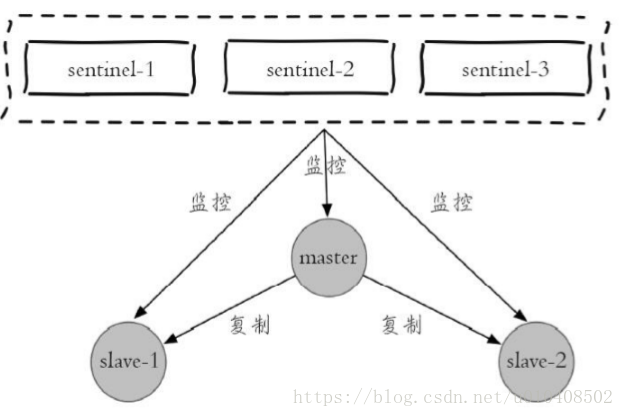
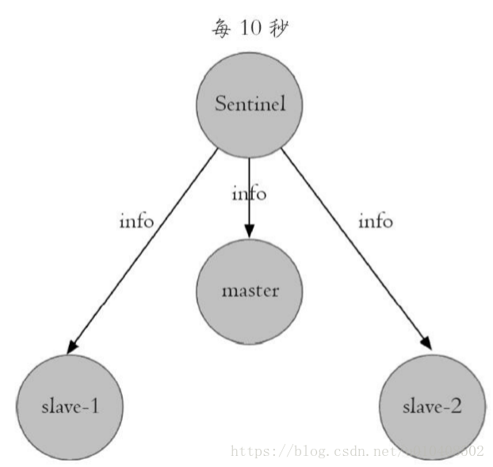
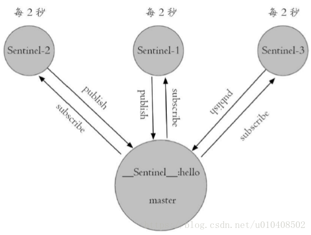
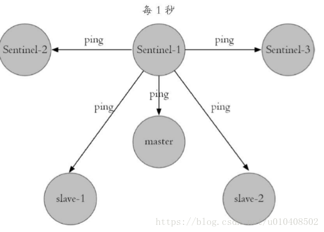
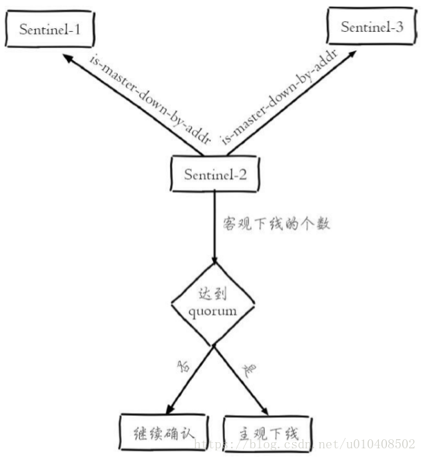
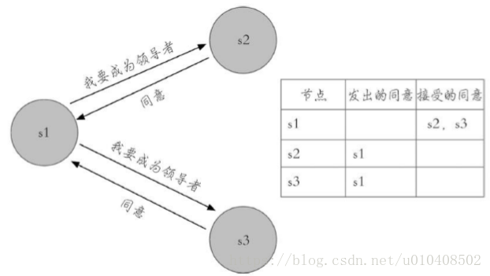

# Redis Sential

Redis的主从复制模式下，一旦主节点由于故障不能提供服务，需要人工将从节点晋升为主节点，同时还要通知应用方更新主节点地址，对于很多 应用场景这种故障处理的方式是无法接受的。Redis从2.8开始正式提供了**Redis Sentinel（哨兵）**架构来解决这个问题。

## 一. 基本概念

Redis Sentinel是Redis的高可用实现方案，在实际的生产环境中，对提高整个系统的高可用性是非常有帮助的。

### 1.1 主从复制的问题

Redis的主从复制模式可以将主节点的数据改变同步给从节点，这样从节点就可以起到两个作用：

- 第一，作为主节点的一个备份，一旦主节点出了 故障不可达的情况，从节点可以作为后备“顶”上来，并且保证数据尽量不丢失（主从复制是最终一致性）。
- 第二，从节点可以扩展主节点的读能力，一旦主节点不能支撑住大并发量的读操作，从节点可以在一定程度上帮助主节点分担读压力。

但是默认的主从复制存在以下问题：

- 一旦主节点出现故障，需要手动将一个从节点晋升为主节点，同时需要修改应用方的主节点地址，还需要命令其他从节点去复制新的主节点，整个过程都需要人工干预。
- 主节点的写能力受到单机的限制。
- 主节点的存储能力受到单机的限制。

其中第一个问题就是Redis的高可用问题， 第二、三个问题属于Redis的分布式问题。

### 1.2 高可用

其中第一个问题就是Redis的高可用问题， 第二、三个问题属于Redis的分布式问题。

Redis Sentinel是一个分布式架构，其中包含若干个Sentinel节点和 Redis 数据节点，每个Sentinel节点会对数据节点和其余Sentinel节点进行监控，当它发现节点不可达时，会对节点做下线标识。如果被标识的是主节点，它还 会和其他Sentinel节点进行“协商”，当大多数Sentinel节点都认为主节点不可 达时，它们会选举出一个Sentinel节点来完成自动故障转移的工作，同时会 将这个变化实时通知给Redis应用方。整个过程完全是自动的，不需要人工来介入，所以这套方案很有效地解决了Redis的高可用问题。

注意:这里的分布式是指：Redis数据节点、Sentinel节点集合、客户端分布在 多个物理节点的架构，不要与第10章介绍的Redis Cluster分布式混淆。

下面以1个主节点、2个从节点、3个Sentinel节点组成的Redis Sentinel为 例子进行说明，拓扑结构如下图所示。



## 二. 实现原理

### 2.1 三个定时监控任务

一套合理的监控机制是Sentinel节点判定节点不可达的重要保证，Redis Sentinel通过三个定时监控任务完成对各个节点发现和监控：

1. 一套合理的监控机制是Sentinel节点判定节点不可达的重要保证，Redis Sentinel通过三个定时监控任务完成对各个节点发现和监控：



例如下面就是在一个主节点上执行info replication的结果片段：

```txt
# Replication 
role:master 
connected_slaves:2 
slave0:ip=127.0.0.1,port=6380,state=online,offset=4917,lag=1 slave1:ip=127.0.0.1,port=6381,state=online,offset=4917,lag=1
```

Sentinel节点通过对上述结果进行解析就可以找到相应的从节点。

这个定时任务的作用具体可以表现在三个方面：

- 通过向主节点执行info命令，获取从节点的信息，这也是为什么 Sentinel节点不需要显式配置监控从节点。
- 当有新的从节点加入时都可以立刻感知出来。
- 节点不可达或者故障转移后，可以通过info命令实时更新节点拓扑信息。

2. 每隔2秒，每个Sentinel节点会向Redis数据节点的`__sentinel__：hello` 频道上发送该Sentinel节点对于主节点的判断以及当前Sentinel节点的信息 （如下图所示），同时每个Sentinel节点也会订阅该频道，来了解其他 Sentinel节点以及它们对主节点的判断，所以这个定时任务可以完成以下两个工作：

- 发现新的Sentinel节点：通过订阅主节点的`__sentinel__：hello`了解其他的Sentinel节点信息，如果是新加入的Sentinel节点，将该Sentinel节点信息保 存起来，并与该Sentinel节点创建连接。
- Sentinel节点之间交换主节点的状态，作为后面客观下线以及领导者选举的依据。



Sentinel节点publish的消息格式如下：

```txt
<Sentinel节点IP> <Sentinel节点端口> <Sentinel节点runId> <Sentinel节点配置版本> <主节点名字> <主节点Ip> <主节点端口> <主节点配置版本>
```

3. 每隔1秒，每个Sentinel节点会向主节点、从节点、其余Sentinel节点 发送一条ping命令做一次心跳检测，来确认这些节点当前是否可达。如下图所示。通过上面的定时任务，Sentinel节点对主节点、从节点、其余 Sentinel节点都建立起连接，实现了对每个节点的监控，这个定时任务是节点失败判定的重要依据。



### 2.2 主观下线和客观下线

#### 2.2.1 主观下线

上一小节介绍的第三个定时任务，每个Sentinel节点会每隔1秒对主节 点、从节点、其他Sentinel节点发送ping命令做心跳检测，当这些节点超过 `down-after-milliseconds` 没有进行有效回复，Sentinel节点就会对该节点做失败判定，这个行为叫做主观下线。从字面意思也可以很容易看出主观下线是当前Sentinel节点的一家之言，存在误判的可能，如下图所示。

#### 2.2.2 客观下线

当Sentinel主观下线的节点是主节点时，该Sentinel节点会通过`sentinel ismaster-down-by-addr`命令向其他Sentinel节点询问对主节点的判断，当超过 `<quorum>` 个数，Sentinel节点认为主节点确实有问题，这时该Sentinel节点会做出客观下线的决定，这样客观下线的含义是比较明显了，也就是大部分 Sentinel节点都对主节点的下线做了同意的判定，那么这个判定就是客观的。

> 从节点、Sentinel节点在主观下线后，没有后序的故障转义操作。



这里有必要对sentinel is-master-down-by-addr命令做一个介绍，它的使用方法如下：

```shell
sentinel is-master-down-by-addr <ip> <port> <current_epoch> <runid>
```

- ip：主节点IP。
- port：主节点端口。
- current_epoch：当前配置纪元。
- runid：此参数有两种类型，不同类型决定了此API作用的不同。

当runid等于“*”时，作用是Sentinel节点直接交换对主节点下线的判定。

当runid等于当前Sentinel节点的runid时，作用是当前Sentinel节点希望目标Sentinel节点同意自己成为领导者的请求，有关Sentinel领导者选举，后面会进行介绍。

例如sentinel-1节点对主节点做主观下线后，会向其余Sentinel节点（假设sentinel-2和sentinel-3节点）发送该命令：

```shell
sentinel is-master-down-by-addr 127.0.0.1 6379 0 *
```

返回结果包含三个参数，如下所示：

- down_state：目标Sentinel节点对于主节点的下线判断，1是下线，0是在线。
- `leader_runid`：当`leader_runid`等于“*”时，代表返回结果是用来做主节点是否不可达，当`leader_runid`等于具体的runid，代表目标节点同意runid成为领导者。
- leader_epoch：领导者纪元。

### 2.3 领导者Sentinel节点选举

假如Sentinel节点对于主节点已经做了客观下线，那么是不是就可以立即进行故障转移了？当然不是，实际上故障转移的工作只需要一个Sentinel 节点来完成即可，所以Sentinel节点之间会做一个领导者选举的工作，选出一个Sentinel节点作为领导者进行故障转移的工作。Redis使用了Raft算法实 现领导者选举，因为Raft算法相对比较抽象和复杂，以及篇幅所限，所以这里给出一个Redis Sentinel进行领导者选举的大致思路：

1. 每个在线的Sentinel节点都有资格成为领导者，当它确认主节点主观 下线时候，会向其他Sentinel节点发送sentinel is-master-down-by-addr命令，要求将自己设置为领导者。
2. 收到命令的Sentinel节点，如果没有同意过其他Sentinel节点的sentinel is-master-down-by-addr命令，将同意该请求，否则拒绝。
3. 如果该Sentinel节点发现自己的票数已经大于等于max（quorum， num（sentinels）/2+1），那么它将成为领导者。
4. 如果此过程没有选举出领导者，将进入下一次选举

下图展示了一次领导者选举的大致过程：



1. s1（sentinel-1）最先完成了客观下线，它会向s2（sentinel-2）和 s3（sentinel-3）发送`sentinel is-master-down-by-addr`命令，s2和s3同意选其为领导者。
2. s1此时已经拿到2张投票，满足了大于等于max（quorum， num（sentinels）/2+1）=2的条件，所以此时s1成为领导者。由于每个Sentinel节点只有一票，所以当s2向s1和s3索要投票时，只能获取一票，而s3由于最后完成主观下线，当s3向s1和s2索要投票时一票都得不到

实际上Redis Sentinel实现会更简单一些，因为一旦有一个Sentinel节点获 得了max（quorum，num（sentinels）/2+1）的票数，其他Sentinel节点再去确 认已经没有意义了，因为每个Sentinel节点只有一票,选举的过程非常快，基本上谁先完成客观下线，谁就是领导者。
有关Raft算法可以参考其GitHub主页https://raft.github.io/。

### 2.4 故障转移

领导者选举出的Sentinel节点负责故障转移，具体步骤如下：

1. 在从节点列表中选出一个节点作为新的主节点，选择方法如下：

- 过滤：“不健康”（主观下线、断线）、5秒内没有回复过Sentinel节 点ping响应、与主节点失联超过down-after-milliseconds*10秒。
- 选择slave-priority（从节点优先级）最高的从节点列表，如果存在则返回，不存在则继续。
- 选择复制偏移量最大的从节点（复制的最完整），如果存在则返回，不存在则继续。
- 选择runid最小的从节点。

2. Sentinel领导者节点会对第一步选出来的从节点执行slaveof no one命令让其成为主节点。
3. Sentinel领导者节点会向剩余的从节点发送命令，让它们成为新主节点的从节点，复制规则和parallel-syncs参数有关。
4. Sentinel节点集合会将原来的主节点更新为从节点，并保持着对其关注，当其恢复后命令它去复制新的主节点。

