# 字典

> 本文转载至：[字典 — Redis 设计与实现 (redisbook.readthedocs.io)](https://redisbook.readthedocs.io/en/latest/internal-datastruct/dict.html)

[字典（dictionary）， 又名映射（map）或关联数组（associative array），](http://en.wikipedia.org/wiki/Associative_array) 是一种抽象数据结构， 由一集键值对（key-value pairs）组成， 各个键值对的键各不相同， 程序可以添加新的键值对到字典中， 或者基于键进行查找、更新或删除等操作。

本章先对字典在 Redis 中的应用进行介绍， 接着讲解字典的具体实现方式， 以及这个字典实现要解决的问题， 最后， 以对字典迭代器的介绍作为本章的结束。

## 一. 字典的应用

字典在 Redis 中的应用广泛， 使用频率可以说和 SDS 以及双端链表不相上下， 基本上各个功能模块都有用到字典的地方。

其中， 字典的主要用途有以下两个：

1. 实现数据库键空间（key space）；
2. 用作 Hash 类型键的底层实现之一；

以下两个小节分别介绍这两种用途。

### 1.1 实现数据库键空间

Redis 是一个键值对数据库，数据库中的键值对由字典保存：每个数据库都有一个对应的字典，这个字典被称之为键空间（key space）。

当用户添加一个键值对到数据库时（不论键值对是什么类型），程序就将该键值对添加到键空间；当用户从数据库中删除键值对时，程序就会将这个键值对从键空间中删除；等等。

举个例子，执行 [FLUSHDB](http://redis.readthedocs.org/en/latest/server/flushdb.html#flushdb) 可以清空键空间里的所有键值对数据：

```shell
redis> FLUSHDB
OK
```

执行 [DBSIZE](http://redis.readthedocs.org/en/latest/server/dbsize.html#dbsize) 则返回键空间里现有的键值对：

```shell
redis> DBSIZE
(integer) 0
```

还可以用 [SET](http://redis.readthedocs.org/en/latest/string/set.html#set) 设置一个字符串键到键空间， 并用 [GET](http://redis.readthedocs.org/en/latest/string/get.html#get) 从键空间中取出该字符串键的值：

```shell
redis> SET number 10086
OK

redis> GET number
"10086"

redis> DBSIZE
(integer) 1
```

后面的《[数据库](https://redisbook.readthedocs.io/en/latest/internal/db.html#db-chapter)》一章会对键空间以及数据库的实现作详细的介绍， 届时将看到， 大部分针对数据库的命令， 比如 [DBSIZE](http://redis.readthedocs.org/en/latest/server/dbsize.html#dbsize) 、 [FLUSHDB](http://redis.readthedocs.org/en/latest/server/flushdb.html#flushdb) 、 [RANDOMKEY](http://redis.readthedocs.org/en/latest/key/randomkey.html#randomkey) ， 等等， 都是构建于对字典的操作之上的； 而那些创建、更新、删除和查找键值对的命令， 也无一例外地需要在键空间上进行操作。

### 1.2 用作Hash类型键的底层实现之一

Redis 的 Hash 类型键使用以下两种数据结构作为底层实现:

1. 字典；
2. [压缩列表](https://redisbook.readthedocs.io/en/latest/compress-datastruct/ziplist.html#ziplist-chapter)；

因为压缩列表比字典更节省内存， 所以程序在创建新 Hash 键时， 默认使用压缩列表作为底层实现， 当有需要时， 程序才会将底层实现从压缩列表转换到字典。

当用户操作一个 Hash 键时， 键值在底层就可能是一个哈希表：

```shell
redis> HSET book name "The design and implementation of Redis"
(integer) 1

redis> HSET book type "source code analysis"
(integer) 1

redis> HSET book release-date "2013.3.8"
(integer) 1

redis> HGETALL book
1) "name"
2) "The design and implementation of Redis"
3) "type"
4) "source code analysis"
5) "release-date"
6) "2013.3.8"
```

《[哈希表](https://redisbook.readthedocs.io/en/latest/datatype/hash.html#hash-chapter)》章节给出了关于哈希类型键的更多信息， 并介绍了压缩列表和字典之间的转换条件。

介绍完了字典的用途， 现在让我们来看看字典数据结构的定义。

## 二. 字典的实现

实现字典的方法有很多种：

- 最简单的就是使用链表或数组，但是这种方式只适用于元素个数不多的情况下；
- 要兼顾高效和简单性，可以使用哈希表；
- 如果追求更为稳定的性能特征，并希望高效地实现排序操作的话，则可使用更为复杂的平衡树；

在众多可能的实现中， Redis 选择了高效、实现简单的哈希表，作为字典的底层实现。

`dict.h/dict` 给出了这个字典的定义：

```c
/*
 * 字典
 *
 * 每个字典使用两个哈希表，用于实现渐进式 rehash
 */
typedef struct dict {

    // 特定于类型的处理函数
    dictType *type;

    // 类型处理函数的私有数据
    void *privdata;

    // 哈希表（2 个）
    dictht ht[2];

    // 记录 rehash 进度的标志，值为 -1 表示 rehash 未进行
    int rehashidx;

    // 当前正在运作的安全迭代器数量
    int iterators;

} dict;
```

以下是用于处理 `dict` 类型的 API ， 它们的作用及相应的算法复杂度：

| 操作                           | 函数                     | 算法复杂度 |
| :----------------------------- | :----------------------- | :--------- |
| 创建一个新字典                 | `dictCreate`             | O(1)O(1)   |
| 添加新键值对到字典             | `dictAdd`                | O(1)O(1)   |
| 添加或更新给定键的值           | `dictReplace`            | O(1)O(1)   |
| 在字典中查找给定键所在的节点   | `dictFind`               | O(1)O(1)   |
| 在字典中查找给定键的值         | `dictFetchValue`         | O(1)O(1)   |
| 从字典中随机返回一个节点       | `dictGetRandomKey`       | O(1)O(1)   |
| 根据给定键，删除字典中的键值对 | `dictDelete`             | O(1)O(1)   |
| 清空并释放字典                 | `dictRelease`            | O(N)O(N)   |
| 清空并重置（但不释放）字典     | `dictEmpty`              | O(N)O(N)   |
| 缩小字典                       | `dictResize`             | O(N)O(N)   |
| 扩大字典                       | `dictExpand`             | O(N)O(N)   |
| 对字典进行给定步数的 rehash    | `dictRehash`             | O(N)O(N)   |
| 在给定毫秒内，对字典进行rehash | `dictRehashMilliseconds` | O(N)O(N)   |

注意 `dict` 类型使用了两个指针，分别指向两个哈希表。

其中， 0 号哈希表（`ht[0]`）是字典主要使用的哈希表， 而 1 号哈希表（`ht[1]`）则只有在程序对 0 号哈希表进行 rehash 时才使用。

接下来两个小节将对哈希表的实现，以及哈希表所使用的哈希算法进行介绍。

### 2.1 Hash表的实现

字典所使用的哈希表实现由 `dict.h/dictht` 类型定义：

```c
/*
 * 哈希表
 */
typedef struct dictht {

    // 哈希表节点指针数组（俗称桶，bucket）
    dictEntry **table;

    // 指针数组的大小
    unsigned long size;

    // 指针数组的长度掩码，用于计算索引值
    unsigned long sizemask;

    // 哈希表现有的节点数量
    unsigned long used;

} dictht;
```

`table` 属性是个数组， 数组的每个元素都是个指向 `dictEntry` 结构的指针。

每个 `dictEntry` 都保存着一个键值对， 以及一个指向另一个 `dictEntry` 结构的指针：

```c
/*
 * 哈希表节点
 */
typedef struct dictEntry {

    // 键
    void *key;

    // 值
    union {
        void *val;
        uint64_t u64;
        int64_t s64;
    } v;

    // 链往后继节点
    struct dictEntry *next;

} dictEntry;
```

`next` 属性指向另一个 `dictEntry` 结构， 多个 `dictEntry` 可以通过 `next` 指针串连成链表， 从这里可以看出， `dictht` [使用链地址法来处理键碰撞](http://en.wikipedia.org/wiki/Hash_table#Separate_chaining)： 当多个不同的键拥有相同的哈希值时，哈希表用一个链表将这些键连接起来。

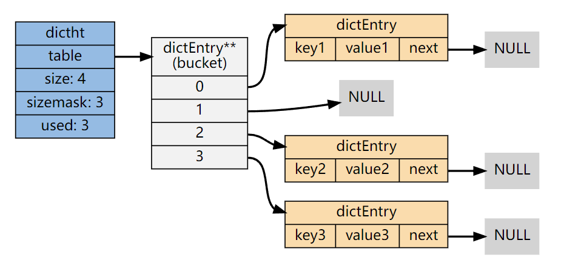

如果再加上之前列出的 `dict` 类型，那么整个字典结构可以表示如下：

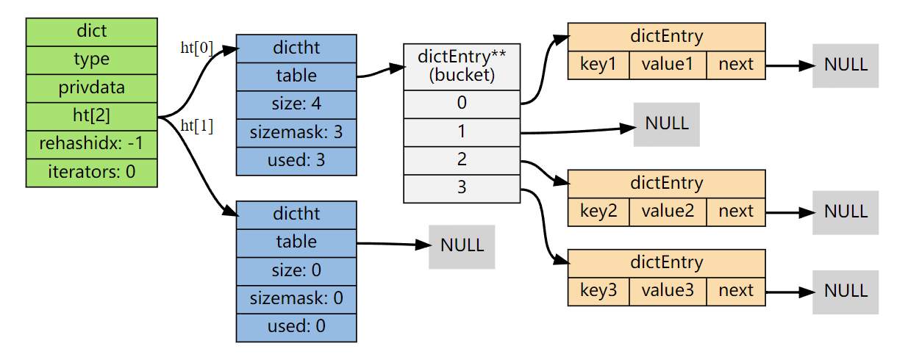

在上图的字典示例中， 字典虽然创建了两个哈希表， 但正在使用的只有 0 号哈希表， 这说明字典未进行 rehash 状态。

### 2.2 哈希算法

Redis 目前使用两种不同的哈希算法：

1. MurmurHash2 32 bit 算法：这种算法的分布率和速度都非常好， 具体信息请参考 MurmurHash 的主页： http://code.google.com/p/smhasher/ 。
2. 基于 djb 算法实现的一个大小写无关散列算法：具体信息请参考 http://www.cse.yorku.ca/~oz/hash.html 。

使用哪种算法取决于具体应用所处理的数据：

- 命令表以及 Lua 脚本缓存都用到了算法 2 。
- 算法 1 的应用则更加广泛：数据库、集群、哈希键、阻塞操作等功能都用到了这个算法。

### 2.3 创建新字典

`dictCreate` 函数创建并返回一个新字典：

```c
dict *d = dictCreate(&hash_type, NULL);
```

`d` 的值可以用图片表示如下：

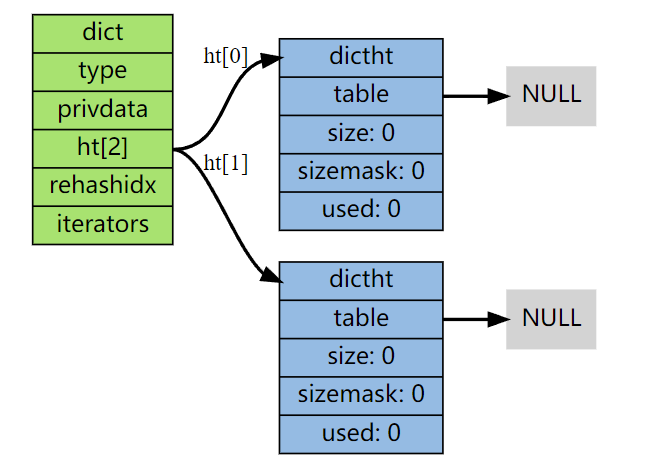

新创建的两个哈希表都没有为 `table` 属性分配任何空间：

- `ht[0]->table` 的空间分配将在第一次往字典添加键值对时进行；
- `ht[1]->table` 的空间分配将在 rehash 开始时进行；

### 2.4 添加键值对到字典

根据字典所处的状态， 将给定的键值对添加到字典可能会引起一系列复杂的操作：

- 如果字典为未初始化（即字典的 0 号哈希表的 `table` 属性为空），则程序需要对 0 号哈希表进行初始化；
- 如果在插入时发生了键碰撞，则程序需要处理碰撞；
- 如果插入新元素，使得字典满足了 rehash 条件，则需要启动相应的 rehash 程序；

当程序处理完以上三种情况之后，新的键值对才会被真正地添加到字典上。

整个添加流程可以用下图表示：

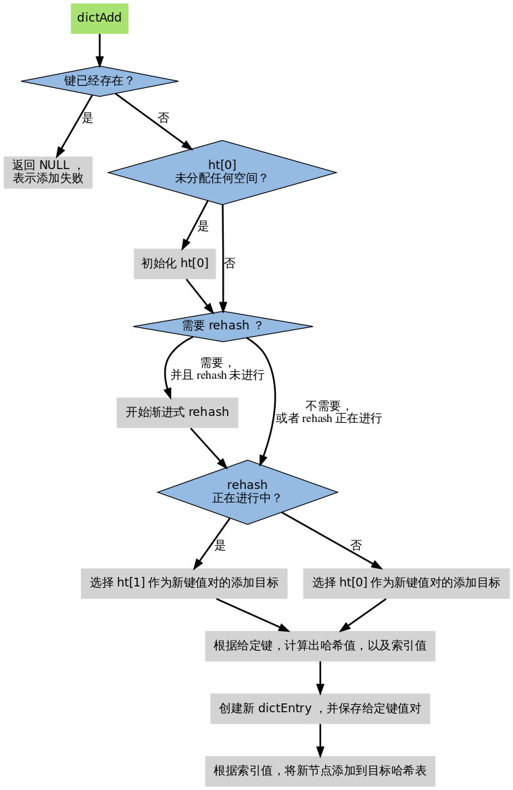

在接下来的三节中， 我们将分别看到，添加操作如何在以下三种情况中执行：

1. 字典为空；
2. 添加新键值对时发生碰撞处理；
3. 添加新键值对时触发了 rehash 操作；

### 2.5 添加新元素到空白字典

当第一次往空字典里添加键值对时， 程序会根据 `dict.h/DICT_HT_INITIAL_SIZE` 里指定的大小为 `d->ht[0]->table` 分配空间 （在目前的版本中， `DICT_HT_INITIAL_SIZE` 的值为 `4` ）。

```c
#define DICT_HT_INITIAL_EXP      2
#define DICT_HT_INITIAL_SIZE     (1<<(DICT_HT_INITIAL_EXP))
```

以下是字典空白时的样子：

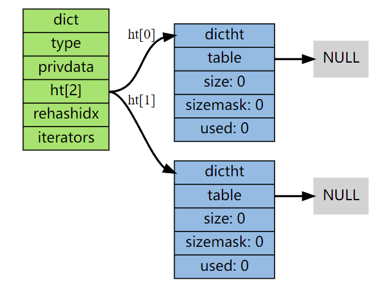

以下是往空白字典添加了第一个键值对之后的样子：

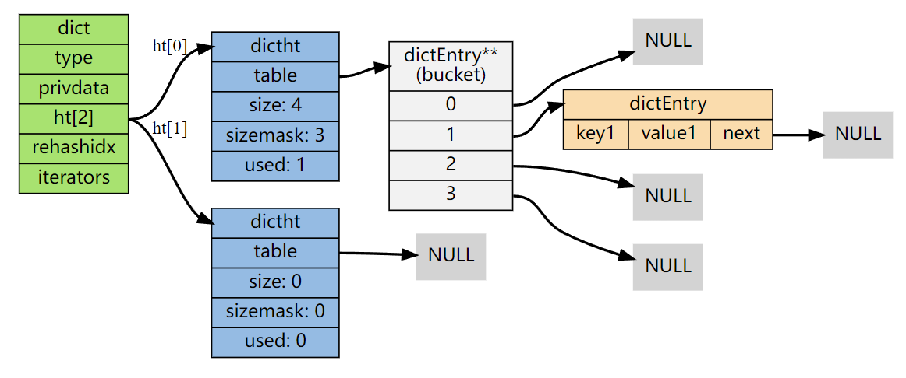

### 2.6 添加新键值对时发生碰撞处理

在哈希表实现中， 当两个不同的键拥有相同的哈希值时， 称这两个键发生碰撞（collision）， 而哈希表实现必须想办法对碰撞进行处理。

字典哈希表所使用的碰撞解决方法被称之为[链地址法](http://en.wikipedia.org/wiki/Hash_table#Separate_chaining)： 这种方法使用链表将多个哈希值相同的节点串连在一起， 从而解决冲突问题。

假设现在有一个带有三个节点的哈希表，如下图：

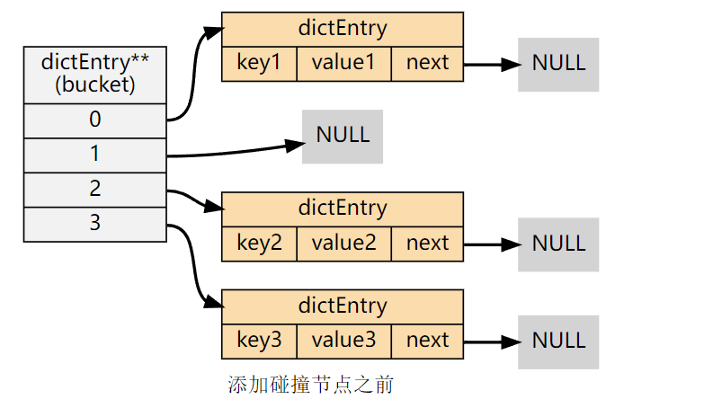

对于一个新的键值对 `key4` 和 `value4` ， 如果 `key4` 的哈希值和 `key1` 的哈希值相同， 那么它们将在哈希表的 `0` 号索引上发生碰撞。

通过将 `key4-value4` 和 `key1-value1` 两个键值对用链表连接起来， 就可以解决碰撞的问题：

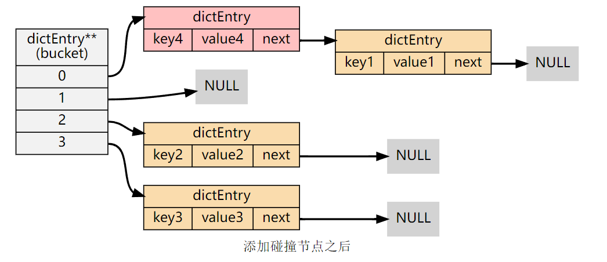

### 2.7 添加新键值对时触发了 rehash 操作

对于使用链地址法来解决碰撞问题的哈希表 `dictht` 来说， 哈希表的性能取决于大小（`size`属性）与保存节点数量（`used`属性）之间的比率：

- 哈希表的大小与节点数量，比率在 1:1 时，哈希表的性能最好；
- 如果节点数量比哈希表的大小要大很多的话，那么哈希表就会退化成多个链表，哈希表本身的性能优势便不复存在；

举个例子， 下面这个哈希表， 平均每次失败查找只需要访问 1 个节点（非空节点访问 2 次，空节点访问 1 次）：

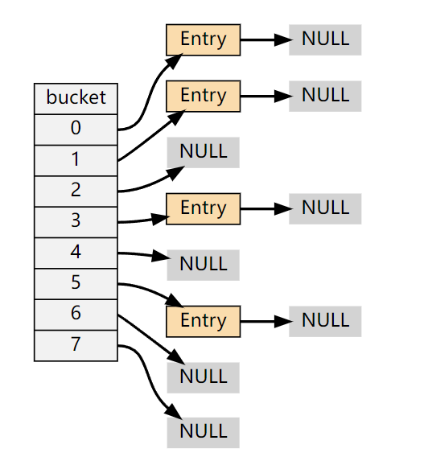

而下面这个哈希表， 平均每次失败查找需要访问 5 个节点：

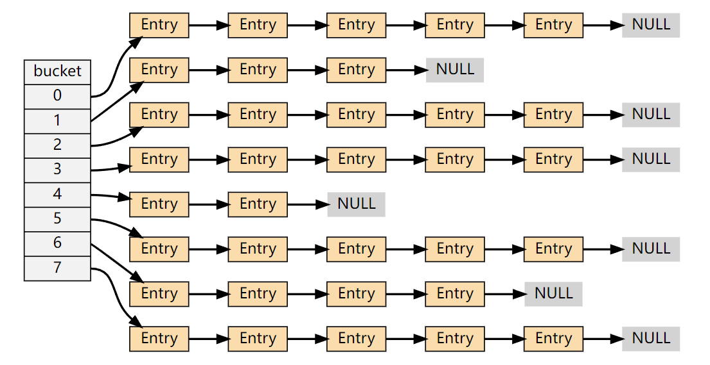

为了在字典的键值对不断增多的情况下保持良好的性能， 字典需要对所使用的哈希表（`ht[0]`）进行 rehash 操作： 在不修改任何键值对的情况下，对哈希表进行扩容， 尽量将比率维持在 1:1 左右。

`dictAdd` 在每次向字典添加新键值对之前， 都会对哈希表 `ht[0]` 进行检查， 对于 `ht[0]` 的 `size` 和 `used` 属性， 如果它们之间的比率 `ratio = used / size` 满足以下任何一个条件的话，rehash 过程就会被激活：

1. 自然 rehash ： `ratio >= 1` ，且变量 `dict_can_resize` 为`true`。
2. 强制 rehash ： `ratio` 大于变量 `dict_force_resize_ratio` （目前版本中， `dict_force_resize_ratio` 的值为 `5` ）。

> 什么时候 `dict_can_resize` 会为false？
>
> 
>
> 在前面介绍字典的应用时也说到过， 数据库就是字典， 数据库里的哈希类型键也是字典， 当 Redis 使用子进程对数据库执行后台持久化任务时（比如执行 `BGSAVE` 或 `BGREWRITEAOF` 时）， 为了最大化地利用系统的 [copy on write](http://en.wikipedia.org/wiki/Copy-on-write) 机制， 程序会暂时将 `dict_can_resize` 设为假， 避免执行自然 rehash ， 从而减少程序对内存的触碰（touch）。
>
> 当持久化任务完成之后， `dict_can_resize` 会重新被设为真。
>
> 另一方面， 当字典满足了强制 rehash 的条件时， 即使 `dict_can_resize` 不为真（有 `BGSAVE` 或 `BGREWRITEAOF` 正在执行）， 这个字典一样会被 rehash 。

### 2.8 rehash执行过程

字典的 rehash 操作实际上就是执行以下任务：

1. 创建一个比 `ht[0]->table` 更大的 `ht[1]->table` ；
2. 将 `ht[0]->table` 中的所有键值对迁移到 `ht[1]->table` ；
3. 将原有 `ht[0]` 的数据清空，并将 `ht[1]` 替换为新的 `ht[0]` ；

经过以上步骤之后， 程序就在不改变原有键值对数据的基础上， 增大了哈希表的大小。

作为例子， 以下四个小节展示了一次对哈希表进行 rehash 的完整过程。

#### 2.8.1 开始rehash

这个阶段有两个事情要做：

1. 设置字典的 `rehashidx` 为 `0` ，标识着 rehash 的开始；
2. 为 `ht[1]->table` 分配空间，大小至少为 `ht[0]->used` 的两倍；

这时的字典是这个样子：

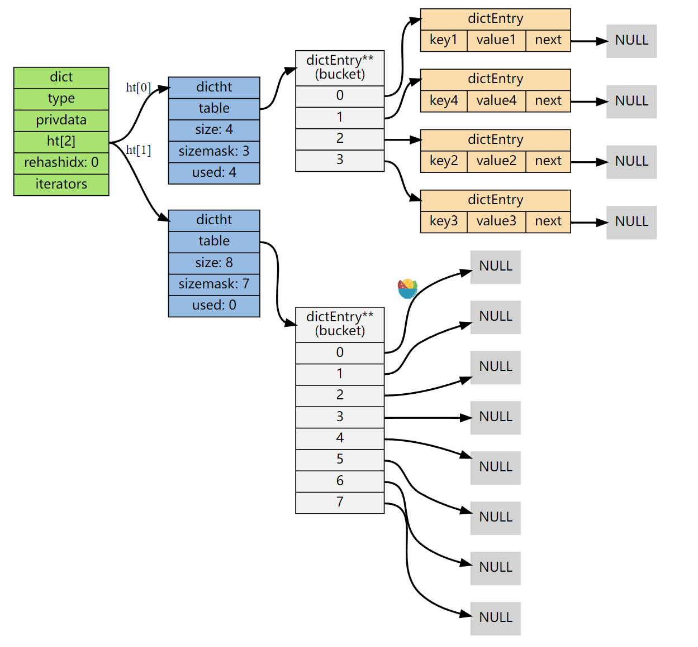

#### 2.8.2 rehash进行中

在这个阶段， `ht[0]->table` 的节点会被逐渐迁移到 `ht[1]->table` ， 因为 rehash 是分多次进行的（细节在下一节解释）， 字典的 `rehashidx` 变量会记录 rehash 进行到 `ht[0]` 的哪个索引位置上。

以下是 `rehashidx` 值为 `2` 时，字典的样子：


注意除了节点的移动外， 字典的 `rehashidx` 、 `ht[0]->used` 和 `ht[1]->used` 三个属性也产生了变化。

#### 2.8.3 节点迁移完毕

到了这个阶段，所有的节点都已经从 `ht[0]` 迁移到 `ht[1]` 了：

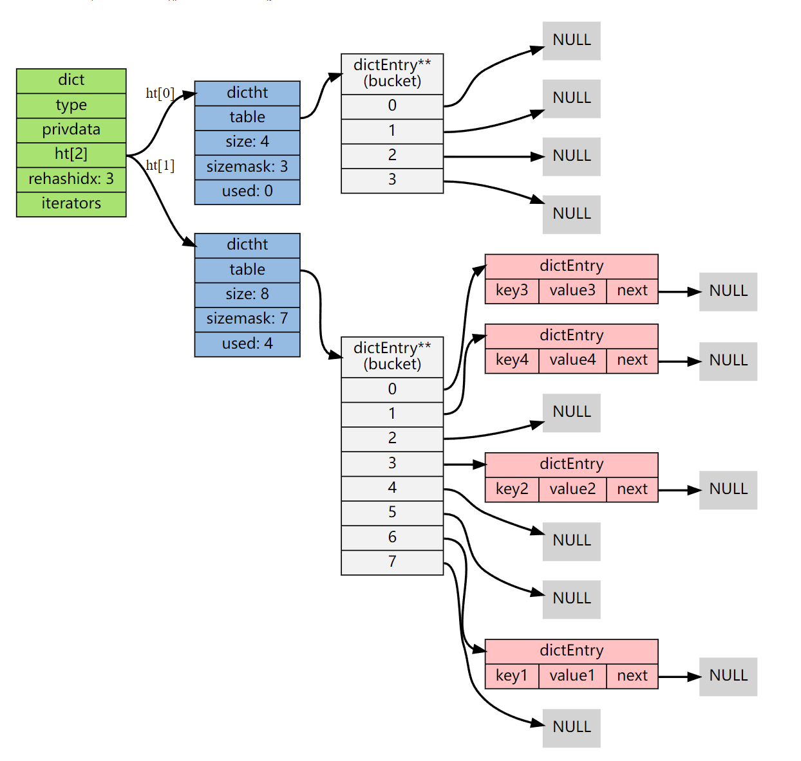

#### 2.8.4 rehash完毕

在 rehash 的最后阶段，程序会执行以下工作：

1. 释放 `ht[0]` 的空间；
2. 用 `ht[1]` 来代替 `ht[0]` ，使原来的 `ht[1]` 成为新的 `ht[0]` ；
3. 创建一个新的空哈希表，并将它设置为 `ht[1]` ；
4. 将字典的 `rehashidx` 属性设置为 `-1` ，标识 rehash 已停止；

以下是字典 rehash 完毕之后的样子：

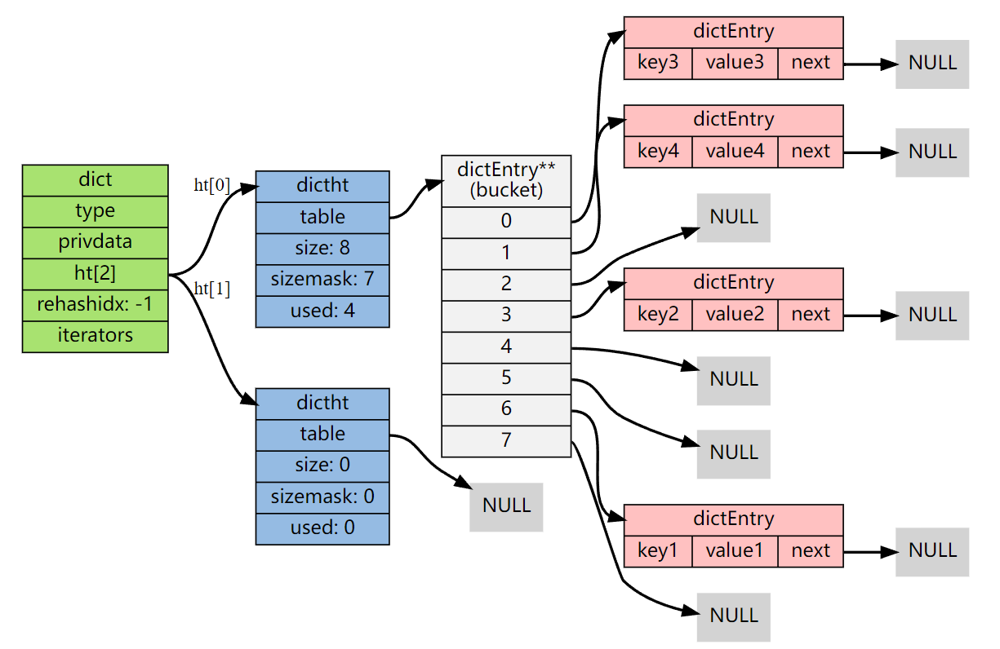

对比字典 rehash 前后， 新的 `ht[0]` 空间更大， 并且字典原有的键值对也没有被修改或者删除。

### 2.9 渐进式rehash

在上一节，我们了解了字典的 rehash 过程， 需要特别指出的是， rehash 程序并不是在激活之后，就马上执行直到完成的， 而是分多次、渐进式地完成的。

假设这样一个场景：在一个有很多键值对的字典里， 某个用户在添加新键值对时触发了 rehash 过程， 如果这个 rehash 过程必须将所有键值对迁移完毕之后才将结果返回给用户， 这样的处理方式将是非常不友好的。

另一方面， 要求服务器必须阻塞直到 rehash 完成， 这对于 Redis 服务器本身也是不能接受的。

为了解决这个问题， Redis 使用了渐进式（incremental）的 rehash 方式： 通过将 rehash 分散到多个步骤中进行， 从而避免了集中式的计算。

渐进式 rehash 主要由 `_dictRehashStep` 和 `dictRehashMilliseconds` 两个函数进行：

- `_dictRehashStep` 用于对数据库字典、以及哈希键的字典进行被动 rehash ；
- `dictRehashMilliseconds` 则由 Redis 服务器常规任务程序（server cron job）执行，用于对数据库字典进行主动 rehash ；

#### 2.9.1 _dictRehashStep

每次执行 `_dictRehashStep` ， `ht[0]->table` 哈希表第一个不为空的索引上的所有节点就会全部迁移到 `ht[1]->table` 。

在 rehash 开始进行之后（`d->rehashidx` 不为 `-1`）， 每次执行一次添加、查找、删除操作， `_dictRehashStep` 都会被执行一次：

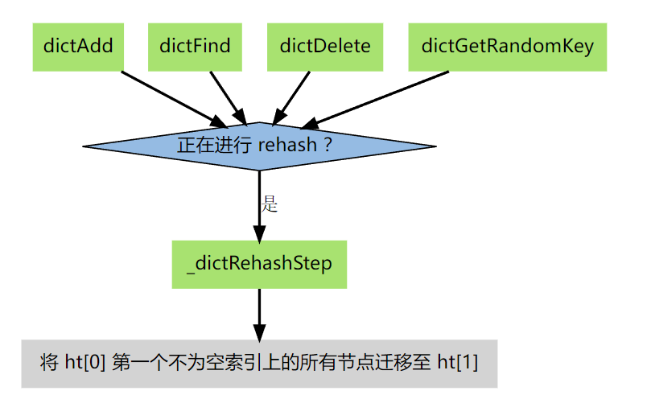

因为字典会保持哈希表大小和节点数的比率在一个很小的范围内， 所以每个索引上的节点数量不会很多（从目前版本的 rehash 条件来看，平均只有一个，最多通常也不会超过五个）， 所以在执行操作的同时，对单个索引上的节点进行迁移， 几乎不会对响应时间造成影响。

#### 2.9.2 dictRehashMilliseconds

`dictRehashMilliseconds` 可以在指定的毫秒数内， 对字典进行 rehash 。

当 Redis 的服务器常规任务执行时， `dictRehashMilliseconds` 会被执行， 在规定的时间内， 尽可能地对数据库字典中那些需要 rehash 的字典进行 rehash ， 从而加速数据库字典的 rehash 进程（progress）。

#### 2.9.3 其他措施

在哈希表进行 rehash 时， 字典还会采取一些特别的措施， 确保 rehash 顺利、正确地进行：

- 因为在 rehash 时，字典会同时使用两个哈希表，所以在这期间的所有查找、删除等操作，除了在 `ht[0]` 上进行，还需要在 `ht[1]` 上进行。
- 在执行添加操作时，新的节点会直接添加到 `ht[1]` 而不是 `ht[0]` ，这样保证 `ht[0]` 的节点数量在整个 rehash 过程中都只减不增。

### 2.9 字典的收缩

上面关于 rehash 的章节描述了通过 rehash 对字典进行扩展（expand）的情况， 如果哈希表的可用节点数比已用节点数大很多的话， 那么也可以通过对哈希表进行 rehash 来收缩（shrink）字典。

收缩 rehash 和上面展示的扩展 rehash 的操作几乎一样，执行以下步骤：

1. 创建一个比 `ht[0]->table` 小的 `ht[1]->table` ；
2. 将 `ht[0]->table` 中的所有键值对迁移到 `ht[1]->table` ；
3. 将原有 `ht[0]` 的数据清空，并将 `ht[1]` 替换为新的 `ht[0]` ；

扩展 rehash 和收缩 rehash 执行完全相同的过程， 一个 rehash 是扩展还是收缩字典， 关键在于新分配的 `ht[1]->table` 的大小：

- 如果 rehash 是扩展操作，那么 `ht[1]->table` 比 `ht[0]->table` 要大；
- 如果 rehash 是收缩操作，那么 `ht[1]->table` 比 `ht[0]->table` 要小；

字典的收缩规则由 `redis.c/htNeedsResize` 函数定义：

```c
/*
 * 检查字典的使用率是否低于系统允许的最小比率
 *
 * 是的话返回 1 ，否则返回 0 。
 */
int htNeedsResize(dict *dict) {
    long long size, used;

    // 哈希表大小
    size = dictSlots(dict);

    // 哈希表已用节点数量
    used = dictSize(dict);

    // 当哈希表的大小大于 DICT_HT_INITIAL_SIZE
    // 并且字典的填充率低于 REDIS_HT_MINFILL 时
    // 返回 1
    return (size && used && size > DICT_HT_INITIAL_SIZE &&
            (used*100/size < REDIS_HT_MINFILL));
}
```

在默认情况下， `REDIS_HT_MINFILL` 的值为 `10` ， 也即是说， 当字典的填充率低于 10% 时， 程序就可以对这个字典进行收缩操作了。

字典收缩和字典扩展的一个区别是：

- 字典的扩展操作是自动触发的（不管是自动扩展还是强制扩展）；
- 而字典的收缩操作则是由程序手动执行。

因此， 使用字典的程序可以决定何时对字典进行收缩：

- 当字典用于实现哈希键的时候， 每次从字典中删除一个键值对， 程序就会执行一次 `htNeedsResize` 函数， 如果字典达到了收缩的标准， 程序将立即对字典进行收缩；
- 当字典用于实现数据库键空间（key space）的时候， 收缩的时机由 `redis.c/tryResizeHashTables` 函数决定， 具体信息请参考《[数据库](https://redisbook.readthedocs.io/en/latest/internal/db.html#db-chapter)》一章的《[数据库空间的收缩和扩展](https://redisbook.readthedocs.io/en/latest/internal/db.html#db-expand-and-shrink)》小节；

### 2.10 字典其他操作

除了添加操作和伸展/收缩操作之外， 字典还定义了一些其他操作， 比如常见的查找、删除和更新。

因为链地址法哈希表实现的相关信息可以从任何一本数据结构或算法书上找到， 这里不再对字典的其他操作进行介绍， 不过前面对创建字典、添加键值对、收缩和扩展 rehash 的讨论已经涵盖了字典模块的核心内容。

### 2.11 字典的迭代

字典带有自己的[迭代器](http://en.wikipedia.org/wiki/Iterator)实现 —— 对字典进行迭代实际上就是对字典所使用的哈希表进行迭代：

- 迭代器首先迭代字典的第一个哈希表，然后，如果 rehash 正在进行的话，就继续对第二个哈希表进行迭代。
- 当迭代哈希表时，找到第一个不为空的索引，然后迭代这个索引上的所有节点。
- 当这个索引迭代完了，继续查找下一个不为空的索引，如此反覆，直到整个哈希表都迭代完为止。

整个迭代过程可以用伪代码表示如下：

```c
def iter_dict(dict):

    # 迭代 0 号哈希表
    iter_table(ht[0]->table)

    # 如果正在执行 rehash ，那么也迭代 1 号哈希表
    if dict.is_rehashing(): iter_table(ht[1]->table)


def iter_table(table):

    # 遍历哈希表上的所有索引
    for index in table:

        # 跳过空索引
        if table[index].empty():
            continue

        # 遍历索引上的所有节点
        for node in table[index]:

            # 处理节点
            do_something_with(node)
```

字典的迭代器有两种：

- 安全迭代器：在迭代进行过程中，可以对字典进行修改。
- 不安全迭代器：在迭代进行过程中，不对字典进行修改。

以下是迭代器的数据结构定义：

```c
/*
 * 字典迭代器
 */
typedef struct dictIterator {

    dict *d;                // 正在迭代的字典

    int table,              // 正在迭代的哈希表的号码（0 或者 1）
        index,              // 正在迭代的哈希表数组的索引
        safe;               // 是否安全？

    dictEntry *entry,       // 当前哈希节点
              *nextEntry;   // 当前哈希节点的后继节点

} dictIterator;
```

以下函数是这个迭代器的 API ，API 的作用及相关算法复杂度：

| 函数                  | 作用                                                   | 算法复杂度 |
| :-------------------- | :----------------------------------------------------- | :--------- |
| `dictGetIterator`     | 创建一个不安全迭代器。                                 | O(1)O(1)   |
| `dictGetSafeIterator` | 创建一个安全迭代器。                                   | O(1)O(1)   |
| `dictNext`            | 返回迭代器指向的当前节点，如果迭代完毕，返回 `NULL` 。 | O(1)O(1)   |
| `dictReleaseIterator` | 释放迭代器。                                           | O(1)       |

## 三. 小结

- 字典是由键值对构成的抽象数据结构。
- Redis 中的数据库和哈希键都基于字典来实现。
- Redis 字典的底层实现为哈希表，每个字典使用两个哈希表，一般情况下只使用 0 号哈希表，只有在 rehash 进行时，才会同时使用 0 号和 1 号哈希表。
- 哈希表使用链地址法来解决键冲突的问题。
- Rehash 可以用于扩展或收缩哈希表。
- 对哈希表的 rehash 是分多次、渐进式地进行的。