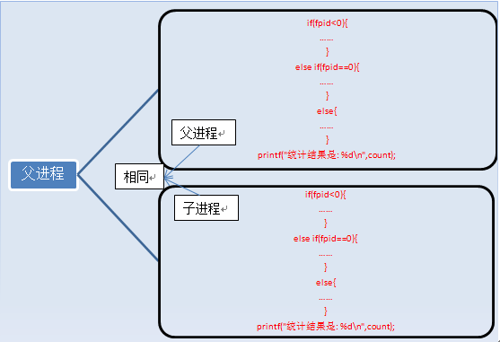
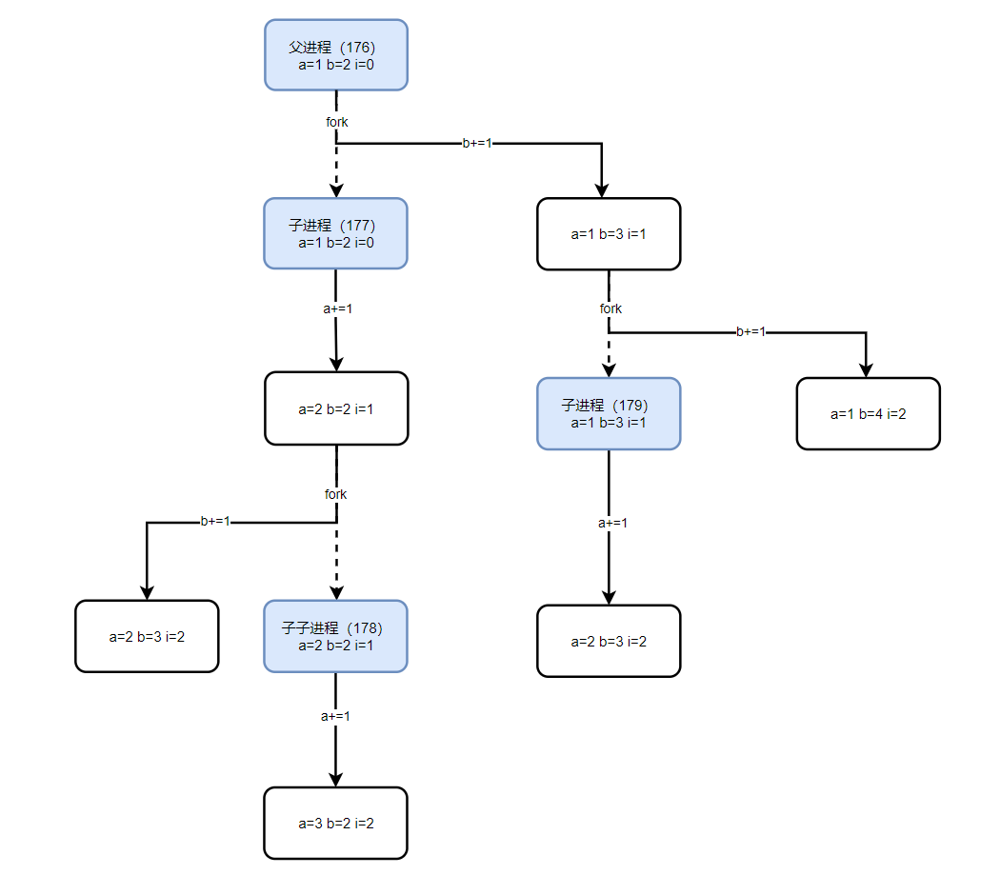

# Linux进程Fork

## 一. fork函数详解

一个进程，包括代码、数据和分配给进程的资源。fork（）函数通过系统调用创建一个与原来进程几乎完全相同的进程，也就是两个进程可以做完全相同的事，但如果初始参数或者传入的变量不同，两个进程也可以做不同的事。

一个进程调用fork（）函数后，系统先给新的进程分配资源，例如存储数据和代码的空间。然后把原来的进程的所有值都复制到新的新进程中，只有少数值与原来的进程的值不同。相当于克隆了一个自己。

我们来看一个例子：

```c
#include <unistd.h>
#include <stdio.h>

int main() {
    pid_t fpid; //fpid表示fork函数返回的值
    int count = 0;
    fpid = fork();
    if (fpid < 0)
        printf("error in fork!");
    else if (fpid == 0) {
        printf("i am the child process, my process id is %d\n", getpid());
        count++;
    } else {
        printf("i am the parent process, my process id is %d\n", getpid());
        count++;
    }
    printf("统计结果是: %d\n", count);
    return 0;
}
```

运行结果是：


在语句fpid=fork()之前，只有一个进程在执行这段代码，但在这条语句之后，就变成两个进程在执行了，这两个进程的几乎完全相同，将要执行的下一条语句都是if(fpid<0)……

为什么两个进程的fpid不同呢，这与fork函数的特性有关。fork调用的一个奇妙之处就是它仅仅被调用一次，却能够返回两次，它可能有三种不同的返回值：

1. 在父进程中，fork返回新创建子进程的进程ID；
2. 在子进程中，fork返回0；
3. 如果出现错误，fork返回一个负值；

在fork函数执行完毕后，如果创建新进程成功，则出现两个进程，一个是子进程，一个是父进程。在子进程中，fork函数返回0，在父进程中，fork返回新创建子进程的进程ID。我们可以通过fork返回的值来判断当前进程是子进程还是父进程。

fork出错可能有两种原因：

1. 当前的进程数已经达到了系统规定的上限，这时errno的值被设置为EAGAIN。
2. 系统内存不足，这时errno的值被设置为ENOMEM。

创建新进程成功后，系统中出现两个基本完全相同的进程，这两个进程执行没有固定的先后顺序，哪个进程先执行要看系统的进程调度策略。

每个进程都有一个独特（互不相同）的进程标识符（process ID），可以通过getpid（）函数获得，还有一个记录父进程pid的变量，可以通过getppid（）函数获得变量的值。

fork执行完毕后，出现两个进程：



有人说两个进程的内容完全一样啊，怎么打印的结果不一样啊，那是因为判断条件的原因，上面列举的只是进程的代码和指令，还有变量啊。
执行完fork后，进程1的变量为count=0，fpid！=0（父进程）。进程2的变量为count=0，fpid=0（子进程），这两个进程的变量都是独立的，存在不同的地址中，不是共用的，这点要注意。可以说，我们就是通过fpid来识别和操作父子进程的。

还有人可能疑惑为什么不是从#include处开始复制代码的，这是因为fork是把进程当前的情况拷贝一份，执行fork时，进程已经执行完了int count=0;fork只拷贝下一个要执行的代码到新的进程。

> 需要注意的是，在fork之后两个进程用的是相同的物理空间(内存区)，子进程的代码段、数据段、堆栈都是指向父进程的物理空间，也就是说，两者的虚拟空间不同，其对应的物理空间是一个。这是出于效率的考虑，在Linux中被称为“写时复制”（COW）技术，只有当父子进程中有更改相应段的行为发生时，再为子进程相应的段分配物理空间。另外fork之后内核会将子进程排在队列的前面，以让子进程先执行，以免父进程执行导致写时复制，而后子进程执行exec系统调用，因无意义的复制而造成效率的下降。

## 二. 代码分析

先看一份代码：

```shell
#include <unistd.h>
#include <stdio.h>

int main() {
    pid_t cld_pid;
    int a = 1, b = 2;
    for (int i = 0; i < 2; i++) {
        if ((cld_pid = fork()) == 0) {
            a += 1;
            printf("a=%d  b=%d\n", a, b);
        } else {
            b += 1;
            printf("a=%d  b=%d\n", a, b);
        }
    }
    return 0;
}
```

代码结果：


执行流程：



图中实线箭头代表进程内变量的变化过程，虚线箭头代表进程之间的fork操作，产生子进程。

> 本文参考至：
>
> [【Linux 进程】fork函数详解 - 我得去图书馆了 - 博客园 (cnblogs.com)](https://www.cnblogs.com/xuelisheng/p/10071336.html)
>
> [神奇的fork（父子进程中一些神奇的问题） - 简书 (jianshu.com)](https://www.jianshu.com/p/0ec862d282d1)

