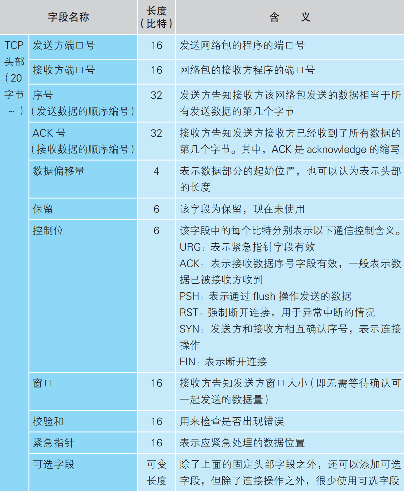

## TCP协议

上一节，我们讲的 UDP，基本上包括了传输层所必须的端口字段。它就像我们小时候一样简单，相信“网之初，性本善，不丢包，不乱序”。

后来呢，我们都慢慢长大，了解了社会的残酷，变得复杂而成熟，就像 TCP 协议一样。它之所以这么复杂，那是因为它秉承的是“性恶论”。它天然认为网络环境是恶劣的，丢包、乱序、重传，拥塞都是常有的事情，一言不合就可能送达不了，因而要从算法层面来保证可靠性。

## TCP 包头格式

我们先来看 TCP 头的格式。从这个图上可以看出，它比 UDP 复杂得多。

首先，源端口号和目标端口号是不可少的，这一点和 UDP 是一样的。如果没有这两个端口号。数据就不知道应该发给哪个应用。

接下来是包的序号。为什么要给包编号呢？当然是为了解决乱序的问题。不编好号怎么确认哪个应该先来，哪个应该后到呢。编号是为了解决乱序问题。既然是社会老司机，做事当然要稳重，一件件来，面临再复杂的情况，也临危不乱。

还应该有的就是确认序号。发出去的包应该有确认，要不然我怎么知道对方有没有收到呢？如果没有收到就应该重新发送，直到送达。这个可以解决不丢包的问题。作为老司机，做事当然要靠谱，答应了就要做到，暂时做不到也要有个回复。

TCP 是靠谱的协议，但是这不能说明它面临的网络环境好。从 IP 层面来讲，如果网络状况的确那么差，是没有任何可靠性保证的，而作为 IP 的上一层 TCP 也无能为力，唯一能做的就是更加努力，不断重传，通过各种算法保证。也就是说，对于 TCP 来讲，IP 层你丢不丢包，我管不着，但是我在我的层面上，会努力保证可靠性。

这有点像如果你在北京，和客户约十点见面，那么你应该清楚堵车是常态，你干预不了，也控制不了，你唯一能做的就是早走。打车不行就改乘地铁，尽力不失约。

接下来有一些状态位。例如 SYN 是发起一个连接，ACK 是回复，RST 是重新连接，FIN 是结束连接等。TCP 是面向连接的，因而双方要维护连接的状态，这些带状态位的包的发送，会引起双方的状态变更。

不像小时候，随便一个不认识的小朋友都能玩在一起，人大了，就变得礼貌，优雅而警觉，人与人遇到会互相热情的寒暄，离开会不舍的道别，但是人与人之间的信任会经过多次交互才能建立。

还有一个重要的就是窗口大小。TCP 要做流量控制，通信双方各声明一个窗口，标识自己当前能够的处理能力，别发送的太快，撑死我，也别发的太慢，饿死我。

作为老司机，做事情要有分寸，待人要把握尺度，既能适当提出自己的要求，又不强人所难。除了做流量控制以外，TCP 还会做拥塞控制，对于真正的通路堵车不堵车，它无能为力，唯一能做的就是控制自己，也即控制发送的速度。不能改变世界，就改变自己嘛。

作为老司机，要会自我控制，知进退，知道什么时候应该坚持，什么时候应该让步。

通过对 TCP 头的解析，我们知道要掌握 TCP 协议，重点应该关注以下几个问题：

- 顺序问题 
- 丢包问题
- 连接维护
- 流量控制
- 拥塞控制

## TCP 的三次握手

所有的问题，首先都要先建立一个连接，所以我们先来看连接维护问题。

TCP 的连接建立，我们常常称为三次握手。

- A：您好，我是 A。
- B：您好 A，我是 B。
- A：您好 B。

我们也常称为“请求 -> 应答 -> 应答之应答”的三个回合。这个看起来简单，其实里面还是有很多的学问，很多的细节。

首先，**为什么要三次，而不是两次？**按说两个人打招呼，一来一回就可以了啊？为了可靠，为什么不是四次？

我们还是假设这个通路是非常不可靠的，A 要发起一个连接，当发了第一个请求杳无音信的时候，会有很多的可能性，比如第一个请求包丢了，再如没有丢，但是绕了弯路，超时了，还有 B 没有响应，不想和我连接。

A 不能确认结果，于是再发，再发。终于，有一个请求包到了 B，但是请求包到了 B 的这个事情，目前 A 还是不知道的，A 还有可能再发。

B 收到了请求包，就知道了 A 的存在，并且知道 A 要和它建立连接。如果 B 不乐意建立连接，则 A 会重试一阵后放弃，连接建立失败，没有问题；如果 B 是乐意建立连接的，则会发送应答包给 A。

当然对于 B 来说，这个应答包也是一入网络深似海，不知道能不能到达 A。这个时候 B 自然不能认为连接是建立好了，因为应答包仍然会丢，会绕弯路，或者 A 已经挂了都有可能。

而且这个时候 B 还能碰到一个诡异的现象就是，A 和 B 原来建立了连接，做了简单通信后，结束了连接。还记得吗？A 建立连接的时候，请求包重复发了几次，有的请求包绕了一大圈又回来了，B 会认为这也是一个正常的的请求的话，因此建立了连接，可以想象，这个连接不会进行下去，也没有个终结的时候，纯属单相思了。因而两次握手肯定不行。

B 发送的应答可能会发送多次，但是只要一次到达 A，A 就认为连接已经建立了，因为对于 A 来讲，他的消息有去有回。A 会给 B 发送应答之应答，而 B 也在等这个消息，才能确认连接的建立，只有等到了这个消息，对于 B 来讲，才算它的消息有去有回。

当然 A 发给 B 的应答之应答也会丢，也会绕路，甚至 B 挂了。按理来说，还应该有个应答之应答之应答，这样下去就没底了。所以四次握手是可以的，四十次都可以，关键四百次也不能保证就真的可靠了。只要双方的消息都有去有回，就基本可以了。

好在大部分情况下，A 和 B 建立了连接之后，A 会马上发送数据的，一旦 A 发送数据，则很多问题都得到了解决。例如 A 发给 B 的应答丢了，当 A 后续发送的数据到达的时候，B 可以认为这个连接已经建立，或者 B 压根就挂了，A 发送的数据，会报错，说 B 不可达，A 就知道 B 出事情了。

当然你可以说 A 比较坏，就是不发数据，建立连接后空着。我们在程序设计的时候，可以要求开启 keepalive 机制，即使没有真实的数据包，也有探活包。

另外，你作为服务端 B 的程序设计者，对于 A 这种长时间不发包的客户端，可以主动关闭，从而空出资源来给其他客户端使用。

**三次握手除了双方建立连接外，主要还是为了沟通一件事情，就是 TCP 包的序号的问题**。

A 要告诉 B，我这面发起的包的序号起始是从哪个号开始的，B 同样也要告诉 A，B 发起的包的序号起始是从哪个号开始的。为什么序号不能都从 1 开始呢？因为这样往往会出现冲突。

例如，A 连上 B 之后，发送了 1、2、3 三个包，但是发送 3 的时候，中间丢了，或者绕路了，于是重新发送。重新发送3号包后 A 掉线了，又重新连上 B 后，序号又从 1 开始，然后发送 2，但是压根没想发送 3，但是上次绕路的那个 3 又回来了，发给了 B，B 自然认为，这就是下一个包，于是发生了错误。

因而，每个连接都要有不同的序号。这个序号的起始序号是随着时间变化的，可以看成一个 32 位的计数器，每 4ms 加一，如果计算一下，如果到重复，需要 4 个多小时，那个绕路的包早就死翘翘了，因为我们都知道 IP 包头里面有个 TTL，也即生存时间。

好了，双方终于建立了信任，建立了连接。前面也说过，为了维护这个连接，双方都要维护一个状态机，在连接建立的过程中，双方的状态变化时序图就像这样。

## TCP 四次挥手

好了，说完了连接，接下来说一说“拜拜”，好说好散。这常被称为四次挥手。

- A：B 啊，我不想玩了。

- B：哦，你不想玩了啊，我知道了。

这个时候，还只是 A 不想玩了，也即 A 不会再发送数据，但是 B 能不能在 ACK 的时候，直接关闭呢？当然不可以了，很有可能 A 是发完了最后的数据就准备不玩了，但是 B 还没做完自己的事情，还是可以发送数据的，所以称为半关闭的状态。

这个时候 A 可以选择不再接收数据了，也可以选择最后再接收一段数据，等待 B 也主动关闭。

- B：A 啊，好吧，我也不玩了，拜拜。

- A：好的，拜拜。

这样整个连接就关闭了。但是这个过程有没有异常情况呢？当然有，上面是和平分手的场面。

A 开始说“不玩了”，B 说“知道了”，这个回合，是没什么问题的，因为在此之前，双方还处于合作的状态，如果 A 说“不玩了”，没有收到回复，则 A 会重新发送“不玩了”。但是这个回合结束之后，就有可能出现异常情况了，因为已经有一方撕破脸。

一种情况是，A 说完“不玩了”之后，直接跑路，是会有问题的，因为 B 还没有发起结束，而如果 A 跑路，B 就算发起结束，也得不到回答，B 就不知道该怎么办了。另一种情况是，A 说完“不玩了”，B 直接跑路，也是有问题的，因为 A 不知道 B 是还有事情要处理，还是过一会儿会发送结束。

那怎么解决这些问题呢？TCP 协议专门设计了几个状态来处理这些问题。我们来看断开连接的时候的状态时序图。

断开的时候，我们可以看到，当 A 说“不玩了”，就进入 FIN_WAIT_1 的状态，B 收到“A 不玩”的消息后，发送知道了，就进入 CLOSE_WAIT 的状态。

A 收到“B 说知道了”，就进入 FIN_WAIT_2 的状态，如果这个时候 B 直接跑路，则 A 将永远在这个状态。TCP 协议里面并没有对这个状态的处理，但是 Linux 有，可以调整 tcp_fin_timeout 这个参数，设置一个超时时间。

如果 B 没有跑路，发送了“B 也不玩了”的请求到达 A 时，A 发送“知道 B 也不玩了”的 ACK 后，从 FIN_WAIT_2 状态结束，按说 A 可以跑路了，但是最后的这个 ACK 万一 B 收不到呢？则 B 会重新发一个“B 不玩了”，这个时候 A 已经跑路了的话，B 就再也收不到 ACK 了，因而 TCP 协议要求 A 最后等待一段时间 TIME_WAIT，这个时间要足够长，长到如果 B 没收到 ACK 的话，“B 说不玩了”会重发的，A 会重新发一个 ACK 并且足够时间到达 B。

A 直接跑路还有一个问题是，A 的端口就直接空出来了，但是 B 不知道，B 原来发过的很多包很可能还在路上，如果 A 的端口被一个新的应用占用了，这个新的应用会收到上个连接中 B 发过来的包，虽然序列号是重新生成的，但是这里要上一个双保险，防止产生混乱，因而也需要等足够长的时间，等到原来 B 发送的所有的包都死翘翘，再空出端口来。

等待的时间设为 2MSL，**MSL 是 Maximum Segment Lifetime，报文最大生存时间**，它是任何报文在网络上存在的最长时间，超过这个时间报文将被丢弃。因为 TCP 报文基于是 IP 协议的，而 IP 头中有一个 TTL 域，是 IP 数据报可以经过的最大路由数，每经过一个处理他的路由器此值就减 1，当此值为 0 则数据报将被丢弃，同时发送 ICMP 报文通知源主机。协议规定 MSL 为 2 分钟，实际应用中常用的是 30 秒，1 分钟和 2 分钟等。

还有一个异常情况就是，B 超过了 2MSL 的时间，依然没有收到它发的 FIN 的 ACK，怎么办呢？按照 TCP 的原理，B 当然还会重发 FIN，这个时候 A 再收到这个包之后，A 就表示，我已经在这里等了这么长时间了，已经仁至义尽了，之后的我就都不认了，于是就直接发送 RST，B 就知道 A 早就跑了。

## TCP 状态机

将连接建立和连接断开的两个时序状态图综合起来，就是这个著名的 TCP 的状态机。学习的时候比较建议将这个状态机和时序状态机对照着看，不然容易晕。

在这个图中，加黑加粗的部分，是上面说到的主要流程，其中阿拉伯数字的序号，是连接过程中的顺序，而大写中文数字的序号，是连接断开过程中的顺序。加粗的实线是客户端 A 的状态变迁，加粗的虚线是服务端 B 的状态变迁。

## 总结

- TCP 是面向连接的，UDP 是面向无连接的。
- TCP 提供可靠交付。通过 TCP 连接传输的数据，无差错、不丢失、不重复、并且按序到达。UDP 继承了 IP 包的特性，不保证不丢失，不保证按顺序到达。
- TCP 是面向字节流的；而 UDP 继承了 IP 的特性，基于数据报的。
- TCP 是可以有拥塞控制的；UDP 就不会，应用让我发，我就发，管它洪水滔天。

- **由于TCP协议是一个可靠协议（努力达到可靠），所以TCP协议中每次发送的包，都期望有一个应答包，来应证该包已经被对方收到**。
- TCP在建立连接时三次握手：A->B发送完毕后，A并不知道B接收到了包，所以B发送一个应答包给A（B->A），但是此次应答B没法证实A已经接收到了这个应答，所以A需要再发送一个应答之应答包（A->B），B接收到这个包后基本上可以确定，A和B之间的通道在两个方向上都是畅通的。
- TCP断开连接的四次挥手：A->B：我要断开连接了，B->A：我知道你要断开了（此时处于半连接状态，A->B的连接断开了，但是B->A的还未断开），B->A：我也要断开连接了，A->B：好的，拜拜。