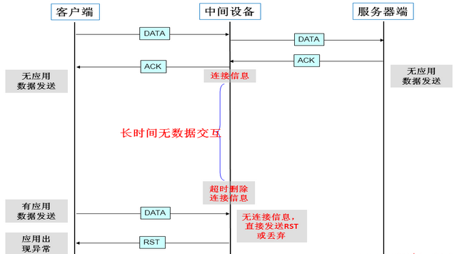
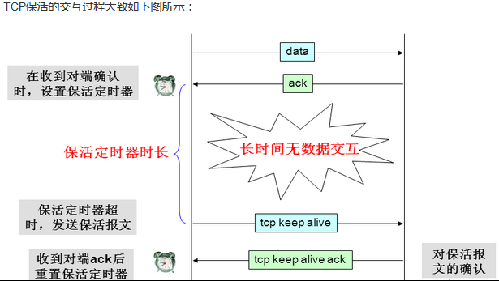

# TCP keep-alive机制

##  一. TCP keep-alive的起源

​      双方建立交互的连接，但是并不是一直存在数据交互，有些连接会在数据交互完毕后，主动释放连接，而有些不会，那么在长时间无数据交互的时间段内，
​      交互双方都有可能出现掉电、死机、异常重启等各种意外，当这些意外发生之后，这些TCP连接并未来得及正常释放，那么，连接的另一方并不知道对端的情况，
​      它会一直维护这个连接，长时间的积累会导致非常多的半打开连接，造成端系统资源的消耗和浪费，为了解决这个问题，在传输层可以利用TCP的保活报文来实现。

##  二. TCP keep-alive存在的作用

### 2.1 探测连接的对端是否存活

​       在应用交互的过程中，可能存在以下几种情况：
​       （1）客户端或服务器意外断电，死机，崩溃，重启。
​       （2）中间网络已经中断，而客户端与服务器并不知道。

​     利用保活探测功能，可以探知这种对端的意外情况，从而保证在意外发生时，可以释放半打开的TCP连接。

### 2.2 防止中间设备因超时删除连接相关的连接表

​       中间设备如防火墙等，会为经过它的数据报文建立相关的连接信息表，并为其设置一个超时时间的定时器，如果超出预定时间，某连接无任何报文交互的话，
​       中间设备会将该连接信息从表中删除，在删除后，再有应用报文过来时，中间设备将丢弃该报文，从而导致应用出现异常，这个交互的过程大致如下图所示：

这种情况在有防火墙的应用环境下非常常见，这会给某些长时间无数据交互但是又要长时间维持连接的应用（如数据库）带来很大的影响，为了解决这个问题，应用本身或TCP可以通过保活报文来维持中间设备中该连接的信息，（也可以在中间设备上开启长连接属性或调高连接表的释放时间来解决，但是，这个影响可能较大，有机会再针对这个做详细的描述，在此不多说）。

## 三. 常见应用故障场景

某财务应用，在客户端需要填写大量的表单数据，在客户端与服务器端建立TCP连接后，客户端终端使用者将花费几分钟甚至几十分钟填写表单相关信息，终端使用者终于填好表单所需信息后，点击“提交”按钮，结果，这个时候由于中间设备早已经将这个TCP连接从连接表中删除了，其将直接丢弃这个报文或者给客户端发送RST报文，应用故障产生，这将导致客户端终端使用者所有的工作将需要重新来过，给使用者带来极大的不便和损失。　

## 四. TCP保活报文交互过程　　

TCP保活可能带来的问题

1. 中间设备因大量保活连接，导致其连接表满：网关设备由于保活问题，导致其连接表满，无法新建连接（XX局网闸故障案例）或性能下降严重
2. 正常连接被释放：当连接一端在发送保活探测报文时，中间网络正好由于各种异常（如链路中断、中间设备重启等）而无法将该保活探测报文正确转发至对端时，可能会导致探测的一方释放本来正常的连接，但是这种可能情况发生的概率较小，另外，一般也可以增加保活探测报文发生的次数来减小这种情况发生的概率和影响

## 五. HTTP keep-alive

Httpd守护进程，一般都提供了keep-alive timeout时间设置参数。比如nginx的keepalive_timeout，和Apache的KeepAliveTimeout

这个 keepalive_timout时间值意味着：一个http产生的tcp连接在传送完最后一个响应后，还需要hold住 keepalive_timeout秒后，才开始关闭这个连接。

当httpd守护进程发送完一个响应后，理应马上主动关闭相应的tcp连接，设置 keepalive_timeout后，httpd守护进程会想说：”再等等吧，看看浏览器还有没有请求过来”，

这一等，便是 keepalive_timeout时间。如果守护进程在这个等待的时间里，一直没有收到浏览器发过来http请求，则关闭这个http连接。

1. 在没有设置 keepalive_timeout情况下，一个socket资源从建立到真正释放需要经过的时间是:建立tcp连接 + 传送http请求 + php脚本执行 + 传送http响应 + 关闭tcp连接
2. 设置了keepalive_timout时间情况下，一个socket建立到释放需要的时间是多了keepalive_timeout时间。
