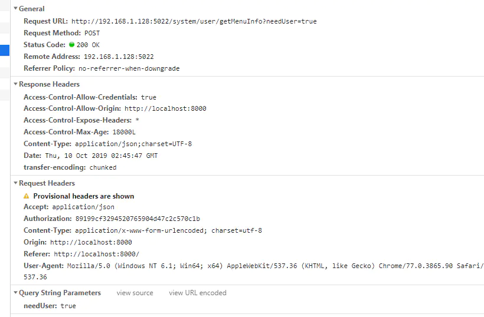
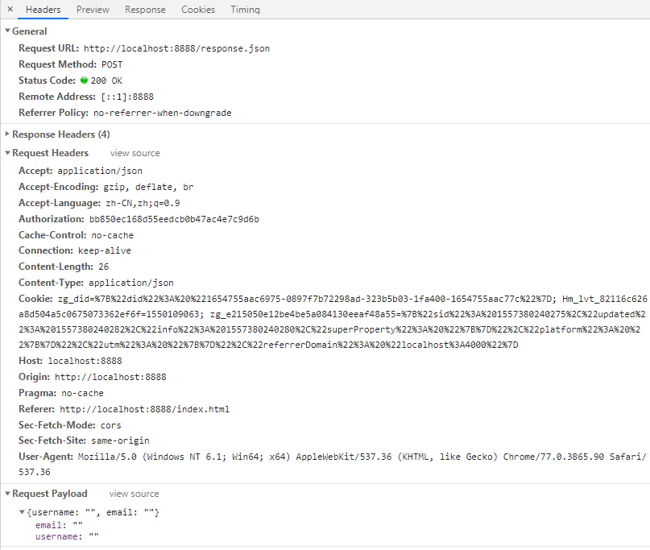

# HTTP请求传参方式

## 一. Query Parameters

参数会以 url string 的形式进行传递，即`?`后的字符串则为其请求参数，并以`&`作为分隔符。常用在 GET 请求方式时使用。 其他请求方式也可以使用，拼接在接口地址 `url?` 后面。



## 二. Form Data

当 `Content-type` 为 `application/x-www-form-urlencoded;charset=utf-8` 时，参数会以 `Form Data` 的形式(数据为 String 键值对格式)传递给接口，并且不会显示在接口 url 上。

本质上FormData数据存放的位置也是在HTTP请求报文的Body区域上，只不过它的数据格式与`Query Parameter`一样通过`&`连接多个参数，具体请求报文如下：

```shell
POST /some-path HTTP/1.1
Content-Type: application/x-www-form-urlencoded

foo=bar&name=John
```

Chrome浏览器的显示效果：


**需要注意的是**，Form Data数据也位于Http的Body上，但是Java EE的ServletRequest对于`Query`和`Form Data`两种形式的传参获取的API是一模一样的，都可以通过`javax.servlet.ServletRequest#getParameterMap`获取到值，虽然这两者请求参数在HTTP报文中的位置并不相同。这也是为什么你对Java程序员说body传参，他们会默认认为采用`application/json`传参，而不是`Form Data`传参。

对应到SpringMVC框架，如果你使用`Query`或`Form Data`传参后端处理方式相同，而如果你采用`application/json`传参，后端需要加上`@RequestBody`注解获取参数值。

## 三. Request Payload

当 `Content-type` 为 `application/json;charset=utf-8` 时，参数会以 `Request Payload` 的形式（数据为 json 格式）传递给接口，并且不会显示在接口 url 上。

```shell
POST /some-path HTTP/1.1
Content-Type: application/json

{ "foo" : "bar", "name" : "John" }
```

Request Payload传参示例：



这也是后端（Java）常说的Body传参形式，因为在SpringMVC框架中`Query Parameters`和`Form Data`传参的处理过程完全一样，而`Request Payload`传参需要将加上`@RequestBody`注解


本文参考至：

[前后端联调之Form Data与Request Payload，你真的了解吗？ - SegmentFault 思否](https://segmentfault.com/a/1190000018774494)

[HTTP 请求参数之三种格式 (juejin.cn)](https://juejin.cn/post/6844903960675876877)

