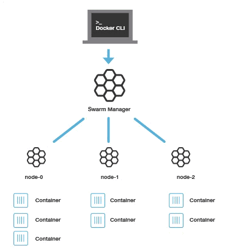
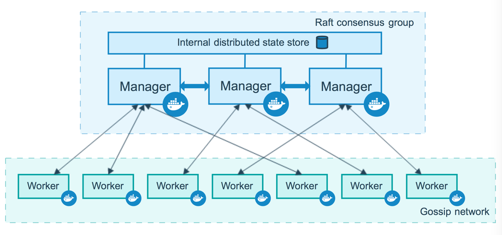
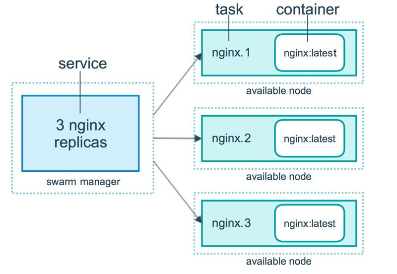

# Docker Swarm简介

> 文章转载至：https://www.cnblogs.com/ityouknow/p/8903975.html
>
> https://zhoujinl.github.io/2018/10/19/docker-swarm-manager-ha/  作者：[Jalon Zhou](https://zhoujinl.github.io/)

## 一. Docker Swarm 介绍

`Docker Swarm` 是使用 [`SwarmKit`](https://github.com/docker/swarmkit/) 构建的原生集群管理和编排工具。其主要作用是把若干台Docker主机抽象为一个整体，并且通过一个入口统一管理这些Docker主机上的各种Docker资源。Swarm和Kubernetes比较类似，但是更加轻量，具有的功能也较kubernetes更少一些。

Docker v1.12 是一个非常重要的版本，Docker 重新实现了集群的编排方式。在此之前，提供集群功能的 Docker Swarm 是一个单独的软件，而且依赖外部数据库（比如 Consul、etcd 或 Zookeeper）。从 v1.12 开始，Docker Swarm 的功能已经完全与 Docker Engine 集成，要管理集群，只需要启动 Swarm Mode。安装好 Docker，Swarm 就已经在那里了，服务发现也在那里了（不需要安装 Consul 等外部数据库）。

Docker Swarm 是一个为 IT 运维团队提供集群和调度能力的编排工具。用户可以把集群中所有 Docker Engine 整合进一个「虚拟 Engine」的资源池，通过执行命令与单一的主 Swarm 进行沟通，而不必分别和每个 Docker Engine 沟通。在灵活的调度策略下，IT 团队可以更好地管理可用的主机资源，保证应用容器的高效运行。

官方网站：https://docs.docker.com/engine/swarm/

## 二. Docker Swarm 优点

**任何规模都有高性能表现**

对于企业级的 Docker Engine 集群和容器调度而言，可拓展性是关键。任何规模的公司——不论是拥有五个还是上千个服务器——都能在其环境下有效使用 Swarm。
经过测试，Swarm 可拓展性的极限是在 1000 个节点上运行 50000 个部署容器，每个容器的启动时间为亚秒级，同时性能无减损。

**灵活的容器调度**

Swarm 帮助 IT 运维团队在有限条件下将性能表现和资源利用最优化。Swarm 的内置调度器（scheduler）支持多种过滤器，包括：节点标签，亲和性和多种容器部策略如 binpack、spread、random 等等。

**服务的持续可用性**

Docker Swarm 由 Swarm Manager 提供高可用性，通过创建多个 Swarm master 节点和制定主 master 节点宕机时的备选策略。如果一个 master 节点宕机，那么一个 slave 节点就会被升格为 master 节点，直到原来的 master 节点恢复正常。
此外，如果某个节点无法加入集群，Swarm 会继续尝试加入，并提供错误警报和日志。在节点出错时，Swarm 现在可以尝试把容器重新调度到正常的节点上去。

**和 Docker API 及整合支持的兼容性**
Swarm 对 Docker API 完全支持，这意味着它能为使用不同 Docker 工具（如 Docker CLI，Compose，Trusted Registry，Hub 和 UCP）的用户提供无缝衔接的使用体验。

**Docker Swarm 为 Docker 化应用的核心功能（诸如多主机网络和存储卷管理）提供原生支持。**开发的 Compose 文件能（通过 docker-compose up ）轻易地部署到测试服务器或 Swarm 集群上。Docker Swarm 还可以从 Docker Trusted Registry 或 Hub 里 pull 并 run 镜像。

**综上所述，Docker Swarm 提供了一套高可用 Docker 集群管理的解决方案，完全支持标准的 Docker API，方便管理调度集群 Docker 容器，合理充分利用集群主机资源**。

## 三. Swarm 基本概念

### 3.1 节点

运行 Docker 的主机可以主动初始化一个 Swarm 集群或者加入一个已存在的 Swarm 集群，这样这个运行 Docker 的主机就成为一个 Swarm 集群的节点 (node) 。节点分为管理 (manager) 节点和工作 (worker) 节点。

管理节点用于 Swarm 集群的管理，docker swarm 命令基本只能在管理节点执行（节点退出集群命令 docker swarm leave 可以在工作节点执行）。一个 Swarm 集群可以有多个管理节点，但只有一个管理节点可以成为 leader，leader 通过 raft 协议实现。

工作节点是任务执行节点，管理节点将服务 (service) 下发至工作节点执行。管理节点默认也作为工作节点。你也可以通过配置让服务只运行在管理节点。下图展示了集群中管理节点与工作节点的关系。

### 3.2 服务和任务

任务 （Task）是 Swarm 中的最小的调度单位，目前来说就是一个单一的容器。
服务 （Services） 是指一组任务的集合，服务定义了任务的属性。服务有两种模式：

- replicated services 按照一定规则在各个工作节点上运行指定个数的任务。
- global services 每个工作节点上运行一个任务

两种模式通过 docker service create 的 --mode 参数指定。下图展示了容器、任务、服务的关系。

### 3.3 负载均衡

`manager`集群管理器使用 **ingress load balancing（入口负载均衡）** 来对外公开群集提供的服务。`manager`可以自动为**PublishedPort** 分配服务，也可以手动配置。如果未指定端口，则swarm管理器会为服务分配30000-32767范围内的端口。

外部组件（例如云负载平衡器）可以访问群集中任何节点的PublishedPort上的服务，无论该节点当前是否正在运行该服务的任务。群集中的所有节点都将入口连接到正在运行的任务实例。

Swarm模式有一个内部DNS组件，可以自动为swarm中的每个服务分配一个DNS条目。群集管理器使用**内部负载平衡**来根据服务的DNS名称在群集内的服务之间分发请求。

