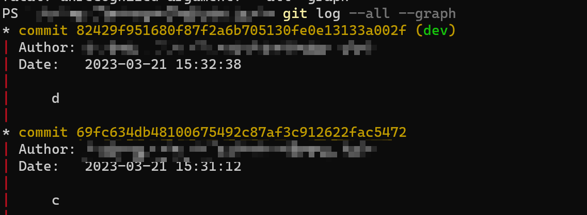

# Git的最小配置(config命令)

## 一. 用户信息

​	当安装完 Git 应该做的第一件事就是设置你的用户名称与邮件地址。 这样做很重要，因为每一个 Git 的提交都会使用这些信息，并且它会写入到你的每一次提交中，不可更改：

### 1.1 通过config命令设置用户信息：

```console
$ git config --global user.name "John Doe"
$ git config --global user.email johndoe@example.com
```

​	 如果使用了 `--global` 选项，那么该命令只需要运行一次，因为之后无论你在该系统上做任何事情， Git 都会使用那些信息。 当你想针对特定项目使用不同的用户名称与邮件地址时，可以在**那个项目目录下**运行没有 `--global` 选项的命令来配置（也就是`--local`的作用域设置）。

​	注意：很多 GUI 工具都会在第一次运行时帮助你配置这些信息。

### 1.2 config的三个作用域：

- `--local `    local只对某一个仓库有效（默认）

- `--global  `   global对当前用户的所有仓库有效

- `--system   `  system对系统登录的所有用户都有效

  如果设置时不指定作用域，默认就是`--local`作用域 

### 1.3 config命令的参数：	 

​	在命令行中直接输入`git config`就能看到`config`命令的所有参数了。


## 二. 查看设置的信息

### 2.1 查看当前所有配置信息

```console
#查看所有配置项
$ git config --list
```


同时还可在命令后面加上“作用域”选项：

```she
$ git config --list --local
$ git config --list --global
$ git config --list --system
```

**示例：**


### 2.2 查看某一项配置信息

你还可以通过输入`git config <key>`来查看某一项的配置值：

```shell
#查看user.name的值
$ git config user.name
```


## 三. 配置日志日期格式

默认情况下日志的日期展示格式:

```txt
Date: Thu Aug 29 19:15:05 2019 +0800
```

执行下列命令，改成常见的时间格式：

```shell
git config --global log.date format:'%Y-%m-%d %H:%M:%S'
```

效果如下：



## 四. 配置branch-d命令别名

git 自带的 `git branch` 命令，默认不是按照最近的更新时间排序的，我们配置一个命令别名即可实现增强的 `git branch` 命令：

```shell
git config --global alias.branch-d "branch --sort committerdate --format '%(committerdate:short) %(authorname) %(refname:short)'"
```

效果：


还可以这样配置：

```shell
git config --global alias.branch-d "for-each-ref --sort=-committerdate refs/heads --format='%(authordate:short) %(color:red)%(objectname:short) %(color:yellow)%(refname:short)%(color:reset) (%(color:green)%(committerdate:relative)%(color:reset))'"
```

效果：


