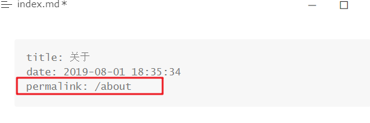

# 创建自定义页面

​	我们搭建一个博客系统可能需要定义一些自定义页面，这里Hexo也给了解决方案。在Hexo自定义页面同样是通过Markdown文件编写的，但是默认的布局不能为博客文章的post而必须为page，详见 [Hexo官方文档](https://hexo.io/zh-cn/docs/writing#布局（Layout）)。我们就以创建一个“关于”页面为例吧。

## 第一步：在source下面创建x.md文件

我们可以通过下列命令创建一个page布局的md文件：

```shell
$ hexo new page 关于
```

此时会在source目录下创建一个名为“关于”的目录。


## 第二步：设置页面的访问路径

通过Front-matter的`permalink`设置该页面的访问路径（详见：[官方文档](https://hexo.io/zh-cn/docs/front-matter)）：



## 第三步：编写页面内容

我们在新建的md文件中编写内容，我们可以在md文件中嵌入HTML代码，然后通过`hexo g`就能生成页面。

