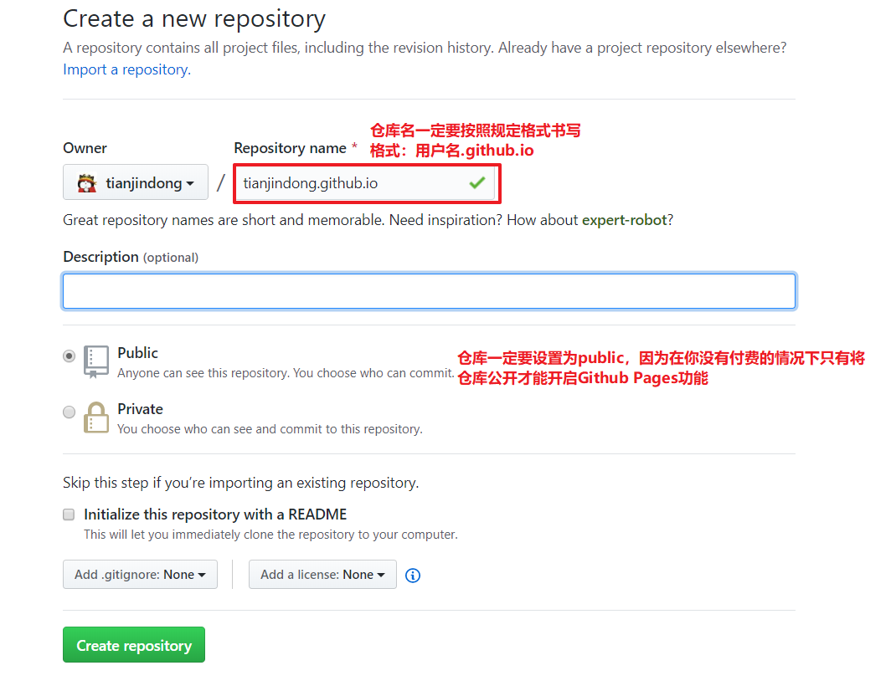

# 将博客部署到服务器

​	我们前面的操作都是在本地生成HTML文件，然后在本地服务器上面运行，我们可以将自己的博客部署到Github上面，因为Github提供GitPage功能，该功能可以部署静态页面，然而我们的博客系统正好都是静态页面，所以我们理所当然的将博客系统部署到Github上面。

## 第一步：前往Github新建一个仓库





## 第二步：安装部署插件

执行下列命令：

```shell
cnpm install --save hexo-deployer-git
```


安装完成`hexo-deployer-git`插件后，我们只需要执行`hexo deploy`将本地文件部署到服务器即可，但是在此之前我们还需要配置远程服务器。


## 第三步：配置远程服务器

编辑`_config.yml`文件（在Windows下用记事本打开即可）：


**注意书写格式：冒号后面有一个空格！！！！**

type属性固定填写为`git`，repo属性填自己仓库的地址，branch用于指定发布到远端的那个分支上去（默认为master）**这个属性最好不要去改**。

如果需要部署到多个服务器上面，例如同时部署到Github和Gitee上面：

```shell
# Deployment
## Docs: https://hexo.io/docs/deployment.html
deploy:
- type: git
  repo: https://gitee.com/tianjindong/tianjindong.git
  branch: master
- type: git
  repo: https://github.com/tianjindong/tianjindong.github.io.git
  branch: master
```


## 第四步：部署到远端

```shell
hexo d或hexo deploy
```

至此你的博客就完成了基本的搭建和部署，你可以通过与你仓库同名的URL地址去访问你的博客了：https://tianjindong.github.io

