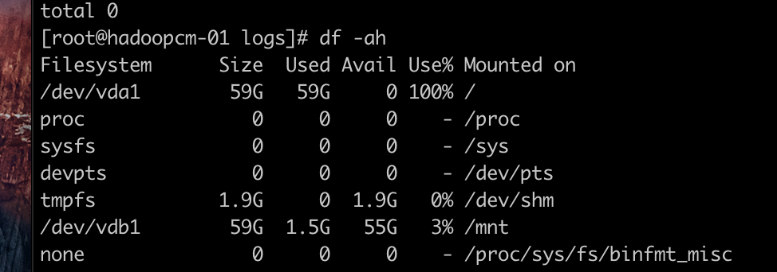

# 运行中的Tomcat日志删除无法释放空间

最近线上磁盘满了，导致服务异常，使用`du -sh *`命令逐步找到了磁盘占用的罪魁祸首是tomcat的日志，有一个长期未清理的的日志高达14GB空间占用，我试图通过`rm -rf catalina.out`来删除文件。

删除后我们通过`df -gh`命令查看分区剩余空间，但是那部分资源并没有释放：



重启Tomcat后这部分资源才得到释放。

## 原因

运行中Tomcat日志无法删除是因为在Linux或者Unix系统中，通过rm或者文件管理器删除文件将会从文件系统的目录结构上解除链接(unlink)，然而如果文件是被打开的（有一个进程正在使用），那么进程将仍然可以读取该文件，磁盘空间也一直被占用。所以删除正在运行中Tomcat 的 logs时该文件正在被使用中，并不会释放磁盘空间。

## 解决方法

我们只需要将一个空字符串写入该文件，即可达到删除文件内容的效果，从而释放空间：

```shell
echo " " > logs/xxx.log
```

